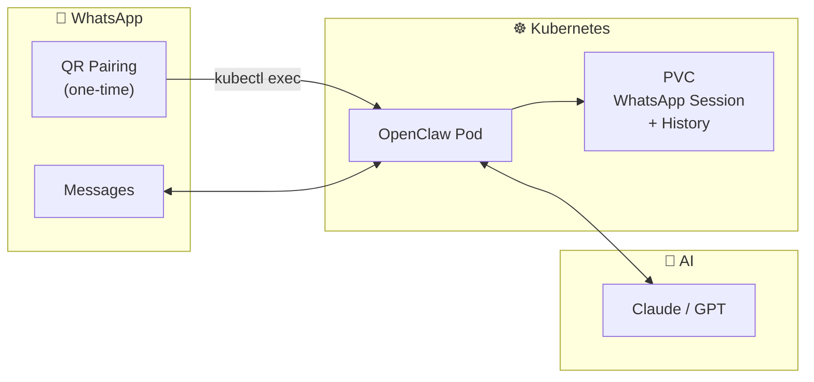

> 💡 **Quick Answer:** Deploy OpenClaw on Kubernetes, then `kubectl exec -it deploy/openclaw -- openclaw channels login` to scan a QR code with WhatsApp. After pairing, OpenClaw bridges your WhatsApp messages to an AI agent. Use `allowFrom` to restrict which numbers can interact with the bot.
>
> **Key concept:** OpenClaw uses the WhatsApp Web multi-device protocol — your phone doesn't need to stay online. The session persists in a PVC.
>
> **Gotcha:** WhatsApp pairing is interactive (QR code scan). You must use `kubectl exec -it` for the initial setup. After that, it's hands-off.

## The Problem

- WhatsApp has no official bot API for personal accounts
- Maintaining a persistent WhatsApp Web session requires careful state management
- You want an AI assistant in WhatsApp without sharing your data with third-party services

## The Solution

OpenClaw connects to WhatsApp via the multi-device protocol, persists the session in a Kubernetes PVC, and routes messages to your AI agent.

## Architecture Overview



## Step 1: Deploy

```yaml
# openclaw-whatsapp.yaml
apiVersion: v1
kind: Secret
metadata:
  name: openclaw-wa-secrets
  namespace: openclaw
type: Opaque
stringData:
  ANTHROPIC_API_KEY: "sk-ant-your-key"
---
apiVersion: v1
kind: ConfigMap
metadata:
  name: openclaw-wa-config
  namespace: openclaw
data:
  openclaw.json: |
    {
      "gateway": { "port": 18789 },
      "channels": {
        "whatsapp": {
          "enabled": true,
          "allowFrom": ["+15555550123", "+15555550456"]
        }
      }
    }
---
apiVersion: v1
kind: PersistentVolumeClaim
metadata:
  name: openclaw-wa-state
  namespace: openclaw
spec:
  accessModes: [ReadWriteOnce]
  resources:
    requests:
      storage: 5Gi
---
apiVersion: apps/v1
kind: Deployment
metadata:
  name: openclaw-whatsapp
  namespace: openclaw
spec:
  replicas: 1
  strategy:
    type: Recreate
  selector:
    matchLabels:
      app: openclaw-whatsapp
  template:
    metadata:
      labels:
        app: openclaw-whatsapp
    spec:
      containers:
        - name: openclaw
          image: node:22-slim
          command: ["sh", "-c", "npm i -g openclaw@latest && openclaw gateway"]
          ports: [{containerPort: 18789}]
          envFrom:
            - secretRef:
                name: openclaw-wa-secrets
          volumeMounts:
            - name: state
              mountPath: /home/node/.openclaw
            - name: config
              mountPath: /home/node/.openclaw/openclaw.json
              subPath: openclaw.json
          resources:
            requests:
              cpu: 250m
              memory: 512Mi
            limits:
              cpu: "1"
              memory: 1Gi
      volumes:
        - name: state
          persistentVolumeClaim:
            claimName: openclaw-wa-state
        - name: config
          configMap:
            name: openclaw-wa-config
```

## Step 2: Pair WhatsApp

```bash
# Interactive pairing — displays QR code in terminal
kubectl exec -it -n openclaw deploy/openclaw-whatsapp -- openclaw channels login

# Scan the QR code with WhatsApp on your phone:
# WhatsApp → Settings → Linked Devices → Link a Device

# Verify connection
kubectl exec -n openclaw deploy/openclaw-whatsapp -- openclaw status
```

## Step 3: Security — Allow List

```json
{
  "channels": {
    "whatsapp": {
      "allowFrom": ["+15555550123"],
      "groups": {
        "*": {
          "requireMention": true,
          "mentionPatterns": ["@ai", "@bot"]
        }
      }
    }
  }
}
```

## Common Issues

### Issue 1: Session expires after pod restart

```bash
# Verify PVC is properly mounted
kubectl exec -n openclaw deploy/openclaw-whatsapp -- ls -la /home/node/.openclaw/

# If session files are missing, the PVC mount may be incorrect
# Re-pair if needed:
kubectl exec -it -n openclaw deploy/openclaw-whatsapp -- openclaw channels login
```

### Issue 2: WhatsApp disconnects after a few days

```bash
# WhatsApp may disconnect linked devices after ~14 days of inactivity
# OpenClaw auto-reconnects, but if pairing is lost:
kubectl exec -it -n openclaw deploy/openclaw-whatsapp -- openclaw channels login

# Prevent disconnection by ensuring the pod stays running
# Set appropriate liveness/readiness probes
```

## Best Practices

1. **Always use allowFrom** — Without it, anyone who messages you gets AI responses
2. **Use Recreate strategy** — Only one WhatsApp Web session is allowed per number
3. **Backup the PVC** — WhatsApp session data is irreplaceable without re-pairing
4. **Set group mention rules** — Prevent bot from responding in every group chat
5. **Use a dedicated number** — Consider a separate SIM/number for the AI assistant

## Key Takeaways

- **QR pairing is one-time** — After initial `kubectl exec` setup, sessions persist in PVC
- **Multi-device protocol** means your phone can be offline
- **allowFrom is essential** for security — restricts who can interact with the AI
- **Recreate strategy** prevents dual-session conflicts
- **Media support** works out of the box — send images, voice notes, documents
