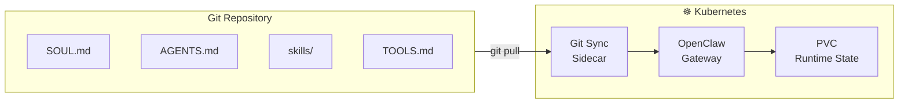

> 💡 **Quick Answer:** Store your OpenClaw workspace files (SOUL.md, AGENTS.md, skills/, TOOLS.md) in a Git repo. Use a Kubernetes CronJob or init container with `git pull` to sync changes, or use Flux/ArgoCD to manage ConfigMaps containing workspace files. Changes to SOUL.md in Git automatically update the agent's persona.
>
> **Key concept:** Workspace files define who your agent is (SOUL.md), how it behaves (AGENTS.md), and what it can do (skills/). Version-controlling these enables auditable, rollback-able AI persona management.
>
> **Gotcha:** Don't version-control `memory/` files or session state — those are runtime data that should stay in PVCs.

## The Problem

- Agent persona changes (SOUL.md edits) are lost if not tracked
- Multiple environments (dev/staging/prod) need consistent agent configuration
- Rolling back a bad persona change requires manual intervention
- Skills and workspace files need a review process before deployment

## The Solution

Store workspace files in Git and sync them to Kubernetes using GitOps patterns.

## Architecture Overview



## Option 1: Git-Sync Sidecar

```yaml
# openclaw-gitsync.yaml
apiVersion: apps/v1
kind: Deployment
metadata:
  name: openclaw-gateway
  namespace: openclaw
spec:
  replicas: 1
  strategy:
    type: Recreate
  selector:
    matchLabels:
      app: openclaw
  template:
    spec:
      initContainers:
        - name: git-sync-init
          image: registry.k8s.io/git-sync/git-sync:v4.3.0
          args:
            - "--repo=https://github.com/yourorg/openclaw-workspace.git"
            - "--root=/workspace"
            - "--one-time"
          volumeMounts:
            - name: workspace
              mountPath: /workspace
          env:
            - name: GITSYNC_USERNAME
              valueFrom:
                secretKeyRef:
                  name: git-credentials
                  key: username
            - name: GITSYNC_PASSWORD
              valueFrom:
                secretKeyRef:
                  name: git-credentials
                  key: token
      containers:
        - name: openclaw
          image: registry.example.com/openclaw:v1
          volumeMounts:
            - name: workspace
              mountPath: /home/node/.openclaw/workspace
              subPath: workspace
            - name: state
              mountPath: /home/node/.openclaw
          resources:
            requests:
              cpu: 250m
              memory: 512Mi
        - name: git-sync
          image: registry.k8s.io/git-sync/git-sync:v4.3.0
          args:
            - "--repo=https://github.com/yourorg/openclaw-workspace.git"
            - "--root=/workspace"
            - "--period=60s"
          volumeMounts:
            - name: workspace
              mountPath: /workspace
      volumes:
        - name: workspace
          emptyDir: {}
        - name: state
          persistentVolumeClaim:
            claimName: openclaw-state
```

## Option 2: ConfigMap-Based (Simple)

```yaml
# openclaw-workspace-cm.yaml
apiVersion: v1
kind: ConfigMap
metadata:
  name: openclaw-workspace
  namespace: openclaw
data:
  SOUL.md: |
    # My AI Assistant
    
    Be helpful, concise, and technically accurate.
    Have opinions. Don't be a sycophant.
    Use code blocks for commands and YAML.
  
  AGENTS.md: |
    # Agent Configuration
    
    Read SOUL.md every session. Update memory files.
    Be resourceful before asking questions.
  
  TOOLS.md: |
    # Tools Notes
    
    - Preferred TTS voice: Nova
    - Default timezone: America/New_York
```

## Git Repository Structure

```
openclaw-workspace/
├── SOUL.md
├── AGENTS.md  
├── USER.md
├── TOOLS.md
├── IDENTITY.md
├── HEARTBEAT.md
├── skills/
│   ├── weather/
│   │   └── SKILL.md
│   └── discord/
│       └── SKILL.md
└── README.md        # Not synced — repo docs only
```

## Common Issues

### Issue 1: Git-sync overwrites runtime changes

```bash
# OpenClaw may modify workspace files (memory, notes)
# Solution: Only sync specific files, not the entire directory
# Or use a merge strategy instead of hard reset
```

### Issue 2: ConfigMap size limit

```bash
# ConfigMaps have a 1MB limit
# For large workspaces with many skills, use git-sync instead
```

## Best Practices

1. **Version control SOUL.md** — Track persona changes with commit history
2. **PR reviews for persona changes** — Treat SOUL.md edits like code reviews
3. **Don't sync memory/** — Runtime memory files belong in PVCs
4. **Use branches for environments** — `main` → prod, `staging` → staging agent
5. **Sync period of 60s** — Fast enough for updates, not too aggressive

## Key Takeaways

- **GitOps for AI personas** enables auditable, version-controlled agent management
- **Git-sync sidecar** continuously pulls workspace changes from Git
- **ConfigMaps** work for simple setups but have size limits
- **Never version-control memory or sessions** — those are runtime state
- **PR-based workflow** adds review gates to persona and skill changes
