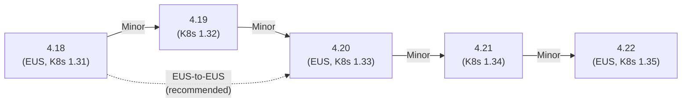

> 💡 **Quick Answer:** OpenShift 4.20 is an **EUS (Extended Update Support)** release based on Kubernetes 1.33. As an even-numbered release, it gets 18 months of support. Upgrade path: 4.18 (EUS) → 4.19 → 4.20, or EUS-to-EUS 4.18 → 4.20 (recommended for production). Key highlights: enhanced GPU/AI scheduling, Gateway API GA, improved MachineConfig management, and OVN-Kubernetes enhancements.

## The Problem

Each OpenShift minor release brings new Kubernetes APIs, operator changes, deprecated features, and infrastructure improvements. Administrators need to understand what changed, what broke, and how to upgrade safely — especially for EUS releases that production clusters depend on for 18 months.

## Release Overview

| Property | Value |
|----------|-------|
| **Version** | OpenShift Container Platform 4.20 |
| **Kubernetes version** | 1.33 |
| **RHCOS base** | RHEL 9.6 |
| **Release type** | EUS (Extended Update Support) |
| **Support duration** | 18 months |
| **GA date** | Q2 2026 (estimated) |
| **Previous EUS** | 4.18 |
| **Next EUS** | 4.22 |



## New Features and Enhancements

### Kubernetes 1.33 Alignment

- **Sidecar containers GA** — `initContainers` with `restartPolicy: Always` now fully stable
- **In-place pod resize** — Change CPU/memory limits without restarting pods (beta)
- **Improved scheduler throughput** — Better handling of large-scale clusters (5000+ nodes)
- **PodReadyToStartContainers condition** — New condition for precise pod lifecycle tracking
- **CRD validation ratcheting GA** — Existing objects with old invalid values pass validation during updates

### Networking

- **Gateway API GA** — `HTTPRoute`, `GRPCRoute`, `TLSRoute` fully supported by OVN-Kubernetes
- **OVN-Kubernetes improvements** — Better multi-homing for secondary network interfaces
- **Network observability operator** — Enhanced flow collection, DNS tracking, RTT metrics
- **AdminNetworkPolicy GA** — Cluster-scoped network policies for platform administrators
- **Service mesh integration** — Improved Istio/Sail Operator compatibility

### AI/GPU Infrastructure

- **NVIDIA GPU Operator 24.9+** — Improved support for multi-instance GPU (MIG)
- **Dynamic Resource Allocation (DRA)** — Enhanced GPU scheduling with structured parameters
- **Topology-aware scheduling improvements** — Better GPU/NIC co-location for RDMA workloads
- **InstaSlice operator** — Dynamic MIG profile management (Tech Preview)

### Security

- **Pod Security Admission enforcement** — Updated baseline and restricted profiles
- **Confidential containers (CoCo)** — Enhanced support for Kata + SEV/TDX (Tech Preview)
- **Cert-manager operator** — Now included as a supported component
- **FIPS 140-3 compliance** — Updated cryptographic modules
- **Token request API improvements** — Better bound service account tokens

### Storage

- **CSI driver updates** — NFS, Ceph, AWS EBS/EFS with enhanced performance
- **Shared resource CSI driver GA** — Share Secrets and ConfigMaps across namespaces
- **VolumeGroupSnapshot GA** — Consistent snapshots across multiple PVCs
- **ReadWriteOncePod access mode GA** — Single-pod PVC access for databases

### Developer Experience

- **OpenShift Builds v2** — Shipwright-based builds as first-class citizen
- **Developer perspective improvements** — Enhanced topology view, Helm chart management
- **Pipelines (Tekton) 1.17** — Improved matrix fan-out, step-level resource limits
- **GitOps (ArgoCD) 2.13** — ApplicationSet improvements, multi-source apps GA

### Operator Framework

- **OLM v1 GA** — New operator lifecycle management with catalog-based resolution
- **Cluster Extensions API** — Simpler operator installation without subscriptions
- **Operator SDK updates** — Enhanced scorecard, Ansible operator improvements

## Upgrade Path

### EUS-to-EUS (Recommended for Production)

```bash
# Pre-flight checks
oc get co | grep -v "True.*False.*False"    # All operators healthy
oc adm upgrade                               # Check available versions

# Check for deprecated APIs used in 4.19/4.20
oc get apirequestcounts -o custom-columns='RESOURCE:.metadata.name,REMOVEDIN:.status.removedInRelease,REQUESTCOUNT:.status.requestCount' | grep -v "<none>" | sort

# Backup etcd
oc debug node/master-0 -- chroot /host /usr/local/bin/cluster-backup.sh /home/core/backup

# 1. Pause worker MCP
oc patch mcp worker --type merge -p '{"spec":{"paused":true}}'

# 2. Set channel
oc adm upgrade channel eus-4.20

# 3. Upgrade control plane through 4.19 to 4.20
oc adm upgrade --to-latest
# CP goes 4.18 → 4.19.x → waits for next

# 4. Once CP is on 4.19, upgrade to 4.20
oc adm upgrade --to-latest
# CP goes 4.19 → 4.20.x

# 5. Wait for CP completion
oc wait --for=condition=Progressing=False clusterversion version --timeout=90m

# 6. Unpause workers (they jump 4.18 → 4.20, single reboot)
oc patch mcp worker --type merge -p '{"spec":{"paused":false}}'

# 7. Monitor
watch 'oc get mcp; echo "---"; oc get nodes -o wide'
```

### Sequential Upgrade (4.19 → 4.20)

```bash
# If already on 4.19:
oc adm upgrade channel stable-4.20
oc adm upgrade --to-latest

# Monitor
oc get clusterversion -w
oc get co
oc get mcp
```

## Deprecated and Removed Features

| Feature | Status in 4.20 | Action Required |
|---------|----------------|-----------------|
| Jenkins operator | Removed | Migrate to Tekton/GitOps |
| OpenShift Builds v1 (BuildConfig) | Deprecated | Migrate to Builds v2 (Shipwright) |
| OLM v0 subscriptions | Deprecated | Prepare for OLM v1 |
| In-tree cloud providers | Removed | Use external cloud-controller-managers |
| `networking.k8s.io/v1beta1` Ingress | Removed (K8s 1.22+) | Use `networking.k8s.io/v1` |
| `policy/v1beta1` PodDisruptionBudget | Removed (K8s 1.25+) | Use `policy/v1` |

## Notable Technical Changes

- **RHCOS rebased on RHEL 9.6** — Updated kernel, systemd, container runtime
- **CRI-O 1.33** — Container runtime aligned with Kubernetes
- **etcd 3.5.x** — Latest stable with improved compaction and defrag
- **CoreDNS 1.12** — Enhanced caching and plugin support
- **Prometheus stack update** — Prometheus 2.55+, Alertmanager 0.28+

## Post-Upgrade Verification

```bash
# 1. Version confirmation
oc get clusterversion

# 2. All operators available
oc get co -o custom-columns='NAME:.metadata.name,AVAIL:.status.conditions[?(@.type=="Available")].status,PROG:.status.conditions[?(@.type=="Progressing")].status,DEG:.status.conditions[?(@.type=="Degraded")].status' | column -t

# 3. All nodes at target version
oc get nodes -o custom-columns='NAME:.metadata.name,VERSION:.status.nodeInfo.kubeletVersion,OS:.status.nodeInfo.osImage'

# 4. MCP completed
oc get mcp

# 5. Workload health
oc get pods -A --field-selector=status.phase!=Running,status.phase!=Succeeded | grep -v Completed

# 6. Test new features
kubectl get gatewayclasses    # Gateway API GA
kubectl get volumegroupsnapshots  # VolumeGroupSnapshot
```

## Common Issues

| Issue | Cause | Fix |
|-------|-------|-----|
| EUS-to-EUS upgrade stuck | Worker MCP unpaused too early | Pause MCP, wait for CP 4.20, then unpause |
| Operator Degraded after upgrade | Operator not compatible with 4.20 | Check operator subscription, update to compatible version |
| Jenkins pipelines broken | Jenkins operator removed | Migrate to Tekton Pipelines |
| BuildConfig not working | Builds v1 deprecated | Still works but migrate to Shipwright |
| etcd defrag needed | Large etcd database after upgrade | `oc debug node/master-0 -- etcdctl defrag` |

## Best Practices

- **EUS-to-EUS for production** — workers reboot once, minimal disruption
- **Test in staging with production workloads** — not just empty clusters
- **Migrate deprecated APIs before upgrading** — don't carry technical debt
- **Plan for 18-month EUS cycle** — schedule the next upgrade before support expires
- **Review operator compatibility** — check Red Hat compatibility matrix
- **Backup etcd** — always, before every minor upgrade

## Key Takeaways

- 4.20 is EUS — 18 months support, recommended for production
- Based on Kubernetes 1.33 with sidecar containers GA and in-place pod resize beta
- Gateway API GA — production-ready alternative to Ingress
- Upgrade via EUS-to-EUS (4.18→4.20) for single worker reboot
- Jenkins operator removed — migrate to Tekton
- RHCOS rebased on RHEL 9.6
