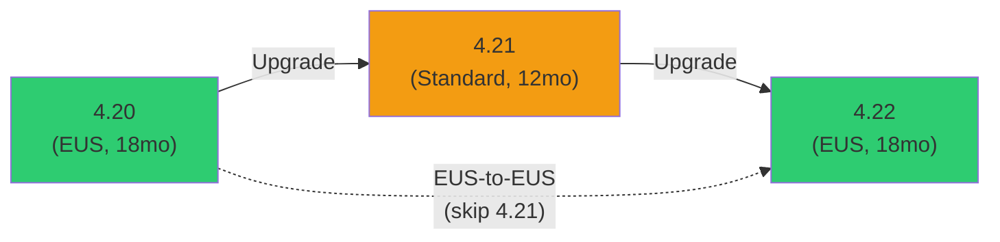

> 💡 **Quick Answer:** OpenShift 4.21 is a **non-EUS** (standard) release based on Kubernetes 1.34. It gets 12 months of support. Available only via sequential upgrade from 4.20. Key highlights: in-place pod resize GA, Dynamic Resource Allocation improvements, OLM v1 as default, and enhanced observability. Non-EUS releases are typically used in dev/staging or by teams wanting the latest features.

## The Problem

OpenShift 4.21 brings the latest Kubernetes innovations to production. As a non-EUS release, it has a shorter support window (12 months vs 18 for EUS). Teams must decide: upgrade to 4.21 for new features, or stay on 4.20 EUS and wait for 4.22 EUS.

## Release Overview

| Property | Value |
|----------|-------|
| **Version** | OpenShift Container Platform 4.21 |
| **Kubernetes version** | 1.34 |
| **RHCOS base** | RHEL 9.6+ |
| **Release type** | Standard (non-EUS) |
| **Support duration** | 12 months |
| **GA date** | Q4 2026 (estimated) |
| **Previous version** | 4.20 (EUS) |
| **Next EUS** | 4.22 |



### Who Should Upgrade to 4.21?

| Scenario | Recommendation |
|----------|---------------|
| Production workloads, conservative | **Stay on 4.20 EUS** → upgrade to 4.22 EUS |
| Dev/staging environments | **Upgrade to 4.21** — test new features early |
| Need in-place pod resize GA | **Upgrade to 4.21** |
| Need DRA for GPU scheduling | **Upgrade to 4.21** |
| Want OLM v1 as default | **Upgrade to 4.21** |
| Don't want short support window | **Stay on 4.20 EUS** |

## New Features and Enhancements

### Kubernetes 1.34 Alignment

- **In-place pod resize GA** — Change CPU/memory requests/limits without pod restart
- **Sidecar container improvements** — Enhanced lifecycle ordering, resource accounting
- **CEL admission policies GA** — Replace webhook-based admission with in-process CEL
- **Job success/failure policies GA** — Fine-grained job completion criteria
- **Recursive read-only mounts** — Enhanced security for read-only volume mounts

### In-Place Pod Resize (GA)

The headline feature — change resource allocations without pod restarts:

```yaml
# Deploy with initial resources
apiVersion: apps/v1
kind: Deployment
metadata:
  name: my-app
spec:
  template:
    spec:
      containers:
        - name: app
          image: my-app:latest
          resources:
            requests:
              cpu: 100m
              memory: 128Mi
            limits:
              cpu: 500m
              memory: 512Mi
          resizePolicy:
            - resourceName: cpu
              restartPolicy: NotRequired    # CPU changes don't restart
            - resourceName: memory
              restartPolicy: RestartContainer  # Memory increases may need restart
```

```bash
# Resize without restart
kubectl patch pod my-app-xxx --subresource resize --type merge -p '
{
  "spec": {
    "containers": [{
      "name": "app",
      "resources": {
        "requests": {"cpu": "200m", "memory": "256Mi"},
        "limits": {"cpu": "1", "memory": "1Gi"}
      }
    }]
  }
}'

# Check resize status
kubectl get pod my-app-xxx -o jsonpath='{.status.resize}'
# "Proposed" → "InProgress" → "" (complete)

kubectl get pod my-app-xxx -o jsonpath='{.status.containerStatuses[0].allocatedResources}'
# Shows currently allocated resources
```

### Dynamic Resource Allocation (DRA) Enhancements

```yaml
# DRA for GPU scheduling — structured parameters
apiVersion: resource.k8s.io/v1beta1
kind: ResourceClaim
metadata:
  name: gpu-claim
spec:
  devices:
    requests:
      - name: gpu
        deviceClassName: gpu.nvidia.com
        selectors:
          - cel:
              expression: "device.attributes['gpu-memory'].compareTo(quantity('40Gi')) >= 0"
    constraints:
      - requests: ["gpu"]
        matchAttribute: "topology-key"    # Co-locate GPUs
---
# Pod using DRA claim
apiVersion: v1
kind: Pod
metadata:
  name: ai-workload
spec:
  containers:
    - name: training
      image: nvcr.io/nvidia/pytorch:24.07-py3
      resources:
        claims:
          - name: gpu-claim
  resourceClaims:
    - name: gpu-claim
      resourceClaimName: gpu-claim
```

### OLM v1 (Default)

```bash
# OLM v1 replaces Subscriptions with ClusterExtensions
# 4.21 makes OLM v1 the default operator management

# Install an operator via ClusterExtension (new way)
cat << 'EOF' | oc apply -f -
apiVersion: olm.operatorframework.io/v1
kind: ClusterExtension
metadata:
  name: cert-manager
spec:
  source:
    sourceType: Catalog
    catalog:
      packageName: cert-manager
      channels: ["stable"]
  install:
    namespace: cert-manager
    serviceAccount:
      name: cert-manager-installer
EOF

# vs old way (OLM v0 — still works but deprecated):
# apiVersion: operators.coreos.com/v1alpha1
# kind: Subscription
# spec:
#   channel: stable
#   name: cert-manager
#   source: redhat-operators
#   sourceNamespace: openshift-marketplace
```

### Enhanced Observability

- **Cluster Observability Operator GA** — Unified monitoring, logging, tracing
- **OpenTelemetry Collector GA** — Replace Fluentd/Vector with OTel pipelines
- **Distributed tracing (Tempo) GA** — Production-ready trace storage
- **Network observability** — eBPF-based flow collection, DNS analytics
- **Metrics federation improvements** — Better multi-cluster metrics aggregation

### Networking

- **Gateway API 1.2** — Support for `BackendTLSPolicy`, session persistence
- **OVN-Kubernetes multi-homing GA** — Multiple network interfaces without Multus
- **Network segmentation policies** — Enhanced micro-segmentation for multi-tenancy
- **Egress IP improvements** — Better failover for egress IP addresses

### Platform Engineering

- **HyperShift improvements** — Hosted control planes with better node management
- **MachineSet enhancements** — Improved capacity-based autoscaling
- **Cluster profiles** — Predefined configuration templates for different workload types
- **Enhanced audit logging** — Structured JSON audit logs with enriched metadata

## Upgrade from 4.20 to 4.21

```bash
# 1. Pre-flight
oc get co | grep -v "True.*False.*False"
oc adm upgrade

# 2. Check deprecated APIs
oc get apirequestcounts | grep "4.21"

# 3. Backup
oc debug node/master-0 -- chroot /host /usr/local/bin/cluster-backup.sh /home/core/backup

# 4. Set channel and upgrade
oc adm upgrade channel stable-4.21
oc adm upgrade --to-latest

# 5. Monitor
watch 'oc get clusterversion; echo; oc get mcp'
```

## Deprecated and Removed Features

| Feature | Status in 4.21 | Action Required |
|---------|----------------|-----------------|
| OLM v0 (Subscriptions) | Deprecated (still works) | Migrate to ClusterExtensions |
| Builds v1 (BuildConfig) | Deprecated | Migrate to Shipwright |
| Fluentd log collector | Removed | Use Vector or OTel Collector |
| OpenShift Service Mesh 2.x | Deprecated | Migrate to Sail Operator (Istio) |
| `oc adm catalog` commands | Deprecated | Use `oc-mirror` v2 |

## Version Comparison: 4.20 vs 4.21

| Feature | 4.20 (EUS) | 4.21 |
|---------|-----------|------|
| Kubernetes | 1.33 | 1.34 |
| In-place pod resize | Beta | **GA** |
| OLM v1 | Available | **Default** |
| DRA structured params | Beta | **Enhanced** |
| Sidecar containers | GA | Improved |
| Support duration | 18 months | 12 months |
| Production recommended | ✅ Yes | ⚠️ For early adopters |
| Gateway API | 1.1 GA | 1.2 GA |
| OTel Collector | Tech Preview | **GA** |

## Common Issues

| Issue | Cause | Fix |
|-------|-------|-----|
| OLM v0 Subscription warnings | OLM v1 is now default | Migrate to ClusterExtension CRDs |
| Fluentd pods missing | Removed in 4.21 | Deploy Vector or OTel Collector |
| In-place resize not working | Feature gate not enabled on older nodes | Ensure all nodes are upgraded |
| Service mesh broken | OSSM 2.x deprecated | Install Sail Operator |
| Operator install fails | OLM v1 catalog resolution | Check ClusterExtension status, verify catalog |

## Best Practices

- **Don't use 4.21 in production unless you need its features** — 4.20 EUS has longer support
- **Test in-place pod resize thoroughly** — behavior differs for CPU (no restart) vs memory (may restart)
- **Migrate to OLM v1 now** — it's the future, even if v0 still works
- **Plan your path to 4.22 EUS** — 4.21 is a stepping stone
- **Replace Fluentd before upgrading** — it's removed, not just deprecated
- **Monitor DRA carefully** — new scheduling path, different failure modes

## Key Takeaways

- 4.21 is non-EUS — 12 months support, best for dev/staging or early adopters
- Kubernetes 1.34 brings in-place pod resize GA — change resources without restarts
- OLM v1 becomes the default — start migrating from Subscriptions to ClusterExtensions
- Fluentd removed — must use Vector or OpenTelemetry Collector
- DRA improvements make GPU scheduling more flexible
- Production clusters should stay on 4.20 EUS and wait for 4.22 EUS
- Upgrade path: 4.20 → 4.21 (sequential only)
