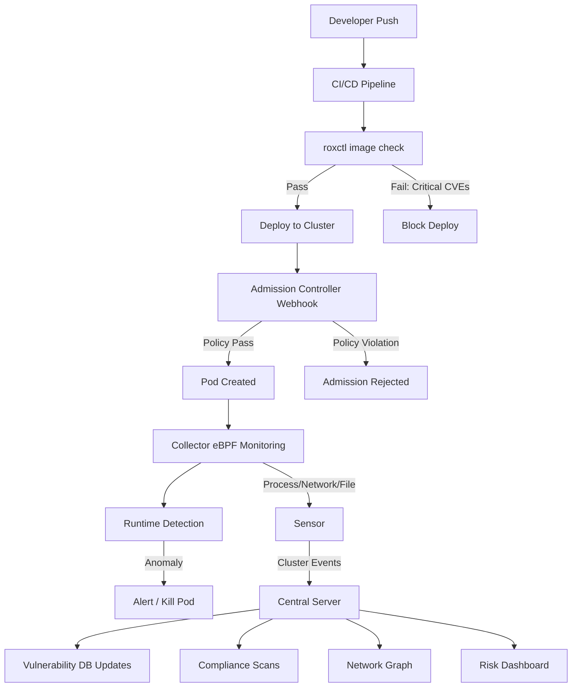

> 💡 **Quick Answer:** Install the RHACS Operator via OLM, deploy a `Central` CR for the management plane (UI, API, scanner, DB), then deploy `SecuredCluster` CRs on each managed cluster to get vulnerability scanning, compliance auditing, network segmentation, risk profiling, and runtime threat detection.

## The Problem

Kubernetes clusters face threats across the full lifecycle: vulnerable container images in CI/CD, misconfigured deployments at admission, lateral movement at runtime, and compliance drift over time. You need a unified security platform that covers build-time scanning, deploy-time policy enforcement, and runtime detection — without bolting together 5 different tools.

## The Solution

### Architecture Overview

```yaml
# RHACS Components:
# Central (management plane):
#   - Central server: UI, API, policy engine, RBAC
#   - Scanner: image vulnerability scanning (Clair-based)
#   - Scanner DB: vulnerability database
#   - Central DB: PostgreSQL for config, alerts, compliance data
#
# SecuredCluster (data plane, per cluster):
#   - Sensor: cluster-level orchestrator, talks to Central
#   - Collector: per-node DaemonSet, eBPF-based runtime monitoring
#   - Admission Controller: webhook for deploy-time enforcement
```

### Install the RHACS Operator

```yaml
apiVersion: v1
kind: Namespace
metadata:
  name: rhacs-operator
---
apiVersion: operators.coreos.com/v1
kind: OperatorGroup
metadata:
  name: rhacs-operator
  namespace: rhacs-operator
spec:
  upgradeStrategy: Default
---
apiVersion: operators.coreos.com/v1alpha1
kind: Subscription
metadata:
  name: rhacs-operator
  namespace: rhacs-operator
spec:
  channel: stable
  name: rhacs-operator
  source: redhat-operators
  sourceNamespace: openshift-marketplace
  installPlanApproval: Automatic
```

### Deploy Central

```yaml
apiVersion: v1
kind: Namespace
metadata:
  name: stackrox
---
apiVersion: platform.stackrox.io/v1alpha1
kind: Central
metadata:
  name: stackrox-central-services
  namespace: stackrox
spec:
  central:
    exposure:
      loadBalancer:
        enabled: false
      nodePort:
        enabled: false
      route:
        enabled: true    # Creates OpenShift Route
    persistence:
      persistentVolumeClaim:
        claimName: stackrox-db
        storageClassName: gp3-csi
        size: 100Gi
    resources:
      requests:
        cpu: "1"
        memory: 4Gi
      limits:
        cpu: "4"
        memory: 8Gi
    db:
      isEnabled: Default
      persistence:
        persistentVolumeClaim:
          claimName: central-db
          storageClassName: gp3-csi
          size: 100Gi
      resources:
        requests:
          cpu: 500m
          memory: 2Gi
        limits:
          cpu: "2"
          memory: 4Gi
  scanner:
    analyzer:
      scaling:
        autoScaling: Enabled
        maxReplicas: 5
        minReplicas: 2
        replicas: 2
      resources:
        requests:
          cpu: 500m
          memory: 1Gi
        limits:
          cpu: "2"
          memory: 4Gi
    db:
      resources:
        requests:
          cpu: 200m
          memory: 512Mi
        limits:
          cpu: "1"
          memory: 2Gi
  egress:
    connectivityPolicy: Online   # Online for CVE feed updates
```

### Get the Admin Password

```bash
# Auto-generated admin password stored in a Secret
oc get secret central-htpasswd -n stackrox \
  -o jsonpath='{.data.password}' | base64 -d

# Access Central UI
oc get route central -n stackrox -o jsonpath='{.spec.host}'
# https://central-stackrox.apps.cluster.example.com
```

### Generate Init Bundle for Secured Clusters

```bash
# Create an init bundle (authentication material for Sensor ↔ Central)
# Via UI: Platform Configuration → Integrations → Cluster Init Bundle → Generate
# Or via API:
roxctl -e https://central-stackrox.apps.cluster.example.com:443 \
  central init-bundles generate my-cluster-bundle \
  --output-secrets cluster-init-secrets.yaml

# Apply the init bundle secrets to the secured cluster
oc apply -f cluster-init-secrets.yaml -n stackrox
```

### Deploy SecuredCluster

```yaml
apiVersion: platform.stackrox.io/v1alpha1
kind: SecuredCluster
metadata:
  name: stackrox-secured-cluster-services
  namespace: stackrox
spec:
  clusterName: production-cluster
  centralEndpoint: central-stackrox.stackrox.svc:443
  # For remote clusters:
  # centralEndpoint: central-stackrox.apps.hub-cluster.example.com:443
  sensor:
    resources:
      requests:
        cpu: 500m
        memory: 1Gi
      limits:
        cpu: "2"
        memory: 4Gi
  admissionControl:
    listenOnCreates: true
    listenOnUpdates: true
    listenOnEvents: true
    contactImageScanners: ScanIfMissing
    timeoutSeconds: 20
    bypass: BreakGlassAnnotation
    resources:
      requests:
        cpu: 50m
        memory: 100Mi
      limits:
        cpu: 500m
        memory: 500Mi
  perNode:
    collector:
      collection: EBPF           # EBPF or CORE_BPF (kernel 5.8+)
      forceCollection: false
      imageFlavor: Regular        # Regular or Slim
      resources:
        requests:
          cpu: 50m
          memory: 320Mi
        limits:
          cpu: "1"
          memory: 1Gi
    taintToleration: TolerateTaints  # Run on all nodes including GPU/infra
```

### Custom Security Policies

```yaml
# RHACS policies are managed via the UI or API
# Examples of critical policies to enable/customize:

# 1. Block images with Critical CVEs
# Policy: "Fixable Critical CVEs"
# Lifecycle: Build + Deploy
# Enforcement: Block admission
# Criteria: CVSS >= 9.0 AND fixable = true

# 2. No privileged containers
# Policy: "Privileged Container"
# Lifecycle: Deploy
# Enforcement: Block admission + Scale to Zero
# Criteria: securityContext.privileged = true

# 3. Required labels
# Policy: "Missing Required Labels"
# Lifecycle: Deploy
# Enforcement: Inform
# Criteria: Missing labels: app, team, cost-center

# 4. Block latest tag
# Policy: "Latest Tag"
# Lifecycle: Build + Deploy
# Enforcement: Block admission
# Criteria: image tag = "latest" OR no tag

# Via roxctl CLI:
roxctl -e $CENTRAL_ENDPOINT \
  policy export --name "Fixable Critical CVEs" -o policy-export.json
```

### CI/CD Integration (Image Scanning)

```yaml
# Scan images in CI pipeline before push
# roxctl CLI image check + image scan

# GitLab CI example:
stages:
  - build
  - scan
  - deploy

image-scan:
  stage: scan
  image: registry.redhat.io/advanced-cluster-security/roxctl-rhel8:latest
  variables:
    ROX_CENTRAL_ADDRESS: central-stackrox.apps.cluster.example.com:443
    ROX_API_TOKEN: $ACS_API_TOKEN
  script:
    # Check image against deploy-time policies
    - roxctl image check --endpoint $ROX_CENTRAL_ADDRESS
        --image quay.io/myorg/myapp:${CI_COMMIT_SHA}
        --insecure-skip-tls-verify

    # Full vulnerability scan
    - roxctl image scan --endpoint $ROX_CENTRAL_ADDRESS
        --image quay.io/myorg/myapp:${CI_COMMIT_SHA}
        --output json > scan-results.json

    # Fail pipeline if critical fixable CVEs found
    - |
      CRITICAL=$(jq '[.result.vulnerabilities[] |
        select(.severity == "CRITICAL" and .fixedBy != "")] |
        length' scan-results.json)
      if [ "$CRITICAL" -gt 0 ]; then
        echo "Found $CRITICAL fixable critical CVEs — blocking deployment"
        exit 1
      fi
```

### Network Graph and Segmentation

```bash
# RHACS auto-discovers network flows between deployments
# Use the Network Graph UI to:
# 1. Visualize actual traffic flows (not just policies)
# 2. Generate NetworkPolicy baselines from observed traffic
# 3. Simulate policy changes before applying
# 4. Detect anomalous connections

# Export generated NetworkPolicies:
roxctl -e $CENTRAL_ENDPOINT \
  netpol generate --cluster production-cluster \
  --namespace my-project \
  --output-dir ./generated-netpols

# Apply generated policies:
oc apply -f ./generated-netpols/
```

### Compliance Scanning

```yaml
# RHACS includes compliance operators for:
# - CIS Kubernetes Benchmark
# - NIST SP 800-53
# - NIST SP 800-190 (Container Security Guide)
# - PCI DSS
# - HIPAA
# - NERC-CIP

# Run compliance scan via UI:
# Compliance → Scan Environment → Select standards → Run Scan

# Via API:
roxctl -e $CENTRAL_ENDPOINT \
  compliance results --standard "CIS Kubernetes" \
  --cluster production-cluster \
  --output csv > compliance-report.csv
```

### Runtime Threat Detection

```yaml
# Collector (eBPF-based) monitors:
# - Process execution (unexpected binaries)
# - Network connections (anomalous outbound)
# - File system access (sensitive file reads)
# - Privilege escalation attempts
# - Crypto mining indicators

# Key runtime policies to enable:
# - "Cryptocurrency Mining Process" → Kill Pod
# - "Shell Spawned by Java Application" → Alert
# - "Netcat Execution Detected" → Kill Pod
# - "Process with UID 0" → Alert (for non-exempt containers)
# - "Unauthorized Network Flow" → Alert

# Enforcement actions:
# - Inform: Alert only (default)
# - Scale to Zero: Set replicas=0
# - Kill Pod: Terminate the pod immediately
# - Admission Rejection: Block future deploys matching criteria
```

### Integration with External Systems

```bash
# Webhook notifications (Slack, PagerDuty, Jira, etc.)
# Platform Configuration → Integrations

# Slack example:
roxctl -e $CENTRAL_ENDPOINT \
  integration create notifier \
  --type slack \
  --name "security-alerts" \
  --slack-webhook "https://hooks.slack.com/services/T.../B.../xxx"

# Syslog for SIEM integration:
roxctl -e $CENTRAL_ENDPOINT \
  integration create notifier \
  --type syslog \
  --name "siem-export" \
  --syslog-endpoint siem.example.com:514 \
  --syslog-protocol TCP

# Registry integrations (scan private registries):
# Quay, Artifactory, Harbor, ECR, GCR, ACR, Docker Hub
# Platform Configuration → Integrations → Image Integrations
```

### Verify Deployment

```bash
# Check operator
oc get csv -n rhacs-operator | grep rhacs

# Check Central pods
oc get pods -n stackrox -l app=central
oc get pods -n stackrox -l app=scanner

# Check SecuredCluster components
oc get pods -n stackrox -l app=sensor
oc get pods -n stackrox -l app=collector
oc get pods -n stackrox -l app=admission-control

# Verify Sensor ↔ Central connectivity
oc logs -n stackrox deploy/sensor | grep -i "connected to central"

# Check cluster health in Central
roxctl -e $CENTRAL_ENDPOINT cluster list

# Run a quick vulnerability check
roxctl -e $CENTRAL_ENDPOINT image scan \
  --image registry.access.redhat.com/ubi9:latest \
  --output table
```



## Common Issues

- **Sensor can't connect to Central** — verify `centralEndpoint` in SecuredCluster CR; for cross-cluster, use the external Route hostname and ensure TLS/port 443 is reachable
- **Collector pods OOMKilled** — increase memory limits; eBPF collection on busy nodes can spike memory; consider `CORE_BPF` on kernel 5.8+ for lower overhead
- **Admission controller timeout** — increase `timeoutSeconds` (default 20); for air-gapped, ensure `contactImageScanners: DoNotScanInline` if scanner is unreachable
- **Scanner not finding CVEs** — check `egress.connectivityPolicy: Online` for CVE feed updates; air-gapped requires manual vulnerability bundle upload
- **Init bundle expired** — bundles have a TTL; regenerate and reapply if Sensor shows auth errors
- **High false positive rate** — tune policies by excluding system namespaces (`openshift-*`, `kube-system`); use policy scopes to target specific clusters/namespaces
- **Collector not running on GPU nodes** — set `taintToleration: TolerateTaints` in SecuredCluster spec to schedule on tainted nodes

## Best Practices

- Deploy Central on a dedicated infra/hub cluster — keeps security management separate from workloads
- Use `CORE_BPF` collection on kernel 5.8+ — lower overhead than `EBPF`, no kernel module needed
- Start with `Inform` enforcement, then graduate to `Block` after tuning policy exceptions
- Enable `BreakGlassAnnotation` on admission controller — allows emergency bypasses with audit trail
- Integrate `roxctl image check` in CI pipelines — shift-left catches CVEs before they reach the cluster
- Use Network Graph to generate baseline NetworkPolicies from actual traffic before enforcing deny-default
- Schedule compliance scans weekly and export reports — required for PCI DSS, HIPAA, FedRAMP audits
- Set up Slack/PagerDuty notifiers for Critical severity runtime alerts

## Key Takeaways

- RHACS (StackRox) provides full-lifecycle security: build-time scanning, deploy-time admission, runtime detection
- Central = management plane (UI, scanner, DB); SecuredCluster = data plane (Sensor, Collector, Admission Controller)
- Collector uses eBPF for zero-instrumentation runtime monitoring of processes, network, and filesystem
- Admission controller acts as a validating webhook — blocks policy-violating deployments at creation
- Network Graph auto-discovers traffic flows and generates NetworkPolicy recommendations
- `roxctl` CLI enables CI/CD integration for pre-deploy image scanning and policy checks
- Compliance scanning covers CIS, NIST, PCI DSS, HIPAA out of the box
