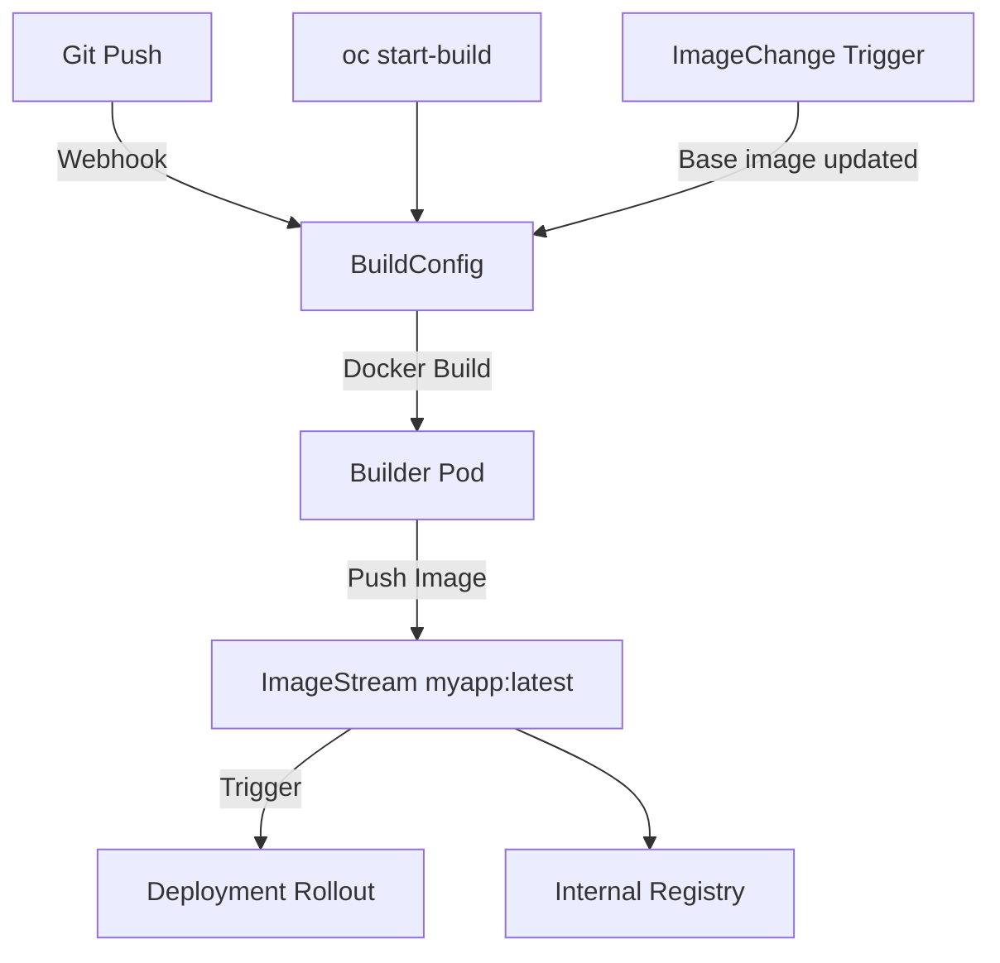

> 💡 **Quick Answer:** Create a BuildConfig with `strategy.type: Docker` and `output.to: ImageStreamTag`, then trigger builds from Git webhooks or `oc start-build`. ImageStreams track tags and auto-trigger Deployments on new builds.

## The Problem

You need to build container images inside OpenShift — from Git source, Dockerfiles, or S2I — and have deployments automatically update when new images are built. External CI/CD adds latency, network hops, and credential management overhead.

## The Solution

OpenShift BuildConfig defines how to build images. ImageStreams act as virtual image repositories that track tags and trigger rollouts when images change.

### BuildConfig from Git with Dockerfile

```yaml
apiVersion: build.openshift.io/v1
kind: BuildConfig
metadata:
  name: myapp-build
  namespace: myproject
spec:
  source:
    type: Git
    git:
      uri: https://github.com/myorg/myapp.git
      ref: main
    contextDir: /
  strategy:
    type: Docker
    dockerStrategy:
      dockerfilePath: Dockerfile
      buildArgs:
        - name: GO_VERSION
          value: "1.22"
      env:
        - name: GOPROXY
          value: "https://proxy.golang.org,direct"
  output:
    to:
      kind: ImageStreamTag
      name: myapp:latest
  triggers:
    - type: ConfigChange
    - type: GitHub
      github:
        secret: github-webhook-secret
    - type: ImageChange
      imageChange: {}
  resources:
    limits:
      cpu: "2"
      memory: 4Gi
    requests:
      cpu: 500m
      memory: 1Gi
  runPolicy: Serial
---
apiVersion: image.openshift.io/v1
kind: ImageStream
metadata:
  name: myapp
  namespace: myproject
```

### S2I (Source-to-Image) Build

```yaml
apiVersion: build.openshift.io/v1
kind: BuildConfig
metadata:
  name: python-app-build
  namespace: myproject
spec:
  source:
    type: Git
    git:
      uri: https://github.com/myorg/python-app.git
      ref: main
  strategy:
    type: Source
    sourceStrategy:
      from:
        kind: ImageStreamTag
        namespace: openshift
        name: python:3.11-ubi9
      env:
        - name: PIP_INDEX_URL
          value: "https://pypi.org/simple"
  output:
    to:
      kind: ImageStreamTag
      name: python-app:latest
  triggers:
    - type: ConfigChange
    - type: ImageChange
      imageChange: {}
```

### Deployment with ImageStream Trigger

```yaml
apiVersion: apps/v1
kind: Deployment
metadata:
  name: myapp
  namespace: myproject
  annotations:
    image.openshift.io/triggers: |
      [{"from":{"kind":"ImageStreamTag","name":"myapp:latest","namespace":"myproject"},
        "fieldPath":"spec.template.spec.containers[?(@.name==\"myapp\")].image",
        "paused":false}]
spec:
  replicas: 3
  selector:
    matchLabels:
      app: myapp
  template:
    metadata:
      labels:
        app: myapp
    spec:
      containers:
        - name: myapp
          image: myapp:latest  # Resolved by ImageStream trigger
          ports:
            - containerPort: 8080
          readinessProbe:
            httpGet:
              path: /healthz
              port: 8080
```

### Build and Monitor

```bash
# Start a build manually
oc start-build myapp-build -n myproject

# Start build from local directory
oc start-build myapp-build --from-dir=. -n myproject

# Follow build logs
oc start-build myapp-build -n myproject --follow

# List builds
oc get builds -n myproject

# View build logs
oc logs build/myapp-build-1 -n myproject

# Check ImageStream tags
oc get is myapp -n myproject
oc describe is myapp -n myproject

# Get image SHA
oc get istag myapp:latest -n myproject -o jsonpath='{.image.dockerImageReference}'
```



## Common Issues

- **Build fails: permission denied** — BuildConfig needs `system:build-strategy-docker` role; check `oc adm policy add-cluster-role-to-user`
- **ImageStream not triggering deployment** — verify `image.openshift.io/triggers` annotation on Deployment matches ImageStream name/namespace
- **Build OOM killed** — increase `spec.resources.limits.memory`; Docker builds can be memory-intensive
- **Webhook not triggering** — check webhook URL in Git provider matches `oc describe bc myapp-build | grep Webhook`
- **ImageStream tag not updating** — ensure `output.to.kind: ImageStreamTag` not `DockerImage`; check build completed successfully

## Best Practices

- Use `runPolicy: Serial` to prevent concurrent builds from conflicting
- Set resource limits on BuildConfig to prevent builder pods from consuming cluster resources
- Use ImageStream triggers for automatic deployment rollouts
- Tag images with version numbers for rollback: `myapp:v1.2.3` alongside `myapp:latest`
- Use `--from-dir=.` for rapid iteration during development
- Configure webhooks for automated builds on Git push

## Key Takeaways

- BuildConfig defines the build pipeline; ImageStream tracks the output images
- Three build strategies: Docker (Dockerfile), Source (S2I), and Custom
- ImageStream triggers auto-update Deployments when new images are pushed
- `oc start-build --follow` for manual builds with live logs
- Builds run as pods inside the cluster — no external CI needed
