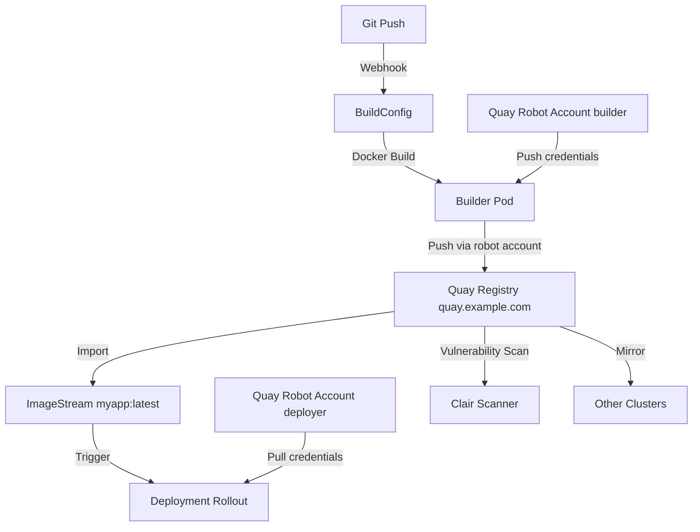

> 💡 **Quick Answer:** Create a push secret with Quay robot account credentials, reference it in BuildConfig `output.pushSecret`, and set `output.to.kind: DockerImage` with the full Quay image path. Add Quay's CA to the cluster for HTTPS trust.

## The Problem

You want to build images inside OpenShift but push to your local Quay registry instead of the internal registry — for image scanning, replication, access control, and sharing across multiple clusters. The internal registry is ephemeral and cluster-scoped.

## The Solution

Configure BuildConfig to push directly to Quay using robot account credentials. Use ImageStream with `referencePolicy.type: Local` to import and track images from Quay.

### Step 1: Create Quay Robot Account Secret

```bash
# Create push secret from Quay robot account
oc create secret docker-registry quay-push-secret \
  --docker-server=quay.example.com \
  --docker-username="myorg+builder" \
  --docker-password="ROBOT_TOKEN_HERE" \
  --docker-email="builder@example.com" \
  -n myproject

# Link secret to builder service account
oc secrets link builder quay-push-secret -n myproject
```

### Step 2: Add Quay CA Certificate (Self-Signed)

```yaml
# If Quay uses self-signed or internal CA
apiVersion: v1
kind: ConfigMap
metadata:
  name: quay-ca-bundle
  namespace: openshift-config
data:
  ca-bundle.crt: |
    -----BEGIN CERTIFICATE-----
    MIIDxTCCA...your CA cert...
    -----END CERTIFICATE-----
---
# Add to cluster-wide trust
apiVersion: config.openshift.io/v1
kind: Image
metadata:
  name: cluster
spec:
  additionalTrustedCA:
    name: quay-ca-bundle
```

### Step 3: BuildConfig Pushing to Quay

```yaml
apiVersion: build.openshift.io/v1
kind: BuildConfig
metadata:
  name: myapp-build
  namespace: myproject
spec:
  source:
    type: Git
    git:
      uri: https://github.com/myorg/myapp.git
      ref: main
  strategy:
    type: Docker
    dockerStrategy:
      dockerfilePath: Dockerfile
  output:
    to:
      kind: DockerImage
      name: quay.example.com/myorg/myapp:latest
    pushSecret:
      name: quay-push-secret
  triggers:
    - type: ConfigChange
    - type: GitHub
      github:
        secret: webhook-secret
  resources:
    limits:
      cpu: "2"
      memory: 4Gi
```

### Step 4: ImageStream Importing from Quay

```yaml
apiVersion: image.openshift.io/v1
kind: ImageStream
metadata:
  name: myapp
  namespace: myproject
spec:
  lookupPolicy:
    local: true
  tags:
    - name: latest
      from:
        kind: DockerImage
        name: quay.example.com/myorg/myapp:latest
      referencePolicy:
        type: Local
      importPolicy:
        scheduled: true       # Periodically check for new images
        importMode: Legacy
    - name: stable
      from:
        kind: DockerImage
        name: quay.example.com/myorg/myapp:stable
      referencePolicy:
        type: Local
      importPolicy:
        scheduled: true
```

### Step 5: Pull Secret for Deployments

```yaml
# Create pull secret for runtime
apiVersion: v1
kind: Secret
metadata:
  name: quay-pull-secret
  namespace: myproject
type: kubernetes.io/dockerconfigjson
stringData:
  .dockerconfigjson: |
    {
      "auths": {
        "quay.example.com": {
          "username": "myorg+deployer",
          "password": "DEPLOYER_ROBOT_TOKEN",
          "auth": "base64encodedcreds"
        }
      }
    }
---
# Link to default SA for pulling
# oc secrets link default quay-pull-secret --for=pull -n myproject
```

### Multi-Architecture Build

```yaml
apiVersion: build.openshift.io/v1
kind: BuildConfig
metadata:
  name: myapp-build-multiarch
  namespace: myproject
spec:
  source:
    type: Git
    git:
      uri: https://github.com/myorg/myapp.git
      ref: main
  strategy:
    type: Docker
    dockerStrategy:
      dockerfilePath: Dockerfile
      buildArgs:
        - name: TARGETARCH
          value: amd64
  output:
    to:
      kind: DockerImage
      name: quay.example.com/myorg/myapp:latest-amd64
    pushSecret:
      name: quay-push-secret
```

### Tagged Builds with Version

```bash
# Build with specific tag
oc start-build myapp-build -n myproject \
  -e VERSION=1.5.0

# Override output image tag
oc start-build myapp-build -n myproject \
  --to='quay.example.com/myorg/myapp:v1.5.0'

# Build from local source
oc start-build myapp-build -n myproject \
  --from-dir=. \
  --to='quay.example.com/myorg/myapp:dev-latest'

# Verify image in Quay
skopeo inspect docker://quay.example.com/myorg/myapp:latest

# Import updated tag into ImageStream
oc import-image myapp:latest -n myproject --confirm
```

### Complete CI/CD Pipeline

```yaml
# BuildConfig with versioned tags
apiVersion: build.openshift.io/v1
kind: BuildConfig
metadata:
  name: myapp-release
  namespace: myproject
spec:
  source:
    type: Git
    git:
      uri: https://github.com/myorg/myapp.git
      ref: main
  strategy:
    type: Docker
    dockerStrategy:
      dockerfilePath: Dockerfile
  output:
    to:
      kind: DockerImage
      name: quay.example.com/myorg/myapp:latest
    pushSecret:
      name: quay-push-secret
    imageLabels:
      - name: io.openshift.build.source-location
        value: https://github.com/myorg/myapp.git
      - name: io.openshift.build.commit.id
        value: "${OPENSHIFT_BUILD_COMMIT}"
  postCommit:
    script: |
      # Run tests after build
      /app/run-tests.sh
  successfulBuildsHistoryLimit: 5
  failedBuildsHistoryLimit: 3
---
# Deployment pulling from Quay
apiVersion: apps/v1
kind: Deployment
metadata:
  name: myapp
  namespace: myproject
  annotations:
    image.openshift.io/triggers: |
      [{"from":{"kind":"ImageStreamTag","name":"myapp:latest","namespace":"myproject"},
        "fieldPath":"spec.template.spec.containers[?(@.name==\"myapp\")].image",
        "paused":false}]
spec:
  replicas: 3
  selector:
    matchLabels:
      app: myapp
  template:
    metadata:
      labels:
        app: myapp
    spec:
      imagePullSecrets:
        - name: quay-pull-secret
      containers:
        - name: myapp
          image: quay.example.com/myorg/myapp:latest
          ports:
            - containerPort: 8080
```



## Common Issues

- **Push fails: x509 certificate error** — add Quay CA to `additionalTrustedCA` in Image config; wait for MCO rollout
- **Push fails: unauthorized** — verify robot account has `write` permission on the repository; check `oc secrets link builder quay-push-secret`
- **ImageStream import fails** — ensure pull credentials exist; run `oc import-image myapp --confirm` to debug
- **Build uses cached layers** — add `--no-cache` flag: `oc start-build myapp-build --build-arg NO_CACHE=$(date +%s)`
- **Deployment not updating** — check ImageStream trigger annotation; verify `oc get istag myapp:latest` shows new SHA

## Best Practices

- Use separate robot accounts for push (builder) and pull (deployer) with minimal permissions
- Add Quay CA to cluster-wide trust before creating BuildConfigs
- Enable Quay vulnerability scanning (Clair) to block vulnerable images
- Use `referencePolicy.type: Local` on ImageStream for faster pulls via internal cache
- Tag releases with semver (`v1.2.3`) and keep `latest` for development
- Set `successfulBuildsHistoryLimit` to prevent build object accumulation
- Use `postCommit` hooks for automated testing before image is tagged

## Key Takeaways

- BuildConfig `output.to.kind: DockerImage` pushes to external registries like Quay
- `pushSecret` references the robot account credentials for registry authentication
- ImageStream with `importPolicy.scheduled: true` auto-imports new tags from Quay
- Separate push/pull robot accounts follow least-privilege principle
- Quay provides scanning, mirroring, and access control that the internal registry lacks
