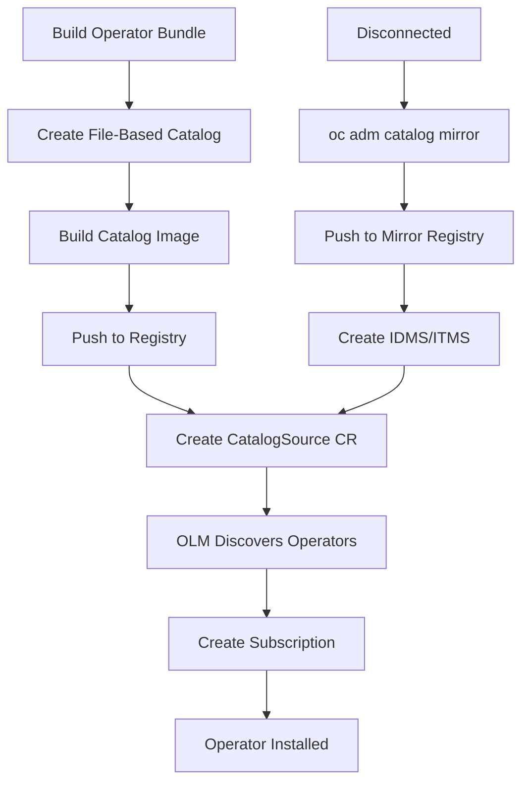

> 💡 **Quick Answer:** Create a `CatalogSource` in the `openshift-marketplace` namespace pointing to your operator index image. OLM polls it to discover installable operators.

## The Problem

OpenShift ships with default CatalogSources (redhat-operators, certified-operators, community-operators) that pull from Red Hat's public registries. In production you often need:

- **Disconnected/air-gapped clusters** that can't reach public registries
- **Custom operator catalogs** with only approved operators
- **Internal operators** built by your team
- **Specific operator versions** pinned for compliance
- **Mirrored catalogs** served from a local registry

Without custom CatalogSources, OLM can't discover or install your operators.

## The Solution

### Basic CatalogSource

```yaml
apiVersion: operators.coreos.com/v1alpha1
kind: CatalogSource
metadata:
  name: my-custom-catalog
  namespace: openshift-marketplace
spec:
  sourceType: grpc
  image: registry.example.com/olm/custom-catalog:v4.14
  displayName: "Custom Operator Catalog"
  publisher: "Platform Team"
  updateStrategy:
    registryPoll:
      interval: 30m
```

### CatalogSource for Disconnected Environment

```yaml
apiVersion: operators.coreos.com/v1alpha1
kind: CatalogSource
metadata:
  name: disconnected-redhat-operators
  namespace: openshift-marketplace
spec:
  sourceType: grpc
  image: mirror.internal.example.com/olm/redhat-operator-index:v4.14
  displayName: "Mirrored Red Hat Operators"
  publisher: "Red Hat (mirrored)"
  updateStrategy:
    registryPoll:
      interval: 60m
  # Trust the internal CA
  secrets:
    - "mirror-registry-ca"
```

### Disable Default CatalogSources

In disconnected environments, disable the default catalogs that can't be reached:

```yaml
apiVersion: config.openshift.io/v1
kind: OperatorHub
metadata:
  name: cluster
spec:
  disableAllDefaultSources: true
```

Then create only the mirrored CatalogSources you need.

### Build a File-Based Catalog (FBC)

Modern OLM uses file-based catalogs instead of the deprecated SQLite format:

```bash
# Initialize a new catalog
mkdir -p my-catalog

# Create the catalog Dockerfile
cat > my-catalog.Dockerfile << 'EOF'
FROM registry.redhat.io/openshift4/ose-operator-registry:v4.14
COPY my-catalog /configs
RUN ["/bin/opm", "serve", "/configs", "--cache-dir=/tmp/cache"]
ENTRYPOINT ["/bin/opm"]
CMD ["serve", "/configs", "--cache-dir=/tmp/cache"]
EXPOSE 50051
LABEL operators.operatorframework.io.index.configs.v1=/configs
EOF

# Add an operator to the catalog
opm init my-operator \
  --default-channel=stable \
  --output yaml > my-catalog/my-operator/operator.yaml

# Render a bundle into the catalog
opm render registry.example.com/my-operator-bundle:v1.0.0 \
  --output yaml >> my-catalog/my-operator/operator.yaml

# Add a channel entry
cat >> my-catalog/my-operator/operator.yaml << 'EOF'
---
schema: olm.channel
package: my-operator
name: stable
entries:
  - name: my-operator.v1.0.0
EOF

# Validate the catalog
opm validate my-catalog

# Build and push
podman build -f my-catalog.Dockerfile -t registry.example.com/olm/my-catalog:latest .
podman push registry.example.com/olm/my-catalog:latest
```

### Mirror an Existing Catalog

```bash
# Mirror Red Hat operators catalog for disconnected use
oc adm catalog mirror \
  registry.redhat.io/redhat/redhat-operator-index:v4.14 \
  mirror.internal.example.com/olm \
  --index-filter-by-os="linux/amd64" \
  --manifests-only

# Apply the generated ImageContentSourcePolicy/IDMS
oc apply -f manifests/imageContentSourcePolicy.yaml

# Push the mirrored index
oc adm catalog mirror \
  registry.redhat.io/redhat/redhat-operator-index:v4.14 \
  mirror.internal.example.com/olm
```

### CatalogSource with Authentication

```yaml
apiVersion: operators.coreos.com/v1alpha1
kind: CatalogSource
metadata:
  name: authenticated-catalog
  namespace: openshift-marketplace
spec:
  sourceType: grpc
  image: private-registry.example.com/olm/catalog:v1.0
  displayName: "Private Catalog"
  publisher: "Internal"
  updateStrategy:
    registryPoll:
      interval: 30m
---
# Create pull secret in openshift-marketplace namespace
apiVersion: v1
kind: Secret
metadata:
  name: private-registry-pull-secret
  namespace: openshift-marketplace
type: kubernetes.io/dockerconfigjson
data:
  .dockerconfigjson: <base64-encoded-docker-config>
```

### Verify CatalogSource Health

```bash
# Check CatalogSource status
oc get catalogsource -n openshift-marketplace

# Check the catalog pod is running
oc get pods -n openshift-marketplace -l olm.catalogSource=my-custom-catalog

# Verify gRPC connection
oc get catalogsource my-custom-catalog -n openshift-marketplace -o yaml | grep -A5 status

# List available packages from your catalog
oc get packagemanifest -l catalog=my-custom-catalog

# Check catalog operator logs
oc logs -n openshift-marketplace deploy/my-custom-catalog -f
```



## Common Issues

### CatalogSource Pod CrashLoopBackOff

```bash
# Check pod logs for catalog errors
oc logs -n openshift-marketplace -l olm.catalogSource=my-custom-catalog --previous

# Common cause: invalid FBC schema
opm validate my-catalog
# Fix: ensure all required fields in operator.yaml

# Common cause: image pull failure
oc describe pod -n openshift-marketplace -l olm.catalogSource=my-custom-catalog
# Fix: check pull secret and IDMS/ITMS configuration
```

### CatalogSource Shows "READY" but No PackageManifests

```bash
# gRPC endpoint may be unreachable — check service
oc get svc -n openshift-marketplace -l olm.catalogSource=my-custom-catalog

# Force catalog re-sync by deleting the pod
oc delete pod -n openshift-marketplace -l olm.catalogSource=my-custom-catalog
```

### Update Strategy Not Polling

```bash
# Verify updateStrategy is set
oc get catalogsource my-custom-catalog -n openshift-marketplace -o jsonpath='{.spec.updateStrategy}'

# If using :latest tag, OLM needs registryPoll to detect new digests
# If using digest-based tags, update the CatalogSource image field directly
```

## Best Practices

- **Use digest-based image references** in production (`@sha256:...`) for reproducibility
- **Set `registryPoll.interval`** to 30-60m in production (too frequent = API rate limits)
- **Disable default CatalogSources** in disconnected clusters to avoid timeout errors
- **Namespace your CatalogSources** in `openshift-marketplace` for cluster-wide visibility, or in a specific namespace for scoped access
- **Version your catalog images** with the OpenShift version (`v4.14`, `v4.15`) for upgrade compatibility
- **Validate catalogs** with `opm validate` before pushing to catch schema errors early
- **Monitor catalog pod health** — a crashed catalog pod blocks all operator installs from that source

## Key Takeaways

- CatalogSource is the bridge between your operator images and OLM's install mechanism
- File-Based Catalogs (FBC) replaced SQLite — use `opm` to build and validate
- Disconnected clusters need `oc adm catalog mirror` + IDMS/ITMS + custom CatalogSource
- Always disable default sources in air-gapped environments to prevent timeout delays
- Poll interval and image tagging strategy directly impact operator update reliability
