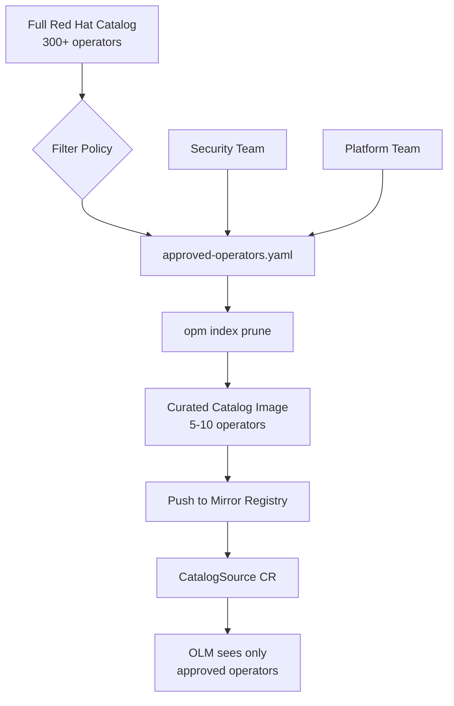

> 💡 **Quick Answer:** Use `opm index prune` or filter a file-based catalog to include only approved operator packages, then build a curated catalog image for your CatalogSource.

## The Problem

Default Red Hat catalogs contain hundreds of operators. In regulated environments you need:

- Only **approved operators** available for installation
- **Audit trail** of which operators are permitted
- **Reduced attack surface** — fewer packages = fewer vulnerabilities
- **Compliance** with internal software governance policies
- **Faster catalog pod startup** — smaller catalog = less memory and faster gRPC

## The Solution

### Prune an Existing Catalog Index

```bash
# List all packages in the source catalog
oc get packagemanifest -l catalog=redhat-operators --no-headers | awk '{print $1}'

# Prune to only approved operators
opm index prune \
  --from-index registry.redhat.io/redhat/redhat-operator-index:v4.14 \
  --packages elasticsearch-operator,cluster-logging,compliance-operator,file-integrity-operator \
  --tag mirror.internal.example.com/olm/curated-redhat-index:v4.14

# Push the pruned index
podman push mirror.internal.example.com/olm/curated-redhat-index:v4.14
```

### File-Based Catalog Filtering (Modern Approach)

```bash
# Render the full catalog to disk
mkdir -p filtered-catalog
opm render registry.redhat.io/redhat/redhat-operator-index:v4.14 \
  --output yaml > full-catalog.yaml

# Filter to only approved packages
APPROVED="elasticsearch-operator cluster-logging compliance-operator"

for pkg in $APPROVED; do
  mkdir -p filtered-catalog/$pkg
  # Extract package, channels, and bundles for this operator
  cat full-catalog.yaml | \
    python3 -c "
import sys, yaml
docs = yaml.safe_load_all(sys.stdin)
for doc in docs:
    if doc and doc.get('package') == '$pkg':
        yaml.dump(doc, sys.stdout, default_flow_style=False)
        print('---')
" > filtered-catalog/$pkg/catalog.yaml
done

# Validate
opm validate filtered-catalog

# Build filtered catalog image
cat > Dockerfile.filtered << 'EOF'
FROM registry.redhat.io/openshift4/ose-operator-registry:v4.14
COPY filtered-catalog /configs
RUN ["/bin/opm", "serve", "/configs", "--cache-dir=/tmp/cache"]
ENTRYPOINT ["/bin/opm"]
CMD ["serve", "/configs", "--cache-dir=/tmp/cache"]
EXPOSE 50051
LABEL operators.operatorframework.io.index.configs.v1=/configs
EOF

podman build -f Dockerfile.filtered -t mirror.internal.example.com/olm/curated-catalog:v4.14 .
podman push mirror.internal.example.com/olm/curated-catalog:v4.14
```

### Deploy the Curated CatalogSource

```yaml
apiVersion: config.openshift.io/v1
kind: OperatorHub
metadata:
  name: cluster
spec:
  disableAllDefaultSources: true
---
apiVersion: operators.coreos.com/v1alpha1
kind: CatalogSource
metadata:
  name: curated-operators
  namespace: openshift-marketplace
spec:
  sourceType: grpc
  image: mirror.internal.example.com/olm/curated-catalog:v4.14
  displayName: "Approved Operators Only"
  publisher: "Platform Team"
  updateStrategy:
    registryPoll:
      interval: 60m
```

### Automate with CI/CD

```yaml
# GitOps-managed approved operator list
# approved-operators.yaml
operators:
  - name: elasticsearch-operator
    reason: "Required for cluster logging"
    approved_by: "security-team"
    approved_date: "2026-01-15"
  - name: compliance-operator
    reason: "CIS benchmark scanning"
    approved_by: "security-team"
    approved_date: "2026-01-15"
  - name: cluster-logging
    reason: "Centralized log collection"
    approved_by: "platform-team"
    approved_date: "2026-02-01"
```

```bash
#!/bin/bash
# build-curated-catalog.sh — run in CI pipeline
set -euo pipefail

APPROVED=$(yq '.operators[].name' approved-operators.yaml | tr '\n' ',')
APPROVED=${APPROVED%,}  # Remove trailing comma

opm index prune \
  --from-index registry.redhat.io/redhat/redhat-operator-index:v4.14 \
  --packages "$APPROVED" \
  --tag "$REGISTRY/olm/curated-catalog:v4.14-$(date +%Y%m%d)"

podman push "$REGISTRY/olm/curated-catalog:v4.14-$(date +%Y%m%d)"
```



## Common Issues

### Pruning Removes Required Dependencies

```bash
# Some operators depend on others — check dependencies
opm index prune \
  --from-index registry.redhat.io/redhat/redhat-operator-index:v4.14 \
  --packages elasticsearch-operator,cluster-logging \
  --tag test-prune:latest 2>&1 | grep -i "depend"

# Solution: include dependency operators in your approved list
```

### Catalog Image Too Large

```bash
# Check catalog image size
skopeo inspect docker://mirror.internal.example.com/olm/curated-catalog:v4.14 | jq '.LayersData | map(.Size) | add'

# FBC approach produces smaller images than SQLite-based pruning
# Also: limit channel history to reduce bundle count
```

## Best Practices

- **Git-track your approved operator list** — treat it as code with PR reviews
- **Include dependency operators** when pruning to avoid install failures
- **Version catalog images** with build dates for rollback capability
- **Automate catalog rebuilds** in CI when the approved list or base catalog updates
- **Test operator installs** from curated catalogs in staging before production
- **Document approval reasons** for audit compliance

## Key Takeaways

- Curated CatalogSources enforce operator governance at the platform level
- `opm index prune` is the simplest approach; FBC filtering gives more control
- Always disable default CatalogSources when deploying curated alternatives
- Git-managed approval lists + CI automation = reproducible, auditable catalogs
