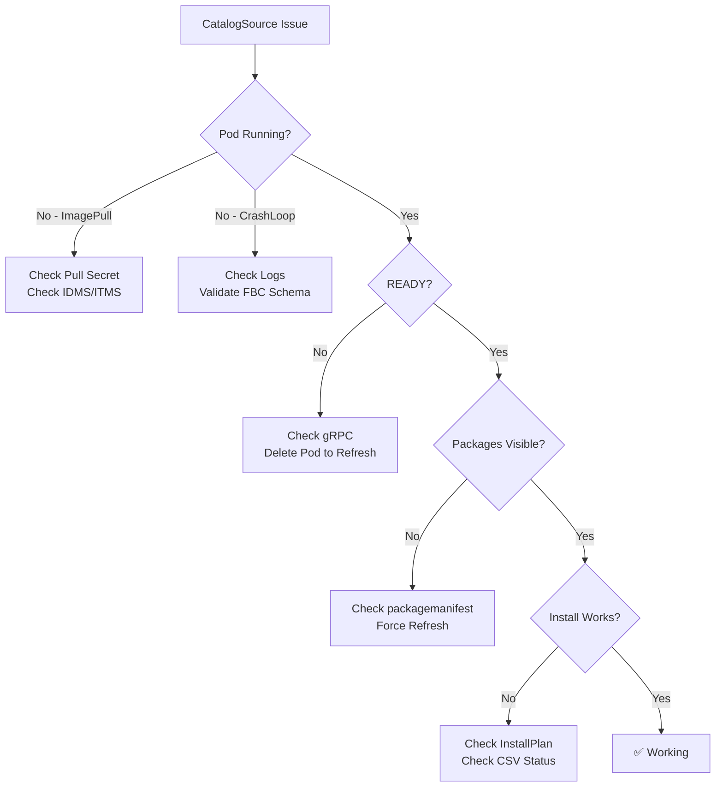

> 💡 **Quick Answer:** Check the catalog pod logs (`oc logs -n openshift-marketplace -l olm.catalogSource=<name>`), verify image pull access, and ensure gRPC connectivity. Most issues are image pull failures or invalid catalog schemas.

## The Problem

CatalogSource issues block operator lifecycle management. Common symptoms:

- CatalogSource shows **READY: false** or no status at all
- Catalog pod in **CrashLoopBackOff** or **ImagePullBackOff**
- Operators show **"no matching packages"** despite being in the catalog
- **Stale operator versions** — catalog not updating
- Subscription stuck in **"UpgradePending"** indefinitely

## The Solution

### Diagnostic Commands

```bash
# 1. Check CatalogSource status
oc get catalogsource -n openshift-marketplace -o wide
# Look for: READY=true, STATUS=READY, CONNECTION_STATE=READY

# 2. Detailed CatalogSource status
oc get catalogsource <name> -n openshift-marketplace -o jsonpath='{.status}' | jq .

# 3. Check catalog pod
oc get pods -n openshift-marketplace -l olm.catalogSource=<name>

# 4. Pod logs
oc logs -n openshift-marketplace -l olm.catalogSource=<name> --tail=100

# 5. Previous pod logs (if crashing)
oc logs -n openshift-marketplace -l olm.catalogSource=<name> --previous

# 6. OLM catalog operator logs
oc logs -n openshift-operator-lifecycle-manager deploy/catalog-operator --tail=200

# 7. Check events
oc get events -n openshift-marketplace --sort-by='.lastTimestamp' | tail -20
```

### Fix: Image Pull Failures

```bash
# Check if the catalog image is accessible
skopeo inspect docker://registry.example.com/olm/my-catalog:v4.14

# For private registries, ensure pull secret exists
oc get secret -n openshift-marketplace | grep -i pull

# Option 1: Add pull secret to openshift-marketplace SA
oc secrets link -n openshift-marketplace default my-pull-secret --for=pull

# Option 2: Use cluster-wide pull secret (affects all nodes)
oc set data secret/pull-secret -n openshift-config \
  --from-file=.dockerconfigjson=merged-pull-secret.json

# Option 3: For IDMS/ITMS mirrored images, verify mirror config
oc get imagecontentsourcepolicy
oc get imagedigestmirrorset
oc get imagetagmirrorset
```

### Fix: CatalogSource Pod CrashLoopBackOff

```bash
# Check for schema validation errors
oc logs -n openshift-marketplace -l olm.catalogSource=<name> --previous 2>&1 | grep -i "error\|fatal\|invalid"

# Common: invalid FBC schema
# Rebuild and validate the catalog
opm validate /path/to/catalog

# Common: OOM killed (large catalog)
oc get pod -n openshift-marketplace -l olm.catalogSource=<name> -o jsonpath='{.items[0].status.containerStatuses[0].lastState.terminated.reason}'
# If "OOMKilled", increase memory:
# Edit the CatalogSource to add resource requirements via pod template
```

### Fix: Catalog Shows READY but No PackageManifests

```bash
# Check gRPC connectivity
CATALOG_POD=$(oc get pod -n openshift-marketplace -l olm.catalogSource=<name> -o name | head -1)
oc exec -n openshift-marketplace $CATALOG_POD -- grpc_health_probe -addr=:50051

# Force catalog refresh by deleting the pod
oc delete pod -n openshift-marketplace -l olm.catalogSource=<name>

# Verify packages are served
oc get packagemanifest -l catalog=<catalogsource-name>
```

### Fix: Stale Catalog (Not Updating)

```bash
# Check updateStrategy
oc get catalogsource <name> -n openshift-marketplace \
  -o jsonpath='{.spec.updateStrategy}'

# Force immediate refresh
oc delete pod -n openshift-marketplace -l olm.catalogSource=<name>

# If using :latest tag, verify digest changed
skopeo inspect --no-tags docker://registry.example.com/olm/my-catalog:latest | jq '.Digest'

# Compare with running pod's image digest
oc get pod -n openshift-marketplace -l olm.catalogSource=<name> \
  -o jsonpath='{.items[0].status.containerStatuses[0].imageID}'
```

### Fix: Subscription Stuck on UpgradePending

```bash
# Check InstallPlan approval
oc get installplan -n <operator-namespace>
# If Manual approval, approve it:
oc patch installplan <plan-name> -n <operator-namespace> \
  --type merge --patch '{"spec":{"approved":true}}'

# Check if the target CSV exists
oc get csv -n <operator-namespace>

# Check Subscription status
oc get subscription <name> -n <operator-namespace> -o yaml | grep -A20 status
```



## Common Issues

### CatalogSource Disappears After Cluster Upgrade

```bash
# Custom CatalogSources survive upgrades, but check:
oc get catalogsource -n openshift-marketplace

# If missing, re-apply from GitOps/backup
# Default sources may reset — re-disable if needed:
oc patch operatorhub cluster --type merge \
  --patch '{"spec":{"disableAllDefaultSources":true}}'
```

### Multiple CatalogSources with Same Operator

```bash
# OLM may pick the wrong source — check which catalog provides it
oc get packagemanifest <operator-name> -o jsonpath='{.status.catalogSource}'

# Set catalog priority via CatalogSource spec.priority (higher = preferred)
# Or use Subscription.spec.source to pin the catalog
```

## Best Practices

- **Always validate** FBC with `opm validate` before deploying
- **Monitor catalog pods** with alerts on CrashLoopBackOff in `openshift-marketplace`
- **Use digest-based images** to avoid caching issues with `:latest` tags
- **Set reasonable poll intervals** — 30-60m for production
- **Keep catalog images small** — prune unused operators to reduce memory and startup time
- **Test catalog updates in staging** before rolling to production

## Key Takeaways

- Most CatalogSource issues are image pull or schema validation failures
- `oc logs` on the catalog pod is the fastest diagnostic tool
- Deleting the catalog pod forces a fresh pull and re-serve
- gRPC health checks confirm the catalog is actually serving data
- Pin Subscriptions to specific CatalogSources to avoid cross-catalog conflicts
