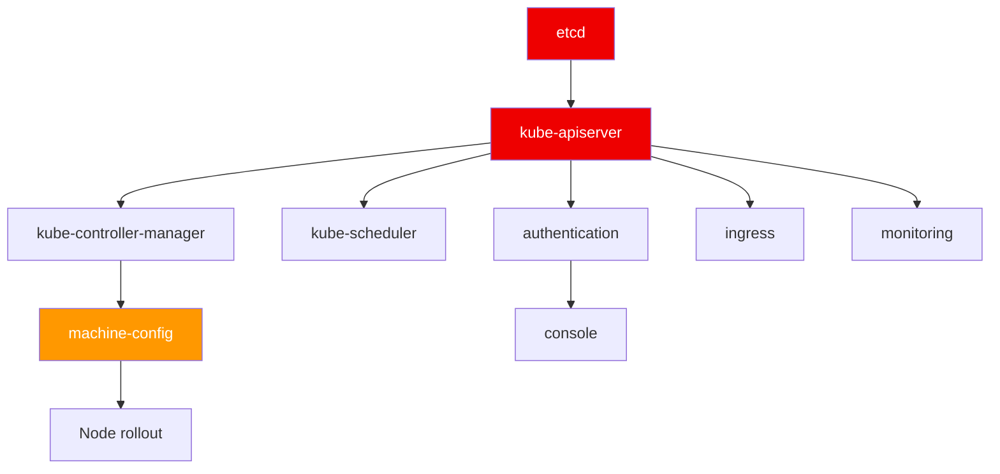

> 💡 **Quick Answer:** When an OpenShift upgrade stalls, check `oc get co` for operators not showing `True False False` (Available/Degraded/Progressing). Get details with `oc describe co <operator>`, then check the operator's namespace pods and logs. Common blockers: `kube-apiserver` (etcd quorum), `machine-config` (node reboot stuck), `ingress` (router pod scheduling), and `monitoring` (PVC full). The CVO pauses the upgrade until all operators report healthy.

## The Problem

OpenShift upgrades are CVO-driven — the Cluster Version Operator updates cluster operators one by one in dependency order. When an operator gets stuck:

- CVO pauses the entire upgrade
- Cluster sits at partial upgrade (mixed versions)
- Some operators depend on others, causing cascading failures
- Nodes may be cordoned or rebooting mid-rollout

## The Solution

### Assess Upgrade Status

```bash
# Overall progress
oc get clusterversion
# NAME      VERSION   AVAILABLE   PROGRESSING   SINCE   STATUS
# version   4.20.8    True        True          45m     Working towards 4.20.12

# Detailed CVO status
oc get clusterversion version -o json | jq '.status.conditions[] | {type, status, message}'

# Which operators are NOT healthy (not True/False/False)
oc get co | awk 'NR==1 || ($3!="True" || $4!="False" || $5!="False")'
# NAME                     AVAILABLE   DEGRADED   PROGRESSING
# kube-apiserver           True        False      True         ← Still progressing
# machine-config           False       True       True         ← Degraded!
# monitoring               True        True       False        ← Degraded

# CVO's view of upgrade progress
oc get clusterversion version -o json | \
  jq '.status.history[0] | {version, state, startedTime, completionTime}'
```

### Debug Specific Operators

```bash
# Get operator details
oc describe co machine-config

# Key fields in status:
# Conditions:
#   Type: Degraded
#   Status: True
#   Reason: MachineConfigPoolDegraded
#   Message: "pool worker: machine worker-3 is not ready"

# Check operator pods
oc get pods -n openshift-machine-config-operator
oc logs -n openshift-machine-config-operator deploy/machine-config-operator --tail=50

# Check events
oc get events -n openshift-machine-config-operator --sort-by=.lastTimestamp | tail -20
```

### Common Stuck Operators and Fixes

#### machine-config — Node Reboot Stuck

```bash
# Check MCP status
oc get mcp
# NAME     CONFIG                             UPDATED   UPDATING   DEGRADED
# worker   rendered-worker-new123             False     True       True

# Find the stuck node
oc get nodes -l node-role.kubernetes.io/worker \
  -o custom-columns=NAME:.metadata.name,READY:.status.conditions[-1].status,CONFIG:.metadata.annotations.machineconfiguration\\.openshift\\.io/currentConfig,DESIRED:.metadata.annotations.machineconfiguration\\.openshift\\.io/desiredConfig

# Check MCD on stuck node
oc debug node/worker-3 -- chroot /host \
  journalctl -u machine-config-daemon-host --since "1 hour ago" | tail -30

# If truly stuck, force MCD to retry
oc debug node/worker-3 -- chroot /host \
  touch /run/machine-config-daemon-force
```

#### kube-apiserver — Revision Rollout

```bash
# Check API server revision progress
oc get pods -n openshift-kube-apiserver -l app=openshift-kube-apiserver
# Should see pods at different revisions during upgrade

# Check installer pods
oc get pods -n openshift-kube-apiserver -l app=installer
oc logs -n openshift-kube-apiserver installer-<revision>-<node> --tail=50

# If stuck on one master — check etcd health
oc get pods -n openshift-etcd -l app=etcd
oc rsh -n openshift-etcd etcd-master-0 etcdctl endpoint health --cluster
```

#### ingress — Router Pod Issues

```bash
# Check router pods
oc get pods -n openshift-ingress
oc describe pod -n openshift-ingress router-default-<pod>

# Common: node selector prevents scheduling after upgrade
# Check: are nodes cordoned?
oc get nodes | grep SchedulingDisabled
```

#### monitoring — Prometheus PVC Full

```bash
# Check Prometheus PVC usage
oc exec -n openshift-monitoring prometheus-k8s-0 -- df -h /prometheus
# If >90%, Prometheus can't ingest → monitoring operator degrades

# Reduce retention or expand PVC
oc edit prometheusrule -n openshift-monitoring
```

### Operator Dependency Order



If `etcd` or `kube-apiserver` is stuck, everything downstream stalls.

### Force Upgrade Progress

```bash
# Check if CVO is paused
oc get clusterversion version -o jsonpath='{.spec.overrides}'

# View CVO logs
oc logs -n openshift-cluster-version deploy/cluster-version-operator --tail=100

# If an operator is stuck but the issue is known/acceptable,
# you can add an override (use with extreme caution):
oc patch clusterversion version --type json -p \
  '[{"op":"add","path":"/spec/overrides","value":[
    {"kind":"ClusterOperator","name":"monitoring","unmanaged":true}
  ]}]'

# ⚠️ REMOVE override after upgrade completes:
oc patch clusterversion version --type json -p \
  '[{"op":"remove","path":"/spec/overrides"}]'
```

### Monitoring Script

```bash
#!/bin/bash
# watch-upgrade.sh — Run during OpenShift upgrades
while true; do
    clear
    echo "=== $(date) ==="
    echo ""
    oc get clusterversion version 2>/dev/null | tail -1
    echo ""
    echo "=== Unhealthy Operators ==="
    oc get co 2>/dev/null | awk 'NR==1 || ($3!="True" || $4!="False" || $5!="False")'
    echo ""
    echo "=== MCP Status ==="
    oc get mcp 2>/dev/null
    echo ""
    echo "=== Node Status ==="
    oc get nodes --no-headers 2>/dev/null | awk '{print $1, $2}'
    sleep 30
done
```

## Common Issues

**Upgrade stuck at 60% for >1 hour**

Usually `machine-config` operator waiting for node reboot. Check which node is stuck with `oc get mcp` and `oc get nodes`.

**Multiple operators degraded simultaneously**

Often a cascading failure from `kube-apiserver` or `etcd`. Fix the root operator first — downstream operators often self-heal.

**"Cluster operator X has not yet reported success"**

CVO is waiting. Check the operator's namespace for pods in CrashLoopBackOff or ImagePullBackOff.

## Best Practices

- **Monitor with the watch script** during every upgrade
- **Fix root operators first** — etcd → apiserver → everything else
- **Never override unless you understand the consequences**
- **Check operator logs, not just conditions** — conditions are summaries
- **Plan for 60-90 minutes** per minor version upgrade

## Key Takeaways

- `oc get co` is your primary upgrade health dashboard
- Healthy operator = `Available: True, Degraded: False, Progressing: False`
- CVO upgrades operators in dependency order — root failures cascade
- `machine-config` is the most common blocker (node reboot issues)
- Check operator namespace pods and logs, not just the ClusterOperator status
- Overrides are last resort — they skip operator health checks
