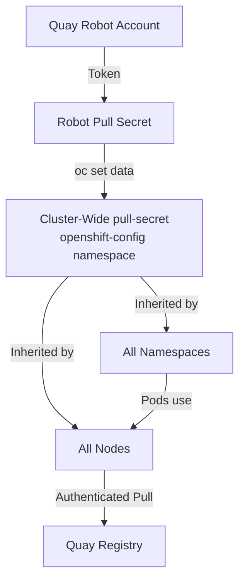

> 💡 **Quick Answer:** Extract the cluster-wide pull secret with `oc extract`, merge your Quay robot credentials using `jq`, then update with `oc set data secret/pull-secret` — all nodes and namespaces inherit the new credentials immediately.

## The Problem

You set up an OpenShift cluster using admin credentials for your Quay registry. Now you need to replace those with a robot account because:

- **Admin credentials are overprivileged** — they can push, delete, and manage repositories
- **Shared passwords are a security risk** — if leaked, the entire registry is compromised
- **No audit trail** — admin actions can't be distinguished from cluster pulls
- **Compliance requirements** — production clusters should use service accounts, not personal credentials

The common mistake is trying to patch a ServiceAccount template directly:

```bash
# ❌ This does NOT work on OpenShift 4.x
oc patch template serviceaccount/default \
  --patch '{"objects":[{"kind":"ServiceAccount",...}]}'
# error: there is no need to specify a resource type as a separate argument
```

The correct approach is to update the cluster-wide pull secret.

## The Solution

### Step 1: Create the Robot Account Secret

First, apply the robot account secret YAML from Quay:

```bash
# Apply the robot secret file from Quay
oc apply -f robot-pull-secret.yml -n openshift-config
```

The secret YAML looks like:

```yaml
apiVersion: v1
kind: Secret
metadata:
  name: quay-robot-pull-secret
type: kubernetes.io/dockerconfigjson
data:
  .dockerconfigjson: <BASE64_ENCODED_DOCKER_CONFIG>
```

### Step 2: Extract the Current Cluster-Wide Pull Secret

```bash
# Extract to current directory
oc extract secret/pull-secret \
  -n openshift-config \
  --to=. --confirm
```

This creates `.dockerconfigjson` containing the current credentials:

```json
{
  "auths": {
    "quay.internal.example.com": {
      "auth": "YWRtaW46YWRtaW4tcGFzc3dvcmQ="
    }
  }
}
```

### Step 3: Decode and Verify Current Credentials

Always check what's currently configured before changing:

```bash
# Decode the auth field to see username:password
cat .dockerconfigjson | jq -r '.auths["quay.internal.example.com"].auth' | base64 -d
# Output: admin:admin-password
```

### Step 4: Extract Robot Account Credentials

```bash
# Decode the robot secret
oc get secret quay-robot-pull-secret \
  -n openshift-config \
  -o jsonpath='{.data.\.dockerconfigjson}' | base64 -d > robot.json

# Verify the robot credentials
cat robot.json | jq -r '.auths["quay.internal.example.com"].auth' | base64 -d
# Output: myorg+k8s_prod_puller:ROBOT_TOKEN_HERE
```

### Step 5: Merge Robot Credentials into the Cluster Pull Secret

Replace admin credentials with the robot account:

```bash
# Merge: robot credentials replace admin for the same registry host
jq -s '.[0].auths + .[1].auths | {auths: .}' \
  .dockerconfigjson robot.json > merged.json

# Verify the merge — admin credentials should be replaced
cat merged.json | jq .
```

The merged result should show only the robot credentials:

```json
{
  "auths": {
    "quay.internal.example.com": {
      "auth": "bXlvcmcrazhzX3Byb2RfcHVsbGVyOlJPQk9UX1RPS0VOX0hFUkU=",
      "email": ""
    }
  }
}
```

### Step 6: Update the Cluster-Wide Pull Secret

```bash
# Apply the merged credentials
oc set data secret/pull-secret \
  -n openshift-config \
  --from-file=.dockerconfigjson=merged.json
```

### Step 7: Verify the Update

```bash
# Confirm the cluster pull secret now uses robot credentials
oc get secret pull-secret -n openshift-config \
  -o jsonpath='{.data.\.dockerconfigjson}' | base64 -d | jq .

# Decode the auth to confirm it's the robot account
oc get secret pull-secret -n openshift-config \
  -o jsonpath='{.data.\.dockerconfigjson}' | base64 -d \
  | jq -r '.auths["quay.internal.example.com"].auth' \
  | base64 -d
# Expected: myorg+k8s_prod_puller:ROBOT_TOKEN_HERE
```

### Step 8: Test Image Pulls

```bash
# Create a test pod to verify pulls work
oc run test-pull --image=quay.internal.example.com/myorg/test-image:latest \
  --restart=Never -n default

# Check events
oc describe pod test-pull -n default | grep -A5 "Events:"

# Clean up
oc delete pod test-pull -n default
```



## Common Issues

### Nodes Don't Pick Up New Credentials Immediately

After updating the cluster-wide pull secret, OpenShift's Machine Config Operator rolls out the change to nodes. This can take several minutes:

```bash
# Monitor the rollout
oc get machineconfigpool -w
```

Wait until all pools show `UPDATED=True` and `DEGRADED=False`.

### Multiple Registries in One Pull Secret

If your cluster pulls from multiple registries, preserve all entries during the merge:

```bash
# Merge preserving all existing registries
jq -s '
  {auths: (.[0].auths * .[1].auths)}
' .dockerconfigjson robot.json > merged.json
```

The `*` operator in jq merges objects, overwriting only matching keys.

### Verifying the Base64 Auth Field

```bash
# Three ways to decode base64 on Linux
echo "YWRtaW46cGFzc3dvcmQ=" | base64 -d

# Or with Python
python3 -c "import base64; print(base64.b64decode('YWRtaW46cGFzc3dvcmQ=').decode())"

# Or decode the full chain from the secret
oc get secret pull-secret -n openshift-config -o json \
  | jq -r '.data[".dockerconfigjson"]' | base64 -d | jq
```

## Best Practices

- **Never use admin credentials in production clusters** — always replace with robot accounts that have read-only access
- **Back up before changing** — save the original `.dockerconfigjson` before merging
- **Verify after updating** — decode the secret to confirm the right credentials are active
- **Clean up local files** — delete `.dockerconfigjson`, `robot.json`, and `merged.json` after updating
- **Monitor the MCO rollout** — wait for all MachineConfigPools to finish updating
- **Document the robot account** — record which robot account is used in your cluster runbook

## Key Takeaways

- The cluster-wide pull secret in `openshift-config/pull-secret` is the correct place for registry credentials — not per-namespace ServiceAccount patches
- Use `oc extract` → `jq -s merge` → `oc set data` as the three-step workflow
- Always decode and verify Base64 auth fields before and after changes
- Robot accounts provide scoped, auditable access compared to admin credentials
