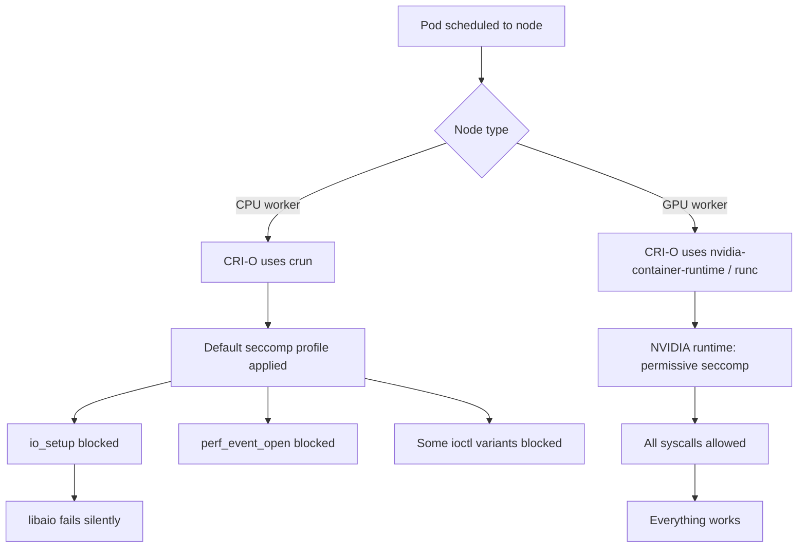

> 💡 **Quick Answer:** OpenShift CPU nodes use `crun` (lightweight, cgroup2-native) while GPU nodes use `runc` (NVIDIA container runtime). The key difference: `crun` applies stricter seccomp filtering by default, blocking syscalls like `io_setup` (libaio), `perf_event_open`, and some `ioctl` variants that `runc` allows.
>
> **Key insight:** When a workload runs on GPU nodes but fails silently on CPU nodes, the container runtime difference — not hardware — is usually the cause.
>
> **Gotcha:** Both runtimes report the same SCC, same SELinux context, and same mount points. The difference is invisible to standard `oc describe pod` output.

## The Problem

You deploy the same workload across OpenShift nodes. It works perfectly on GPU nodes but silently fails or behaves differently on CPU nodes. Standard debugging shows identical configurations:

```bash
# Both show privileged SCC
oc get pod -o jsonpath='{.metadata.annotations.openshift\.io/scc}'
# privileged

# Both show same SELinux context
oc exec pod-on-gpu -- cat /proc/1/attr/current
# system_u:system_r:spc_t:s0
oc exec pod-on-cpu -- cat /proc/1/attr/current
# system_u:system_r:spc_t:s0

# Both show same mounts
oc exec pod-on-gpu -- mount | wc -l
# 24
oc exec pod-on-cpu -- mount | wc -l
# 24
```

## The Solution

### Identify the Runtime

```bash
# Check runtime on each node
for node in $(oc get nodes -l node-role.kubernetes.io/worker -o name); do
  echo "=== $node ==="
  oc debug $node -- chroot /host crio config 2>/dev/null | grep -E "default_runtime|runtime_path" | head -3
done
```

Typical output:

```
=== node/worker-1 ===        # CPU node
default_runtime = "crun"
runtime_path = "/usr/bin/crun"

=== node/gpu-1 ===           # GPU node  
default_runtime = "nvidia"
runtime_path = "/usr/bin/nvidia-container-runtime"
```

### Check seccomp Status Inside Pods

```bash
# CPU node pod — seccomp active
oc exec -n test pod-on-cpu -- cat /proc/self/status | grep Seccomp
# Seccomp:     2
# Seccomp_filters:     1

# GPU node pod — seccomp inactive
oc exec -n test pod-on-gpu -- cat /proc/self/status | grep Seccomp
# Seccomp:     0
# Seccomp_filters:     0
```

The `Seccomp: 2` means filter mode is active (syscalls are being checked against a whitelist). `Seccomp: 0` means disabled.



### Key Differences Between crun and runc

| Feature | crun (CPU nodes) | runc/nvidia (GPU nodes) |
|---------|-------------------|------------------------|
| Language | C | Go |
| cgroup support | cgroup2 native | cgroup1 + cgroup2 |
| seccomp default | Strict filtering | Permissive / disabled |
| `io_setup` | ❌ Blocked | ✅ Allowed |
| `perf_event_open` | ❌ Blocked | ✅ Allowed |
| Memory overhead | ~50KB | ~15MB |
| Startup time | Faster | Slower |

### Affected Workloads

Common tools that fail silently under crun's seccomp:

- **fio with libaio** — `io_setup`/`io_submit` blocked → empty output
- **perf/eBPF tools** — `perf_event_open` blocked → permission denied
- **DPDK applications** — certain `ioctl` variants blocked
- **Custom kernel module loaders** — `init_module` blocked
- **Some Java NIO** — native async I/O may fall back to sync

### Workarounds

**Option 1: Override seccomp per pod**

```yaml
spec:
  securityContext:
    seccompProfile:
      type: Unconfined
```

**Option 2: Force runc on specific pods**

Add a `RuntimeClass` that uses runc:

```yaml
apiVersion: node.k8s.io/v1
kind: RuntimeClass
metadata:
  name: runc
handler: runc
```

Then reference it in your pod:

```yaml
spec:
  runtimeClassName: runc
```

**Option 3: Use alternative syscalls**

For fio specifically, switch from `libaio` to `psync` or `io_uring`.

## Common Issues

### How to tell which runtime a pod actually used
```bash
# Check the CRI-O logs for the pod's container ID
oc debug node/worker-1 -- chroot /host journalctl -u crio --no-pager | grep "runtime" | tail -5
```

### RuntimeClass not available in OpenShift
OpenShift supports RuntimeClass from 4.12+. Earlier versions require MachineConfig changes to CRI-O configuration.

### NVIDIA runtime is just a wrapper around runc
The `nvidia-container-runtime` calls `runc` with additional GPU device mounts. It inherits runc's permissive seccomp behavior.

## Best Practices

- **Always test workloads on both CPU and GPU node types** before declaring them production-ready
- **Check `/proc/self/status` Seccomp field** as the first debugging step for node-type-specific failures
- **Use `strace` in privileged pods** to identify which syscalls are blocked: `strace -f your-command 2>&1 | grep EPERM`
- **Document runtime requirements** in your Helm charts or deployment manifests
- **Prefer userspace alternatives** (`psync`, `io_uring`) over kernel-level syscalls when possible

## Key Takeaways

- OpenShift uses different container runtimes on different node types — this is invisible to most debugging tools
- `crun` on CPU nodes enforces stricter seccomp than `runc`/NVIDIA runtime on GPU nodes
- SCC, SELinux, and mount outputs are identical — the difference is at the syscall filtering level
- Silent failures (no error, no crash) are the hallmark of seccomp-blocked syscalls
- Check `Seccomp` in `/proc/self/status` to quickly identify if filtering is active
