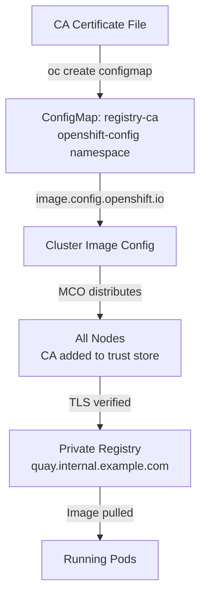

> 💡 **Quick Answer:** Create a ConfigMap with your CA cert keyed by the registry hostname, then patch `image.config.openshift.io/cluster` to reference it via `additionalTrustedCA`.

## The Problem

Your private Quay registry uses a self-signed certificate or an internal CA that OpenShift nodes don't trust. Image pulls fail with:

```
x509: certificate signed by unknown authority
```

Even with correct pull secret credentials, nodes can't establish TLS connections to the registry. You need to distribute your CA certificate to all nodes cluster-wide.

## The Solution

### Step 1: Create the CA ConfigMap

The ConfigMap key **must** be the registry hostname (with port if non-standard):

```bash
# For a registry on the default HTTPS port (443)
oc create configmap registry-ca \
  --from-file=quay.internal.example.com=/path/to/ca-bundle.crt \
  -n openshift-config
```

For a registry on a custom port:

```bash
# Key must include the port
oc create configmap registry-ca \
  --from-file=quay.internal.example.com..8443=/path/to/ca-bundle.crt \
  -n openshift-config
```

> ⚠️ **Note:** Dots in the port separator must be `..` (double dot) because ConfigMap keys can't contain colons. OpenShift interprets `hostname..port` as `hostname:port`.

### Step 2: Patch the Cluster Image Configuration

```bash
oc patch image.config.openshift.io/cluster --type=merge \
  -p '{"spec":{"additionalTrustedCA":{"name":"registry-ca"}}}'
```

### Step 3: Wait for the Machine Config Operator Rollout

The MCO distributes the CA to all nodes. Monitor the rollout:

```bash
# Watch MachineConfigPools
oc get machineconfigpool -w

# Wait for all pools to finish updating
oc wait machineconfigpool --all \
  --for=condition=Updated=True \
  --timeout=600s
```

### Step 4: Verify the CA is Trusted

```bash
# Test from a debug pod on a node
oc debug node/<node-name> -- chroot /host \
  curl -s --cacert /etc/pki/ca-trust/extracted/pem/tls-ca-bundle.pem \
  https://quay.internal.example.com/v2/ -o /dev/null -w "%{http_code}"
# Expected: 200 or 401 (auth required, but TLS works)
```

### Step 5: Test Image Pull

```bash
# Test with a pod
oc run test-pull \
  --image=quay.internal.example.com/myorg/test-image:latest \
  --restart=Never

# Verify it pulled successfully
oc get pod test-pull -o jsonpath='{.status.phase}'
# Expected: Running or Succeeded

# Clean up
oc delete pod test-pull
```

### Multiple Registries

Add multiple CAs to the same ConfigMap:

```bash
oc create configmap registry-ca \
  --from-file=quay.internal.example.com=/path/to/quay-ca.crt \
  --from-file=harbor.internal.example.com=/path/to/harbor-ca.crt \
  --from-file=registry.internal.example.com..5000=/path/to/registry-ca.crt \
  -n openshift-config \
  --dry-run=client -o yaml | oc apply -f -
```



## Common Issues

### x509 Still Failing After ConfigMap Update

- **Wait for MCO rollout** — check `oc get mcp` shows `UPDATED=True`
- **Verify the key name** matches the registry hostname exactly
- **Check the CA file** — must be PEM format, not DER

### ConfigMap Key Format for Non-Standard Ports

```bash
# ❌ Wrong — colons not allowed in ConfigMap keys
--from-file=quay.example.com:8443=ca.crt

# ✅ Correct — use double dots
--from-file=quay.example.com..8443=ca.crt
```

### CA Chain Issues

If your registry cert is signed by an intermediate CA, include the full chain:

```bash
# Concatenate intermediate + root CA
cat intermediate-ca.crt root-ca.crt > ca-bundle.crt
oc create configmap registry-ca \
  --from-file=quay.internal.example.com=ca-bundle.crt \
  -n openshift-config
```

## Best Practices

- **Use a CA bundle** — include the full chain from leaf to root
- **One ConfigMap for all registries** — keep all CAs in the same ConfigMap referenced by `additionalTrustedCA`
- **Test with `oc debug node`** — verify TLS from the node perspective, not just from your workstation
- **Combine with pull secret** — CA trust enables TLS; pull secrets handle authentication
- **Document your CAs** — track which certificates are in the ConfigMap and when they expire

## Key Takeaways

- Use `additionalTrustedCA` on `image.config.openshift.io/cluster` for cluster-wide registry CA distribution
- ConfigMap keys must match registry hostnames exactly (use `..` for port separators)
- MCO rollout takes several minutes — monitor `machineconfigpool` status
- Always combine CA trust with pull secret credentials for private registries
