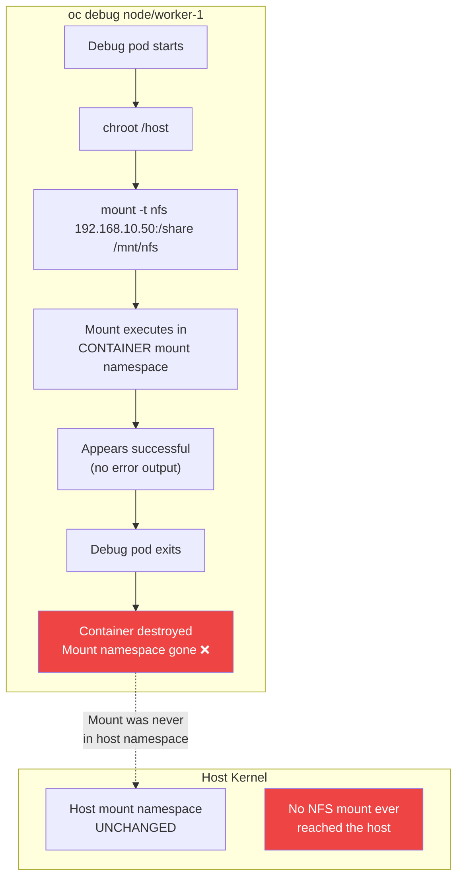

> 💡 **Quick Answer:** `oc debug node` runs in a temporary container with its own mount namespace. Any `mount` command executes inside the container — not on the host kernel. When the debug pod exits, all mounts vanish. Use MachineConfig systemd mount units for persistent mounts.

## The Problem

You run `oc debug node` with `chroot /host` and execute a `mount -t nfs` command. It appears to succeed (no error). But when you check:

```bash
oc debug node/worker-1 -- chroot /host sh -c "mount | grep nfs"
# (empty — nothing mounted!)
```

The mount is gone. You try again, same result. Pods using `hostPath` to the mount point see empty directories. Fio benchmarks return zero IOPS. What's happening?

## The Solution

### Why It Fails



**The key insight:** Even with `chroot /host`, the mount syscall is executed inside the **container's mount namespace**, not the host's. Linux mount namespaces provide isolation — the container can see the host filesystem via chroot, but new mounts are local to the container.

### What `chroot /host` Actually Does

```
┌─────────────────────────────────────┐
│           Host Kernel               │
│  Mount Namespace: host (PID 1)      │
│  - /dev/sda1 on /                   │
│  - NFS? NO — never mounted here     │
│                                     │
│  ┌───────────────────────────────┐  │
│  │     Debug Pod Container       │  │
│  │  Mount Namespace: container   │  │
│  │                               │  │
│  │  chroot /host → sees host FS  │  │
│  │  mount -t nfs → mounts HERE   │  │
│  │  (in container namespace)     │  │
│  │                               │  │
│  │  Pod exits → namespace gone   │  │
│  └───────────────────────────────┘  │
└─────────────────────────────────────┘
```

`chroot` changes the root directory — it does **not** change the mount namespace. The `mount` syscall is still trapped in the container's namespace.

### What DOES Work

| Method | Persists? | Production-safe? | Reboot-safe? |
|--------|-----------|-------------------|--------------|
| `oc debug` + `mount` | ❌ No | ❌ | ❌ |
| `nsenter -t 1 -m -- mount` | ⚠️ Until reboot | ❌ | ❌ |
| Privileged DaemonSet | ⚠️ While running | ⚠️ | ❌ |
| **MachineConfig** systemd mount | ✅ Yes | ✅ | ✅ |

### The Correct Solution: MachineConfig

```yaml
apiVersion: machineconfiguration.openshift.io/v1
kind: MachineConfig
metadata:
  name: 99-worker-nfs-mount
  labels:
    machineconfiguration.openshift.io/role: worker
spec:
  config:
    ignition:
      version: 3.2.0
    systemd:
      units:
        - name: mnt-nfsdata.mount
          enabled: true
          contents: |
            [Unit]
            Description=Mount NFS Share
            After=network-online.target
            Wants=network-online.target

            [Mount]
            What=192.168.10.50:/exports/shared
            Where=/mnt/nfsdata
            Type=nfs
            Options=rw,hard,nointr

            [Install]
            WantedBy=multi-user.target
```

This creates a systemd mount unit that runs in the **host mount namespace** at boot time — the mount persists across reboots and is visible to all pods.

### What About `nsenter`?

`nsenter -a -t 1` can enter the host's mount namespace:

```bash
oc debug node/worker-1 -- nsenter -t 1 -m -- mount -t nfs 192.168.10.50:/share /mnt/nfs
```

This **does** mount in the host namespace. However:
- ❌ Doesn't survive node reboot
- ❌ Not tracked by MachineConfig (drift)
- ❌ No systemd management (no auto-remount on failure)
- ❌ Not supported by Red Hat

Use it for **one-time debugging only**, never for production mounts.

### Diagnostic: Prove the Mount Namespace Issue

```bash
# 1. Mount inside oc debug
oc debug node/worker-1 -- chroot /host sh -c \
  "mount -t tmpfs test-tmpfs /tmp/test-mount && mount | grep test-mount"
# Output: test-tmpfs on /tmp/test-mount type tmpfs (rw,...)
# Looks like it worked!

# 2. Check from ANOTHER debug session
oc debug node/worker-1 -- chroot /host sh -c "mount | grep test-mount"
# Output: (empty)
# The mount was only in the first container's namespace
```

## Common Issues

### "But the mount command didn't show an error!"

Correct — `mount` succeeded. It mounted the filesystem in the container's mount namespace. There's no error because technically it worked. It just didn't mount where you expected (the host).

### "It worked once and then stopped"

You may have been checking in the same debug session where you mounted. The moment that session ended, the mount disappeared.

### "I added it to /etc/fstab via oc debug"

Writing to `/etc/fstab` via `chroot /host` **does** modify the host file. But:
- The mount still won't happen until reboot
- MachineConfig may overwrite `/etc/fstab` on next render
- Systemd mount units are the proper way on RHCOS

## Best Practices

- **Use MachineConfig for any persistent host changes** — mounts, kernel params, systemd units
- **Use `oc debug` only for read-only diagnostics** — checking logs, listing mounts, testing connectivity
- **Never rely on `oc debug` for state changes** — anything written or mounted is ephemeral
- **Use `nsenter -t 1 -m`** only for emergency one-time debugging — not production
- **Document the limitation** for your team — this catches even experienced engineers

## Key Takeaways

- `oc debug node` + `chroot /host` + `mount` = mount in container namespace, not host
- Mounts vanish when the debug pod exits — by design, not a bug
- MachineConfig with systemd mount units is the only supported persistent mount method
- `nsenter -t 1 -m` can reach the host namespace but doesn't survive reboots
- This affects ALL mount types: NFS, tmpfs, bind mounts, etc.
- Red Hat considers this expected behavior — it's a security feature, not a limitation
