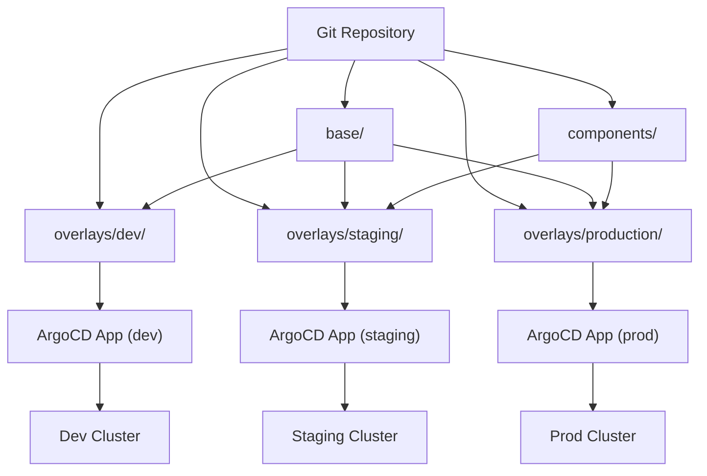

> 💡 **Quick Answer:** Set `spec.source.path` to your Kustomize overlay directory in an ArgoCD Application. ArgoCD auto-detects `kustomization.yaml` and runs `kustomize build` — no Helm charts or plugins needed.

## The Problem

Managing the same application across multiple environments (dev, staging, production) requires:

- **Shared base manifests** with environment-specific overrides
- **No template duplication** — DRY configuration across clusters
- **GitOps workflow** — all changes through pull requests
- **Native Kubernetes** — no proprietary templating languages
- **OpenShift-specific patches** — Routes, SCCs, resource quotas per environment

Kustomize solves the templating problem. OpenShift GitOps Operator (ArgoCD) solves the delivery problem. Together they provide a complete GitOps pipeline.

## The Solution

### Repository Structure

```
my-app/
├── base/
│   ├── kustomization.yaml
│   ├── deployment.yaml
│   ├── service.yaml
│   ├── route.yaml
│   └── configmap.yaml
└── overlays/
    ├── dev/
    │   ├── kustomization.yaml
    │   ├── replica-patch.yaml
    │   └── configmap-patch.yaml
    ├── staging/
    │   ├── kustomization.yaml
    │   ├── replica-patch.yaml
    │   └── resource-patch.yaml
    └── production/
        ├── kustomization.yaml
        ├── replica-patch.yaml
        ├── resource-patch.yaml
        ├── hpa.yaml
        └── pdb.yaml
```

### Base Manifests

```yaml
# base/kustomization.yaml
apiVersion: kustomize.config.k8s.io/v1beta1
kind: Kustomization
commonLabels:
  app.kubernetes.io/name: my-app
  app.kubernetes.io/managed-by: kustomize
resources:
  - deployment.yaml
  - service.yaml
  - route.yaml
  - configmap.yaml
```

```yaml
# base/deployment.yaml
apiVersion: apps/v1
kind: Deployment
metadata:
  name: my-app
spec:
  replicas: 1
  selector:
    matchLabels:
      app: my-app
  template:
    metadata:
      labels:
        app: my-app
    spec:
      containers:
        - name: my-app
          image: registry.example.com/my-app:latest
          ports:
            - containerPort: 8080
          resources:
            requests:
              cpu: 100m
              memory: 128Mi
            limits:
              cpu: 500m
              memory: 256Mi
          env:
            - name: APP_ENV
              valueFrom:
                configMapKeyRef:
                  name: my-app-config
                  key: APP_ENV
```

```yaml
# base/route.yaml
apiVersion: route.openshift.io/v1
kind: Route
metadata:
  name: my-app
spec:
  to:
    kind: Service
    name: my-app
  port:
    targetPort: 8080
  tls:
    termination: edge
    insecureEdgeTerminationPolicy: Redirect
```

### Environment Overlays

```yaml
# overlays/dev/kustomization.yaml
apiVersion: kustomize.config.k8s.io/v1beta1
kind: Kustomization
namespace: my-app-dev
namePrefix: dev-
bases:
  - ../../base
patches:
  - path: replica-patch.yaml
  - path: configmap-patch.yaml
images:
  - name: registry.example.com/my-app
    newTag: dev-latest
```

```yaml
# overlays/dev/replica-patch.yaml
apiVersion: apps/v1
kind: Deployment
metadata:
  name: my-app
spec:
  replicas: 1
```

```yaml
# overlays/dev/configmap-patch.yaml
apiVersion: v1
kind: ConfigMap
metadata:
  name: my-app-config
data:
  APP_ENV: "development"
  LOG_LEVEL: "debug"
```

```yaml
# overlays/production/kustomization.yaml
apiVersion: kustomize.config.k8s.io/v1beta1
kind: Kustomization
namespace: my-app-prod
namePrefix: prod-
bases:
  - ../../base
patches:
  - path: replica-patch.yaml
  - path: resource-patch.yaml
resources:
  - hpa.yaml
  - pdb.yaml
images:
  - name: registry.example.com/my-app
    newTag: v2.1.0
```

```yaml
# overlays/production/replica-patch.yaml
apiVersion: apps/v1
kind: Deployment
metadata:
  name: my-app
spec:
  replicas: 3
```

```yaml
# overlays/production/resource-patch.yaml
apiVersion: apps/v1
kind: Deployment
metadata:
  name: my-app
spec:
  template:
    spec:
      containers:
        - name: my-app
          resources:
            requests:
              cpu: 500m
              memory: 512Mi
            limits:
              cpu: "2"
              memory: 1Gi
```

```yaml
# overlays/production/hpa.yaml
apiVersion: autoscaling/v2
kind: HorizontalPodAutoscaler
metadata:
  name: prod-my-app
spec:
  scaleTargetRef:
    apiVersion: apps/v1
    kind: Deployment
    name: prod-my-app
  minReplicas: 3
  maxReplicas: 10
  metrics:
    - type: Resource
      resource:
        name: cpu
        target:
          type: Utilization
          averageUtilization: 70
```

### ArgoCD Applications per Environment

```yaml
# argocd/dev-app.yaml
apiVersion: argoproj.io/v1alpha1
kind: Application
metadata:
  name: my-app-dev
  namespace: openshift-gitops
  labels:
    env: dev
spec:
  project: default
  source:
    repoURL: https://git.example.com/platform/my-app.git
    targetRevision: develop
    path: overlays/dev
  destination:
    server: https://kubernetes.default.svc
    namespace: my-app-dev
  syncPolicy:
    automated:
      prune: true
      selfHeal: true
    syncOptions:
      - CreateNamespace=true
---
# argocd/production-app.yaml
apiVersion: argoproj.io/v1alpha1
kind: Application
metadata:
  name: my-app-prod
  namespace: openshift-gitops
  labels:
    env: production
spec:
  project: production
  source:
    repoURL: https://git.example.com/platform/my-app.git
    targetRevision: main
    path: overlays/production
  destination:
    server: https://kubernetes.default.svc
    namespace: my-app-prod
  syncPolicy:
    automated:
      prune: true
      selfHeal: true
    syncOptions:
      - CreateNamespace=true
      - PrunePropagationPolicy=foreground
```

### Kustomize with Components (Reusable Patches)

```yaml
# components/monitoring/kustomization.yaml
apiVersion: kustomize.config.k8s.io/v1alpha1
kind: Component
patches:
  - target:
      kind: Deployment
    patch: |
      - op: add
        path: /spec/template/metadata/annotations/prometheus.io~1scrape
        value: "true"
      - op: add
        path: /spec/template/metadata/annotations/prometheus.io~1port
        value: "8080"
resources:
  - servicemonitor.yaml
```

```yaml
# overlays/production/kustomization.yaml
apiVersion: kustomize.config.k8s.io/v1beta1
kind: Kustomization
bases:
  - ../../base
components:
  - ../../components/monitoring
  - ../../components/security
```

### OpenShift-Specific Patches

```yaml
# components/openshift-scc/kustomization.yaml
apiVersion: kustomize.config.k8s.io/v1alpha1
kind: Component
patches:
  - target:
      kind: Deployment
    patch: |
      - op: add
        path: /spec/template/spec/securityContext
        value:
          runAsNonRoot: true
          seccompProfile:
            type: RuntimeDefault
      - op: add
        path: /spec/template/spec/containers/0/securityContext
        value:
          allowPrivilegeEscalation: false
          capabilities:
            drop: ["ALL"]
```

```yaml
# overlays/production/route-patch.yaml
apiVersion: route.openshift.io/v1
kind: Route
metadata:
  name: my-app
  annotations:
    haproxy.router.openshift.io/rate-limit-connections: "true"
    haproxy.router.openshift.io/rate-limit-connections.concurrent-tcp: "100"
spec:
  host: my-app.apps.production.example.com
  tls:
    termination: reencrypt
    certificate: |
      -----BEGIN CERTIFICATE-----
      ...
      -----END CERTIFICATE-----
```

### ArgoCD Kustomize Build Options

```yaml
apiVersion: argoproj.io/v1alpha1
kind: Application
metadata:
  name: my-app-prod
  namespace: openshift-gitops
spec:
  source:
    repoURL: https://git.example.com/platform/my-app.git
    path: overlays/production
    kustomize:
      # Override image tag without changing git
      images:
        - registry.example.com/my-app:v2.2.0-hotfix
      # Add common labels
      commonLabels:
        team: platform
      # Add name prefix/suffix
      namePrefix: ocp-
      # Set Kustomize version
      version: v5.3.0
      # Pass build options
      commonAnnotations:
        argocd.argoproj.io/tracking-id: my-app-prod
```

### Preview Kustomize Output in ArgoCD

```bash
# See what ArgoCD will apply (dry run)
argocd app manifests my-app-prod --source live

# Compare live vs desired
argocd app diff my-app-prod

# Local kustomize build (same as ArgoCD)
kustomize build overlays/production

# Validate with oc
kustomize build overlays/production | oc apply --dry-run=server -f -
```



## Common Issues

### ArgoCD Not Detecting Kustomize

```bash
# ArgoCD auto-detects kustomization.yaml — check it exists:
ls overlays/production/kustomization.yaml

# If using kustomization.yml (different extension), ArgoCD still detects it
# If using Kustomization (capital K), also works

# Force Kustomize tool detection in Application spec:
# spec.source.kustomize is enough to signal ArgoCD
```

### Kustomize Version Mismatch

```bash
# Check ArgoCD's built-in Kustomize version
argocd version | grep kustomize

# OpenShift GitOps bundles a specific version
# If you need newer features, configure in argocd-cm:
# kustomize.version.v5.3.0: /usr/local/bin/kustomize-5.3.0

# Or set per-app:
# spec.source.kustomize.version: v5.3.0
```

### Strategic Merge Patch vs JSON Patch

```yaml
# Strategic merge (default) — merges maps, replaces lists
patches:
  - path: deployment-patch.yaml

# JSON patch — precise array operations
patches:
  - target:
      kind: Deployment
      name: my-app
    patch: |
      - op: add
        path: /spec/template/spec/containers/0/env/-
        value:
          name: NEW_VAR
          value: "added"
```

## Best Practices

- **Keep bases generic** — no environment-specific values in base manifests
- **Use `images` in kustomization.yaml** to manage image tags (not patches)
- **Prefer components** over duplicating patches across overlays
- **Pin `targetRevision`** per environment — `develop` for dev, `main` for prod
- **Use `CreateNamespace=true`** syncOption so ArgoCD manages namespace lifecycle
- **Validate locally** with `kustomize build | oc apply --dry-run=server` before pushing
- **Don't mix Helm and Kustomize** in the same Application unless using Helm post-rendering
- **Use `commonLabels`** sparingly — they're added to selectors too and can break rolling updates

## Key Takeaways

- ArgoCD auto-detects Kustomize — just point `spec.source.path` to your overlay directory
- Base + overlays + components = DRY multi-environment config management
- OpenShift GitOps Operator bundles ArgoCD with Kustomize — no extra setup needed
- Per-environment Applications with different `targetRevision` and `path` enable promotion workflows
- Kustomize components make reusable cross-cutting concerns (monitoring, security) composable
