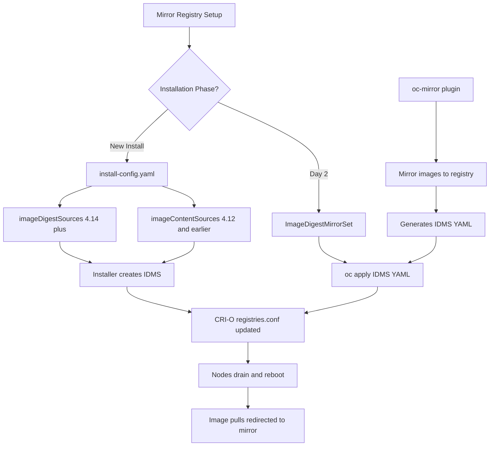

> 💡 **Quick Answer:** Use `ImageDigestMirrorSet` (IDMS) to redirect image pulls from public registries to your mirror registry by digest. For initial cluster installation, configure `imageContentSources` in `install-config.yaml`. IDMS replaced the deprecated `ImageContentSourcePolicy` (ICSP) starting in OpenShift 4.13.

## The Problem

Disconnected, air-gapped, and regulated OpenShift environments cannot pull images directly from the internet. You need to:

- **Mirror all required images** to an internal registry before installation
- **Redirect image pulls** transparently so workloads reference the original image names but pull from the mirror
- **Handle digest-based references** — OpenShift release images use `@sha256:` digests, not tags
- **Maintain the mirror** as new releases and operators are published

OpenShift uses two mechanisms for this:

| Phase | Mechanism | Resource |
|-------|-----------|----------|
| **Installation** | `install-config.yaml` | `imageContentSources` or `imageDigestSources` |
| **Day 2** | Cluster API | `ImageDigestMirrorSet` (IDMS) or `ImageTagMirrorSet` (ITMS) |
| **Legacy** | Cluster API | `ImageContentSourcePolicy` (ICSP) — deprecated in 4.13 |

## The Solution

### Part 1: install-config.yaml for Disconnected Installation

#### Step 1: Mirror the OpenShift Release Images

```bash
# Set variables
export OCP_RELEASE="4.16.5"
export LOCAL_REGISTRY="mirror.internal.example.com:5000"
export LOCAL_REPOSITORY="ocp4/openshift4"
export PRODUCT_REPO="openshift-release-dev"
export RELEASE_NAME="ocp-release"

# Mirror the release images
oc adm release mirror \
  -a ${PULL_SECRET_FILE} \
  --from=quay.io/${PRODUCT_REPO}/${RELEASE_NAME}:${OCP_RELEASE}-x86_64 \
  --to=${LOCAL_REGISTRY}/${LOCAL_REPOSITORY} \
  --to-release-image=${LOCAL_REGISTRY}/${LOCAL_REPOSITORY}:${OCP_RELEASE}-x86_64
```

The command outputs the `imageContentSources` block you need for `install-config.yaml`.

#### Step 2: Configure install-config.yaml

For OpenShift 4.13+ use `imageDigestSources` (replaces `imageContentSources`):

```yaml
apiVersion: v1
metadata:
  name: my-disconnected-cluster
baseDomain: internal.example.com
compute:
  - name: worker
    replicas: 3
    platform:
      aws:
        type: m5.xlarge
controlPlane:
  name: master
  replicas: 3
  platform:
    aws:
      type: m5.xlarge
networking:
  networkType: OVNKubernetes
  clusterNetwork:
    - cidr: 10.128.0.0/14
      hostPrefix: 23
  serviceNetwork:
    - 172.30.0.0/16
platform:
  aws:
    region: us-east-1
pullSecret: '<your-combined-pull-secret>'
sshKey: '<your-ssh-public-key>'
additionalTrustBundle: |
  -----BEGIN CERTIFICATE-----
  MIIDXTCCAkWgAwIBAgIJAJC1HiIAZAiUMA...
  -----END CERTIFICATE-----
# OpenShift 4.14+ — use imageDigestSources
imageDigestSources:
  - mirrors:
      - mirror.internal.example.com:5000/ocp4/openshift4
    source: quay.io/openshift-release-dev/ocp-release
  - mirrors:
      - mirror.internal.example.com:5000/ocp4/openshift4
    source: quay.io/openshift-release-dev/ocp-v4.0-art-dev
  - mirrors:
      - mirror.internal.example.com:5000/olm-mirror/redhat-operator-index
    source: registry.redhat.io/redhat/redhat-operator-index
  - mirrors:
      - mirror.internal.example.com:5000/olm-mirror
    source: registry.redhat.io
```

For OpenShift 4.12 and earlier, use `imageContentSources` instead:

```yaml
# OpenShift 4.12 and earlier
imageContentSources:
  - mirrors:
      - mirror.internal.example.com:5000/ocp4/openshift4
    source: quay.io/openshift-release-dev/ocp-release
  - mirrors:
      - mirror.internal.example.com:5000/ocp4/openshift4
    source: quay.io/openshift-release-dev/ocp-v4.0-art-dev
```

> ⚠️ **Important:** `imageContentSources` is deprecated in 4.14+. The installer converts it to IDMS resources automatically, but you should migrate to `imageDigestSources` for new installations.

#### Step 3: Combined Pull Secret

Your pull secret must include credentials for both the source registries (for validation) and your mirror:

```bash
# Merge pull secrets
jq -s '{"auths": (.[].auths | add)}' \
  cloud.openshift.com-pull-secret.json \
  mirror-registry-pull-secret.json > combined-pull-secret.json
```

### Part 2: ImageDigestMirrorSet (Day 2)

IDMS is the post-installation mechanism for managing mirror rules. The installer creates initial IDMS resources from your `imageDigestSources` config, and you can add more for operators and application images.

#### Step 1: View Existing Mirror Configuration

```bash
# List current IDMS resources
oc get imagedigestmirrorset

# View details
oc get imagedigestmirrorset -o yaml

# Check for legacy ICSP (deprecated)
oc get imagecontentsourcepolicy
```

#### Step 2: Create an IDMS for Operator Catalogs

```yaml
apiVersion: config.openshift.io/v1
kind: ImageDigestMirrorSet
metadata:
  name: operator-catalog-mirrors
spec:
  imageDigestMirrors:
    # Red Hat Operator catalog
    - mirrors:
        - mirror.internal.example.com:5000/olm/redhat-operator-index
      source: registry.redhat.io/redhat/redhat-operator-index
      mirrorSourcePolicy: NeverContactSource
    # Certified Operator catalog
    - mirrors:
        - mirror.internal.example.com:5000/olm/certified-operator-index
      source: registry.redhat.io/redhat/certified-operator-index
      mirrorSourcePolicy: NeverContactSource
    # Community Operator catalog
    - mirrors:
        - mirror.internal.example.com:5000/olm/community-operator-index
      source: registry.redhat.io/redhat/community-operator-index
      mirrorSourcePolicy: NeverContactSource
```

#### Step 3: Create an IDMS for Application Images

```yaml
apiVersion: config.openshift.io/v1
kind: ImageDigestMirrorSet
metadata:
  name: application-mirrors
spec:
  imageDigestMirrors:
    # Mirror all docker.io images
    - mirrors:
        - mirror.internal.example.com:5000/docker-io
      source: docker.io
      mirrorSourcePolicy: AllowFallback
    # Mirror all quay.io images
    - mirrors:
        - mirror.internal.example.com:5000/quay-io
      source: quay.io
      mirrorSourcePolicy: AllowFallback
    # Mirror all ghcr.io images
    - mirrors:
        - mirror.internal.example.com:5000/ghcr-io
      source: ghcr.io
      mirrorSourcePolicy: NeverContactSource
    # Specific image override
    - mirrors:
        - mirror.internal.example.com:5000/custom/nginx
      source: docker.io/library/nginx
      mirrorSourcePolicy: NeverContactSource
```

#### mirrorSourcePolicy Options

| Policy | Behavior | Use Case |
|--------|----------|----------|
| `NeverContactSource` | Only pull from mirror, never from source | Air-gapped, strict disconnected |
| `AllowFallback` | Try mirror first, fall back to source if mirror fails | Semi-connected, migration |

#### Step 4: Migrate ICSP to IDMS

If you have legacy `ImageContentSourcePolicy` resources:

```bash
# List existing ICSPs
oc get imagecontentsourcepolicy -o yaml > icsp-backup.yaml

# Convert ICSP to IDMS (manual — same structure, different kind)
# ICSP:
#   kind: ImageContentSourcePolicy
#   spec:
#     repositoryDigestMirrors:
#
# IDMS:
#   kind: ImageDigestMirrorSet
#   spec:
#     imageDigestMirrors:

# Or use oc-mirror to generate fresh IDMS
oc mirror --config=imageset-config.yaml \
  docker://${LOCAL_REGISTRY} \
  --dest-skip-tls
```

### Part 3: Using oc-mirror for Complete Mirroring

The `oc-mirror` plugin handles mirroring and generates IDMS/ITMS resources automatically.

#### ImageSet Configuration

```yaml
apiVersion: mirror.openshift.io/v1alpha2
kind: ImageSetConfiguration
mirror:
  platform:
    channels:
      - name: stable-4.16
        minVersion: "4.16.0"
        maxVersion: "4.16.5"
        type: ocp
  operators:
    - catalog: registry.redhat.io/redhat/redhat-operator-index:v4.16
      packages:
        - name: elasticsearch-operator
        - name: cluster-logging
        - name: local-storage-operator
        - name: ocs-operator
        - name: advanced-cluster-management
        - name: openshift-gitops-operator
  additionalImages:
    - name: registry.redhat.io/ubi9/ubi:latest
    - name: registry.redhat.io/ubi9/ubi-minimal:latest
    - name: docker.io/library/nginx:1.27
```

#### Run the Mirror

```bash
# Mirror to registry
oc mirror --config=imageset-config.yaml \
  docker://mirror.internal.example.com:5000 \
  --dest-skip-tls

# Mirror to disk (for air-gapped transfer)
oc mirror --config=imageset-config.yaml \
  file://mirror-archive

# Load from disk to registry
oc mirror --from=mirror-archive \
  docker://mirror.internal.example.com:5000 \
  --dest-skip-tls
```

#### Apply Generated IDMS Resources

`oc-mirror` generates IDMS YAML files in the `oc-mirror-workspace/results-*` directory:

```bash
# Apply the generated IDMS
oc apply -f oc-mirror-workspace/results-*/imageDigestMirrorSet.yaml

# Apply catalog sources
oc apply -f oc-mirror-workspace/results-*/catalogSource-*.yaml

# Verify
oc get imagedigestmirrorset
oc get catalogsource -n openshift-marketplace
```

### Verification

```bash
# Check that IDMS is applied
oc get imagedigestmirrorset -o yaml

# Verify CRI-O picked up the mirror configuration
# (IDMS translates to /etc/containers/registries.conf on each node)
oc debug node/worker-0 -- chroot /host cat /etc/containers/registries.conf

# Test an image pull through the mirror
oc run mirror-test --rm -it --restart=Never \
  --image=docker.io/library/nginx:latest -- nginx -v

# Check which registry actually served the image
oc get pod mirror-test -o jsonpath='{.status.containerStatuses[0].imageID}'

# Verify operator catalog is accessible
oc get packagemanifest -n openshift-marketplace | head -20
```



## Common Issues

### Nodes stuck after IDMS change

```bash
# IDMS changes trigger Machine Config Operator updates
oc get mcp

# If a pool is degraded, check the daemon
oc get nodes
oc debug node/stuck-worker -- chroot /host \
  journalctl -u machine-config-daemon --no-pager -n 50

# Force drain if needed
oc adm drain worker-2 --ignore-daemonsets --delete-emptydir-data --force
```

### Image pull fails with "manifest unknown"

```bash
# The image exists in source but wasn't mirrored
# Check what's actually in the mirror
skopeo list-tags docker://mirror.internal.example.com:5000/ocp4/openshift4

# Re-run oc-mirror with updated config
oc mirror --config=imageset-config.yaml \
  docker://mirror.internal.example.com:5000

# For tag-based images, use ImageTagMirrorSet instead of IDMS
```

### IDMS vs ITMS confusion

```bash
# IDMS (ImageDigestMirrorSet) — for @sha256: digest references
# ITMS (ImageTagMirrorSet) — for :tag references

# OpenShift release images always use digests → IDMS
# Application images with tags → ITMS or IDMS (digests preferred)

# Check how an image is referenced
oc get deployment my-app -o jsonpath='{.spec.template.spec.containers[0].image}'
# docker.io/nginx:1.27 → needs ITMS
# docker.io/nginx@sha256:abc123... → needs IDMS
```

### additionalTrustBundle not working

```bash
# Verify the CA is correct
openssl s_client -connect mirror.internal.example.com:5000 \
  -CAfile /path/to/ca-bundle.pem

# Check the install-config.yaml indentation
# additionalTrustBundle must be a top-level field with PEM content
# The | pipe character preserves newlines

# After installation, verify on nodes
oc debug node/master-0 -- chroot /host \
  trust list | grep -i "your-ca"
```

### Migrating from ICSP to IDMS

```bash
# Check for deprecated ICSPs
oc get imagecontentsourcepolicy

# Export and convert
for icsp in $(oc get icsp -o name); do
  oc get $icsp -o yaml | \
    sed 's/ImageContentSourcePolicy/ImageDigestMirrorSet/g' | \
    sed 's/repositoryDigestMirrors/imageDigestMirrors/g' | \
    sed '/resourceVersion/d; /uid/d; /creationTimestamp/d; /generation/d' \
    > "idms-$(basename $icsp).yaml"
done

# Apply new IDMS
oc apply -f idms-*.yaml

# Remove old ICSPs after verification
oc delete icsp --all
```

## Best Practices

- **Use `imageDigestSources` in install-config.yaml** for OpenShift 4.14+ — `imageContentSources` is deprecated
- **Set `mirrorSourcePolicy: NeverContactSource`** for air-gapped environments — prevents any attempt to reach public registries
- **Use `AllowFallback`** during migration — lets you validate mirrors while keeping source as backup
- **Always include `additionalTrustBundle`** if your mirror uses self-signed certificates
- **Use oc-mirror for ongoing maintenance** — it handles incremental mirroring and generates IDMS automatically
- **Mirror to disk first for air-gapped** — use `file://` target, then physically transfer and load
- **Plan for MCP rollouts** — IDMS changes trigger Machine Config updates and rolling node reboots
- **Keep IDMS resources organized** — separate by purpose (platform, operators, applications)
- **Migrate ICSP to IDMS** — ImageContentSourcePolicy is deprecated and will be removed in future versions
- **Test with `skopeo inspect`** before creating IDMS — verify images exist in the mirror registry
- **Document your mirror layout** — record the namespace structure in your mirror registry

## Key Takeaways

- **`install-config.yaml`** uses `imageDigestSources` (4.14+) or `imageContentSources` (4.12-) to configure mirrors during installation
- **`ImageDigestMirrorSet` (IDMS)** is the Day 2 mechanism for managing mirror rules — replaces deprecated `ImageContentSourcePolicy` (ICSP)
- **`ImageTagMirrorSet` (ITMS)** handles tag-based image references — use alongside IDMS for complete coverage
- IDMS changes update `/etc/containers/registries.conf` on nodes via Machine Config Operator, triggering **rolling reboots**
- Use **`oc-mirror`** to automate mirroring and IDMS generation — handles release images, operators, and additional images
- `mirrorSourcePolicy` controls fallback behavior: `NeverContactSource` for strict air-gap, `AllowFallback` for semi-connected
