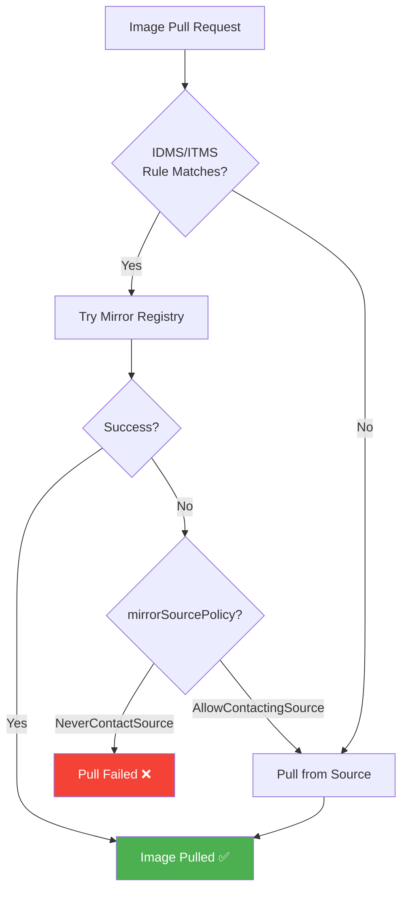

> 💡 **Quick Answer:** ImageDigestMirrorSet (IDMS) and ImageTagMirrorSet (ITMS) are the OpenShift 4.13+ replacements for the deprecated ImageContentSourcePolicy (ICSP). IDMS rewrites image pulls by digest (`@sha256:...`) to your mirror registry; ITMS rewrites tag-based pulls (`:latest`). Set `mirrorSourcePolicy: NeverContactSource` for strict air-gap or `AllowContactingSource` for hybrid environments where the mirror is preferred but upstream is a fallback.

## The Problem

Disconnected OpenShift clusters need to redirect all image pulls from Red Hat/Quay registries to a local mirror. The old ICSP had limitations:

- Only supported digest-based mirrors
- No tag-based mirroring
- No fallback policy control
- Maximum 250 mirrors per ICSP (performance issues)
- Deprecated in OpenShift 4.13+

## The Solution

### IDMS — ImageDigestMirrorSet

For images pulled by digest (most OCP internal components):

```yaml
apiVersion: config.openshift.io/v1
kind: ImageDigestMirrorSet
metadata:
  name: ocp-release-mirror
spec:
  imageDigestMirrors:
  # OCP release images
  - mirrors:
    - registry.example.com:5000/openshift/release-images
    source: quay.io/openshift-release-dev/ocp-release
    mirrorSourcePolicy: NeverContactSource

  # OCP component images
  - mirrors:
    - registry.example.com:5000/openshift/release
    source: quay.io/openshift-release-dev/ocp-v4.0-art-dev
    mirrorSourcePolicy: NeverContactSource

  # Red Hat operator images
  - mirrors:
    - registry.example.com:5000/rhel9
    source: registry.redhat.io/rhel9
    mirrorSourcePolicy: NeverContactSource
```

### ITMS — ImageTagMirrorSet

For images pulled by tag (operators, user workloads):

```yaml
apiVersion: config.openshift.io/v1
kind: ImageTagMirrorSet
metadata:
  name: operator-mirror
spec:
  imageTagMirrors:
  - mirrors:
    - registry.example.com:5000/redhat/redhat-operator-index
    source: registry.redhat.io/redhat/redhat-operator-index
    mirrorSourcePolicy: NeverContactSource

  - mirrors:
    - registry.example.com:5000/openshift-update-service/graph-data
    source: registry.redhat.io/openshift-update-service/graph-data
    mirrorSourcePolicy: NeverContactSource
```

### Mirror Source Policies

| Policy | Behavior | Use Case |
|--------|----------|----------|
| `NeverContactSource` | Only use mirror. Fail if mirror unavailable. | Strict air-gap, no internet |
| `AllowContactingSource` | Try mirror first, fall back to source. | Hybrid, mirror as cache |



### Migrate from ICSP to IDMS

```bash
# Check existing ICSPs
oc get imagecontentsourcepolicy

# Auto-convert ICSP to IDMS
oc adm migrate icsp /path/to/icsp.yaml --dest-dir /tmp/idms/

# Or manually convert:
# ICSP:                    → IDMS:
# kind: ImageContentSourcePolicy  → kind: ImageDigestMirrorSet
# spec:                           → spec:
#   repositoryDigestMirrors:      →   imageDigestMirrors:
#   - mirrors:                    →   - mirrors:
#     - mirror.example.com/repo   →     - mirror.example.com/repo
#     source: quay.io/repo        →     source: quay.io/repo
#                                 →     mirrorSourcePolicy: NeverContactSource

# Apply IDMS, then remove ICSP
oc apply -f /tmp/idms/
oc get idms  # Verify
oc delete icsp --all  # Remove deprecated ICSPs

# Nodes will rolling-reboot to update /etc/containers/registries.conf
oc get mcp -w
```

### What Happens on the Node

IDMS/ITMS translate to CRI-O registry configuration:

```bash
# After IDMS apply, each node gets:
# /etc/containers/registries.conf.d/XXX-idms.conf

[[registry]]
  prefix = ""
  location = "quay.io/openshift-release-dev/ocp-release"
  blocked = true  # NeverContactSource

  [[registry.mirror]]
    location = "registry.example.com:5000/openshift/release-images"

[[registry]]
  prefix = ""
  location = "registry.redhat.io/redhat/redhat-operator-index"
  blocked = true

  [[registry.mirror]]
    location = "registry.example.com:5000/redhat/redhat-operator-index"
```

### Verify Mirror Rules

```bash
# List all mirror sets
oc get idms,itms

# Check node registry configuration
oc debug node/worker-0 -- chroot /host \
  cat /etc/containers/registries.conf.d/*.conf

# Test image pull through mirror
oc debug node/worker-0 -- chroot /host \
  crictl pull registry.example.com:5000/openshift/release-images:4.20.12-x86_64

# Check which registry a pod is actually pulling from
oc get pod <pod> -o jsonpath='{.status.containerStatuses[*].imageID}'
```

## Common Issues

**Nodes stuck rebooting after IDMS apply**

IDMS changes trigger MachineConfig updates → rolling reboot. If stuck, check MCP: `oc describe mcp worker`. Common cause: invalid mirror URL in IDMS.

**"image not found" despite IDMS configured**

IDMS only works for digest-based pulls. If the image is pulled by tag, you need ITMS. Check the failing pull with `oc describe pod` — look for `@sha256:` (IDMS) vs `:tag` (ITMS).

**Multiple IDMS with overlapping sources**

Allowed — mirrors are tried in order. First successful pull wins. Use separate IDMS per source registry for clarity.

**Performance degradation with many mirror rules**

Keep IDMS count reasonable. CRI-O checks rules sequentially. Consolidate mirrors for the same source into one IDMS entry.

## Best Practices

- **IDMS for platform, ITMS for operators** — OCP internals use digests, operator catalogs use tags
- **`NeverContactSource` for air-gap** — prevents accidental internet access
- **Migrate from ICSP** — ICSP is deprecated; use `oc adm migrate icsp`
- **Let oc-mirror generate them** — don't hand-write IDMS/ITMS; use oc-mirror's `cluster-resources/`
- **One IDMS per logical source** — easier to manage than one giant IDMS

## Key Takeaways

- IDMS rewrites digest-based pulls, ITMS rewrites tag-based pulls
- `NeverContactSource` = strict air-gap; `AllowContactingSource` = mirror-preferred with fallback
- IDMS/ITMS replace the deprecated ICSP (OpenShift 4.13+)
- Mirror rules translate to `/etc/containers/registries.conf.d/` on each node
- Changes trigger MCP rolling reboot — plan for maintenance window
- oc-mirror generates correct IDMS/ITMS automatically in `cluster-resources/`
