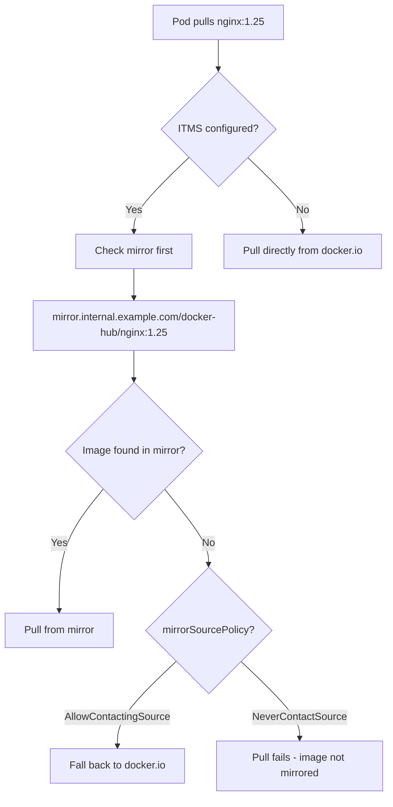

> 💡 **Quick Answer:** `ImageTagMirrorSet` (ITMS) mirrors images by **tag** instead of digest. Use it when your workloads reference images by tag (e.g., `nginx:1.25`) and you need to redirect pulls to a mirror registry in disconnected or air-gapped OpenShift clusters. Available from OpenShift 4.13+.

## The Problem

OpenShift has two mirror set types for disconnected environments:

- **IDMS** (ImageDigestMirrorSet) — mirrors images referenced by **digest** (`@sha256:...`)
- **ITMS** (ImageTagMirrorSet) — mirrors images referenced by **tag** (`:latest`, `:v1.2`)

Many third-party applications, Helm charts, and operator catalogs reference images by **tag**, not digest. Without ITMS, these pulls fail in disconnected clusters because IDMS only intercepts digest-based references.

## The Solution

### Step 1: Create an ImageTagMirrorSet

```yaml
apiVersion: config.openshift.io/v1
kind: ImageTagMirrorSet
metadata:
  name: enterprise-tag-mirrors
spec:
  imageTagMirrors:
    # Mirror Docker Hub images
    - source: docker.io
      mirrors:
        - mirror.internal.example.com/docker-hub
      mirrorSourcePolicy: AllowContactingSource

    # Mirror Quay.io images
    - source: quay.io
      mirrors:
        - mirror.internal.example.com/quay-io
      mirrorSourcePolicy: AllowContactingSource

    # Mirror GitHub Container Registry
    - source: ghcr.io
      mirrors:
        - mirror.internal.example.com/ghcr-io
      mirrorSourcePolicy: AllowContactingSource

    # Mirror Red Hat registry
    - source: registry.redhat.io
      mirrors:
        - mirror.internal.example.com/redhat-io
      mirrorSourcePolicy: AllowContactingSource
```

```bash
# Apply the ITMS
oc apply -f itms-enterprise.yaml

# Verify
oc get imagetagmirrorset
oc describe imagetagmirrorset enterprise-tag-mirrors
```

### Step 2: Fully Disconnected (NeverContactSource)

```yaml
apiVersion: config.openshift.io/v1
kind: ImageTagMirrorSet
metadata:
  name: airgapped-tag-mirrors
spec:
  imageTagMirrors:
    # Docker Hub — never contact source (fully air-gapped)
    - source: docker.io
      mirrors:
        - mirror.internal.example.com/docker-hub
      mirrorSourcePolicy: NeverContactSource

    # NVIDIA NGC — GPU operator images
    - source: nvcr.io
      mirrors:
        - mirror.internal.example.com/nvcr-io
      mirrorSourcePolicy: NeverContactSource

    # Quay.io — operators and tools
    - source: quay.io
      mirrors:
        - mirror.internal.example.com/quay-io
      mirrorSourcePolicy: NeverContactSource

    # K8s registry
    - source: registry.k8s.io
      mirrors:
        - mirror.internal.example.com/k8s-io
      mirrorSourcePolicy: NeverContactSource
```

### Step 3: Mirror Images with oc-mirror or skopeo

```bash
# Mirror specific images by tag using skopeo
skopeo copy \
  docker://docker.io/nginx:1.25 \
  docker://mirror.internal.example.com/docker-hub/nginx:1.25

skopeo copy \
  docker://quay.io/prometheus/prometheus:v2.53.0 \
  docker://mirror.internal.example.com/quay-io/prometheus/prometheus:v2.53.0

# Mirror NVIDIA GPU Operator images
skopeo copy \
  docker://nvcr.io/nvidia/gpu-operator:v24.9.0 \
  docker://mirror.internal.example.com/nvcr-io/nvidia/gpu-operator:v24.9.0

# Bulk mirror with oc-mirror (imageSetConfiguration)
cat << 'EOF' > imageset-config.yaml
apiVersion: mirror.openshift.io/v1alpha2
kind: ImageSetConfiguration
mirror:
  additionalImages:
    - name: docker.io/nginx:1.25
    - name: docker.io/redis:7.4
    - name: quay.io/prometheus/prometheus:v2.53.0
    - name: nvcr.io/nvidia/tritonserver:24.12-py3
EOF

oc mirror --config imageset-config.yaml \
  docker://mirror.internal.example.com
```

### Step 4: ITMS for Specific Namespaces / Projects

```yaml
# Mirror NVIDIA AI images specifically
apiVersion: config.openshift.io/v1
kind: ImageTagMirrorSet
metadata:
  name: nvidia-ai-mirrors
spec:
  imageTagMirrors:
    - source: nvcr.io/nvidia
      mirrors:
        - mirror.internal.example.com/nvidia
      mirrorSourcePolicy: NeverContactSource

    - source: nvcr.io/nvidia/tritonserver
      mirrors:
        - mirror.internal.example.com/nvidia/tritonserver
      mirrorSourcePolicy: NeverContactSource
---
# Mirror HuggingFace model images
apiVersion: config.openshift.io/v1
kind: ImageTagMirrorSet
metadata:
  name: ai-inference-mirrors
spec:
  imageTagMirrors:
    - source: docker.io/vllm/vllm-openai
      mirrors:
        - mirror.internal.example.com/vllm/vllm-openai
      mirrorSourcePolicy: NeverContactSource
```

### IDMS vs ITMS Comparison

```text
| Feature              | IDMS                         | ITMS                        |
|----------------------|------------------------------|-----------------------------|
| Full name            | ImageDigestMirrorSet         | ImageTagMirrorSet           |
| References           | Digest (@sha256:...)         | Tag (:latest, :v1.2)        |
| OpenShift version    | 4.13+                        | 4.13+                       |
| Immutable references | Yes (digest never changes)   | No (tag can be overwritten) |
| Use case             | OCP platform, operators      | Third-party apps, Helm      |
| Legacy equivalent    | ImageContentSourcePolicy     | N/A (new in 4.13)           |
| Scope                | Cluster-wide                 | Cluster-wide                |
```



### Step 5: Combined IDMS + ITMS Setup

```bash
# Check existing mirror sets
oc get imagedigestmirrorset
oc get imagetagmirrorset

# Check which images are using tags vs digests in your cluster
oc get pods -A -o jsonpath='{range .items[*]}{range .spec.containers[*]}{.image}{"\n"}{end}{end}' | \
  sort -u | \
  awk -F'@' '{if(NF>1) print "DIGEST:", $0; else print "TAG:", $0}'

# Verify mirror configuration is applied to nodes
oc debug node/<node-name> -- chroot /host \
  cat /etc/containers/registries.conf.d/99-imagetagmirrorset.conf
```

### Step 6: Validate ITMS is Working

```bash
# Check node configuration after ITMS apply
# MCO (Machine Config Operator) rolls out changes to all nodes
oc get mcp
# Wait for all MachineConfigPools to finish updating

# Test image pull from mirror
oc run test-mirror --image=nginx:1.25 --restart=Never -n default
oc describe pod test-mirror | grep -A5 "Events"
# Should show pull from mirror URL, not docker.io

# Check CRI-O registries config on a node
oc debug node/<node-name> -- chroot /host \
  cat /etc/containers/registries.conf
```

## Common Issues

### Node rolling restart after ITMS apply

```bash
# ITMS changes trigger MCO to update registries.conf on all nodes
# This causes a rolling restart of all nodes (one at a time)
# Plan ITMS changes during maintenance windows

# Check rollout status
oc get mcp -w
# Wait for UPDATED=True, UPDATING=False on all pools
```

### Tag not found in mirror

```bash
# Unlike digests, tags can be overwritten at source
# Your mirror might have an older version of :latest
# Solution: re-sync regularly
skopeo sync --src docker --dest docker \
  docker.io/library/nginx \
  mirror.internal.example.com/docker-hub/library/

# Or pin to specific tags instead of :latest
```

### ITMS vs legacy ImageContentSourcePolicy

```bash
# ICSP (ImageContentSourcePolicy) is deprecated in 4.13+
# ICSP only supported digest-based mirroring
# Migrate ICSP to IDMS + ITMS:
oc adm migrate icsp /path/to/icsp.yaml \
  --dest-dir /path/to/output/
# This generates IDMS files — add ITMS manually for tag-based mirrors
```

### Multiple mirrors — fallback order

```yaml
# Mirrors are tried in order — first match wins
imageTagMirrors:
  - source: docker.io
    mirrors:
      - primary-mirror.example.com/docker-hub    # tried first
      - backup-mirror.example.com/docker-hub      # tried second
    mirrorSourcePolicy: AllowContactingSource      # source tried last
```

## Best Practices

- **Use ITMS for third-party images** that reference tags (Helm charts, vendor apps)
- **Use IDMS for platform images** (OpenShift release, operators) which use digests
- **`NeverContactSource`** for fully air-gapped environments
- **`AllowContactingSource`** for partial disconnection (mirror as cache)
- **Schedule ITMS changes** during maintenance — triggers node rolling restarts
- **Sync mirrors regularly** — tags are mutable, mirrors can become stale
- **Pin to specific tags** (`:1.25.3`) instead of floating tags (`:latest`)
- **Combine with cluster-wide pull secret** for mirror registry auth

## Key Takeaways

- **ITMS** (`ImageTagMirrorSet`) redirects **tag-based** image pulls to mirror registries
- Available from **OpenShift 4.13+** — replaces part of deprecated ICSP functionality
- **IDMS for digests, ITMS for tags** — use both in disconnected clusters
- Applying ITMS triggers **MCO rolling restart** of all nodes
- `mirrorSourcePolicy`: **`AllowContactingSource`** (cache) vs **`NeverContactSource`** (air-gap)
- Use **skopeo** or **oc-mirror** to populate the mirror registry with tagged images
