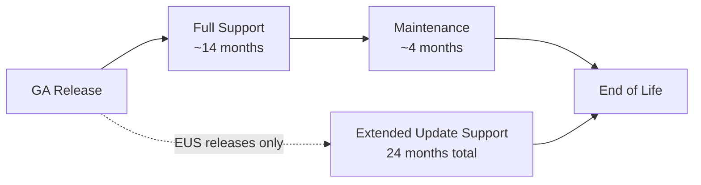
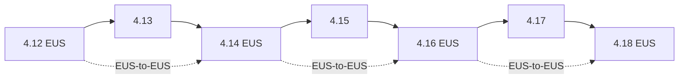

> 💡 **Quick Answer:** OpenShift 4.x follows a ~4-month release cycle. Each minor release receives full support for ~14 months, then maintenance support for ~4 months. Extended Update Support (EUS) releases (even-numbered: 4.12, 4.14, 4.16, 4.18) get 24 months total. Always upgrade to the latest EUS for longest support.

## The Problem

OpenShift clusters need regular upgrades to stay supported, secure, and compatible with workloads. Missing end-of-life dates means running unsupported clusters with no security patches. Understanding the lifecycle — release cadence, support phases, Kubernetes version mapping, and EUS eligibility — is critical for planning upgrades.



## The Solution

### OpenShift 4.x Release and Kubernetes Mapping

| OCP Version | Kubernetes | GA Date | End of Full Support | End of Life | EUS? |
|:-----------:|:----------:|:-------:|:-------------------:|:-----------:|:----:|
| **4.18** | 1.31 | 2025-02 | ~2026-04 | ~2027-02 | ✅ |
| **4.17** | 1.30 | 2024-10 | ~2025-12 | ~2026-04 | ❌ |
| **4.16** | 1.29 | 2024-06 | ~2025-08 | ~2026-06 | ✅ |
| **4.15** | 1.28 | 2024-02 | ~2025-04 | ~2025-08 | ❌ |
| **4.14** | 1.27 | 2023-10 | ~2024-12 | ~2025-10 | ✅ |
| **4.13** | 1.26 | 2023-06 | ~2024-08 | ~2024-11 | ❌ |
| **4.12** | 1.25 | 2023-01 | ~2024-03 | ~2025-01 | ✅ |

> **Note**: Dates are approximate. Check [Red Hat OpenShift Life Cycle Policy](https://access.redhat.com/support/policy/updates/openshift/) for exact dates.

### Support Phases Explained

| Phase | Duration | What You Get |
|-------|----------|-------------|
| **Full Support** | ~14 months | Bug fixes, security patches, new features, operator updates |
| **Maintenance Support** | ~4 months after full | Critical security patches only, no new features |
| **Extended Update Support (EUS)** | 24 months total | Full + maintenance extended, available on even-numbered releases |
| **End of Life** | — | No patches, no support, must upgrade |

### EUS (Extended Update Support)

EUS is available on **even-numbered** minor releases: 4.12, 4.14, 4.16, 4.18, etc.

```
Standard release (4.17):  |--Full Support (14mo)--|--Maint (4mo)--|EOL
EUS release (4.18):       |--Full Support (14mo)--|--Extended (10mo)--|EOL
                          |<------------- 24 months total ----------->|
```

**Why EUS matters:**
- Skip non-EUS releases entirely: upgrade 4.16 → 4.18 directly
- Longer patch window for production clusters
- Requires EUS subscription add-on

### Upgrade Paths



**Rules:**
- Can upgrade **one minor version at a time**: 4.16 → 4.17 → 4.18
- **EUS-to-EUS** upgrades skip the intermediate version: 4.16 → 4.18 directly
- Must be on latest z-stream patch before upgrading minor version
- Check upgrade graph: \`oc adm upgrade\`

### Check Your Cluster

```bash
# Current version
oc get clusterversion
# NAME      VERSION   AVAILABLE   PROGRESSING   SINCE
# version   4.16.23   True        False         45d

# Available upgrades
oc adm upgrade
# Recommended updates:
#   VERSION     IMAGE
#   4.16.24     quay.io/openshift-release-dev/ocp-release@sha256:...
#   4.17.12     quay.io/openshift-release-dev/ocp-release@sha256:...

# Check Kubernetes version mapping
oc get nodes -o wide
# VERSION column shows underlying Kubernetes version

# Check operator compatibility
oc get csv -A | head -20
```

### Plan Your Upgrade

```bash
# 1. Check current version and available channels
oc get clusterversion -o jsonpath='{.items[0].spec.channel}'
# stable-4.16

# 2. Switch to EUS channel if available
oc adm upgrade channel eus-4.18

# 3. Check upgrade prerequisites
oc adm upgrade --include-not-recommended
# Shows all paths including those with known issues

# 4. Start upgrade
oc adm upgrade --to-latest
# Or specific version:
oc adm upgrade --to=4.18.3

# 5. Monitor progress
oc get clusterversion -w
oc get co  # Check all ClusterOperators
```

### MachinConfigPool (MCP) During Upgrades

```bash
# Check MCP status (nodes rolling out)
oc get mcp
# NAME     CONFIG                             UPDATED   UPDATING   DEGRADED   MACHINECOUNT   READYMACHINECOUNT
# master   rendered-master-abc123             True      False      False      3              3
# worker   rendered-worker-def456             True      False      False      6              6

# If MCP is degraded
oc get mcp worker -o jsonpath='{.status.conditions[?(@.type=="Degraded")].message}'

# Pause MCP during maintenance
oc patch mcp/worker --type merge -p '{"spec":{"paused":true}}'

# Resume
oc patch mcp/worker --type merge -p '{"spec":{"paused":false}}'
```

### Version Compatibility Checklist

Before upgrading, verify:

- [ ] All ClusterOperators healthy: \`oc get co\`
- [ ] No degraded MachineConfigPools: \`oc get mcp\`
- [ ] Operators compatible with target version: check OperatorHub
- [ ] API deprecations reviewed: \`oc get apirequestcounts\`
- [ ] etcd backup taken: \`etcdctl snapshot save\`
- [ ] Node capacity sufficient for rolling update
- [ ] PodDisruptionBudgets won't block node drains

## Common Issues

| Issue | Cause | Fix |
|-------|-------|-----|
| Upgrade stuck at 80% | MCP not completing rollout | Check \`oc get mcp\` for degraded nodes |
| "Version not found in channel" | Wrong update channel | Switch channel: \`oc adm upgrade channel stable-4.18\` |
| Operators degraded post-upgrade | Operator not compatible | Check CSV status, may need manual approval |
| EUS-to-EUS fails | Intermediate upgrade needed | Ensure on latest z-stream of current EUS first |
| API deprecation warnings | Removed APIs in new version | Run \`oc get apirequestcounts\` to find affected resources |
| Node stuck in SchedulingDisabled | Drain timeout during upgrade | Check PDBs blocking eviction |

## Best Practices

- **Target EUS releases for production** — 24 months of support vs 18 for standard
- **Upgrade within 60 days of new z-stream** — critical CVEs patched quickly
- **Test upgrades in staging first** — same version, same operators, same workloads
- **Monitor \`oc get co\` continuously during upgrades** — catch degraded operators early
- **Take etcd backup before every upgrade** — recovery point if upgrade fails
- **Review API deprecations before upgrading** — \`oc get apirequestcounts\` shows removed APIs

## Key Takeaways

- OpenShift 4.x releases every ~4 months, each supported for ~18 months (14 full + 4 maintenance)
- EUS releases (even-numbered: 4.12, 4.14, 4.16, 4.18) get 24 months total support
- EUS-to-EUS upgrades skip intermediate versions — ideal for production stability
- Each OCP version maps to a specific Kubernetes version (e.g., OCP 4.18 = K8s 1.31)
- Always check \`oc adm upgrade\` for available paths before upgrading
- Take etcd backups and verify operator compatibility before every minor upgrade

## Frequently Asked Questions

### What is the OpenShift support lifecycle?
OpenShift Container Platform follows a ~4-month release cycle. Each minor version receives Full Support (~14 months) then Maintenance Support (~4 months). Even-numbered releases (4.12, 4.14, 4.16, 4.18) qualify for Extended Update Support (EUS) with 24 months total coverage.

### How long is OpenShift 4.16 supported?
OpenShift 4.16 is an EUS release with 24 months of support from its GA date. Full support covers the first ~18 months with bug fixes and security patches, followed by ~6 months of maintenance support with critical fixes only.

### Can I skip OpenShift versions when upgrading?
You can skip minor versions only between EUS releases (e.g., 4.14 → 4.16). Non-EUS upgrades must go version by version (4.15 → 4.16 → 4.17). Always check the upgrade graph with `oc adm upgrade` before planning.

### What happens when OpenShift reaches end of life?
Once EOL, Red Hat no longer provides security patches, bug fixes, or technical support. Running EOL clusters is a compliance and security risk. Plan upgrades at least 2 months before EOL dates.
