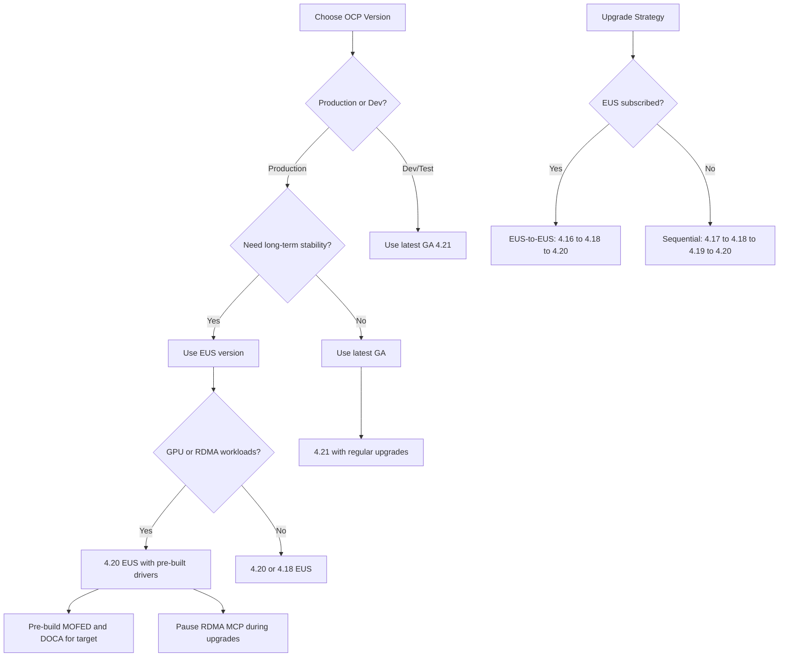

> 💡 **Quick Answer:** OpenShift releases every ~4 months. Each version has ~6 months full support + ~12 months maintenance. Even-numbered minors (4.12, 4.14, 4.16, 4.18, 4.20) offer Extended Update Support (EUS) add-ons for up to 24+ months total coverage.

## The Problem

Planning OpenShift upgrades requires understanding which versions are supported, when maintenance ends, and which versions offer Extended Update Support. Running an unsupported version means no security patches, no bug fixes, and no Red Hat support.

## The Solution

Track the OpenShift lifecycle matrix to plan upgrades proactively, leverage EUS for longer stability windows, and schedule driver/operator rebuilds around upgrade cycles.

### OpenShift Version Lifecycle Matrix (as of March 2026)

| Version | GA Date | Full Support Ends | Maintenance Ends | EUS Term 1 | EUS Term 2 |
|---------|---------|-------------------|-------------------|------------|------------|
| **4.21** | Feb 3, 2026 | GA of 4.22 + 3mo | Aug 3, 2027 | N/A | N/A |
| **4.20** | Oct 21, 2025 | May 3, 2026 | Apr 21, 2027 | Oct 21, 2027 | Oct 21, 2028 |
| **4.19** | Jun 17, 2025 | Jan 21, 2026 | Dec 17, 2026 | N/A | N/A |
| **4.18** | Feb 25, 2025 | Sep 17, 2025 | Aug 25, 2026 | Feb 25, 2027 | Feb 25, 2028 |
| **4.17** | Oct 1, 2024 | May 25, 2025 | Apr 1, 2026 | N/A | N/A |
| **4.16** | Jun 27, 2024 | Jan 1, 2025 | Dec 27, 2025 | Jun 27, 2026 | Jun 27, 2027 |
| **4.14** | Oct 31, 2023 | May 27, 2024 | May 1, 2025 | Oct 31, 2025 | Oct 31, 2026 |
| **4.12** | Jan 17, 2023 | Aug 17, 2023 | Jul 17, 2024 | Jan 17, 2025 | Jan 17, 2026 |

### Support Phases

```yaml
# Support lifecycle phases:
Full Support:
  duration: "~6 months (until next version GA + 3 months)"
  includes:
    - Critical and important security fixes
    - Urgent and high-priority bug fixes
    - New features and enhancements
    - Full Red Hat support

Maintenance Support:
  duration: "~12 months after Full Support ends"
  includes:
    - Critical security fixes
    - Selected high-impact bug fixes
    - No new features
    - Full Red Hat support

Extended Update Support (EUS):
  availability: "Even-numbered minors only (4.12, 4.14, 4.16, 4.18, 4.20)"
  duration: "Additional 12-24 months (paid add-on per term)"
  includes:
    - Critical security fixes
    - Backported bug fixes
    - Stability-focused updates
  benefit: "Skip odd-numbered releases in upgrade path (EUS-to-EUS)"

Extended Life Phase:
  duration: "After all support ends"
  includes:
    - No patches or fixes
    - Self-support only
    - Access to existing documentation
```

### EUS-to-EUS Upgrade Strategy

```bash
# EUS-to-EUS allows skipping intermediate versions
# Example: 4.16 → 4.18 (skip 4.17)

# 1. Check current version
oc get clusterversion

# 2. Verify EUS-to-EUS upgrade path available
oc adm upgrade
# Look for: "EUS-to-EUS upgrade available to 4.18.x"

# 3. Acknowledge the intermediate version
oc adm upgrade --to-eus

# 4. The upgrade pauses at intermediate (4.17)
#    MCPs are automatically paused during EUS-to-EUS
oc get mcp

# 5. Continue to target EUS version
oc adm upgrade --to=4.18.latest

# 6. Verify completion
oc get clusterversion
oc get nodes
```

### Pre-Upgrade Checklist

```bash
#!/bin/bash
set -euo pipefail

echo "=== OpenShift Pre-Upgrade Checklist ==="

# 1. Current version and available upgrades
echo "1. Current version:"
oc get clusterversion version -o jsonpath='{.status.desired.version}'
echo ""
echo "Available upgrades:"
oc adm upgrade | head -20

# 2. Check cluster operators
echo "2. Cluster operators health:"
oc get co | grep -v "True.*False.*False"

# 3. Check nodes
echo "3. Node status:"
oc get nodes
oc get mcp

# 4. Check pending certificates
echo "4. Pending CSRs:"
oc get csr | grep -c Pending || echo "None"

# 5. Check etcd health
echo "5. Etcd health:"
oc get etcd -o jsonpath='{.items[0].status.conditions[?(@.type=="EtcdMembersAvailable")].message}'
echo ""

# 6. Check PDBs that might block drain
echo "6. PDBs with 0 allowed disruptions:"
oc get pdb -A | awk '$6 == 0 {print}'

# 7. Check storage (PVCs near capacity)
echo "7. Storage check:"
oc get pv | grep -c Released || echo "No released PVs"

# 8. Verify backup exists
echo "8. Verify recent etcd backup exists before proceeding"

# 9. Pre-build drivers for target version
echo "9. Pre-build MOFED/DOCA drivers for target version"
echo "   Use: oc adm release info --image-for=driver-toolkit <target-release>"
```

### Version Selection Decision Tree



### Upgrade Impact on Operators

```yaml
# Operators affected by OCP upgrades:
GPU Operator:
  impact: "May need driver rebuild for new kernel"
  action: "Pre-build driver container with DTK for target version"
  recipe: "mofed-doca-driver-building-openshift"

Network Operator (MOFED/DOCA):
  impact: "Kernel modules must match new kernel"
  action: "Pre-build MOFED/DOCA, pause RDMA MCP during upgrade"
  recipe: "doca-driver-openshift-dtk"

CNPG:
  impact: "Minimal — operator manages PG lifecycle independently"
  action: "Verify operator compatibility matrix"

MariaDB Operator:
  impact: "Minimal — stateless operator with CRD versioning"
  action: "Check operator version compatibility"

Training Operator (Kubeflow):
  impact: "May need SCC reconfiguration after upgrade"
  action: "Verify pods restart cleanly post-upgrade"
```

## Common Issues

- **Upgrade stuck at intermediate version** — check cluster operators: `oc get co | grep -v "True.*False.*False"`; resolve degraded operators before continuing
- **Nodes not updating** — check MCP status: `oc get mcp`; nodes may be paused or cordoned
- **EUS-to-EUS not available** — EUS is a paid add-on; verify subscription entitlement
- **MOFED/GPU drivers broken after upgrade** — kernel changed; rebuild drivers with new DTK image before upgrading
- **etcd degraded during upgrade** — normal during control plane updates; wait for completion; check with `oc get etcd`

## Best Practices

- Use EUS versions for production GPU/RDMA clusters — fewer upgrades, longer support
- Pre-build MOFED/DOCA driver images for the target OCP version before upgrading
- Pause RDMA/GPU MachineConfigPools during upgrades, unpause after
- Take etcd backup before every upgrade: `oc debug node/<master> -- chroot /host /usr/local/bin/cluster-backup.sh`
- Test upgrades on a staging cluster first
- Monitor the Red Hat lifecycle page: <https://access.redhat.com/support/policy/updates/openshift>
- Plan upgrades at least 1 month before maintenance support ends
- EUS-to-EUS skips intermediate versions — reduces upgrade risk and downtime

## Key Takeaways

- OpenShift releases every ~4 months; each version has ~18 months total support
- EUS (even-numbered minors) extends support to 24-36 months with paid add-ons
- EUS-to-EUS upgrades skip intermediate versions (4.16 → 4.18 → 4.20)
- Pre-build kernel-dependent drivers (MOFED, DOCA, GPU) before upgrading
- Current recommended production versions: 4.20 (EUS) or 4.18 (EUS)
- Release cadence: ~4 months between minor versions
