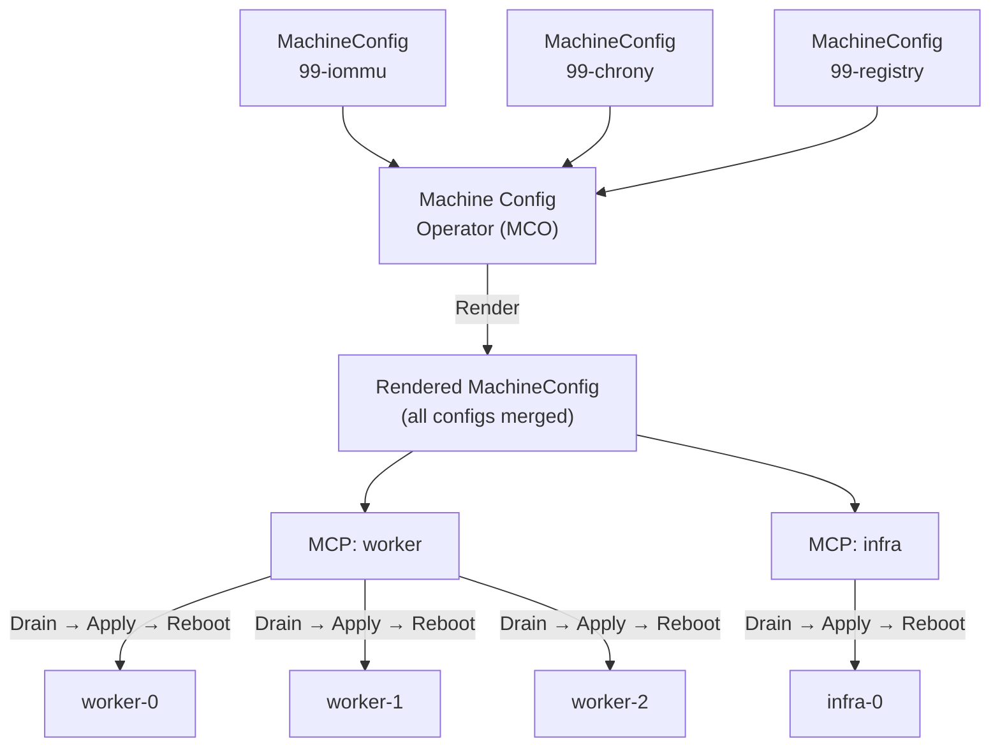
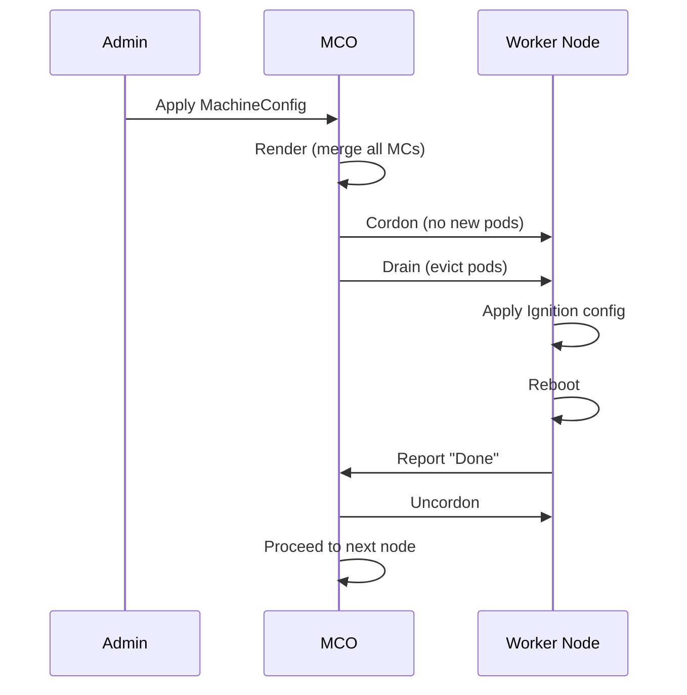

> 💡 **Quick Answer:** `MachineConfig` defines the desired OS-level state of OpenShift nodes — kernel parameters, files, systemd units, and extensions. `MachineConfigPool` (MCP) groups nodes and controls how MachineConfigs roll out. The Machine Config Operator (MCO) renders all MachineConfigs into a single config per pool, drains nodes one-by-one, applies changes, and reboots. Use `maxUnavailable` and `paused` to control blast radius.

## The Problem

OpenShift runs on immutable CoreOS (RHCOS) nodes. You can't SSH in and edit files — changes are lost on reboot. MachineConfig is the declarative way to configure the OS layer: kernel parameters, config files, certificates, systemd services, kernel modules, and more. MachineConfigPool controls which nodes get which configs and how fast they roll out.



## The Solution

### MachineConfig Anatomy

```yaml
apiVersion: machineconfiguration.openshift.io/v1
kind: MachineConfig
metadata:
  name: 99-worker-custom-config
  labels:
    machineconfiguration.openshift.io/role: worker  # Which MCP this targets
spec:
  config:
    ignition:
      version: 3.2.0                  # Always 3.2.0 for OCP 4.x
    
    # 1. Files — drop config files onto nodes
    storage:
      files:
        - path: /etc/sysctl.d/99-gpu-hugepages.conf
          mode: 0644
          overwrite: true
          contents:
            source: data:text/plain;charset=utf-8;base64,dm0ubnJfaHVnZXBhZ2VzPTEwMjQK
            # Decoded: vm.nr_hugepages=1024
        
        - path: /etc/containers/registries.conf.d/99-mirror.conf
          mode: 0644
          overwrite: true
          contents:
            source: data:text/plain;charset=utf-8,[[registry]]%0A  prefix = "docker.io"%0A  location = "mirror.example.com/docker-hub"
    
    # 2. Systemd units — manage services
    systemd:
      units:
        - name: gpu-clock-boost.service
          enabled: true
          contents: |
            [Unit]
            Description=Set GPU clocks to max
            After=nvidia-persistenced.service
            
            [Service]
            Type=oneshot
            ExecStart=/usr/bin/nvidia-smi -pm 1
            ExecStart=/usr/bin/nvidia-smi -ac 1593,1410
            RemainAfterExit=yes
            
            [Install]
            WantedBy=multi-user.target
  
  # 3. Kernel arguments
  kernelArguments:
    - intel_iommu=on
    - iommu=pt
    - hugepagesz=1G
    - hugepages=64
    - default_hugepagesz=1G
  
  # 4. Kernel type (optional)
  kernelType: ""                       # default, realtime, or 64k-pages
  
  # 5. Extensions (optional — install RPMs)
  extensions:
    - usbguard                         # Example: install usbguard extension
```

### MachineConfigPool (MCP)

```yaml
# Default worker pool (exists by default)
apiVersion: machineconfiguration.openshift.io/v1
kind: MachineConfigPool
metadata:
  name: worker
spec:
  machineConfigSelector:
    matchExpressions:
      - key: machineconfiguration.openshift.io/role
        operator: In
        values: [worker]
  nodeSelector:
    matchLabels:
      node-role.kubernetes.io/worker: ""
  configuration:
    name: rendered-worker-xxxxx        # Auto-generated rendered config
  maxUnavailable: 1                    # Roll out one node at a time
  paused: false                        # Set true to pause rollout
---
# Custom MCP for GPU nodes
apiVersion: machineconfiguration.openshift.io/v1
kind: MachineConfigPool
metadata:
  name: gpu-worker
spec:
  machineConfigSelector:
    matchExpressions:
      - key: machineconfiguration.openshift.io/role
        operator: In
        values: [worker, gpu-worker]   # Inherits worker + gpu-specific configs
  nodeSelector:
    matchLabels:
      node-role.kubernetes.io/gpu-worker: ""
  maxUnavailable: 1
  paused: false
```

```bash
# Label nodes for custom MCP
oc label node gpu-node-0 node-role.kubernetes.io/gpu-worker=""
oc label node gpu-node-1 node-role.kubernetes.io/gpu-worker=""
# Remove from default worker pool if exclusive
oc label node gpu-node-0 node-role.kubernetes.io/worker-
```

### MachineConfig Examples

```yaml
# Kernel parameters (e.g., IOMMU, hugepages)
apiVersion: machineconfiguration.openshift.io/v1
kind: MachineConfig
metadata:
  name: 99-gpu-kernel-args
  labels:
    machineconfiguration.openshift.io/role: gpu-worker
spec:
  kernelArguments:
    - intel_iommu=on
    - iommu=pt
    - nvidia.NVreg_OpenRmEnableUnsupportedGpus=1
    - rdma_rxe.max_qp_wr=4096
---
# Drop a file
apiVersion: machineconfiguration.openshift.io/v1
kind: MachineConfig
metadata:
  name: 99-gpu-modprobe
  labels:
    machineconfiguration.openshift.io/role: gpu-worker
spec:
  config:
    ignition:
      version: 3.2.0
    storage:
      files:
        - path: /etc/modprobe.d/nvidia-peermem.conf
          mode: 0644
          contents:
            source: data:text/plain;charset=utf-8;base64,b3B0aW9ucyBudmlkaWEgTlZyZWdfUmVnaXN0ZXJQZWVyTWVtb3J5PTEKc29mdHBvc3QgbnZpZGlhIG1vZHByb2JlIG52aWRpYS1wZWVybWVtCg==
            # Decoded:
            # options nvidia NVreg_RegisterPeerMemory=1
            # softpost nvidia modprobe nvidia-peermem
---
# NTP/Chrony configuration
apiVersion: machineconfiguration.openshift.io/v1
kind: MachineConfig
metadata:
  name: 99-chrony
  labels:
    machineconfiguration.openshift.io/role: worker
spec:
  config:
    ignition:
      version: 3.2.0
    storage:
      files:
        - path: /etc/chrony.conf
          mode: 0644
          overwrite: true
          contents:
            source: data:text/plain;charset=utf-8,server%20ntp.example.com%20iburst%0Adriftfile%20/var/lib/chrony/drift%0Amakestep%201.0%203%0Artcsync%0A
```

### Managing MCP Rollouts

```bash
# Check MCP status
oc get mcp
# NAME         CONFIG                  UPDATED   UPDATING   DEGRADED   MACHINECOUNT   READYMACHINECOUNT
# master       rendered-master-abc     True      False      False      3              3
# worker       rendered-worker-def     True      False      False      5              5
# gpu-worker   rendered-gpu-worker-x   False     True       False      2              1

# Pause rollout (emergency or maintenance window)
oc patch mcp worker --type merge -p '{"spec":{"paused":true}}'

# Resume rollout
oc patch mcp worker --type merge -p '{"spec":{"paused":false}}'

# Speed up rollout (update 2 nodes at a time)
oc patch mcp worker --type merge -p '{"spec":{"maxUnavailable":2}}'

# Or percentage
oc patch mcp worker --type merge -p '{"spec":{"maxUnavailable":"25%"}}'

# Check which rendered config a node has
oc get node worker-0 -o jsonpath='{.metadata.annotations.machineconfiguration\.openshift\.io/currentConfig}'

# Check if node matches desired config
oc get node worker-0 -o jsonpath='{.metadata.annotations.machineconfiguration\.openshift\.io/state}'
# "Done" = up to date, "Working" = applying

# View rendered MachineConfig (merged from all MCs)
oc get mc rendered-worker-def -o yaml

# See all MachineConfigs targeting workers
oc get mc -l machineconfiguration.openshift.io/role=worker
```

### Rollout Process



### Naming Convention

```
# MachineConfig naming: NN-role-description
# NN = priority (00-99, higher = applied later)

00-master      # Base platform configs (don't touch)
01-master-*    # Platform-generated configs
99-worker-*    # Your custom configs (always use 99-)

# Why 99? Higher priority wins when configs conflict.
# Platform configs (00-01) are applied first, your 99-* overrides them.
```

## Common Issues

| Issue | Cause | Fix |
|-------|-------|-----|
| MCP stuck `UPDATING` | Node can't drain (PDB blocking) | Check `oc adm drain` manually, adjust PDBs |
| MCP `DEGRADED=True` | Bad ignition config or file | `oc describe mcp worker`, check MCO pod logs |
| Node won't reboot | Ignition syntax error | Validate base64 encoding, check ignition version |
| Changes not applied | Wrong role label on MC | Verify label matches MCP's `machineConfigSelector` |
| Slow rollout | `maxUnavailable: 1` with many nodes | Increase `maxUnavailable` during maintenance window |
| Rendered config missing new MC | MC label doesn't match MCP selector | Check `matchExpressions` in MCP spec |
| Node in `Degraded` after reboot | Service failed to start | SSH via `oc debug node/`, check `journalctl` |

## Best Practices

- **Always prefix custom MCs with `99-`** — ensures your config wins over platform defaults
- **Test on one node first** — create a dedicated MCP with one node, verify, then expand
- **Pause MCP during changes** — apply multiple MCs, then unpause for a single rollout
- **Use `maxUnavailable: 1` in production** — never risk multiple nodes down simultaneously
- **Base64 encode file contents** — use `echo -n "content" | base64 -w0` for the `source` field
- **Don't modify `00-*` or `01-*` MCs** — these are platform-managed
- **Label nodes before creating MCP** — avoids unexpected rollouts
- **Monitor with `oc get mcp -w`** — watch rollout progress in real time

## Key Takeaways

- MachineConfig is the **only** way to persistently configure RHCOS nodes on OpenShift
- MCO merges all MachineConfigs into a rendered config per pool
- Rollout is drain → apply → reboot, one node at a time by default
- Use custom MCPs to separate GPU, infra, and worker node configs
- `maxUnavailable` and `paused` control rollout speed and timing
- Always use `99-` prefix for custom MachineConfigs
- Changes trigger node reboots — plan for maintenance windows
