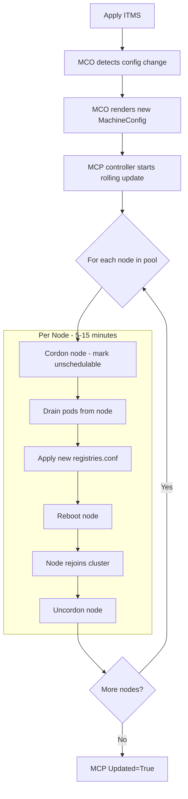

> 💡 **Quick Answer:** When you apply an `ImageTagMirrorSet` (ITMS), the Machine Config Operator (MCO) updates `/etc/containers/registries.conf` on every node, triggering a **rolling restart** of all MachineConfigPools. Monitor with `oc get mcp -w`, expect 5-15 minutes per node, and plan changes during maintenance windows.

## The Problem

After applying an ITMS (or IDMS) in OpenShift:

- The **Machine Config Operator** (MCO) generates a new `MachineConfig` with updated registry configuration
- Every node must **drain, reboot, and rejoin** the cluster — one at a time per pool
- In production clusters with 50+ nodes, this can take **hours**
- If something goes wrong, nodes can get stuck in **Degraded** state
- Compute-heavy workloads (AI/GPU) are especially sensitive to node restarts

Understanding the MCO → MCP → Node lifecycle is critical for safely managing ITMS changes.

## The Solution

### Step 1: Monitor MCP Status After ITMS Apply

```bash
# Apply ITMS
oc apply -f itms.yaml

# Immediately watch MachineConfigPool status
oc get mcp -w

# Expected output during rollout:
# NAME     CONFIG                          UPDATED   UPDATING   DEGRADED   MACHINECOUNT   READYCOUNT
# master   rendered-master-abc123          True      False      False      3              3
# worker   rendered-worker-def456          False     True       False      10             7
#                                          ↑         ↑
#                                          Not done  In progress

# Wait for all pools to finish
oc wait mcp/worker --for condition=Updated --timeout=3600s
oc wait mcp/master --for condition=Updated --timeout=1800s
```

### Step 2: Understand the MCO Rollout Flow



### Step 3: Check Detailed Node Progress

```bash
# Which nodes are updating right now?
oc get nodes -o custom-columns=\
NAME:.metadata.name,\
READY:.status.conditions[-1].status,\
SCHEDULABLE:.spec.unschedulable,\
ROLE:.metadata.labels.node-role\\.kubernetes\\.io,\
VERSION:.status.nodeInfo.kubeletVersion

# Check which MachineConfig each node is running
oc get nodes -o custom-columns=\
NAME:.metadata.name,\
CURRENT_CONFIG:.metadata.annotations.machineconfiguration\\.openshift\\.io/currentConfig,\
DESIRED_CONFIG:.metadata.annotations.machineconfiguration\\.openshift\\.io/desiredConfig,\
STATE:.metadata.annotations.machineconfiguration\\.openshift\\.io/state

# Nodes show:
# STATE=Done     → already updated
# STATE=Working  → currently updating
# STATE=Degraded → something went wrong
```

### Step 4: Pause MCP Before ITMS (Production Safety)

```bash
# BEST PRACTICE: Pause the pool BEFORE applying ITMS
# This prevents immediate rolling restart

# Pause worker pool
oc patch mcp/worker --type merge \
  --patch '{"spec":{"paused":true}}'

# Now safely apply ITMS — no nodes will restart yet
oc apply -f itms.yaml

# Verify the new MachineConfig was rendered
oc get mc | grep rendered

# When ready (maintenance window), unpause to start rollout
oc patch mcp/worker --type merge \
  --patch '{"spec":{"paused":false}}'

# Monitor rollout
oc get mcp -w
```

### Step 5: Control Rollout Speed

```yaml
# Customize how many nodes update simultaneously
apiVersion: machineconfiguration.openshift.io/v1
kind: MachineConfigPool
metadata:
  name: worker
spec:
  maxUnavailable: 1          # Default: 1 node at a time
  # maxUnavailable: "10%"    # Or percentage-based
  # maxUnavailable: 3        # Up to 3 nodes simultaneously

  paused: false

  nodeSelector:
    matchLabels:
      node-role.kubernetes.io/worker: ""

  configuration:
    source:
      - apiGroup: machineconfiguration.openshift.io
        kind: MachineConfig
```

```bash
# Speed up rollout (risky — reduces capacity more)
oc patch mcp/worker --type merge \
  --patch '{"spec":{"maxUnavailable": 3}}'

# Slow down rollout (safer — minimal capacity impact)
oc patch mcp/worker --type merge \
  --patch '{"spec":{"maxUnavailable": 1}}'
```

### Step 6: GPU Worker Pool — Separate MCP

```yaml
# Create a dedicated MCP for GPU/compute nodes
# So ITMS changes don't restart GPU nodes with regular workers
apiVersion: machineconfiguration.openshift.io/v1
kind: MachineConfigPool
metadata:
  name: gpu-worker
  labels:
    pools.operator.machineconfiguration.openshift.io/gpu-worker: ""
spec:
  maxUnavailable: 1
  paused: true  # Always paused — only unpause during GPU maintenance windows

  machineConfigSelector:
    matchExpressions:
      - key: machineconfiguration.openshift.io/role
        operator: In
        values:
          - worker
          - gpu-worker

  nodeSelector:
    matchLabels:
      node-role.kubernetes.io/gpu-worker: ""
```

```bash
# Label GPU nodes with the custom role
oc label node gpu-node-01 node-role.kubernetes.io/gpu-worker=""
oc label node gpu-node-02 node-role.kubernetes.io/gpu-worker=""

# Remove from default worker pool
oc label node gpu-node-01 node-role.kubernetes.io/worker-
oc label node gpu-node-02 node-role.kubernetes.io/worker-

# Now ITMS changes:
# - Worker pool updates automatically
# - GPU pool stays paused — update manually during maintenance
oc patch mcp/gpu-worker --type merge \
  --patch '{"spec":{"paused":false}}'

# Watch GPU pool rollout
oc get mcp gpu-worker -w
```

### Step 7: Verify registries.conf After Rollout

```bash
# Confirm ITMS is applied on a node
oc debug node/<node-name> -- chroot /host \
  cat /etc/containers/registries.conf.d/99-imagetagmirrorset.conf

# Expected content:
# [[registry]]
#   prefix = "docker.io"
#   location = "docker.io"
#   [[registry.mirror]]
#     location = "mirror.internal.example.com/docker-hub"

# Test image pull from the updated node
oc debug node/<node-name> -- chroot /host \
  crictl pull nginx:1.25
# Should pull from mirror, not docker.io
```

### MCP Status Reference

```text
| Condition   | Meaning                                              |
|-------------|------------------------------------------------------|
| Updated     | All nodes in pool running desired MachineConfig      |
| Updating    | At least one node is being updated                   |
| Degraded    | A node failed to apply the config (needs attention)  |
| Paused      | Pool is paused — no updates will proceed             |

| Node State  | Meaning                                              |
|-------------|------------------------------------------------------|
| Done        | Node is running the desired MachineConfig            |
| Working     | Node is currently applying the new config            |
| Degraded    | Node failed to apply config — check MCO logs         |
```

## Common Issues

### Node stuck in Degraded state

```bash
# Check why a node is degraded
oc describe node <degraded-node> | grep -A10 "Annotations"
oc get events --field-selector involvedObject.name=<degraded-node>

# Check MCO logs for errors
oc logs -n openshift-machine-config-operator \
  $(oc get pods -n openshift-machine-config-operator \
    -l k8s-app=machine-config-daemon \
    --field-selector spec.nodeName=<degraded-node> \
    -o name) -c machine-config-daemon

# Common fix: force node to re-apply
oc debug node/<degraded-node> -- chroot /host \
  touch /run/machine-config-daemon-force
```

### Pods disrupted during drain

```bash
# Set PodDisruptionBudgets to protect critical workloads
apiVersion: policy/v1
kind: PodDisruptionBudget
metadata:
  name: critical-ai-pdb
  namespace: ai-inference
spec:
  minAvailable: 1
  selector:
    matchLabels:
      app: llama31-8b

# This ensures at least 1 replica stays running during node drain
```

### Rollout taking too long

```bash
# Check which node is blocking
oc get nodes -l node-role.kubernetes.io/worker \
  -o custom-columns=NAME:.metadata.name,STATE:.metadata.annotations.machineconfiguration\\.openshift\\.io/state

# If a node is stuck draining — check for non-evictable pods
oc get pods --all-namespaces --field-selector spec.nodeName=<stuck-node> \
  -o custom-columns=NS:.metadata.namespace,POD:.metadata.name,PDB:.metadata.annotations.pdb

# Force drain if needed (use with caution)
oc adm drain <stuck-node> --force --ignore-daemonsets --delete-emptydir-data
```

### Multiple ITMS changes — batch them

```bash
# Each ITMS change triggers a new MachineConfig render → full rollout
# DON'T apply ITMS changes one at a time

# BAD: 3 separate applies = 3 rolling restarts
oc apply -f itms-dockerhub.yaml
oc apply -f itms-quay.yaml
oc apply -f itms-nvidia.yaml

# GOOD: Combine into one ITMS or apply all at once
oc apply -f itms-all-mirrors.yaml
# OR
oc apply -f itms-dockerhub.yaml -f itms-quay.yaml -f itms-nvidia.yaml
# MCO batches these into a single MachineConfig render
```

## Best Practices

- **Pause MCP before ITMS apply** — control when the rollout starts
- **Separate GPU nodes into their own MCP** — update GPU nodes on a different schedule
- **Batch ITMS changes** — apply all mirror changes at once to avoid multiple rollouts
- **Set PodDisruptionBudgets** — protect critical workloads during node drain
- **`maxUnavailable: 1`** for production — slow but safe
- **Monitor with `oc get mcp -w`** — watch the entire rollout in real-time
- **Verify registries.conf** — always confirm the config reached nodes after rollout
- **Plan maintenance windows** — a 50-node cluster at 10 min/node = ~8 hours

## Key Takeaways

- ITMS/IDMS changes trigger **MCO rolling restarts** of all nodes in affected MachineConfigPools
- **Pause MCPs first** to control timing — unpause during maintenance windows
- Each node: **cordon → drain → reboot → rejoin** — takes 5-15 minutes
- Create a **separate MCP for GPU nodes** to manage compute-heavy nodes independently
- **Batch ITMS changes** into a single apply to avoid multiple rollout cycles
- Watch for **Degraded** nodes and check MCO daemon logs for errors
- Set **PodDisruptionBudgets** to protect critical AI inference workloads during drain
