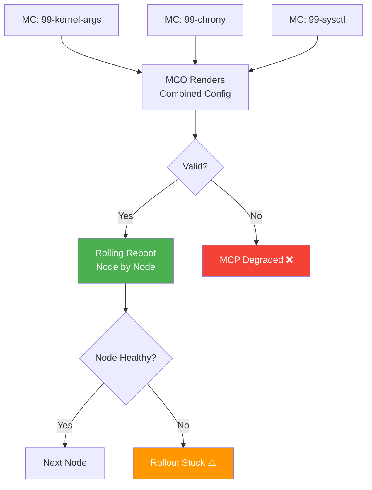

> 💡 **Quick Answer:** A broken MachineConfig (MC) can degrade an entire MachineConfigPool, rendering nodes unbootable or stuck in a render loop. Always validate MCs before applying: check Ignition spec syntax, verify file paths and permissions, dry-run with `oc apply --dry-run=server`, and monitor the MCP rollout. If an MCP is degraded, identify the broken MC with `oc describe mcp`, check the rendered config, and either fix or revert the offending MC.

## The Problem

MachineConfig errors in OpenShift are dangerous because:

- A bad MC renders to ALL nodes in the pool simultaneously
- Broken Ignition configs can make nodes unbootable after reboot
- Syntax errors in systemd units prevent kubelet from starting
- Invalid file permissions cause security context failures
- Conflicting MCs with same filename create unpredictable behavior
- Degraded MCP blocks cluster upgrades entirely
- Rollback requires manual node recovery or reprovisioning

## The Solution

### Check MCP Status

```bash
# List all MCPs and their status
oc get mcp
# NAME     CONFIG                             UPDATED   UPDATING   DEGRADED   MACHINECOUNT   READYCOUNT
# master   rendered-master-abc123             True      False      False      3              3
# worker   rendered-worker-def456             True      False      False      10             10

# Detailed MCP status
oc describe mcp worker

# Check for degraded conditions
oc get mcp -o json | jq '.items[] | select(.status.conditions[] | select(.type=="Degraded" and .status=="True")) | .metadata.name'
```

### Identify Broken MachineConfig

```bash
# List all MachineConfigs
oc get mc --sort-by=.metadata.name

# Check rendered config (the merged result)
oc get mc rendered-worker-def456 -o yaml

# Find which MC caused degradation
oc describe mcp worker | grep -A 20 "Degraded"
# message: "Node worker-3 is reporting: \"error: failed to render
#   machineconfig (99-custom-kernel-args): invalid kernel argument\""

# Compare current rendered vs previous
oc get mc rendered-worker-def456 -o yaml > current.yaml
oc get mc rendered-worker-abc123 -o yaml > previous.yaml
diff current.yaml previous.yaml
```

### Common Broken MC Patterns

#### 1. Invalid Ignition Spec Version

```yaml
# ❌ BROKEN — wrong Ignition spec version
apiVersion: machineconfiguration.openshift.io/v1
kind: MachineConfig
metadata:
  name: 99-bad-ignition
  labels:
    machineconfiguration.openshift.io/role: worker
spec:
  config:
    ignition:
      version: 2.2.0    # ❌ OpenShift 4.x uses 3.2.0 or 3.4.0
```

```yaml
# ✅ CORRECT
spec:
  config:
    ignition:
      version: 3.2.0    # Match your OpenShift version
```

#### 2. Invalid File Permissions

```yaml
# ❌ BROKEN — octal permissions as string
spec:
  config:
    storage:
      files:
      - path: /etc/myconfig.conf
        mode: "0644"     # ❌ Must be integer, not string
```

```yaml
# ✅ CORRECT — decimal integer (0644 octal = 420 decimal)
spec:
  config:
    storage:
      files:
      - path: /etc/myconfig.conf
        mode: 0644       # ✅ YAML interprets 0644 as octal → 420 decimal
```

#### 3. Conflicting File Paths

```yaml
# ❌ BROKEN — two MCs writing the same file
# MC: 99-team-a-config
spec:
  config:
    storage:
      files:
      - path: /etc/sysctl.d/99-custom.conf
        contents:
          source: data:,net.core.somaxconn=65535

# MC: 99-team-b-config  ← CONFLICT — same path
spec:
  config:
    storage:
      files:
      - path: /etc/sysctl.d/99-custom.conf    # ❌ Same file!
        contents:
          source: data:,vm.swappiness=10
```

```yaml
# ✅ CORRECT — unique file names
- path: /etc/sysctl.d/99-network-tuning.conf
- path: /etc/sysctl.d/99-vm-tuning.conf
```

#### 4. Bad systemd Unit

```yaml
# ❌ BROKEN — typo in systemd unit
spec:
  config:
    systemd:
      units:
      - name: custom-service.service
        enabled: true
        contents: |
          [Unit]
          Descriptin=My Service     # ❌ Typo: "Descriptin"
          After=network.target
          
          [Service]
          ExecStart=/usr/local/bin/myapp
          Tpye=simple               # ❌ Typo: "Tpye"
          
          [Install]
          WantedBy=multi-user.target
```

#### 5. Invalid Kernel Arguments

```yaml
# ❌ BROKEN — invalid kernel parameter
spec:
  kernelArguments:
  - "hugepages=2048"              # ❌ Wrong format
  - "isolcpus=0-3,5-7"           # ❌ Comma in wrong position
```

```yaml
# ✅ CORRECT
spec:
  kernelArguments:
  - "hugepagesz=2M"
  - "hugepages=2048"
  - "isolcpus=0-3"
```

### Pre-Flight Validation Script

```bash
#!/bin/bash
# validate-machineconfig.sh — Run before applying any MC
set -euo pipefail

MC_FILE="${1:?Usage: validate-machineconfig.sh <mc-yaml>}"

echo "=== MachineConfig Pre-Flight Validation ==="

# 1. YAML syntax check
echo "[1/7] YAML syntax..."
oc apply --dry-run=server -f "$MC_FILE" 2>&1 || {
    echo "❌ FAIL: Invalid YAML or API schema"
    exit 1
}
echo "✅ YAML syntax valid"

# 2. Check Ignition version
echo "[2/7] Ignition version..."
IGN_VER=$(yq '.spec.config.ignition.version' "$MC_FILE" 2>/dev/null)
if [[ "$IGN_VER" != "3.2.0" && "$IGN_VER" != "3.4.0" && "$IGN_VER" != "null" ]]; then
    echo "❌ FAIL: Ignition version '$IGN_VER' — expected 3.2.0 or 3.4.0"
    exit 1
fi
echo "✅ Ignition version OK ($IGN_VER)"

# 3. Check role label exists
echo "[3/7] Role label..."
ROLE=$(yq '.metadata.labels["machineconfiguration.openshift.io/role"]' "$MC_FILE")
if [[ "$ROLE" == "null" || -z "$ROLE" ]]; then
    echo "❌ FAIL: Missing role label (machineconfiguration.openshift.io/role)"
    exit 1
fi
echo "✅ Role label: $ROLE"

# 4. Check naming convention (99- prefix for custom)
echo "[4/7] Naming convention..."
MC_NAME=$(yq '.metadata.name' "$MC_FILE")
if [[ ! "$MC_NAME" =~ ^99- ]]; then
    echo "⚠️  WARNING: Name '$MC_NAME' doesn't use 99- prefix (custom MCs should)"
fi
echo "✅ Name: $MC_NAME"

# 5. Check for file path conflicts with existing MCs
echo "[5/7] File path conflicts..."
NEW_PATHS=$(yq '.spec.config.storage.files[].path' "$MC_FILE" 2>/dev/null | grep -v null || true)
if [[ -n "$NEW_PATHS" ]]; then
    while IFS= read -r path; do
        CONFLICTS=$(oc get mc -o json | jq -r \
            ".items[] | select(.metadata.name != \"$MC_NAME\") |
             select(.spec.config.storage.files[]?.path == \"$path\") |
             .metadata.name" 2>/dev/null || true)
        if [[ -n "$CONFLICTS" ]]; then
            echo "❌ FAIL: File path '$path' conflicts with MC: $CONFLICTS"
            exit 1
        fi
    done <<< "$NEW_PATHS"
fi
echo "✅ No file path conflicts"

# 6. Check file permissions are integers
echo "[6/7] File permissions..."
BAD_PERMS=$(yq '.spec.config.storage.files[] | select(.mode | type == "!!str")' "$MC_FILE" 2>/dev/null || true)
if [[ -n "$BAD_PERMS" ]]; then
    echo "❌ FAIL: File permissions must be integers, not strings"
    exit 1
fi
echo "✅ File permissions OK"

# 7. Validate systemd units (basic check)
echo "[7/7] Systemd units..."
UNITS=$(yq '.spec.config.systemd.units[].contents' "$MC_FILE" 2>/dev/null | grep -v null || true)
if [[ -n "$UNITS" ]]; then
    if echo "$UNITS" | grep -qP '^\s*(Descriptin|Tpye|ExecSart|Enviroment)='; then
        echo "❌ FAIL: Possible typo in systemd unit directives"
        exit 1
    fi
fi
echo "✅ Systemd units OK"

echo ""
echo "=== All checks passed ✅ ==="
echo "Safe to apply: oc apply -f $MC_FILE"
echo ""
echo "After applying, monitor:"
echo "  oc get mcp $ROLE -w"
echo "  oc get nodes -l node-role.kubernetes.io/$ROLE -w"
```

### Monitor MC Rollout

```bash
# Watch MCP rollout after applying MC
oc get mcp worker -w

# Check node-by-node progress
oc get nodes -l node-role.kubernetes.io/worker \
  -o custom-columns=NAME:.metadata.name,STATUS:.status.conditions[-1].type,CONFIG:.metadata.annotations.machineconfiguration\\.openshift\\.io/currentConfig,DESIRED:.metadata.annotations.machineconfiguration\\.openshift\\.io/desiredConfig

# Check Machine Config Daemon logs on stuck node
oc debug node/worker-3 -- chroot /host journalctl -u machine-config-daemon-host -f
```

### Recover from Degraded MCP

```bash
# Option 1: Fix the broken MC
oc edit mc 99-broken-config
# Fix the issue, save → MCP auto-retries

# Option 2: Delete the broken MC
oc delete mc 99-broken-config
# MCP will re-render and roll out the previous config

# Option 3: Force node to reapply
oc debug node/worker-3
chroot /host
touch /run/machine-config-daemon-force
# Daemon will re-render and reapply

# Option 4: Nuclear — remove node and re-provision
oc adm cordon worker-3
oc adm drain worker-3 --ignore-daemonsets --delete-emptydir-data
oc delete node worker-3
# Re-provision via Machine API
```



### Documentation Template for MC Changes

```markdown
## MachineConfig Change Request

**MC Name:** 99-increase-memlock
**Target MCP:** worker
**Author:** Jane Doe
**Date:** 2026-04-29
**Ticket:** INFRA-1234

### Purpose
Increase memlock ulimit for RDMA workloads

### Files Modified
| Path | Action | Permissions |
|------|--------|-------------|
| /etc/security/limits.d/99-memlock.conf | Create | 0644 |

### Kernel Arguments Changed
- Added: `default_hugepagesz=1G hugepagesz=1G hugepages=32`

### Validation
- [ ] `oc apply --dry-run=server` passed
- [ ] No file path conflicts with existing MCs
- [ ] Ignition version correct (3.2.0)
- [ ] Role label present
- [ ] Tested on staging cluster
- [ ] Rollback plan documented

### Rollback
```
oc delete mc 99-increase-memlock
```
MCP will re-render previous config. Rolling reboot ~15 min for 10 nodes.

### Monitoring
```
oc get mcp worker -w
oc get nodes -l node-role.kubernetes.io/worker
```
```

## Common Issues

**MCP degraded after MC apply — node won't reboot**

Machine Config Daemon can't parse the Ignition config. Check MCD logs: `oc debug node/<node> -- chroot /host journalctl -u machine-config-daemon-host --since "1 hour ago"`.

**Rendered config stuck — nodes show different desired vs current**

MCO is still rendering. If stuck >30 minutes, check the `machine-config-operator` pod logs in `openshift-machine-config-operator` namespace.

**MC changes not taking effect after node reboot**

File may be on a read-only filesystem overlay. Use `/etc/` paths for persistent changes. `/usr/` is immutable on RHCOS.

**Two MCs writing the same file — last-writer-wins unpredictability**

MCs are merged alphabetically by name. `99-z-config` overwrites `99-a-config` for the same file path. Use unique file paths or consolidate into one MC.

**Upgrade blocked by degraded MCP**

Cluster upgrades require ALL MCPs to be `Updated=True, Degraded=False`. Fix all degraded MCPs before upgrading.

## Best Practices

- **Always `99-` prefix for custom MCs** — ensures highest priority (alphabetical merge order)
- **One MC per concern** — don't bundle kernel args, sysctl, and systemd in one MC
- **Validate before applying** — use the pre-flight script above
- **Test on staging first** — especially kernel arguments and systemd units
- **Document every MC change** — use the change request template
- **Monitor rollout** — watch MCP status until `UPDATED=True` on all nodes
- **Keep MCs minimal** — fewer changes = easier debugging when things break
- **Never edit rendered MCs** — they're auto-generated; edit source MCs instead
- **Unique file paths** — never have two MCs writing the same file

## Key Takeaways

- Broken MachineConfigs can degrade entire node pools and block upgrades
- Pre-flight validation catches most issues: Ignition version, file conflicts, permissions, systemd syntax
- `oc apply --dry-run=server` validates schema but not Ignition logic — manual checks still needed
- Recovery options: fix MC, delete MC, force daemon reapply, or re-provision node
- Document every MC change with purpose, validation steps, and rollback plan
- MCs merge alphabetically — file path conflicts cause unpredictable behavior
- Always monitor MCP rollout to completion after applying changes
