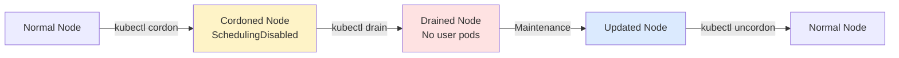

> 💡 **Quick Answer:** `kubectl cordon <node>` marks a node unschedulable (no new pods). `kubectl drain <node> --ignore-daemonsets --delete-emptydir-data` evicts all pods. `kubectl uncordon <node>` restores scheduling. Always drain before hardware maintenance or OS updates.

## The Problem

You need to take a Kubernetes node offline for maintenance (hardware repair, OS upgrade, kernel update, storage expansion) without disrupting running workloads. Simply powering off the node would kill pods ungracefully, potentially losing data and causing service outages.

## The Solution

### The Three-Step Process

```bash
# Step 1: Cordon — prevent new pods from scheduling on this node
kubectl cordon worker-3
# node/worker-3 cordoned

# Step 2: Drain — gracefully evict all pods to other nodes
kubectl drain worker-3 \
  --ignore-daemonsets \
  --delete-emptydir-data \
  --force \
  --timeout=300s

# Step 3: Perform maintenance...
# (hardware repair, OS update, reboot, etc.)

# Step 4: Uncordon — allow scheduling again
kubectl uncordon worker-3
# node/worker-3 uncordoned
```

### Understanding Each Flag

```bash
kubectl drain worker-3 \
  --ignore-daemonsets \       # Skip DaemonSet pods (they belong to every node)
  --delete-emptydir-data \    # Delete pods using emptyDir volumes (data will be lost)
  --force \                   # Delete pods not managed by a controller (bare pods)
  --grace-period=30 \         # Seconds to wait for graceful termination
  --timeout=600s \            # Abort drain if it takes longer than 10 minutes
  --pod-selector='app!=critical' \  # Only drain pods matching selector
  --dry-run=client            # Preview what would happen (no actual eviction)
```

### Verify Node Status

```bash
# Check scheduling status
kubectl get nodes
# NAME       STATUS                     ROLES    AGE   VERSION
# worker-1   Ready                      worker   30d   v1.28.6
# worker-2   Ready                      worker   30d   v1.28.6
# worker-3   Ready,SchedulingDisabled   worker   30d   v1.28.6  ← cordoned

# Check what's still running on the drained node
kubectl get pods -A -o wide --field-selector spec.nodeName=worker-3
# Only DaemonSet pods should remain
```



### OpenShift-Specific: oc adm drain

```bash
# OpenShift uses the same commands via oc
oc adm cordon worker-3
oc adm drain worker-3 --ignore-daemonsets --delete-emptydir-data --force --timeout=30m
oc adm uncordon worker-3
```

## Common Issues

### Drain Blocked by PDB

```
error: Cannot evict pod as it would violate the pod's disruption budget
```

See [MCP Drain PDB Workaround](/recipes/troubleshooting/mcp-drain-pdb-workaround/) for the fix.

### Pods with Local Storage

```
error: cannot delete Pods with local storage
```

Add `--delete-emptydir-data` to allow eviction of pods using emptyDir.

### Bare Pods (No Controller)

```
error: cannot delete Pods not managed by ReplicationController, ReplicaSet, Job, DaemonSet or StatefulSet
```

Add `--force` to delete bare pods (they won't be rescheduled anywhere).

### DaemonSet Pods Remaining

DaemonSet pods are expected to stay — they run on every node by design. `--ignore-daemonsets` tells drain to skip them.

## Best Practices

- **Always do `--dry-run=client` first** to see what will happen
- **Drain one node at a time** in production — maintain capacity
- **Set `--timeout`** to avoid infinite hangs on PDB-blocked drains
- **Check PDBs before draining** — `kubectl get pdb -A` shows allowed disruptions
- **Verify pods rescheduled** after drain — check the other nodes

## Key Takeaways

- Cordon prevents new scheduling; drain evicts existing pods
- Always use `--ignore-daemonsets` — DaemonSet pods belong on every node
- PodDisruptionBudgets are the #1 cause of stuck drains
- Use `--dry-run=client` to preview before committing
- Uncordon after maintenance to restore the node to the scheduling pool
