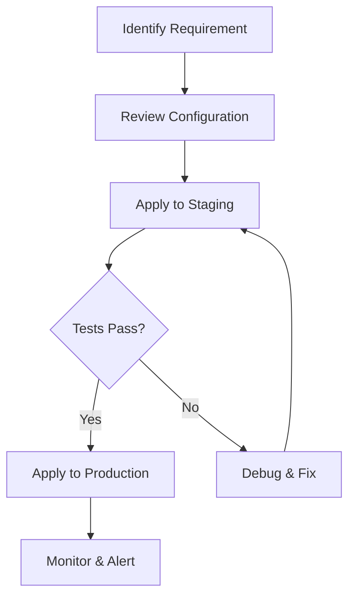

> 💡 **Quick Answer:** Protect K8s services with OpenShift OAuth proxy sidecar. Authentication, RBAC delegation, and SSO for internal dashboards.

## The Problem

Teams running production K8s clusters need openshift oauth proxy sidecar for reliability, security, and operational excellence. Misconfiguration leads to outages, security gaps, or wasted resources.

## The Solution

### Prerequisites

```bash
# Verify cluster access
kubectl cluster-info
kubectl get nodes
```

### Configuration

```yaml
# OpenShift OAuth Proxy Sidecar — production example
apiVersion: v1
kind: ConfigMap
metadata:
  name: openshift-oauth-proxy-guide-config
  namespace: production
  labels:
    app.kubernetes.io/managed-by: kubectl
data:
  config.yaml: |
    enabled: true
    logLevel: info
```

### Deployment

```bash
# Apply the configuration
kubectl apply -f config.yaml

# Verify deployment
kubectl get all -n production -l app.kubernetes.io/managed-by=kubectl

# Check logs for errors
kubectl logs -n production -l component=controller --tail=50
```

### Verification

```bash
# Confirm everything is running
kubectl get pods -n production -o wide
kubectl describe pod -n production <pod-name>
```



## Common Issues

**Configuration not taking effect**

Verify the resource exists in the correct namespace. Check for typos in label selectors. Use `kubectl get events` to see scheduling or admission errors.

**Performance degradation after changes**

Monitor resource usage before and after. Use `kubectl top pods` and check Prometheus metrics. Roll back if metrics degrade: `kubectl rollout undo`.

**RBAC permission denied**

Ensure the ServiceAccount has the required ClusterRole or Role bindings. Use `kubectl auth can-i` to verify permissions.

## Best Practices

- **Test in staging first** — never apply untested configs to production
- **Use GitOps** — version all manifests in Git for audit trail and rollback
- **Monitor after deployment** — set up alerts for key metrics within 15 minutes
- **Document decisions** — record why configurations were chosen in PR descriptions
- **Automate validation** — add CI checks for YAML syntax and policy compliance

## Key Takeaways

- OpenShift OAuth Proxy Sidecar is critical for production K8s operations
- Start with safe defaults and tune based on real monitoring data
- Always test changes in non-production environments first
- Combine with observability for full visibility into cluster behavior
- Automate repetitive tasks with CI/CD pipelines and GitOps
