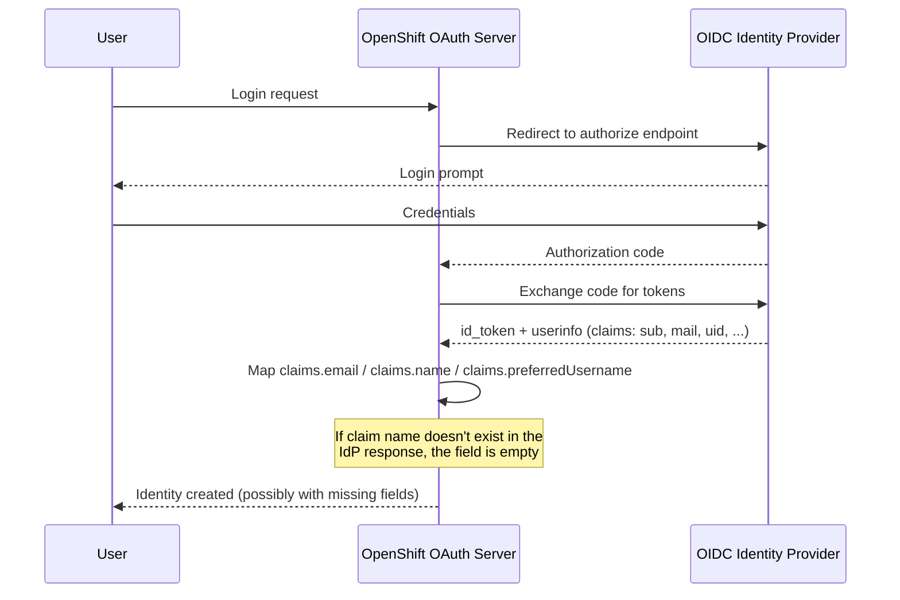

> 💡 **Quick Answer:** OpenShift's OAuth CR maps OIDC claims to identity fields with `claims.email`, `claims.name`, and `claims.preferredUsername` — each is a **list of claim names to try, in order**, not the OIDC-standard claim itself. If your identity provider returns `mail` instead of `email`, or `uid` instead of `preferred_username`, login succeeds at the IdP but OpenShift creates a broken or empty-attribute `Identity`/`User`. Check `oc get oauth cluster -o yaml`, compare it against the IdP's actual `/userinfo` response, and fix the claim list — not the IdP.

## The Problem

Users can authenticate against the external identity provider (Keycloak, Azure AD, Okta, a corporate OIDC broker) — they see the login page, enter credentials, get redirected back — but OpenShift either:

- Rejects the login with `error=access_denied` or a generic 500 on `/oauth/callback`
- Logs the user in with a **blank or wrong email/username** in `oc whoami` and the console
- Creates a new `Identity`/`User` object on every login instead of reusing the existing one (because the mapped username claim doesn't match between logins)

This is a **configuration** problem in the `OAuth` custom resource, not an IdP outage — the OAuth server pods are healthy and the IdP itself works fine for other applications.



## Am I Affected?

```bash
# Check the current OIDC identity provider config
oc get oauth cluster -o json | jq '.spec.identityProviders[] | select(.type=="OpenID")'

# Look specifically at the claims block
oc get oauth cluster -o json | jq '.spec.identityProviders[].openID.claims'
```

Typical broken config:

```yaml
claims:
  email:
    - email              # IdP might actually return "mail"
  name:
    - uid                # IdP might actually return "name" or "displayName"
  preferredUsername:
    - uid
```

### Confirm what the IdP actually returns

The fastest way to stop guessing is to query the IdP's `/userinfo` endpoint directly with a real token:

```bash
# Get an access token via the IdP's token endpoint (adjust for your IdP's flow)
TOKEN=$(curl -s -X POST https://idp.example.com/protocol/openid-connect/token \
  -d "grant_type=password" \
  -d "client_id=openshift-preprod-client" \
  -d "client_secret=${CLIENT_SECRET}" \
  -d "username=${TEST_USER}" \
  -d "password=${TEST_PASSWORD}" | jq -r '.access_token')

# Call userinfo and inspect the actual claim names
curl -s https://idp.example.com/protocol/openid-connect/userinfo \
  -H "Authorization: Bearer ${TOKEN}" | jq .
```

Compare the JSON keys in the response (`sub`, `mail`, `uid`, `preferred_username`, `displayName`, ...) against what the `OAuth` CR's `claims` block is looking for. A mismatch here is the root cause in most cases.

## The Solution

### 1. Fix the claims mapping

```yaml
# oauth-oidc-provider.yaml
apiVersion: config.openshift.io/v1
kind: OAuth
metadata:
  name: cluster
spec:
  identityProviders:
    - name: corporate-oidc
      mappingMethod: claim
      type: OpenID
      openID:
        clientID: openshift-preprod-client
        clientSecret:
          name: openshift-idp-client-secret
        issuer: 'https://idp.example.com'
        extraScopes:
          - email
          - profile
        claims:
          email:
            - mail              # matches what /userinfo actually returns
            - email              # fallback if the IdP is later reconfigured
          name:
            - name
            - displayName
          preferredUsername:
            - preferred_username
            - uid
        ca:
          name: idp-ca-bundle
```

`claims.<field>` is evaluated as an **ordered fallback list** — OpenShift takes the first claim name present in the token/userinfo response. List every plausible name your IdP might send, most-likely-first, instead of hardcoding a single OIDC-standard name.

### 2. Fix the issuer URL

A second common mistake: pointing `issuer` at an environment-specific subdomain that doesn't match what the IdP's discovery document (`/.well-known/openid-configuration`) actually advertises as `issuer`.

```bash
# Confirm the real issuer value
curl -s https://idp.example.com/.well-known/openid-configuration | jq -r '.issuer'
```

If the returned value doesn't **exactly** match `spec.identityProviders[].openID.issuer` (including trailing slash and subdomain), token validation fails even though the login redirect itself works — OpenShift rejects the `id_token` because its `iss` claim doesn't match the configured issuer. Fix the CR to use the exact string from the discovery document, not a guessed per-environment hostname.

### 3. Apply and roll out

```bash
oc apply -f oauth-oidc-provider.yaml

# The OAuth operator restarts the authentication pods to pick up the change
oc get pods -n openshift-authentication -w

# Tail logs during a test login for immediate feedback
oc logs -n openshift-authentication -l app=oauth-openshift -f | grep -iE "claim|issuer|oidc"
```

### 4. Verify the resulting Identity

```bash
# After a test login, inspect what OpenShift actually stored
oc get identity -o json | jq '.items[] | select(.providerName=="corporate-oidc")'

# Confirm the User object has a populated, correct email/username
oc get user <username> -o yaml
```

If `extra.email` is still empty after fixing the claim list, re-check the `extraScopes` — most OIDC providers only include the `email`/`profile` claims in the userinfo response if the corresponding **scope** was requested during authorization.

## Common Issues

| Issue | Cause | Fix |
|-------|-------|-----|
| Login succeeds, `oc whoami` shows a UUID instead of username | `preferredUsername` claim list has no match in the token | Add the IdP's actual username claim (`uid`, `sam_account_name`, etc.) to the list |
| New `Identity` created on every login | Username claim value isn't stable between logins (e.g. mapped to a random `sub`) | Map `preferredUsername` to a stable, human-readable claim, not `sub` |
| `invalid_request: iss claim mismatch` | `issuer` in the CR doesn't exactly match the IdP's discovery document | Copy the `issuer` value verbatim from `/.well-known/openid-configuration` |
| Email is empty even with a correct claim list | Scope not requested | Add `email` to `extraScopes` |
| Works in one environment, fails in another | Per-environment `issuer` hostname configured instead of a shared IdP issuer | Confirm whether your IdP uses one shared issuer across environments and only the `clientID`/`clientSecret` should differ |
| `x509: certificate signed by unknown authority` calling the IdP | Missing or wrong `ca` reference | Set `spec.identityProviders[].openID.ca` to a ConfigMap containing the IdP's CA bundle |

## Best Practices

- **Query `/userinfo` before writing the claims block** — never guess claim names from documentation; enterprise IdPs frequently override defaults (LDAP-backed brokers commonly emit `mail`, `uid`, `sAMAccountName` instead of OIDC-standard names)
- **List fallback claim names** — `claims.email: [mail, email]` survives an IdP reconfiguration better than a single hardcoded name
- **Copy the issuer from discovery, don't construct it** — always verify against `/.well-known/openid-configuration`
- **Keep `clientID`/`clientSecret` per environment, `issuer` shared** — if your IdP realm is shared across preprod/prod, only the client credentials should change between overlays
- **Test with a throwaway account first** — claims mapping mistakes can leave broken `Identity`/`User` objects that need manual cleanup with `oc delete identity` / `oc delete user`

## Key Takeaways

- OpenShift's `claims.email`/`claims.name`/`claims.preferredUsername` are ordered fallback lists, not fixed OIDC field names — they must match what your specific IdP returns
- Query the IdP's `/userinfo` endpoint directly to see the real claim names before editing the `OAuth` CR
- An `issuer` mismatch fails token validation silently after a successful-looking login redirect — always copy it from `/.well-known/openid-configuration`
- A shared IdP issuer across environments with per-environment `clientID` is a common pattern — don't invent environment-specific issuer hostnames
- Missing `extraScopes` (`email`, `profile`) is a frequent cause of empty claims even when the claim name is correct
