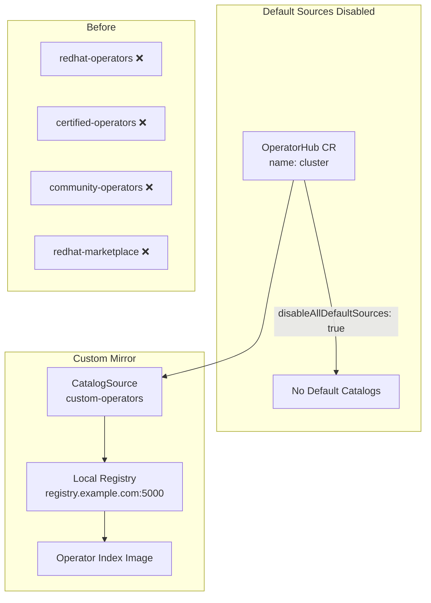

> 💡 **Quick Answer:** Set `spec.disableAllDefaultSources: true` on the `OperatorHub` CR named `cluster` to disable all default catalog sources in an air-gapped OpenShift cluster. For selective disabling, use `spec.sources[]` with `disabled: true` per source.

## The Problem

OpenShift ships with four default OperatorHub catalog sources that require internet access:
- `redhat-operators` — Red Hat certified operators
- `certified-operators` — ISV certified operators
- `community-operators` — Community-maintained operators
- `redhat-marketplace` — Red Hat Marketplace operators

In air-gapped (disconnected) clusters, these sources:
- Generate constant failed pull attempts against registry.redhat.io
- Produce noisy error logs in the `openshift-marketplace` namespace
- Consume cluster resources attempting to sync unreachable catalogs
- Must be replaced with mirrored catalog sources from a local registry

## The Solution

### Disable All Sources at Once

```yaml
apiVersion: config.openshift.io/v1
kind: OperatorHub
metadata:
  name: cluster
spec:
  disableAllDefaultSources: true
```

```bash
oc apply -f - <<EOF
apiVersion: config.openshift.io/v1
kind: OperatorHub
metadata:
  name: cluster
spec:
  disableAllDefaultSources: true
EOF
```

### Disable Individual Sources

```yaml
apiVersion: config.openshift.io/v1
kind: OperatorHub
metadata:
  name: cluster
spec:
  sources:
    - name: redhat-operators
      disabled: true
    - name: certified-operators
      disabled: true
    - name: community-operators
      disabled: true
    - name: redhat-marketplace
      disabled: true
```

### Ansible Automation

```yaml
---
- name: Manage OperatorHub default sources
  hosts: localhost
  vars:
    kubeconfig_path: "{{ lookup('env', 'KUBECONFIG') | default('~/.kube/config') }}"
    disable_default_operatorhub_sources: true
    operatorhub_disable_all: false

  tasks:
    - name: Disable specific default OperatorHub sources
      when: disable_default_operatorhub_sources and not operatorhub_disable_all
      kubernetes.core.k8s:
        kubeconfig: "{{ kubeconfig_path }}"
        state: present
        definition:
          apiVersion: config.openshift.io/v1
          kind: OperatorHub
          metadata:
            name: cluster
          spec:
            sources:
              - { name: redhat-operators, disabled: true }
              - { name: certified-operators, disabled: true }
              - { name: community-operators, disabled: true }
              - { name: redhat-marketplace, disabled: true }

    - name: Disable all default OperatorHub sources at once
      when: disable_default_operatorhub_sources and operatorhub_disable_all
      kubernetes.core.k8s:
        kubeconfig: "{{ kubeconfig_path }}"
        state: present
        definition:
          apiVersion: config.openshift.io/v1
          kind: OperatorHub
          metadata:
            name: cluster
          spec:
            disableAllDefaultSources: true

    - name: Re-enable default OperatorHub sources
      when: not disable_default_operatorhub_sources
      kubernetes.core.k8s:
        kubeconfig: "{{ kubeconfig_path }}"
        state: present
        definition:
          apiVersion: config.openshift.io/v1
          kind: OperatorHub
          metadata:
            name: cluster
          spec:
            disableAllDefaultSources: false
            sources: []
```

### Add Mirrored Catalog Source

After disabling defaults, add your local mirror:

```yaml
apiVersion: operators.coreos.com/v1alpha1
kind: CatalogSource
metadata:
  name: custom-operators
  namespace: openshift-marketplace
spec:
  sourceType: grpc
  image: registry.example.com:5000/olm/redhat-operator-index:v4.15
  displayName: Custom Operator Catalog
  publisher: Internal
  updateStrategy:
    registryPoll:
      interval: 30m
```

### Verify

```bash
# Check OperatorHub status
oc get operatorhub cluster -o yaml

# Verify catalog sources
oc get catalogsource -n openshift-marketplace

# Check marketplace pods (should only show custom sources)
oc get pods -n openshift-marketplace

# Verify no failed pulls
oc get events -n openshift-marketplace --field-selector reason=Failed
```



## Common Issues

**Catalog pods still running after disabling**

OLM may take a few minutes to reconcile. Force deletion:
```bash
oc delete pods -n openshift-marketplace -l olm.catalogSource=redhat-operators
```

**`disableAllDefaultSources` vs `sources[]`**

- `disableAllDefaultSources: true` — blanket disable, simplest for fully air-gapped
- `sources[]` with `disabled: true` — selective, allows keeping some defaults enabled
- Both can't be used simultaneously — `disableAllDefaultSources` takes precedence

**Custom CatalogSource image pull fails**

Ensure the mirrored index image is accessible and the pull secret includes credentials for your local registry:
```bash
oc get secret pull-secret -n openshift-config -o jsonpath='{.data.\.dockerconfigjson}' | base64 -d | jq
```

**Ansible `kubernetes.core.k8s` module not found**

Install the collection:
```bash
ansible-galaxy collection install kubernetes.core
pip install kubernetes
```

## Best Practices

- **Use `disableAllDefaultSources: true`** for fully air-gapped clusters — cleaner than listing each source
- **Mirror catalogs before disabling** — ensure operators are available from your local registry
- **Use `oc-mirror`** CLI to mirror operator catalogs to your local registry
- **Set `updateStrategy.registryPoll.interval`** to control how often OLM checks for catalog updates
- **Automate with Ansible** for consistent Day 2 operations across multiple clusters
- **Verify with `oc get catalogsource`** after changes — ensure only intended sources are active

## Key Takeaways

- OpenShift's `OperatorHub` CR (named `cluster`) controls default catalog sources
- `disableAllDefaultSources: true` is the fastest way to silence internet-dependent catalogs
- `spec.sources[]` allows selective disabling of individual catalogs
- Air-gapped clusters must replace defaults with mirrored CatalogSource CRs
- The `kubernetes.core.k8s` Ansible module provides declarative, idempotent management
- Always add your mirrored catalog source before disabling defaults to avoid operator gaps
