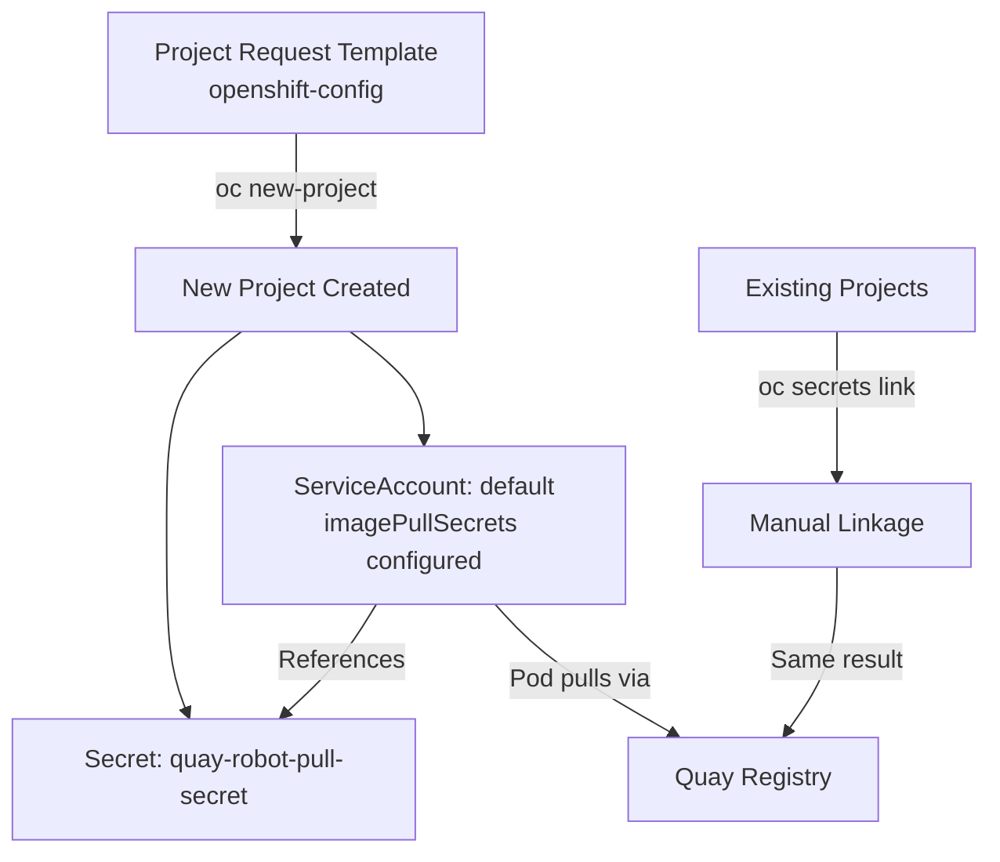

> 💡 **Quick Answer:** Create a Template with a ServiceAccount containing `imagePullSecrets`, apply it to `openshift-config`, then patch `project.config.openshift.io/cluster` to use it as the default project template.

## The Problem

In OpenShift, when developers create new projects, the default ServiceAccount has no `imagePullSecrets` for private registries. Teams must manually link secrets in every new namespace, which is:

- **Error-prone** — developers forget and get `ImagePullBackOff` errors
- **Inconsistent** — some namespaces have secrets, others don't
- **Not scalable** — manual steps don't work with hundreds of projects

You need every new project to automatically include pull secrets for your private Quay registry.

> **Note:** If you want *all* nodes and namespaces to pull immediately (including existing ones), use the [cluster-wide pull secret](/recipes/security/openshift-cluster-wide-pull-secret/) approach instead. Project Request Templates only affect **new** projects.

## The Solution

### Step 1: Export the Default Project Template

Start with OpenShift's default template as a base:

```bash
oc adm create-bootstrap-project-template -o yaml > project-template.yaml
```

This generates a Template with the standard objects: Project, RoleBindings, and ServiceAccounts.

### Step 2: Add imagePullSecrets to the Template

Edit `project-template.yaml` to add your pull secret to the default ServiceAccount:

```yaml
apiVersion: template.openshift.io/v1
kind: Template
metadata:
  name: project-request
  namespace: openshift-config
objects:
  - apiVersion: project.openshift.io/v1
    kind: Project
    metadata:
      annotations:
        openshift.io/description: ${PROJECT_DESCRIPTION}
        openshift.io/display-name: ${PROJECT_DISPLAYNAME}
        openshift.io/requester: ${PROJECT_REQUESTING_USER}
      name: ${PROJECT_NAME}
  - apiVersion: rbac.authorization.k8s.io/v1
    kind: RoleBinding
    metadata:
      name: admin
      namespace: ${PROJECT_NAME}
    roleRef:
      apiGroup: rbac.authorization.k8s.io
      kind: ClusterRole
      name: admin
    subjects:
      - apiGroup: rbac.authorization.k8s.io
        kind: User
        name: ${PROJECT_ADMIN_USER}
  # --- Pull secret injected into every new project ---
  - apiVersion: v1
    kind: Secret
    metadata:
      name: quay-robot-pull-secret
      namespace: ${PROJECT_NAME}
    type: kubernetes.io/dockerconfigjson
    data:
      .dockerconfigjson: ${PULL_SECRET_DOCKERCONFIGJSON}
  # --- Default SA with imagePullSecrets ---
  - apiVersion: v1
    kind: ServiceAccount
    metadata:
      name: default
      namespace: ${PROJECT_NAME}
    imagePullSecrets:
      - name: quay-robot-pull-secret
parameters:
  - name: PROJECT_NAME
    required: true
  - name: PROJECT_DISPLAYNAME
  - name: PROJECT_DESCRIPTION
  - name: PROJECT_ADMIN_USER
    required: true
  - name: PROJECT_REQUESTING_USER
    required: true
  - name: PULL_SECRET_DOCKERCONFIGJSON
    description: "Base64-encoded .dockerconfigjson for the pull secret"
    required: true
```

### Step 3: Apply the Template

```bash
oc apply -f project-template.yaml -n openshift-config
```

### Step 4: Configure OpenShift to Use the Template

```bash
oc patch project.config.openshift.io/cluster --type=merge \
  -p '{"spec":{"projectRequestTemplate":{"name":"project-request"}}}'
```

### Step 5: Verify with a New Project

```bash
# Create a test project
oc new-project test-pull-template

# Check the default SA has imagePullSecrets
oc get sa default -n test-pull-template -o yaml | grep -A2 imagePullSecrets

# Check the secret exists
oc get secret quay-robot-pull-secret -n test-pull-template

# Clean up
oc delete project test-pull-template
```

### Fix Existing Namespaces

The template only applies to new projects. For existing namespaces, link the secret manually:

```bash
# Link pull secret in an existing namespace
oc secrets link default quay-robot-pull-secret \
  --for=pull -n <existing-namespace>
```

Or automate for all namespaces:

```bash
# Apply to all existing non-system namespaces
for ns in $(oc get namespaces -o jsonpath='{.items[*].metadata.name}' \
  | tr ' ' '\n' | grep -v '^openshift\|^kube-\|^default$'); do

  # Create the secret if it doesn't exist
  oc get secret quay-robot-pull-secret -n "$ns" &>/dev/null || \
    oc create secret docker-registry quay-robot-pull-secret \
      --docker-server=quay.internal.example.com \
      --docker-username="myorg+k8s_prod_puller" \
      --docker-password="${ROBOT_TOKEN}" \
      -n "$ns"

  # Link to default SA
  oc secrets link default quay-robot-pull-secret --for=pull -n "$ns"
  echo "✅ Configured: $ns"
done
```



## Common Issues

### Template Not Taking Effect

Verify the cluster config points to your template:

```bash
oc get project.config.openshift.io/cluster -o yaml | grep -A3 projectRequestTemplate
```

### ServiceAccount Already Exists Error

OpenShift auto-creates the `default` SA. Your template replaces it — if you get conflicts, ensure your template uses the same SA name (`default`).

### Secret Not Available in New Projects

If using a parameter for the secret data, ensure the `PULL_SECRET_DOCKERCONFIGJSON` parameter is populated. Alternatively, hardcode the secret data in the template (less flexible but simpler).

## Best Practices

- **Use cluster-wide pull secret for immediate, universal coverage** — Project Request Templates only affect new projects
- **Combine both approaches** — cluster-wide for nodes, template for namespace-level audit trail
- **Export the default template first** — don't write from scratch; modify the generated base
- **Test with a throwaway project** before rolling out to production
- **Automate existing namespace backfill** with the loop script above

## Key Takeaways

- `oc patch template serviceaccount/default` does not work — use a proper Project Request Template instead
- The template only affects new projects; use `oc secrets link` for existing namespaces
- For simplest cluster-wide coverage, the `openshift-config/pull-secret` approach is preferred
- Combine both methods: cluster-wide pull secret for nodes + template for namespace-level visibility
