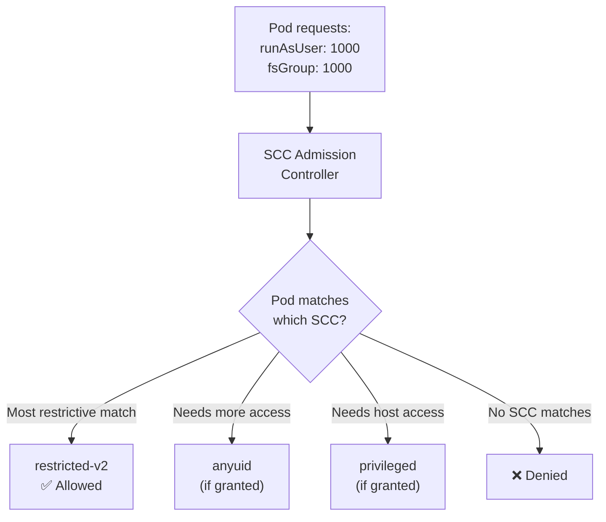

> 💡 **Quick Answer:** Security Context Constraints (SCC) are OpenShift's mechanism to control what pods can do — run as root, use host network, mount volumes, escalate privileges. Default SCCs range from `restricted-v2` (most secure) to `privileged` (full access). Assign SCCs via `oc adm policy add-scc-to-user <scc> -z <service-account>`. Pods automatically use the most restrictive SCC that satisfies their requirements.

## The Problem

On vanilla Kubernetes, Pod Security Admission (PSA) provides namespace-level enforcement with three profiles. OpenShift goes further with SCCs — fine-grained, per-pod security policies that control UID ranges, SELinux contexts, capabilities, volumes, and host access. When deploying workloads that need elevated privileges (databases, monitoring agents, GPU operators), you must grant the right SCC without over-permitting.



## Built-in SCCs (Least to Most Permissive)

| SCC | Run As | Volumes | Capabilities | Host Network | Use Case |
|-----|--------|---------|-------------|--------------|----------|
| `restricted-v2` | MustRunAsRange (random UID) | configMap, secret, PVC, emptyDir | Drop ALL | No | **Default for all pods** |
| `nonroot-v2` | MustRunAsNonRoot | Same as restricted | Drop ALL | No | Apps that set their own non-root UID |
| `hostmount-anyuid` | RunAsAny | hostPath + all | Drop ALL | No | Monitoring agents needing host mounts |
| `anyuid` | RunAsAny | Same as restricted | Drop ALL | No | **Databases, legacy apps needing root** |
| `hostnetwork-v2` | MustRunAsRange | Same as restricted | Drop ALL | Yes | Ingress controllers, CNI plugins |
| `node-exporter` | RunAsAny | hostPath + all | Drop ALL | Yes | Prometheus node exporter |
| `hostaccess` | RunAsAny | hostPath + all | Drop ALL | Yes | Host-level monitoring |
| `privileged` | RunAsAny | ALL (including hostPath) | ALL | Yes | **GPU operators, CSI drivers, system daemons** |

## The Solution

### Check Current SCCs

```bash
# List all SCCs
oc get scc
# NAME                  PRIV   CAPS  SELINUX    RUNASUSER        FSGROUP    SUPGROUP   PRIORITY
# anyuid                false  []    MustRunAs  RunAsAny         RunAsAny   RunAsAny   10
# hostaccess            false  []    MustRunAs  RunAsAny         RunAsAny   RunAsAny   <none>
# hostmount-anyuid      false  []    MustRunAs  RunAsAny         RunAsAny   RunAsAny   <none>
# hostnetwork           false  []    MustRunAs  MustRunAsRange   MustRunAs  MustRunAs  <none>
# hostnetwork-v2        false  []    MustRunAs  MustRunAsRange   MustRunAs  MustRunAs  <none>
# nonroot               false  []    MustRunAs  MustRunAsNonRoot RunAsAny   RunAsAny   <none>
# nonroot-v2            false  []    MustRunAs  MustRunAsNonRoot RunAsAny   RunAsAny   <none>
# privileged            true   [*]   RunAsAny   RunAsAny         RunAsAny   RunAsAny   <none>
# restricted            false  []    MustRunAs  MustRunAsRange   MustRunAs  MustRunAs  <none>
# restricted-v2         false  []    MustRunAs  MustRunAsRange   MustRunAs  MustRunAs  <none>

# See which SCC a pod is using
oc get pod <pod-name> -o jsonpath='{.metadata.annotations.openshift\.io/scc}'
# restricted-v2

# Describe an SCC
oc describe scc anyuid

# Check who can use an SCC
oc adm policy who-can use scc anyuid
```

### Grant SCC to ServiceAccount

```bash
# Grant anyuid to a service account (most common operation)
oc adm policy add-scc-to-user anyuid -z myapp-sa -n my-namespace

# Grant privileged (use sparingly!)
oc adm policy add-scc-to-user privileged -z gpu-operator-sa -n nvidia-gpu-operator

# Grant to a specific user
oc adm policy add-scc-to-user anyuid user1

# Grant to a group
oc adm policy add-scc-to-group anyuid system:serviceaccounts:my-namespace

# Remove SCC grant
oc adm policy remove-scc-from-user anyuid -z myapp-sa -n my-namespace

# Check which SCCs a service account can use
oc adm policy who-can use scc --list -z myapp-sa -n my-namespace
```

### Using SCCs in Deployments

```yaml
# Step 1: Create a ServiceAccount
apiVersion: v1
kind: ServiceAccount
metadata:
  name: mydb-sa
  namespace: my-database
---
# Step 2: Grant the SCC (via CLI or RoleBinding)
# oc adm policy add-scc-to-user anyuid -z mydb-sa -n my-database
#
# Or declaratively via ClusterRoleBinding:
apiVersion: rbac.authorization.k8s.io/v1
kind: ClusterRoleBinding
metadata:
  name: mydb-anyuid
roleRef:
  apiGroup: rbac.authorization.k8s.io
  kind: ClusterRole
  name: system:openshift:scc:anyuid
subjects:
  - kind: ServiceAccount
    name: mydb-sa
    namespace: my-database
---
# Step 3: Reference SA in Deployment
apiVersion: apps/v1
kind: Deployment
metadata:
  name: mydb
  namespace: my-database
spec:
  template:
    spec:
      serviceAccountName: mydb-sa     # Uses the SA with anyuid
      containers:
        - name: db
          image: registry.example.com/mydb:latest
          securityContext:
            runAsUser: 999             # anyuid allows specifying UID
```

### Create Custom SCC

```yaml
# Custom SCC — allows specific capabilities without full privileged
apiVersion: security.openshift.io/v1
kind: SecurityContextConstraints
metadata:
  name: gpu-workload
allowPrivilegedContainer: false
allowHostNetwork: false
allowHostPorts: false
allowHostPID: false
allowHostIPC: true                     # Needed for NCCL shared memory
allowedCapabilities:
  - SYS_PTRACE                         # For debugging
  - IPC_LOCK                           # For RDMA memory pinning
  - SYS_RESOURCE                       # For ulimit settings
requiredDropCapabilities:
  - KILL
  - MKNOD
  - SYS_CHROOT
runAsUser:
  type: RunAsAny
seLinuxContext:
  type: MustRunAs
fsGroup:
  type: RunAsAny
supplementalGroups:
  type: RunAsAny
volumes:
  - configMap
  - downwardAPI
  - emptyDir
  - persistentVolumeClaim
  - projected
  - secret
  - hostPath                           # For GPU device access
allowHostDirVolumePlugin: true
readOnlyRootFilesystem: false
users: []
groups: []
priority: 10                           # Higher = preferred when multiple match
```

```bash
# Apply and grant
oc apply -f gpu-workload-scc.yaml
oc adm policy add-scc-to-user gpu-workload -z training-sa -n ai-workloads
```

### SCC Priority and Selection Logic

```bash
# When a pod is admitted, OpenShift:
# 1. Finds all SCCs the pod's SA can use
# 2. Sorts by priority (highest first), then restrictiveness
# 3. Tries each SCC — first match wins
# 4. If none match → pod rejected

# Check which SCC would be selected for a pod
oc adm policy scc-subject-review -z myapp-sa -n my-namespace -f pod.yaml

# Debug: why is my pod using the wrong SCC?
oc get pod <pod> -o jsonpath='{.metadata.annotations.openshift\.io/scc}'
```

### Common SCC Assignments

```bash
# Databases (need specific UID)
oc adm policy add-scc-to-user anyuid -z postgresql-sa -n databases
oc adm policy add-scc-to-user anyuid -z mariadb-sa -n databases
oc adm policy add-scc-to-user anyuid -z mongodb-sa -n databases

# Monitoring (need host access)
oc adm policy add-scc-to-user privileged -z prometheus-node-exporter -n monitoring
oc adm policy add-scc-to-user hostnetwork-v2 -z ingress-nginx -n ingress

# GPU/AI workloads
oc adm policy add-scc-to-user privileged -z nvidia-gpu-operator -n nvidia-gpu-operator
oc adm policy add-scc-to-user privileged -z nvidia-driver-daemonset -n nvidia-gpu-operator

# Storage (CSI drivers)
oc adm policy add-scc-to-user privileged -z csi-driver-sa -n storage
```

## Common Issues

| Issue | Cause | Fix |
|-------|-------|-----|
| `unable to validate against any SCC` | No SCC matches pod requirements | Grant appropriate SCC to ServiceAccount |
| Pod running as wrong UID | `restricted-v2` assigns random UID | Grant `anyuid` SCC if specific UID needed |
| `permission denied` on volume mount | SCC doesn't allow volume type | Grant SCC with `hostPath` or appropriate volume |
| Container can't bind port < 1024 | `restricted-v2` drops `NET_BIND_SERVICE` | Grant `anyuid` or add capability via custom SCC |
| GPU operator pods `CrashLoopBackOff` | Missing `privileged` SCC | Grant `privileged` to operator ServiceAccount |
| SELinux denial | SCC SELinux context mismatch | Check `seLinuxContext` in SCC, use `MustRunAs` |
| Pod gets `privileged` unexpectedly | SA has multiple SCC grants | Check priority, remove unnecessary SCC grants |

## Best Practices

- **Use `restricted-v2` by default** — only escalate when needed
- **Grant to ServiceAccounts, not users** — declarative and auditable
- **Create custom SCCs** for specific needs — don't grant `privileged` when `anyuid` + one capability suffices
- **Use `priority` field** — ensures the right SCC is selected when multiple match
- **Audit SCC usage** — `oc get pods -A -o custom-columns='NAME:.metadata.name,SCC:.metadata.annotations.openshift\.io/scc'`
- **Document why each SCC grant exists** — add annotations to the RoleBinding
- **Never grant `privileged` to application workloads** — only for infrastructure (operators, CSI, CNI)
- **Use `oc adm policy scc-subject-review`** to test before deploying

## Key Takeaways

- SCCs are OpenShift's fine-grained pod security mechanism (more powerful than PSA)
- Default is `restricted-v2` — random UID, no root, no host access, minimal capabilities
- `anyuid` is the most commonly needed escalation — allows specific UID (databases, legacy apps)
- `privileged` is for infrastructure only — GPU operators, CSI drivers, node-exporter
- Grant via `oc adm policy add-scc-to-user <scc> -z <sa> -n <ns>`
- Pods automatically get the most restrictive matching SCC
- Create custom SCCs for specific capability needs instead of granting `privileged`
