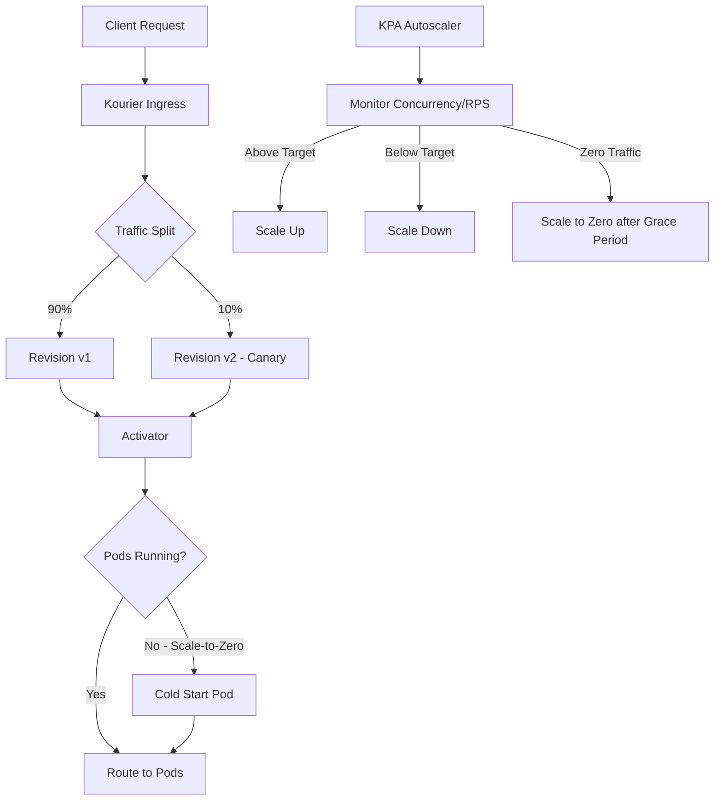

> 💡 **Quick Answer:** Install the OpenShift Serverless Operator via OLM, create a `KnativeServing` CR in `knative-serving` namespace, then deploy workloads as Knative Services that auto-scale (including to zero) based on concurrency or RPS targets.

## The Problem

Traditional Kubernetes Deployments run pods 24/7 regardless of traffic. For bursty workloads — webhooks, event processors, inference endpoints, batch APIs — you pay for idle capacity. You need automatic scale-to-zero when idle and rapid scale-up when traffic arrives, plus traffic splitting for canary rollouts.

## The Solution

### Install the Serverless Operator

```yaml
# 1. Create the namespace
apiVersion: v1
kind: Namespace
metadata:
  name: openshift-serverless
---
# 2. Create the OperatorGroup
apiVersion: operators.coreos.com/v1
kind: OperatorGroup
metadata:
  name: serverless-operators
  namespace: openshift-serverless
spec: {}
---
# 3. Subscribe to the operator
apiVersion: operators.coreos.com/v1alpha1
kind: Subscription
metadata:
  name: serverless-operator
  namespace: openshift-serverless
spec:
  channel: stable
  name: serverless-operator
  source: redhat-operators
  sourceNamespace: openshift-marketplace
  installPlanApproval: Automatic
```

### Create KnativeServing

```yaml
apiVersion: operator.knative.dev/v1beta1
kind: KnativeServing
metadata:
  name: knative-serving
  namespace: knative-serving
spec:
  # High availability
  high-availability:
    replicas: 2
  # Ingress configuration
  ingress:
    kourier:
      enabled: true
      service-type: ClusterIP
  # Controller custom config
  config:
    # Autoscaler defaults
    autoscaler:
      container-concurrency-target-default: "100"
      enable-scale-to-zero: "true"
      scale-to-zero-grace-period: "30s"
      scale-to-zero-pod-retention-period: "0s"
      stable-window: "60s"
      panic-window-percentage: "10.0"
      panic-threshold-percentage: "200.0"
      max-scale-up-rate: "1000.0"
      max-scale-down-rate: "2.0"
    # Default resource limits
    defaults:
      revision-timeout-seconds: "300"
      max-revision-timeout-seconds: "600"
      container-concurrency: "0"
    # Domain configuration
    domain:
      example.com: ""
    # Network configuration
    network:
      ingress-class: kourier.ingress.networking.knative.dev
      domain-template: "{{.Name}}.{{.Namespace}}.{{.Domain}}"
```

### Deploy a Knative Service

```yaml
apiVersion: serving.knative.dev/v1
kind: Service
metadata:
  name: my-app
  namespace: my-project
spec:
  template:
    metadata:
      annotations:
        # Autoscaling configuration
        autoscaling.knative.dev/class: kpa.autoscaling.knative.dev
        autoscaling.knative.dev/metric: concurrency
        autoscaling.knative.dev/target: "50"
        autoscaling.knative.dev/min-scale: "0"
        autoscaling.knative.dev/max-scale: "10"
        autoscaling.knative.dev/scale-down-delay: "15s"
        autoscaling.knative.dev/window: "60s"
    spec:
      containerConcurrency: 100
      timeoutSeconds: 300
      containers:
        - image: quay.io/myorg/my-app:v1
          ports:
            - containerPort: 8080
          resources:
            requests:
              cpu: 100m
              memory: 128Mi
            limits:
              cpu: "1"
              memory: 512Mi
          readinessProbe:
            httpGet:
              path: /health
              port: 8080
            initialDelaySeconds: 5
            periodSeconds: 10
          env:
            - name: TARGET
              value: "World"
```

### Traffic Splitting (Canary/Blue-Green)

```yaml
apiVersion: serving.knative.dev/v1
kind: Service
metadata:
  name: my-app
  namespace: my-project
spec:
  template:
    metadata:
      name: my-app-v2
    spec:
      containers:
        - image: quay.io/myorg/my-app:v2
          ports:
            - containerPort: 8080
  traffic:
    # 90% to stable revision
    - revisionName: my-app-v1
      percent: 90
    # 10% canary to new revision
    - revisionName: my-app-v2
      percent: 10
    # Tag for direct access: my-app-v2-my-project.example.com
    - revisionName: my-app-v2
      tag: canary
      percent: 0
```

### GPU Inference with Scale-to-Zero

```yaml
apiVersion: serving.knative.dev/v1
kind: Service
metadata:
  name: llm-inference
  namespace: ai-serving
spec:
  template:
    metadata:
      annotations:
        autoscaling.knative.dev/class: kpa.autoscaling.knative.dev
        autoscaling.knative.dev/metric: concurrency
        autoscaling.knative.dev/target: "5"
        autoscaling.knative.dev/min-scale: "0"
        autoscaling.knative.dev/max-scale: "4"
        # Longer scale-down delay for GPU (model unload is expensive)
        autoscaling.knative.dev/scale-down-delay: "300s"
        autoscaling.knative.dev/scale-to-zero-pod-retention-period: "600s"
    spec:
      containerConcurrency: 10
      timeoutSeconds: 600
      containers:
        - image: nvcr.io/nvidia/tritonserver:24.12-trtllm-python-py3
          ports:
            - containerPort: 8000
              protocol: TCP
          resources:
            requests:
              nvidia.com/gpu: "1"
            limits:
              nvidia.com/gpu: "1"
              memory: 32Gi
          volumeMounts:
            - name: model-store
              mountPath: /models
      volumes:
        - name: model-store
          persistentVolumeClaim:
            claimName: model-store-pvc
```

### HPA-Class Autoscaling (CPU/Memory Metrics)

```yaml
apiVersion: serving.knative.dev/v1
kind: Service
metadata:
  name: cpu-intensive-app
  namespace: my-project
spec:
  template:
    metadata:
      annotations:
        # Use HPA instead of KPA for CPU-based scaling
        autoscaling.knative.dev/class: hpa.autoscaling.knative.dev
        autoscaling.knative.dev/metric: cpu
        autoscaling.knative.dev/target: "70"
        autoscaling.knative.dev/min-scale: "1"
        autoscaling.knative.dev/max-scale: "20"
    spec:
      containers:
        - image: quay.io/myorg/cpu-app:v1
          resources:
            requests:
              cpu: 500m
              memory: 256Mi
```

### Verify the Deployment

```bash
# Check operator status
oc get csv -n openshift-serverless

# Check KnativeServing
oc get knativeserving -n knative-serving
oc get pods -n knative-serving

# Check Knative Services
oc get ksvc -n my-project

# Get the service URL
oc get ksvc my-app -n my-project -o jsonpath='{.status.url}'

# Check revisions and traffic split
oc get revisions -n my-project
oc get routes.serving.knative.dev -n my-project -o yaml

# Watch autoscaling in action
oc get pods -n my-project -w

# Test the service
curl -H "Host: my-app.my-project.example.com" \
  http://$(oc get svc kourier -n knative-serving-ingress \
  -o jsonpath='{.status.loadBalancer.ingress[0].ip}')
```

### Private Services (Cluster-Local)

```yaml
apiVersion: serving.knative.dev/v1
kind: Service
metadata:
  name: internal-api
  namespace: my-project
  labels:
    # Makes the service cluster-local only (no external route)
    networking.knative.dev/visibility: cluster-local
spec:
  template:
    spec:
      containers:
        - image: quay.io/myorg/internal-api:v1
          ports:
            - containerPort: 8080
# Access via: http://internal-api.my-project.svc.cluster.local
```



## Common Issues

- **Service stuck at 0 replicas** — check activator pods in `knative-serving` are running; verify `enable-scale-to-zero: "true"` in autoscaler config
- **Cold start too slow for GPU** — increase `scale-to-zero-pod-retention-period` to keep warm pods longer; set `min-scale: "1"` for latency-sensitive endpoints
- **502 errors during scale-up** — increase `timeoutSeconds` and ensure readiness probes pass before traffic is routed; check `scale-to-zero-grace-period`
- **Traffic split not working** — revision names must be explicit and match; check `oc get revisions` for actual names
- **KPA vs HPA confusion** — KPA supports concurrency/rps + scale-to-zero; HPA supports cpu/memory but NO scale-to-zero
- **Domain not resolving** — configure `config.domain` in KnativeServing to match your cluster's wildcard DNS
- **Kourier vs OpenShift Routes** — default ingress is Kourier; for OpenShift Routes set `ingress.istio.enabled: false` and use Kourier

## Best Practices

- Use KPA (default) with concurrency metric for request-driven workloads — it responds faster than HPA
- Set `min-scale: "1"` for production APIs where cold start latency is unacceptable
- Use longer `scale-down-delay` for GPU workloads (300s+) — model loading is expensive
- Tag revisions for direct testing before shifting traffic: `tag: canary` creates a dedicated URL
- Set `containerConcurrency` to match your app's actual thread/worker count — prevents overloading
- Use `cluster-local` visibility for internal microservices that don't need external routes
- Monitor with `oc get ksvc` — the `READY` column and `LATESTREADY` revision tell you deployment health

## Key Takeaways

- OpenShift Serverless = Knative Serving managed by an OLM operator
- `KnativeServing` CR configures the control plane: autoscaler defaults, ingress (Kourier), domain, HA
- Knative Services auto-scale on concurrency or RPS, including scale-to-zero
- Traffic splitting enables canary rollouts with percentage-based routing between revisions
- KPA handles scale-to-zero; HPA handles CPU/memory but always keeps ≥1 pod
- For GPU inference: use longer scale-down delays and pod retention to avoid expensive cold starts
