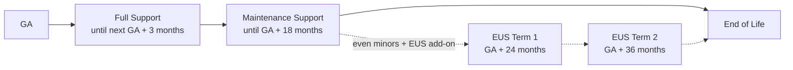
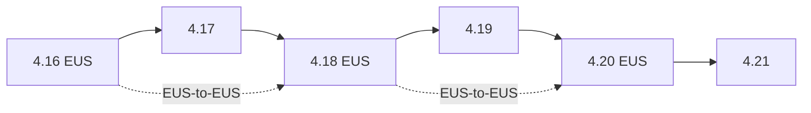

> 💡 **Quick Answer:** OpenShift ships a new 4.x minor roughly every 4 months. Each minor gets **Full Support** until 3 months after the next minor's GA, then **Maintenance Support** until **18 months after GA** (its end of life). Even minors (4.12, 4.14, 4.16, 4.18, 4.20) are **EUS** releases: EUS Term 1 extends support to 24 months, Term 2 to 36 months (4.12 and 4.14 also got a Term 3). Each OCP minor maps to one Kubernetes minor: **OCP 4.x = Kubernetes 1.(x+13)**, so 4.18 = 1.31, 4.20 = 1.33, 4.22 = 1.35.

## OpenShift Version Matrix: Kubernetes Version, GA and EOL

| OCP | Kubernetes | GA | Full Support Ends | Maintenance Ends (EOL) | EUS Term 1 Ends | EUS Term 2 Ends |
|:---:|:---:|---|---|---|---|---|
| **4.22** (EUS) | 1.35 | Jun 9, 2026 | Dec 31, 2026 | Dec 31, 2027 | Jun 30, 2028 | Jun 30, 2029 |
| **4.21** | 1.34 | Feb 3, 2026 | Sep 9, 2026 | Aug 3, 2027 | — | — |
| **4.20** (EUS) | 1.33 | Oct 21, 2025 | May 3, 2026 | Apr 21, 2027 | Oct 21, 2027 | Oct 21, 2028 |
| **4.19** | 1.32 | Jun 17, 2025 | Jan 21, 2026 | Dec 17, 2026 | — | — |
| **4.18** (EUS) | 1.31 | Feb 25, 2025 | Sep 17, 2025 | Aug 25, 2026 | Feb 25, 2027 | Feb 25, 2028 |
| **4.17** | 1.30 | Oct 1, 2024 | May 25, 2025 | Apr 1, 2026 | — | — |
| **4.16** (EUS) | 1.29 | Jun 27, 2024 | Jan 1, 2025 | Dec 27, 2025 | Jun 27, 2026 | Jun 27, 2027 |
| **4.15** | 1.28 | Feb 27, 2024 | Sep 27, 2024 | Aug 27, 2025 | — | — |
| **4.14** (EUS) | 1.27 | Oct 31, 2023 | May 27, 2024 | May 1, 2025 | Oct 31, 2025 | Oct 31, 2026 (Term 3: Oct 31, 2027) |
| **4.13** | 1.26 | May 17, 2023 | Jan 31, 2024 | Nov 17, 2024 | — | — |
| **4.12** (EUS) | 1.25 | Jan 17, 2023 | Aug 17, 2023 | Jul 17, 2024 | Jan 17, 2025 | Jan 17, 2026 (Term 3: Jan 17, 2027) |

> **Always confirm** against the [Red Hat OpenShift Life Cycle Policy](https://access.redhat.com/support/policy/updates/openshift/) — dates can shift. Dates above are from Red Hat's product life cycle data (checked September 2026); 4.22 does not follow the GA + 18 months rule exactly. EUS terms require an EUS entitlement; without it, a release's EOL is the "Maintenance Ends" date.

**How to read it (as of September 2026):**

- **Current, fully supported:** 4.22 (GA Jun 9, 2026) — also the newest EUS release and the target for new production clusters.
- **Maintenance only:** 4.21 (Full Support ended Sep 9, 2026; EOL Aug 3, 2027), 4.20 (EOL Apr 21, 2027 without EUS), 4.19 (EOL Dec 17, 2026).
- **Still supported only with EUS:** 4.18 (Term 1 to Feb 2027), 4.16 (Term 2 to Jun 2027), 4.14 (Term 2 to Oct 2026, Term 3 to Oct 2027), 4.12 (Term 3 to Jan 2027).
- **4.17** reached EOL Apr 1, 2026; **4.18** standard maintenance ended Aug 25, 2026.

## OpenShift Release Cycle and Support Phases



| Phase | Duration | What you get |
|---|---|---|
| **Full Support** | GA → next minor GA + 3 months (~6–7 months) | Critical/important security fixes, urgent and high-priority bug fixes, new z-streams, enhancements |
| **Maintenance Support** | Until 18 months after GA | Critical security fixes and selected high-impact bug fixes; no new features |
| **EUS Term 1** (even minors) | Until 24 months after GA | Critical security fixes and backported bug fixes; enables EUS-to-EUS upgrades |
| **EUS Term 2** (even minors) | Until 36 months after GA | Further 12 months of stability-focused updates (separate add-on) |
| **End of Life** | — | No patches or fixes; self-support only |

Pattern:

- **Even minors** (4.12, 4.14, 4.16, 4.18, 4.20, 4.22) = EUS-eligible
- **Odd minors** (4.13, 4.15, 4.17, 4.19, 4.21) = standard 18-month lifecycle only
- **Kubernetes mapping:** OCP 4.x ships Kubernetes 1.(x+13) — check it on a live cluster with `oc version`

## Upgrade Paths



- **Minor upgrades are sequential:** 4.18 → 4.19 → 4.20. You cannot skip a minor.
- **EUS-to-EUS** (e.g. 4.16 → 4.18, 4.18 → 4.20): the control plane still passes through the odd minor, but worker MachineConfigPools stay paused, so workers reboot only once.
- **z-stream:** any 4.20.z → any higher 4.20.z offered in your channel.
- Update to the latest z-stream of your current minor before moving to the next minor.

```bash
# Current version, channel and Kubernetes version
oc get clusterversion
oc get clusterversion version -o jsonpath='{.spec.channel}{"\n"}'   # e.g. eus-4.18
oc version            # Server Version: 4.18.x / Kubernetes Version: v1.31.x

# Available (and not-recommended) update targets
oc adm upgrade
oc adm upgrade --include-not-recommended
```

### EUS-to-EUS Upgrade (4.18 → 4.20)

```bash
# 1. Pause worker pools so they only reboot once (control plane is never paused)
oc patch mcp/worker --type merge -p '{"spec":{"paused":true}}'

# 2. Switch to the target EUS channel and update to the intermediate minor
oc adm upgrade channel eus-4.20
oc adm upgrade --to-latest          # control plane -> 4.19.z
oc get clusterversion -w

# 3. After 4.19 completes (acknowledge any admin-ack gates), update to 4.20
oc adm upgrade --to-latest          # control plane -> 4.20.z

# 4. Unpause workers; they roll straight to 4.20
oc patch mcp/worker --type merge -p '{"spec":{"paused":false}}'
oc get mcp -w
oc get co
```

### Pre-Upgrade Checklist

- [ ] Current version EOL checked against the matrix above; plan ≥ 3 months before EOL
- [ ] All ClusterOperators healthy: `oc get co`
- [ ] No degraded MachineConfigPools: `oc get mcp`
- [ ] Removed-API usage reviewed: `oc get apirequestcounts`
- [ ] Installed operators compatible with the target version: `oc get csv -A`
- [ ] etcd backup taken: `oc debug node/<control-plane> -- chroot /host /usr/local/bin/cluster-backup.sh /home/core/backup`
- [ ] PodDisruptionBudgets won't block node drains: `oc get pdb -A`
- [ ] Kernel-dependent drivers (GPU, MOFED/DOCA) pre-built for the target release — see [DOCA driver with DTK](/recipes/configuration/doca-driver-openshift-dtk/)

Timeline: start planning ~6 months before EOL, test in staging ~3 months before, upgrade production 1–2 months before.

## Common Issues

| Issue | Cause | Fix |
|---|---|---|
| "Version not found in channel" | Wrong channel (stable / fast / eus / candidate) | `oc adm upgrade channel stable-4.20` or `eus-4.20` |
| Upgrade blocked on removed APIs | Workloads still call APIs removed in the target Kubernetes | Find callers with `oc get apirequestcounts`, migrate, then admin-ack |
| Upgrade stuck ~80% | MCP rollout not completing | `oc get mcp`; check degraded nodes and PDBs blocking drains |
| No EUS-to-EUS path offered | Source or target isn't an even minor, or not on latest z-stream | Update to latest z of current EUS; confirm EUS entitlement |
| GPU/RDMA drivers broken after upgrade | New RHCOS kernel | Pre-build drivers with the target release's Driver Toolkit image |
| Cluster already EOL | Missed upgrade window | Upgrade sequentially through each minor; contact Red Hat support |

## Best Practices

1. **Run EUS minors in production** (4.18, 4.20) — longer support, fewer disruptive upgrades
2. **Use EUS-to-EUS** with paused worker MCPs to halve worker reboots
3. **Apply z-streams regularly** — CVE fixes land there
4. **Watch `oc get apirequestcounts`** before every minor — each OCP minor is a new Kubernetes minor
5. **Never let a cluster reach EOL** — upgrade at least every 12 months on non-EUS
6. **Test in staging first** with the same operators and workloads

## Key Takeaways

- New OpenShift minor every ~4 months; each is supported 18 months from GA
- Full Support ends 3 months after the next minor's GA; Maintenance runs to GA + 18 months
- EUS (even minors) extends to 24 months (Term 1) or 36 months (Term 2)
- OCP 4.x = Kubernetes 1.(x+13): 4.16 = 1.29, 4.18 = 1.31, 4.20 = 1.33
- Upgrades are sequential, except EUS-to-EUS, which saves worker reboots
- Source of truth: access.redhat.com/support/policy/updates/openshift

## Frequently Asked Questions

### What Kubernetes version does each OpenShift version use?
Each OpenShift 4.x minor ships exactly one Kubernetes minor, 1.(x+13): OCP 4.12 = 1.25, 4.13 = 1.26, 4.14 = 1.27, 4.15 = 1.28, 4.16 = 1.29, 4.17 = 1.30, 4.18 = 1.31, 4.19 = 1.32, 4.20 = 1.33, 4.21 = 1.34, 4.22 = 1.35. Run `oc version` to see the exact Kubernetes patch version on your cluster.

### What is the OpenShift release cycle?
Red Hat releases a new OpenShift 4.x minor roughly every 4 months. Each minor gets Full Support until 3 months after the next minor's GA, then Maintenance Support until 18 months after its own GA. Z-stream patch releases ship throughout.

### When is OpenShift 4.18, 4.19 and 4.20 end of life?
OpenShift 4.18 Maintenance ends Aug 25, 2026; with EUS it is supported to Feb 25, 2027 (Term 1) or Feb 25, 2028 (Term 2). OpenShift 4.19 reaches end of life Dec 17, 2026 (no EUS). OpenShift 4.20 Maintenance ends Apr 21, 2027, with EUS to Oct 21, 2027 (Term 1) or Oct 21, 2028 (Term 2).

### What is OpenShift EUS?
Extended Update Support (EUS) is available on even-numbered minors (4.12, 4.14, 4.16, 4.18, 4.20, 4.22). EUS Term 1 extends support to about 24 months after GA, and Term 2 to about 36 months; 4.12 and 4.14 also received a Term 3. EUS also enables EUS-to-EUS upgrades, such as 4.18 → 4.20, where worker nodes skip the intermediate odd release.

### What is the current OpenShift version?
As of September 2026, the newest OpenShift minor is 4.22 (GA Jun 9, 2026, Kubernetes 1.35). It is also an EUS release, so it is the recommended target for new long-lived production clusters; existing 4.20 EUS clusters can move to it with an EUS-to-EUS upgrade (4.20 → 4.22). Check the Red Hat lifecycle page for any newer GA release.

### Can I skip OpenShift versions when upgrading?
No. Minor upgrades are sequential (4.18 → 4.19 → 4.20). The one exception is EUS-to-EUS: the control plane still passes through the odd minor, but paused worker pools update only once, straight to the target EUS release.

### What happens when OpenShift reaches end of life?
Red Hat stops shipping security patches and bug fixes, and support moves to self-support only. Running an EOL cluster is a security and compliance risk, so plan the upgrade at least 1–3 months before the Maintenance or EUS end date.
