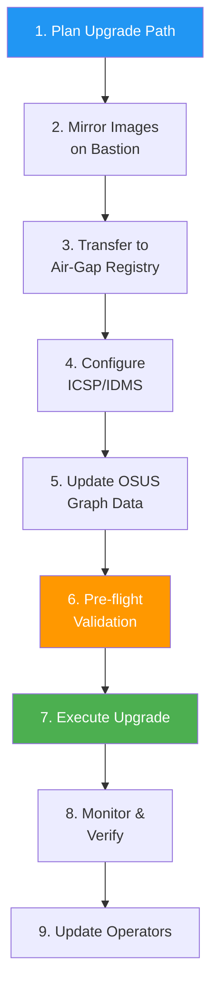

> 💡 **Quick Answer:** Upgrading a disconnected OpenShift cluster requires mirroring release images and graph data to an internal registry, configuring ImageContentSourcePolicy (ICSP) or ImageDigestMirrorSet (IDMS), pointing ClusterVersion to a local OSUS instance, and then running `oc adm upgrade --to=<version>`. The key difference from connected upgrades: every image must be pre-staged — there's no fallback to the internet.

## The Problem

Disconnected OpenShift clusters — common in government, defense, financial, and telco environments — can't reach `quay.io` or `api.openshift.com`. This means:

- **No release images** — the ClusterVersion operator can't pull the target release payload
- **No upgrade graph** — `oc adm upgrade` shows nothing without the Cincinnati endpoint
- **No operator catalog** — OLM can't update operators during or after the upgrade
- **No signature verification** — release signatures must be mirrored alongside images
- **Failed upgrades are catastrophic** — you can't "just pull what's missing" mid-upgrade
- **Multi-hop upgrades** require every intermediate version mirrored and staged

## The Solution

### End-to-End Upgrade Workflow



### Step 1: Plan the Upgrade Path

Before mirroring anything, determine the exact path:

```bash
# On a connected machine, query the graph for your path
CURRENT="4.14.38"
TARGET="4.16.15"
CHANNEL="eus-4.16"
ARCH="amd64"

# Get the full upgrade path
curl -sH "Accept: application/json" \
  "https://api.openshift.com/api/upgrades_info/v1/graph?channel=${CHANNEL}&arch=${ARCH}" \
  | python3 -c "
import json, sys
from collections import deque

data = json.load(sys.stdin)
nodes = {i: n['version'] for i, n in enumerate(data['nodes'])}
rev = {v: k for k, v in nodes.items()}

start, end = rev.get('$CURRENT'), rev.get('$TARGET')
adj = {}
for e in data['edges']:
    adj.setdefault(e[0], []).append(e[1])

queue = deque([(start, [start])])
visited = {start}
while queue:
    node, path = queue.popleft()
    if node == end:
        print('Upgrade path:')
        for i, n in enumerate(path):
            marker = '  ←  current' if i == 0 else '  ←  TARGET' if i == len(path)-1 else ''
            print(f'  {i+1}. {nodes[n]}{marker}')
        sys.exit(0)
    for nxt in adj.get(node, []):
        if nxt not in visited:
            visited.add(nxt)
            queue.append((nxt, path + [nxt]))
print('No path found')
"

# Example output:
# Upgrade path:
#   1. 4.14.38  ←  current
#   2. 4.14.42
#   3. 4.15.35
#   4. 4.16.15  ←  TARGET
```

**Document every version in the path** — you must mirror all of them.

### Step 2: Mirror Release Images (oc-mirror)

```yaml
# imageset-config.yaml — define exactly what to mirror
apiVersion: mirror.openshift.io/v2alpha1
kind: ImageSetConfiguration
mirror:
  platform:
    channels:
    # Mirror every version in your upgrade path
    - name: stable-4.14
      minVersion: 4.14.38
      maxVersion: 4.14.42
      type: ocp
    - name: stable-4.15
      minVersion: 4.15.30
      maxVersion: 4.15.35
      type: ocp
    - name: eus-4.16
      minVersion: 4.16.10
      maxVersion: 4.16.15
      type: ocp
    graph: true  # Include Cincinnati graph data
  
  operators:
  # Mirror operators you use — they must also be compatible with target version
  - catalog: registry.redhat.io/redhat/redhat-operator-index:v4.16
    packages:
    - name: kubernetes-nmstate-operator
    - name: sriov-network-operator
    - name: nfd
    - name: gpu-operator-certified
    - name: cincinnati-operator
    - name: local-storage-operator

  additionalImages:
  # Any custom images your workloads need
  - name: registry.redhat.io/ubi9/ubi-minimal:latest
```

```bash
# Run oc-mirror on the connected bastion
oc mirror --config=imageset-config.yaml \
  docker://bastion-registry.example.com:5000 \
  --dest-skip-tls \
  --continue-on-error \
  2>&1 | tee mirror-$(date +%Y%m%d).log

# This creates:
# - Mirrored images in bastion registry
# - oc-mirror-workspace/results-*/
#   ├── imageContentSourcePolicy.yaml   (ICSP)
#   ├── catalogSource-*.yaml            (operator catalogs)
#   ├── mapping.txt                     (image mapping)
#   └── release-signatures/             (GPG signatures)
```

### Step 3: Transfer to Air-Gapped Registry

If your bastion has no direct access to the internal registry, use disk-based transfer:

```bash
# Option A: Direct push (bastion can reach internal registry)
oc mirror --config=imageset-config.yaml \
  docker://quay.internal.example.com/ocp-mirror

# Option B: Disk-based transfer (true air gap)
# 1. Mirror to disk on connected side
oc mirror --config=imageset-config.yaml \
  file:///mnt/transfer-disk/ocp-mirror

# 2. Physically transport the disk

# 3. Push from disk to internal registry on disconnected side
oc mirror --from=/mnt/transfer-disk/ocp-mirror \
  docker://quay.internal.example.com/ocp-mirror
```

```bash
# Verify critical images are in the registry
# Release payload
skopeo inspect docker://quay.internal.example.com/ocp-mirror/openshift-release-dev/ocp-release:4.14.42-x86_64
skopeo inspect docker://quay.internal.example.com/ocp-mirror/openshift-release-dev/ocp-release:4.15.35-x86_64
skopeo inspect docker://quay.internal.example.com/ocp-mirror/openshift-release-dev/ocp-release:4.16.15-x86_64

# Graph data
skopeo inspect docker://quay.internal.example.com/ocp-mirror/openshift-update-service/graph-data:latest

# Count total mirrored images
skopeo list-tags docker://quay.internal.example.com/ocp-mirror/openshift-release-dev/ocp-v4.0-art-dev | jq '.Tags | length'
```

### Step 4: Configure Image Mirroring (ICSP or IDMS)

oc-mirror generates the YAML — apply it to the cluster:

```bash
# Apply the generated ImageContentSourcePolicy (OCP 4.13 and earlier)
oc apply -f oc-mirror-workspace/results-*/imageContentSourcePolicy.yaml

# Or for OCP 4.14+ use ImageDigestMirrorSet (preferred)
oc apply -f oc-mirror-workspace/results-*/imageDigestMirrorSet.yaml
```

If you need to create it manually:

```yaml
# ImageDigestMirrorSet (OCP 4.14+)
apiVersion: config.openshift.io/v1
kind: ImageDigestMirrorSet
metadata:
  name: ocp-release-mirror
spec:
  imageDigestMirrors:
  - mirrors:
    - quay.internal.example.com/ocp-mirror/openshift-release-dev
    source: quay.io/openshift-release-dev
  - mirrors:
    - quay.internal.example.com/ocp-mirror/openshift-release-dev
    source: registry.redhat.io/openshift-release-dev
```

```bash
# Wait for MachineConfigPool to roll out (nodes restart with new mirror config)
oc get mcp -w
# NAME     CONFIG   UPDATED   UPDATING   DEGRADED   MACHINECOUNT   READYMACHINECOUNT
# master   ...      True      False      False      3              3
# worker   ...      False     True       False      6              4  ← rolling

# This takes 10-30 minutes depending on cluster size
```

### Step 5: Update OSUS Graph Data

```bash
# If running OSUS operator (see osus-operator-disconnected-openshift recipe)
# Restart the update-service pods to pick up new graph-data image
oc rollout restart deployment -n openshift-update-service -l app=update-service

# Verify graph serves the target version
OSUS_ROUTE=$(oc get route update-service -n openshift-update-service -o jsonpath='{.spec.host}')
curl -sk "https://${OSUS_ROUTE}/api/upgrades_info/v1/graph?channel=eus-4.16&arch=amd64" \
  | jq --arg v "4.16.15" '[.nodes[] | select(.version == $v)] | length'
# 1  (target version exists in graph)

# If NOT using OSUS, set upstream directly to empty (use --to-image instead)
oc patch clusterversion version --type merge -p '{"spec":{"upstream":""}}'
```

### Step 6: Pre-Flight Validation

```bash
#!/bin/bash
# pre-upgrade-disconnected.sh — validate everything before starting
set -euo pipefail

TARGET_VERSION="${1:?Usage: $0 <target-version>}"
REGISTRY="quay.internal.example.com/ocp-mirror"

echo "=========================================="
echo "  Pre-Upgrade Validation (Disconnected)"
echo "  Target: $TARGET_VERSION"
echo "=========================================="

# 1. Release image exists in mirror
echo -e "\n--- Release Image ---"
RELEASE_IMG="${REGISTRY}/openshift-release-dev/ocp-release:${TARGET_VERSION}-x86_64"
if skopeo inspect "docker://${RELEASE_IMG}" &>/dev/null; then
    echo "✅ Release image found: ${RELEASE_IMG}"
else
    echo "❌ Release image MISSING: ${RELEASE_IMG}"
    exit 1
fi

# 2. Release payload images are all mirrored
echo -e "\n--- Release Payload Contents ---"
MISSING=$(oc adm release info "${RELEASE_IMG}" -o json \
  | jq -r '.references.spec.tags[].from.name' \
  | while read img; do
      # Check if each image exists in mirror
      MIRROR_IMG=$(echo "$img" | sed "s|quay.io/openshift-release-dev|${REGISTRY}/openshift-release-dev|")
      skopeo inspect "docker://${MIRROR_IMG}" &>/dev/null || echo "$img"
    done)
if [ -z "$MISSING" ]; then
    echo "✅ All payload images present"
else
    echo "❌ Missing images:"
    echo "$MISSING"
    exit 1
fi

# 3. Node health
echo -e "\n--- Node Health ---"
NOT_READY=$(oc get nodes --no-headers | grep -v " Ready" | wc -l)
echo "Not Ready nodes: $NOT_READY"
[ "$NOT_READY" -gt 0 ] && echo "❌ Fix nodes first" && exit 1
echo "✅ All nodes Ready"

# 4. Cluster operators
echo -e "\n--- Cluster Operators ---"
DEGRADED=$(oc get co --no-headers | awk '$5=="True" {print $1}')
if [ -z "$DEGRADED" ]; then
    echo "✅ No degraded operators"
else
    echo "❌ Degraded operators: $DEGRADED"
    exit 1
fi

# 5. MachineConfigPool
echo -e "\n--- MachineConfigPool ---"
UPDATING=$(oc get mcp --no-headers | awk '$4=="True" {print $1}')
if [ -z "$UPDATING" ]; then
    echo "✅ No MCPs updating"
else
    echo "❌ MCPs still updating: $UPDATING"
    exit 1
fi

# 6. IDMS/ICSP configured
echo -e "\n--- Image Mirror Config ---"
IDMS_COUNT=$(oc get imagedigestmirrorset --no-headers 2>/dev/null | wc -l)
ICSP_COUNT=$(oc get imagecontentsourcepolicy --no-headers 2>/dev/null | wc -l)
echo "ImageDigestMirrorSet: $IDMS_COUNT"
echo "ImageContentSourcePolicy: $ICSP_COUNT"
[ "$IDMS_COUNT" -eq 0 ] && [ "$ICSP_COUNT" -eq 0 ] && echo "⚠️  No mirror config — upgrade will fail!" && exit 1
echo "✅ Mirror config present"

# 7. etcd backup reminder
echo -e "\n--- etcd Backup ---"
echo "⚠️  Take etcd backup before proceeding!"
echo "   Run: oc debug node/<master-node> -- chroot /host /usr/local/bin/cluster-backup.sh /home/core/backup-pre-upgrade"

# 8. Available updates
echo -e "\n--- Available Updates ---"
oc adm upgrade 2>&1 | head -20

echo -e "\n=========================================="
echo "  Pre-flight complete. Ready to upgrade."
echo "=========================================="
```

### Step 7: Execute the Upgrade

```bash
# Take etcd backup FIRST
MASTER=$(oc get nodes -l node-role.kubernetes.io/master -o name | head -1)
oc debug $MASTER -- chroot /host /usr/local/bin/cluster-backup.sh /home/core/backup-pre-upgrade

# Z-stream upgrade (patch): 4.14.38 → 4.14.42
oc adm upgrade --to=4.14.42

# Y-stream upgrade (minor): 4.14.42 → 4.15.35
# First acknowledge API removals if required
oc -n openshift-config patch cm admin-gates \
  --type merge -p '{"data":{"ack-4.14-kube-1.28-api-removals-in-4.15":"true"}}'

oc adm upgrade channel stable-4.15
oc adm upgrade --to=4.15.35

# EUS hop: 4.15.35 → 4.16.15
oc adm upgrade channel eus-4.16
oc adm upgrade --to=4.16.15

# Alternative: upgrade by image digest (bypass graph entirely)
oc adm upgrade --to-image=quay.internal.example.com/ocp-mirror/openshift-release-dev/ocp-release@sha256:<digest> \
  --allow-explicit-upgrade
```

### Step 8: Monitor the Upgrade

```bash
# Watch ClusterVersion progress
oc get clusterversion -w

# Detailed progress with conditions
oc get clusterversion version -o json | jq '.status.conditions[] | {type, status, message}'

# Watch cluster operators converge
watch -n10 'oc get co | grep -v "True.*False.*False"'

# Monitor MachineConfigPool rollout (nodes rebooting)
oc get mcp -w

# Check individual node progress
oc get nodes -o custom-columns=\
"NAME:.metadata.name,\
STATUS:.status.conditions[-1].type,\
VERSION:.status.nodeInfo.kubeletVersion,\
READY:.status.conditions[?(@.type=='Ready')].status"

# Watch for stuck pods
oc get pods -A --field-selector=status.phase!=Running,status.phase!=Succeeded | grep -v Completed
```

### Step 9: Post-Upgrade Operator Updates

```bash
# Update the operator catalog source to the new version
oc apply -f oc-mirror-workspace/results-*/catalogSource-redhat-operator-index.yaml

# Verify operators are upgrading
oc get csv -A | grep -v Succeeded

# Check for pending install plans (if Manual approval)
oc get installplan -A | grep -v Complete

# Approve pending plans
for plan in $(oc get installplan -A -o json | jq -r '.items[] | select(.spec.approved==false) | .metadata.namespace + "/" + .metadata.name'); do
    NS=$(echo $plan | cut -d/ -f1)
    NAME=$(echo $plan | cut -d/ -f2)
    oc patch installplan $NAME -n $NS --type merge -p '{"spec":{"approved":true}}'
done
```

### Rollback (Emergency Only)

```bash
# If upgrade is stuck and cluster is still partially functional:
# 1. Check if rollback is possible
oc get clusterversion version -o jsonpath='{.status.history}'

# 2. Force rollback to previous version
oc adm upgrade --to-image=quay.internal.example.com/ocp-mirror/openshift-release-dev/ocp-release@sha256:<previous-digest> \
  --allow-explicit-upgrade --force

# 3. If cluster is completely broken, restore etcd backup
# Boot into recovery on a master node and run:
# /usr/local/bin/cluster-restore.sh /home/core/backup-pre-upgrade
```

## Common Issues

**Upgrade fails with "image not found"**

An image in the release payload wasn't mirrored. Check `oc adm release info <release-image>` to list all required images, then verify each exists in your mirror. Re-run `oc mirror` with the same imageset-config.

**MCP stuck updating — nodes won't drain**

A PodDisruptionBudget is blocking node drain. Identify with `oc get pdb -A` and temporarily relax the PDB or manually delete the blocking pod. Also check for pods using `emptyDir` volumes with local data.

**"Precondition checks failed" on Y-stream upgrade**

Admin acknowledgment required. Check `oc adm upgrade --include-not-recommended` for the exact condition, then patch the `admin-gates` ConfigMap.

**Graph shows no updates after mirroring**

The OSUS graph-data image may be cached. Restart the update-service pods. If not using OSUS, use `--to-image` with the exact image digest instead of `--to=<version>`.

**Operators degraded after upgrade**

Operator catalogs must also be updated to match the new OCP version. Apply the new `catalogSource` YAML from the oc-mirror output and wait for OLM to reconcile.

## Best Practices

- **Mirror ALL versions in the path** — don't skip intermediate hops
- **Always take etcd backup** before Y-stream upgrades — it's your only rollback option
- **Validate before upgrading** — run the pre-flight script, check every image exists
- **Stage upgrades in non-prod first** — mirror to staging cluster, upgrade, validate, then production
- **Keep mirroring logs** — `tee mirror-YYYYMMDD.log` for audit and troubleshooting
- **Use oc-mirror v2** — better incremental mirroring, smaller disk footprint
- **Schedule multi-hop upgrades** — EUS-to-EUS needs two maintenance windows (4.14→4.15→4.16)
- **Update operators in the same window** — operator/OCP version skew has limits
- **Document your mirror registry credentials** — lost creds during upgrade = disaster

## Key Takeaways

- Disconnected upgrades require pre-staging every release image, graph data, and operator catalog
- Use `oc-mirror` with `ImageSetConfiguration` for reproducible, auditable mirroring
- ICSP (≤4.13) or IDMS (4.14+) tells the cluster where to find mirrored images
- Always validate with pre-flight checks — a missing image mid-upgrade is unrecoverable
- etcd backup is mandatory before Y-stream upgrades — it's your only rollback path
- Multi-hop upgrades (especially EUS-to-EUS) need every intermediate version mirrored and tested
