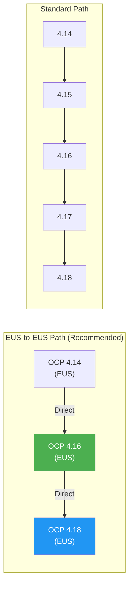

> 💡 **Quick Answer:** For 2026, most teams should be on OCP 4.16 (EUS) and planning the jump to 4.18 (EUS). The EUS-to-EUS upgrade path (4.14 → 4.16 → 4.18) skips intermediate versions, reducing maintenance windows. Before upgrading: check operator compatibility, run `oc adm upgrade`, verify API deprecations, and test in a non-production cluster first.

## The Problem

OpenShift upgrade planning is complex because it involves: Red Hat's support lifecycle (which versions are still supported?), Kubernetes API deprecations (which manifests break?), operator compatibility (do all Operators work on the new version?), and EUS eligibility (can I skip versions?). Getting any of these wrong means failed upgrades, broken workloads, or unsupported clusters.



## The Solution

### 2026 Upgrade Decision Matrix

| Current Version | Recommended Target | Path | Urgency |
|-----------------|-------------------|------|---------|
| **4.12 (EUS)** | 4.16 (EUS) | 4.12 → 4.14 → 4.16 | **Critical** — 4.12 EOL imminent |
| **4.13** | 4.16 (EUS) | 4.13 → 4.14 → 4.16 | **High** — 4.13 already EOL |
| **4.14 (EUS)** | 4.16 (EUS) | 4.14 → 4.16 (direct EUS) | **Medium** — plan for 2026 |
| **4.15** | 4.16 (EUS) | 4.15 → 4.16 | **Medium** — 4.15 non-EUS |
| **4.16 (EUS)** | 4.18 (EUS) | 4.16 → 4.18 (direct EUS) | **Low** — plan for late 2026 |
| **4.17** | 4.18 (EUS) | 4.17 → 4.18 | **Low** — when 4.18 GA |

### Pre-Upgrade Checklist

```bash
# 1. Check current version and available upgrades
oc get clusterversion
oc adm upgrade

# 2. Check for deprecated APIs used by your workloads
oc get apirequestcounts | grep -v "0" | sort -t, -k2 -rn

# 3. Verify all ClusterOperators are healthy
oc get co | grep -v "True.*False.*False"
# All should show: Available=True, Progressing=False, Degraded=False

# 4. Check Operator compatibility
oc get csv -A | grep -v Succeeded
# All should show Phase: Succeeded

# 5. Check node health
oc get nodes
oc get mcp                              # MachineConfigPool status
oc adm top nodes

# 6. Check certificate expiry
oc get secret -n openshift-kube-apiserver-operator \
  -o jsonpath='{.items[*].metadata.name}' | tr ' ' '\n' | grep cert

# 7. Backup etcd
oc debug node/<control-plane-node> -- chroot /host \
  /usr/local/bin/cluster-backup.sh /home/core/backup-$(date +%Y%m%d)
```

### EUS-to-EUS Upgrade (4.14 → 4.16)

```bash
# Step 1: Acknowledge the EUS upgrade channel
oc adm upgrade channel eus-4.16

# Step 2: Start the control plane upgrade
oc adm upgrade --to-latest
# Or specify exact version:
oc adm upgrade --to=4.16.12

# Step 3: Monitor progress
watch oc get clusterversion
watch oc get co
watch oc get mcp

# Step 4: Wait for MachineConfigPools to update
# Worker nodes will drain, update, and reboot one at a time
oc get mcp -w
# NAME     CONFIG   UPDATED   UPDATING   DEGRADED   MACHINECOUNT   READYMACHINECOUNT
# master   ...      True      False      False      3              3
# worker   ...      False     True       False      6              4

# Step 5: Verify all nodes are Ready and updated
oc get nodes -o wide
```

### Canary Node Pool Strategy

```yaml
# Create a canary MachineConfigPool for testing
apiVersion: machineconfiguration.openshift.io/v1
kind: MachineConfigPool
metadata:
  name: worker-canary
spec:
  machineConfigSelector:
    matchExpressions:
      - key: machineconfiguration.openshift.io/role
        operator: In
        values: ["worker", "worker-canary"]
  nodeSelector:
    matchLabels:
      node-role.kubernetes.io/worker-canary: ""
  maxUnavailable: 1
---
# Label 1-2 nodes as canary
# oc label node worker-node-1 node-role.kubernetes.io/worker-canary=""

# Canary pool upgrades first — monitor for 24h before proceeding
# Pause the main worker pool:
# oc patch mcp worker --type merge -p '{"spec":{"paused": true}}'
# After canary validation:
# oc patch mcp worker --type merge -p '{"spec":{"paused": false}}'
```

### Operator Compatibility Check

```bash
# Check all installed operators for target version compatibility
oc get csv -A -o json | jq -r '
  .items[] | 
  select(.status.phase == "Succeeded") |
  "\(.metadata.namespace)/\(.metadata.name) → min_kube: \(.spec.minKubeVersion // "not specified")"'

# Check for operators that might block upgrade
oc get installplan -A | grep -v Complete

# Update operators BEFORE cluster upgrade
# Most operators auto-update — verify:
oc get sub -A -o json | jq -r '
  .items[] | "\(.metadata.name): channel=\(.spec.channel) installPlanApproval=\(.spec.installPlanApproval)"'

# If any operator uses Manual approval, approve first:
oc get installplan -A | grep "RequiresApproval"
oc patch installplan <plan-name> -n <ns> --type merge \
  -p '{"spec":{"approved":true}}'
```

### API Deprecation Audit

```bash
# Check for removed APIs in target version
# 4.16 (K8s 1.29): flowcontrol.apiserver.k8s.io/v1beta3 removed
# 4.17 (K8s 1.30): No major removals
# 4.18 (K8s 1.31): No major removals

# Find workloads using deprecated APIs
oc get apirequestcounts -o json | jq -r '
  .items[] | 
  select(.status.removedInRelease != null) |
  "\(.metadata.name) → removed in \(.status.removedInRelease), current requests: \(.status.currentHour.requestCount // 0)"'

# Fix deprecated manifests before upgrading
# Replace v1beta1 → v1 in all stored manifests
grep -r "v1beta1" manifests/ --include="*.yaml"
```

### Rollback Plan

```bash
# ⚠️ OpenShift does NOT support downgrade
# Your rollback plan is etcd restore:

# 1. If upgrade fails, restore etcd backup
oc debug node/<control-plane-node> -- chroot /host \
  /usr/local/bin/cluster-restore.sh /home/core/backup-20260412

# 2. Restart kubelet on all control plane nodes
for node in master-{0,1,2}; do
  oc debug node/$node -- chroot /host systemctl restart kubelet
done

# Prevention is better:
# - Always backup etcd BEFORE upgrading
# - Test in non-prod first
# - Use canary node pool
# - Have a maintenance window
```

### Upgrade Timeline Template

```
Week 1: Pre-upgrade audit
  □ Run API deprecation check
  □ Update all Operators to latest
  □ Backup etcd
  □ Test in dev/staging cluster
  
Week 2: Canary upgrade
  □ Label 2 worker nodes as canary
  □ Upgrade canary MCP
  □ Monitor 48h: workloads, metrics, logs
  □ Validate application health
  
Week 3: Production upgrade
  □ Schedule maintenance window
  □ Backup etcd (again)
  □ Upgrade control plane
  □ Upgrade worker nodes (rolling)
  □ Verify all ClusterOperators healthy
  
Week 4: Post-upgrade
  □ Remove deprecated API usage
  □ Update monitoring dashboards
  □ Document lessons learned
  □ Plan next EUS upgrade
```

## Common Issues

| Issue | Cause | Fix |
|-------|-------|-----|
| Upgrade stuck on MachineConfigPool | Node failed to drain | Check `oc get mcp` and `oc describe node <stuck-node>` |
| ClusterOperator degraded after upgrade | Operator not compatible | Update operator or check known issues |
| Nodes NotReady after reboot | Kubelet config mismatch | Check `journalctl -u kubelet` on affected node |
| PDB blocking node drain | Too-strict PodDisruptionBudget | Temporarily relax PDB during upgrade window |
| etcd backup corrupted | Backup during high load | Take backup during quiet period, verify with restore test |

## Best Practices

- **Stay on EUS track** — 4.14 → 4.16 → 4.18 for longest support and simplest upgrades
- **Upgrade operators before cluster** — compatibility issues surface early
- **Use canary node pools** — catch issues on 1-2 nodes before rolling to all workers
- **Backup etcd before every upgrade** — only rollback mechanism for failed upgrades
- **Schedule during low-traffic windows** — node reboots cause brief workload disruption
- **Audit deprecated APIs proactively** — don't wait for upgrade failures to find them

## Key Takeaways

- 2026 target: OCP 4.16 (current EUS) or 4.18 (next EUS)
- EUS-to-EUS upgrades skip intermediate versions: 4.14 → 4.16 direct
- Pre-upgrade: check ClusterOperators, API deprecations, operator compatibility, etcd backup
- Canary MachineConfigPools test the upgrade on 1-2 nodes before fleet-wide rollout
- OpenShift does NOT support downgrade — etcd restore is your only rollback
- Plan 4 weeks: audit → canary → production → post-upgrade cleanup
