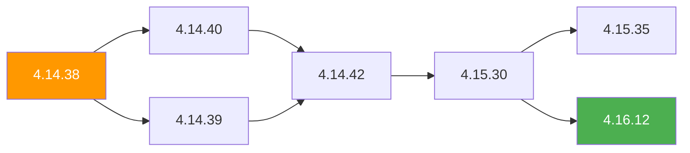

> 💡 **Quick Answer:** The OpenShift Upgrade Service (OSUS), based on the Cincinnati protocol, serves a directed graph of safe upgrade paths. The ClusterVersion operator queries this graph to determine which versions are reachable from your current release. Use channels (stable, fast, eus, candidate) and understand conditional update edges to plan safe, validated upgrades.

## The Problem

OpenShift upgrades aren't linear — you can't just jump from any version to any other. Some paths require intermediate hops, some are blocked by known bugs, and some are only safe if your cluster meets specific conditions. Without understanding the upgrade graph:

- You attempt an unsupported version jump and get stuck
- You miss a required intermediate upgrade and break operators
- You hit a conditional edge that blocks the upgrade with no clear explanation
- Air-gapped clusters have no access to the graph service and fly blind

## The Solution

### How the Upgrade Service Works

The OpenShift Upgrade Service (formerly Cincinnati) maintains a **directed acyclic graph (DAG)** of all valid upgrade paths between OCP releases. Every connected cluster queries this graph automatically.



```bash
# Check your current version and available updates
oc get clusterversion
# NAME      VERSION   AVAILABLE   PROGRESSING   SINCE   STATUS
# version   4.14.38   True        False         5d      Cluster version is 4.14.38

# See what the upgrade service recommends
oc adm upgrade
# Cluster version is 4.14.38
#
# Upstream is unset, so the cluster will use an appropriate default.
# Channel: stable-4.14 (available channels: candidate-4.14, eus-4.14, fast-4.14, stable-4.14)
#
# Recommended updates:
#
# VERSION   IMAGE
# 4.14.42   quay.io/openshift-release-dev/ocp-release@sha256:...
# 4.14.40   quay.io/openshift-release-dev/ocp-release@sha256:...
# 4.14.39   quay.io/openshift-release-dev/ocp-release@sha256:...
```

### Channels Explained

Channels control which subset of the graph you see:

| Channel | Purpose | Risk | Use Case |
|---------|---------|------|----------|
| **candidate-4.x** | Earliest access to new releases | Highest | Dev/test clusters, early validation |
| **fast-4.x** | Promoted from candidate after initial soak | Medium | Non-production, confident teams |
| **stable-4.x** | Promoted from fast after broader validation | Lowest | Production clusters |
| **eus-4.x** | Extended Update Support (even minors only) | Lowest | Enterprise production, skip odd minors |

```bash
# Switch channel
oc adm upgrade channel stable-4.15

# Check available channels for your version
oc adm upgrade --include-not-recommended
```

### EUS-to-EUS Upgrades

EUS (Extended Update Support) lets you skip odd-numbered minor versions. This is the recommended enterprise path:

```
4.14 (EUS) → 4.15 (transient) → 4.16 (EUS) → 4.17 (transient) → 4.18 (EUS)
```

```bash
# Set the EUS channel for your target
oc adm upgrade channel eus-4.16

# The graph will show the required intermediate hop through 4.15
oc adm upgrade
# Recommended updates:
# 4.15.35 (intermediate)   ← must go here first
# Then from 4.15.35 → 4.16.x becomes available
```

**Important:** During EUS-to-EUS, you temporarily pass through a non-EUS version. Plan maintenance windows for both hops.

### Conditional Updates

Some edges in the graph have **conditions** — the upgrade is only recommended if your cluster meets certain criteria:

```bash
# Show conditional updates
oc adm upgrade --include-not-recommended

# Example output:
# Conditional Updates:
#   VERSION   CONDITION                                    STATUS
#   4.15.30   ClusterNotRunningPlatformAWS                Recommended
#   4.15.30   AdminGateRequired                           Not Recommended
```

Common conditions:
- **Platform-specific** — some updates are blocked on certain cloud providers until a fix lands
- **AdminAckRequired** — you must manually acknowledge a breaking change
- **ClusterCondition** — based on installed operators or cluster state

```bash
# Acknowledge an admin gate (required for some Y-stream upgrades)
oc -n openshift-config patch cm admin-gates \
  --type merge -p '{"data":{"ack-4.14-kube-1.28-api-removals-in-4.15":"true"}}'

# After acknowledging, the conditional update becomes recommended
oc adm upgrade
```

### Query the Graph API Directly

```bash
# Query the Cincinnati API for available upgrades from a specific version
ARCH="amd64"
CHANNEL="stable-4.14"
VERSION="4.14.38"

curl -sH "Accept: application/json" \
  "https://api.openshift.com/api/upgrades_info/v1/graph?channel=${CHANNEL}&arch=${ARCH}" \
  | jq --arg v "$VERSION" '.nodes[] | select(.version == $v)'

# Get all edges FROM your version
curl -sH "Accept: application/json" \
  "https://api.openshift.com/api/upgrades_info/v1/graph?channel=${CHANNEL}&arch=${ARCH}" \
  | jq --arg v "$VERSION" '
    (.nodes | to_entries | map({(.value.version): .key}) | add) as $idx |
    .edges[] | select(.[0] == $idx[$v]) |
    .nodes[.[1]].version
  '
```

### Visualize the Upgrade Graph

Use the Red Hat upgrade graph tool:

```bash
# Web tool (connected clusters)
# https://access.redhat.com/labs/ocpupgradegraph/update_path

# CLI visualization — find shortest path
CURRENT="4.14.38"
TARGET="4.16.12"
CHANNEL="eus-4.16"

curl -sH "Accept: application/json" \
  "https://api.openshift.com/api/upgrades_info/v1/graph?channel=${CHANNEL}&arch=amd64" \
  | python3 -c "
import json, sys
from collections import deque

data = json.load(sys.stdin)
nodes = {i: n['version'] for i, n in enumerate(data['nodes'])}
rev = {v: k for k, v in nodes.items()}

# BFS shortest path
start, end = rev.get('$CURRENT'), rev.get('$TARGET')
if not start or not end:
    print('Version not found in channel')
    sys.exit(1)

adj = {}
for e in data['edges']:
    adj.setdefault(e[0], []).append(e[1])

queue = deque([(start, [start])])
visited = {start}
while queue:
    node, path = queue.popleft()
    if node == end:
        print(' → '.join(nodes[n] for n in path))
        sys.exit(0)
    for nxt in adj.get(node, []):
        if nxt not in visited:
            visited.add(nxt)
            queue.append((nxt, path + [nxt]))
print('No path found')
"
```

### Air-Gapped / Disconnected Clusters

Disconnected clusters can't reach `api.openshift.com`. You need to run OSUS locally:

```yaml
# Deploy the OpenShift Update Service operator
apiVersion: operators.coreos.com/v1alpha1
kind: Subscription
metadata:
  name: cincinnati-operator
  namespace: openshift-update-service
spec:
  channel: v1
  name: cincinnati-operator
  source: redhat-operators
  sourceNamespace: openshift-marketplace

---
# Create the UpdateService instance
apiVersion: updateservice.operator.openshift.io/v1
kind: UpdateService
metadata:
  name: update-service
  namespace: openshift-update-service
spec:
  replicas: 1
  releases: quay.example.com/openshift-release-dev/ocp-release
  graphDataImage: quay.example.com/openshift-update-service/graph-data:latest
```

```bash
# Mirror the graph data image
oc image mirror \
  registry.redhat.io/openshift-update-service/graph-data:latest \
  quay.example.com/openshift-update-service/graph-data:latest

# Mirror release images for your upgrade path
oc adm release mirror \
  --from=quay.io/openshift-release-dev/ocp-release:4.14.42-x86_64 \
  --to=quay.example.com/openshift-release-dev/ocp-release \
  --to-release-image=quay.example.com/openshift-release-dev/ocp-release:4.14.42-x86_64

# Point ClusterVersion to local OSUS
oc patch clusterversion version --type merge -p '{
  "spec": {
    "upstream": "https://update-service.openshift-update-service.svc:8443/api/upgrades_info/v1/graph"
  }
}'
```

### Pre-Upgrade Checklist

```bash
#!/bin/bash
# pre-upgrade-check.sh — validate before starting upgrade

echo "=== Current Version ==="
oc get clusterversion -o jsonpath='{.items[0].status.desired.version}'
echo ""

echo "=== Channel ==="
oc get clusterversion -o jsonpath='{.items[0].spec.channel}'
echo ""

echo "=== Node Health ==="
NOT_READY=$(oc get nodes --no-headers | grep -v " Ready" | wc -l)
echo "Not Ready nodes: $NOT_READY"
[ "$NOT_READY" -gt 0 ] && echo "❌ Fix nodes before upgrading" && exit 1

echo "=== Degraded Operators ==="
oc get co --no-headers | awk '$3=="False" || $4=="True" || $5=="True" {print "❌", $1, "Available="$3, "Progressing="$4, "Degraded="$5}'

echo "=== Pending MachineConfigPools ==="
oc get mcp --no-headers | awk '$3!=$4 || $3!=$5 {print "⚠️", $1, "READY="$3, "UPDATED="$4, "UPDATING="$5}'

echo "=== etcd Health ==="
oc get etcd cluster -o jsonpath='{.status.conditions[?(@.type=="EtcdMembersAvailable")].status}'
echo ""

echo "=== Available Updates ==="
oc adm upgrade 2>&1 | head -20

echo "=== Admin Acks Required ==="
oc get cm admin-gates -n openshift-config -o json 2>/dev/null | jq '.data // "none"'
```

### Start the Upgrade

```bash
# Upgrade to a specific version (from recommended list)
oc adm upgrade --to=4.14.42

# Or upgrade to latest in channel
oc adm upgrade --to-latest

# Force upgrade (skip conditional checks — use with caution)
oc adm upgrade --to=4.15.30 --force

# Monitor progress
oc get clusterversion -w
oc get co | grep -E "AVAILABLE|False"
oc get mcp -w
```

## Common Issues

**"No recommended updates available"**

You're likely on the wrong channel or at the latest version in your channel. Switch to a newer channel: `oc adm upgrade channel stable-4.15`. Also check if conditional updates are blocking — use `--include-not-recommended`.

**Upgrade stuck at partial completion**

Check degraded operators: `oc get co | grep -v "True.*False.*False"`. Common culprits: failing webhooks, PDB-blocked drains, or an operator waiting for manual intervention.

**AdminAckRequired blocks Y-stream upgrade**

Kubernetes removes deprecated APIs between minor versions. You must acknowledge awareness by patching the `admin-gates` ConfigMap in `openshift-config`. Read the release notes for which APIs are removed.

**Air-gapped graph data is stale**

The graph-data image must be refreshed regularly. Set up a cron job to re-mirror it monthly or before planned upgrades.

## Best Practices

- **Always use `stable` channel for production** — `fast` and `candidate` have less soak time
- **Plan EUS-to-EUS for enterprise** — skip odd minors, reduce upgrade frequency
- **Run pre-upgrade checks** — verify node health, operator status, and MCP readiness
- **Acknowledge admin gates early** — don't discover them during the maintenance window
- **Mirror graph data for air-gapped** — stale graph data means invisible upgrade paths
- **Take etcd backup before Y-stream upgrades** — `oc get etcd cluster -o yaml > etcd-backup.yaml`
- **Schedule Z-stream (patch) updates monthly** — stay current within your minor version

## Key Takeaways

- The OpenShift Upgrade Service serves a DAG of validated upgrade paths via the Cincinnati protocol
- Channels (candidate → fast → stable → eus) control which paths you see
- Conditional edges require admin acknowledgment or cluster conditions to be met
- EUS-to-EUS skips odd minor versions but requires a transient hop through the intermediate release
- Air-gapped clusters need OSUS deployed locally with mirrored graph-data and release images
- Always run pre-upgrade checks: node health, operator status, MCP readiness, admin gates
