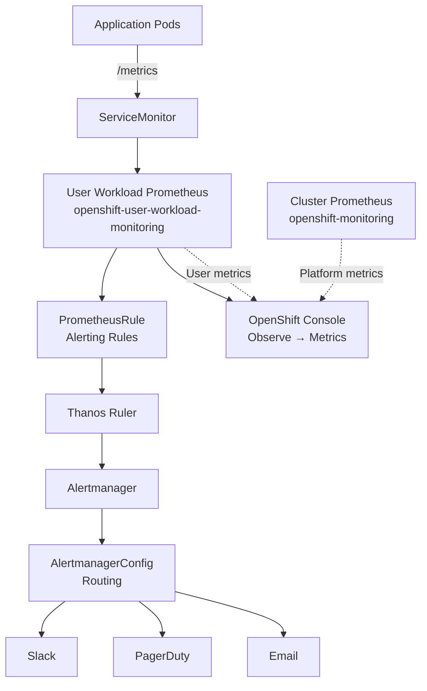

> 💡 **Quick Answer:** Create a ConfigMap in `openshift-monitoring` with `enableUserWorkload: true`, then deploy `ServiceMonitor` resources in your app namespace to scrape custom metrics. OpenShift spins up a dedicated Prometheus stack in `openshift-user-workload-monitoring` automatically.

## The Problem

OpenShift's built-in monitoring (cluster Prometheus) only scrapes platform components — API server, etcd, node-exporter, etc. Your application exposes custom Prometheus metrics on `/metrics`, but the cluster Prometheus won't scrape them. You need user workload monitoring to collect app-level metrics, create custom alerts, and build dashboards.

## The Solution

### Step 1: Enable User Workload Monitoring

```yaml
# cluster-monitoring-config.yaml
apiVersion: v1
kind: ConfigMap
metadata:
  name: cluster-monitoring-config
  namespace: openshift-monitoring
data:
  config.yaml: |
    enableUserWorkload: true
```

```bash
oc apply -f cluster-monitoring-config.yaml

# Wait for the user workload monitoring stack to spin up
oc get pods -n openshift-user-workload-monitoring -w
# NAME                                   READY   STATUS    RESTARTS
# prometheus-user-workload-0             6/6     Running   0
# prometheus-user-workload-1             6/6     Running   0
# thanos-ruler-user-workload-0           4/4     Running   0
# thanos-ruler-user-workload-1           4/4     Running   0
```

### Step 2: Configure User Workload Monitoring (Optional)

```yaml
# user-workload-monitoring-config.yaml
apiVersion: v1
kind: ConfigMap
metadata:
  name: user-workload-monitoring-config
  namespace: openshift-user-workload-monitoring
data:
  config.yaml: |
    prometheus:
      retention: 15d                    # How long to keep metrics
      resources:
        requests:
          cpu: 200m
          memory: 1Gi
        limits:
          cpu: "2"
          memory: 4Gi
      volumeClaimTemplate:
        spec:
          storageClassName: gp3-csi
          resources:
            requests:
              storage: 50Gi             # Persistent storage for metrics
    thanosRuler:
      resources:
        requests:
          cpu: 100m
          memory: 256Mi
```

```bash
oc apply -f user-workload-monitoring-config.yaml
```

### Step 3: Deploy an Application with Metrics

Example app exposing Prometheus metrics:

```yaml
# sample-app.yaml
apiVersion: apps/v1
kind: Deployment
metadata:
  name: myapp
  namespace: myproject
  labels:
    app: myapp
spec:
  replicas: 3
  selector:
    matchLabels:
      app: myapp
  template:
    metadata:
      labels:
        app: myapp
    spec:
      containers:
        - name: app
          image: quay.io/myorg/myapp:1.0
          ports:
            - name: http
              containerPort: 8080
            - name: metrics
              containerPort: 9090       # Prometheus metrics endpoint
          resources:
            requests:
              cpu: 100m
              memory: 128Mi
---
apiVersion: v1
kind: Service
metadata:
  name: myapp
  namespace: myproject
  labels:
    app: myapp
spec:
  selector:
    app: myapp
  ports:
    - name: http
      port: 8080
    - name: metrics
      port: 9090                        # Service exposes metrics port
```

### Step 4: Create a ServiceMonitor

The ServiceMonitor tells Prometheus what to scrape:

```yaml
# servicemonitor.yaml
apiVersion: monitoring.coreos.com/v1
kind: ServiceMonitor
metadata:
  name: myapp-monitor
  namespace: myproject                  # Same namespace as the app
  labels:
    app: myapp
spec:
  selector:
    matchLabels:
      app: myapp                        # Matches the Service labels
  endpoints:
    - port: metrics                     # Matches Service port name
      path: /metrics                    # Metrics endpoint path
      interval: 30s                     # Scrape every 30 seconds
      scrapeTimeout: 10s
      metricRelabelings:
        # Drop high-cardinality metrics to save storage
        - sourceLabels: [__name__]
          regex: "go_gc_.*"
          action: drop
  namespaceSelector:
    matchNames:
      - myproject
```

```bash
oc apply -f servicemonitor.yaml

# Verify Prometheus is scraping
# Check targets in the OpenShift console:
# Observe → Targets → select "User" source → look for myapp-monitor
```

### Step 5: PodMonitor (Alternative to ServiceMonitor)

Use PodMonitor when pods expose metrics without a Service:

```yaml
apiVersion: monitoring.coreos.com/v1
kind: PodMonitor
metadata:
  name: myapp-pods
  namespace: myproject
spec:
  selector:
    matchLabels:
      app: myapp
  podMetricsEndpoints:
    - port: metrics
      path: /metrics
      interval: 30s
```

### Step 6: Create Alerting Rules

```yaml
# alerting-rules.yaml
apiVersion: monitoring.coreos.com/v1
kind: PrometheusRule
metadata:
  name: myapp-alerts
  namespace: myproject
spec:
  groups:
    - name: myapp.rules
      rules:
        # Alert: High error rate
        - alert: MyAppHighErrorRate
          expr: |
            sum(rate(http_requests_total{job="myapp", status=~"5.."}[5m]))
            /
            sum(rate(http_requests_total{job="myapp"}[5m]))
            > 0.05
          for: 5m
          labels:
            severity: warning
            namespace: myproject
          annotations:
            summary: "High error rate on {{ $labels.instance }}"
            description: "Error rate is {{ $value | humanizePercentage }} (threshold: 5%)"

        # Alert: Pod restarting frequently
        - alert: MyAppPodRestartingFrequently
          expr: |
            increase(kube_pod_container_status_restarts_total{namespace="myproject", container="app"}[1h]) > 3
          for: 10m
          labels:
            severity: warning
          annotations:
            summary: "Pod {{ $labels.pod }} restarting frequently"
            description: "{{ $value }} restarts in the last hour"

        # Alert: High latency P99
        - alert: MyAppHighLatency
          expr: |
            histogram_quantile(0.99,
              sum(rate(http_request_duration_seconds_bucket{job="myapp"}[5m])) by (le)
            ) > 2
          for: 5m
          labels:
            severity: critical
          annotations:
            summary: "P99 latency above 2 seconds"
            description: "P99 latency is {{ $value }}s"

        # Alert: Low replica count
        - alert: MyAppLowReplicas
          expr: |
            kube_deployment_status_replicas_available{namespace="myproject", deployment="myapp"} < 2
          for: 5m
          labels:
            severity: critical
          annotations:
            summary: "MyApp has fewer than 2 available replicas"
            description: "Available replicas: {{ $value }}"

    - name: myapp.slo
      rules:
        # Recording rule for SLI (faster queries)
        - record: myapp:http_request_error_rate:5m
          expr: |
            sum(rate(http_requests_total{job="myapp", status=~"5.."}[5m]))
            /
            sum(rate(http_requests_total{job="myapp"}[5m]))

        # Recording rule for latency SLI
        - record: myapp:http_request_duration_p99:5m
          expr: |
            histogram_quantile(0.99,
              sum(rate(http_request_duration_seconds_bucket{job="myapp"}[5m])) by (le)
            )
```

```bash
oc apply -f alerting-rules.yaml

# Verify rules loaded
oc get prometheusrule -n myproject
# NAME           AGE
# myapp-alerts   5s

# Check in OpenShift console: Observe → Alerting → select "User" source
```

### Step 7: Query Metrics in the Console

```bash
# OpenShift Console → Observe → Metrics
# Switch to "User" workload metrics
# Example PromQL queries:

# Request rate
rate(http_requests_total{job="myapp"}[5m])

# Error rate percentage
100 * sum(rate(http_requests_total{job="myapp", status=~"5.."}[5m])) / sum(rate(http_requests_total{job="myapp"}[5m]))

# P95 latency
histogram_quantile(0.95, sum(rate(http_request_duration_seconds_bucket{job="myapp"}[5m])) by (le))

# Memory usage vs request
container_memory_working_set_bytes{namespace="myproject", container="app"} / on(pod) kube_pod_container_resource_requests{resource="memory"}
```

### Step 8: Configure Alert Routing (AlertmanagerConfig)

```yaml
# alertmanager-config.yaml
apiVersion: monitoring.coreos.com/v1beta1
kind: AlertmanagerConfig
metadata:
  name: myapp-alerting
  namespace: myproject
spec:
  route:
    receiver: team-slack
    groupBy: [alertname, namespace]
    groupWait: 30s
    groupInterval: 5m
    repeatInterval: 4h
    routes:
      - receiver: team-pagerduty
        matchers:
          - name: severity
            value: critical
            matchType: "="
  receivers:
    - name: team-slack
      slackConfigs:
        - apiURL:
            name: slack-webhook-secret
            key: url
          channel: "#myapp-alerts"
          title: '{{ "{{" }} .GroupLabels.alertname {{ "}}" }}'
          text: '{{ "{{" }} range .Alerts {{ "}}" }}{{ "{{" }} .Annotations.description {{ "}}" }}{{ "{{" }} end {{ "}}" }}'
          sendResolved: true
    - name: team-pagerduty
      pagerDutyConfigs:
        - routingKey:
            name: pagerduty-secret
            key: routing-key
          severity: '{{ "{{" }} .CommonLabels.severity {{ "}}" }}'
```



### RBAC: Grant Monitoring Access

```bash
# Allow developers to view metrics in their namespace
oc adm policy add-role-to-user monitoring-rules-view developer -n myproject
oc adm policy add-role-to-user monitoring-rules-edit developer -n myproject
oc adm policy add-role-to-user monitoring-edit developer -n myproject

# Roles:
# monitoring-rules-view — view PrometheusRule and AlertmanagerConfig
# monitoring-rules-edit — create/edit PrometheusRule and AlertmanagerConfig
# monitoring-edit       — create/edit ServiceMonitor and PodMonitor
```

## Common Issues

### ServiceMonitor Not Scraping

```bash
# 1. Check labels match
oc get svc myapp -n myproject --show-labels
oc get servicemonitor myapp-monitor -n myproject -o jsonpath='{.spec.selector}'
# Labels must match!

# 2. Check port name matches
oc get svc myapp -n myproject -o jsonpath='{.spec.ports[*].name}'
# Must include the port name referenced in ServiceMonitor

# 3. Check metrics endpoint works
oc exec deploy/myapp -n myproject -- curl -s localhost:9090/metrics | head -5
```

### Prometheus Out of Storage

```bash
# Check PVC usage
oc exec -n openshift-user-workload-monitoring prometheus-user-workload-0 -c prometheus -- \
  df -h /prometheus
# If full: increase storage or reduce retention

oc edit configmap user-workload-monitoring-config -n openshift-user-workload-monitoring
# Reduce retention: "3d" or increase storage: "100Gi"
```

### Alerts Not Firing

```bash
# Check rule syntax
oc get prometheusrule myapp-alerts -n myproject -o yaml
# Look for status conditions or events

# Test the PromQL expression manually in the Console
# Observe → Metrics → paste the expr → verify it returns data
```

### User Workload Monitoring Pods Not Starting

```bash
# Check cluster-monitoring-config is correct
oc get configmap cluster-monitoring-config -n openshift-monitoring -o yaml
# Must have enableUserWorkload: true under config.yaml

# Check events
oc get events -n openshift-user-workload-monitoring --sort-by='.lastTimestamp'
```

## Best Practices

- **Use ServiceMonitor over annotations** — annotations (`prometheus.io/scrape`) don't work with user workload monitoring
- **Set `interval: 30s`** as default — 15s doubles storage cost with minimal benefit
- **Drop high-cardinality metrics** with `metricRelabelings` — Go runtime and gRPC metrics are noisy
- **Use recording rules** for complex queries — faster dashboard loading
- **Set retention and storage** appropriately — 15d retention with 50Gi covers most use cases
- **Separate critical and warning alert channels** — PagerDuty for critical, Slack for warning
- **Include `namespace` label in alerts** — multi-tenant clusters need clear ownership
- **Use `for: 5m`** on alerts — avoid flapping on transient spikes

## Key Takeaways

- One ConfigMap (`enableUserWorkload: true`) enables the entire user monitoring stack
- ServiceMonitor/PodMonitor CRDs tell Prometheus what to scrape — no annotation hacks
- PrometheusRule CRDs define alerting and recording rules in your namespace
- AlertmanagerConfig routes alerts to Slack/PagerDuty per namespace
- RBAC roles (`monitoring-edit`, `monitoring-rules-edit`) control who can create monitors and rules
- User workload Prometheus is separate from cluster Prometheus — they don't interfere
