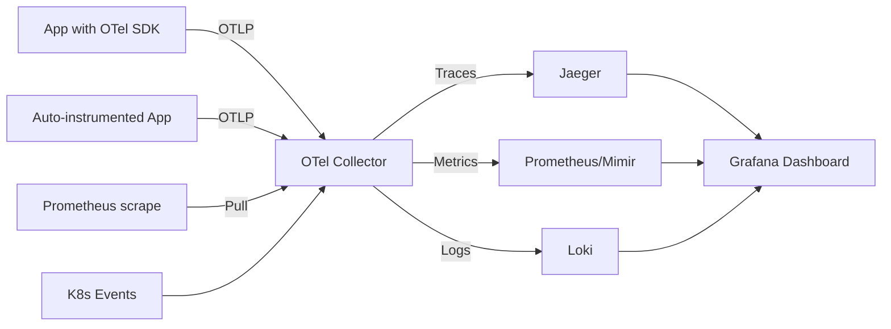

> 💡 **Quick Answer:** Deploy OpenTelemetry Collector, auto-instrumentation, and exporters on Kubernetes. Unified traces, metrics, and logs pipeline to Jaeger, Prometheus, and Loki.

## The Problem

Separate tools for metrics (Prometheus), traces (Jaeger), and logs (Fluentd) create silos. OpenTelemetry unifies collection into a single pipeline — one agent per node, one collector per cluster, any backend.

## The Solution

### Step 1: Install OpenTelemetry Operator

```bash
# Install cert-manager (required)
kubectl apply -f https://github.com/cert-manager/cert-manager/releases/latest/download/cert-manager.yaml

# Install OTel Operator
kubectl apply -f https://github.com/open-telemetry/opentelemetry-operator/releases/latest/download/opentelemetry-operator.yaml
```

### Step 2: Deploy OTel Collector

```yaml
apiVersion: opentelemetry.io/v1beta1
kind: OpenTelemetryCollector
metadata:
  name: otel-collector
spec:
  mode: deployment       # Or daemonset for node-level collection
  config:
    receivers:
      otlp:
        protocols:
          grpc:
            endpoint: 0.0.0.0:4317
          http:
            endpoint: 0.0.0.0:4318
      prometheus:
        config:
          scrape_configs:
            - job_name: kubernetes-pods
              kubernetes_sd_configs:
                - role: pod
              relabel_configs:
                - source_labels: [__meta_kubernetes_pod_annotation_prometheus_io_scrape]
                  action: keep
                  regex: true
      k8s_events:
        namespaces: []     # All namespaces
    
    processors:
      batch:
        timeout: 5s
        send_batch_size: 1000
      memory_limiter:
        check_interval: 1s
        limit_mib: 512
      k8sattributes:
        extract:
          metadata:
            - k8s.pod.name
            - k8s.namespace.name
            - k8s.deployment.name
            - k8s.node.name
      resource:
        attributes:
          - key: cluster.name
            value: production
            action: upsert
    
    exporters:
      otlp/jaeger:
        endpoint: jaeger-collector.observability:4317
        tls:
          insecure: true
      prometheusremotewrite:
        endpoint: http://prometheus.observability:9090/api/v1/write
      loki:
        endpoint: http://loki.observability:3100/loki/api/v1/push
    
    service:
      pipelines:
        traces:
          receivers: [otlp]
          processors: [memory_limiter, k8sattributes, batch]
          exporters: [otlp/jaeger]
        metrics:
          receivers: [otlp, prometheus]
          processors: [memory_limiter, k8sattributes, batch]
          exporters: [prometheusremotewrite]
        logs:
          receivers: [otlp, k8s_events]
          processors: [memory_limiter, k8sattributes, batch]
          exporters: [loki]
```

### Step 3: Auto-Instrument Applications

```yaml
# Auto-instrument Python apps (no code changes needed!)
apiVersion: opentelemetry.io/v1alpha1
kind: Instrumentation
metadata:
  name: python-instrumentation
spec:
  exporter:
    endpoint: http://otel-collector-collector:4317
  propagators:
    - tracecontext
    - baggage
  python:
    image: ghcr.io/open-telemetry/opentelemetry-operator/autoinstrumentation-python:latest
    env:
      - name: OTEL_PYTHON_LOG_CORRELATION
        value: "true"
---
# Annotate your deployment to enable auto-instrumentation
apiVersion: apps/v1
kind: Deployment
metadata:
  name: my-python-app
spec:
  template:
    metadata:
      annotations:
        instrumentation.opentelemetry.io/inject-python: "python-instrumentation"
    spec:
      containers:
        - name: app
          image: my-python-app:v1
```

Supported auto-instrumentation languages: Java, Python, Node.js, .NET, Go.



## Best Practices

- **Start small and iterate** — don't over-engineer on day one
- **Monitor and measure** — you can't improve what you don't measure
- **Automate repetitive tasks** — reduce human error and toil
- **Document your decisions** — future you will thank present you

## Key Takeaways

- This is essential knowledge for production Kubernetes operations
- Start with the simplest approach that solves your problem
- Monitor the impact of every change you make
- Share knowledge across your team with internal runbooks
