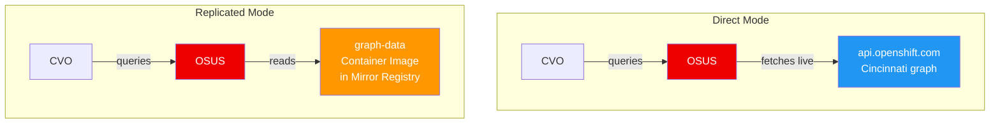

> 💡 **Quick Answer:** OSUS (OpenShift Update Service) serves the upgrade graph that tells CVO which versions are available and safe. **Direct mode** — OSUS fetches graph data live from `api.openshift.com` (connected clusters). **Replicated mode** — OSUS serves graph data from a local container image containing a pre-built graph (disconnected/air-gapped). Choose replicated for air-gapped, direct for connected, and a pull-through cache for hybrid.

## The Problem

OpenShift's Cluster Version Operator (CVO) needs an upgrade graph to determine:

- Which versions exist
- Which upgrade paths are safe (tested)
- Which versions are blocked (CVEs, regressions)
- Conditional update risks

In connected clusters, CVO queries `api.openshift.com` directly. But in disconnected environments:

- No internet access to `api.openshift.com`
- Stale graph data means missing safe upgrade paths
- No visibility into blocked versions or conditional updates
- CVO shows "No updates available" even when release images are mirrored

OSUS solves this — but you must choose how it gets its graph data.

## The Solution

### Mode Comparison

| Aspect | Direct | Replicated |
|--------|--------|------------|
| **Graph source** | Live from `api.openshift.com` | Local graph-data container image |
| **Internet required** | Yes (OSUS → internet) | No |
| **Freshness** | Always current | Stale until image updated |
| **Use case** | Connected/hybrid | Fully disconnected |
| **Graph updates** | Automatic | Manual (mirror new image) |
| **Setup complexity** | Simple | More steps (mirror graph image) |

### Architecture



### Install OSUS Operator

```bash
# Same for both modes
cat <<EOF | oc apply -f -
apiVersion: operators.coreos.com/v1alpha1
kind: Subscription
metadata:
  name: cincinnati-operator
  namespace: openshift-update-service
spec:
  channel: v1
  installPlanApproval: Automatic
  name: cincinnati-operator
  source: redhat-operators
  sourceNamespace: openshift-marketplace
EOF

oc get csv -n openshift-update-service | grep update-service
```

### Direct Mode (Connected)

```yaml
apiVersion: updateservice.operator.openshift.io/v1
kind: UpdateService
metadata:
  name: update-service
  namespace: openshift-update-service
spec:
  replicas: 1
  releases: quay.io/openshift-release-dev/ocp-release
  graphDataImage: ""    # Empty = direct mode (fetch from upstream)
```

In direct mode, OSUS acts as a local Cincinnati server that proxies graph requests to `api.openshift.com`. Benefits:

- Caches graph data locally
- Faster CVO queries (LAN vs internet)
- Single egress point for graph data (firewall-friendly)
- Still needs outbound HTTPS to `api.openshift.com`

### Replicated Mode (Disconnected)

#### Step 1: Mirror the Graph Data Image

```bash
# On a connected host, mirror the graph data image
# This image contains the Cincinnati graph database

# Using oc-mirror (recommended)
cat > imageset-config.yaml <<EOF
apiVersion: mirror.openshift.io/v2alpha1
kind: ImageSetConfiguration
mirror:
  additionalImages:
  - name: registry.redhat.io/openshift-update-service/graph-data:latest
EOF

oc mirror --config imageset-config.yaml \
  docker://registry.example.com:8443

# Or using skopeo directly
skopeo copy --all \
  docker://registry.redhat.io/openshift-update-service/graph-data:latest \
  docker://registry.example.com:8443/openshift-update-service/graph-data:latest
```

#### Step 2: Create UpdateService with Graph Data Image

```yaml
apiVersion: updateservice.operator.openshift.io/v1
kind: UpdateService
metadata:
  name: update-service
  namespace: openshift-update-service
spec:
  replicas: 2                    # HA for production
  releases: registry.example.com:8443/openshift-release-dev/ocp-release
  graphDataImage: registry.example.com:8443/openshift-update-service/graph-data:latest
```

The key difference: `graphDataImage` is set — OSUS reads graph data from this container image instead of fetching from the internet.

#### Step 3: Trust the Mirror Registry CA

```bash
# Create ConfigMap with mirror registry CA
oc create configmap update-service-registry-ca \
  --from-file=updateservice-registry=ca-bundle.crt \
  -n openshift-update-service

# Note: The key MUST be "updateservice-registry"
# If registry URL has a port, use ".." separator:
# --from-file=registry.example.com..8443=ca-bundle.crt
```

#### Step 4: Point CVO to OSUS

```bash
# Get the OSUS route
OSUS_ROUTE=$(oc get updateservice update-service -n openshift-update-service \
  -o jsonpath='{.status.policyEngineURI}')

echo $OSUS_ROUTE
# https://update-service-policy-engine-route-openshift-update-service.apps.cluster.example.com

# Patch CVO to use OSUS
oc patch clusterversion version \
  --type merge \
  --patch "{\"spec\":{\"upstream\":\"${OSUS_ROUTE}/api/upgrades_info/v1/graph\"}}"

# Verify
oc get clusterversion version -o jsonpath='{.spec.upstream}'
```

### Hybrid Mode (Pull-Through Cache)

For environments with intermittent connectivity:

```yaml
# Use direct mode but cache through a pull-through registry
apiVersion: updateservice.operator.openshift.io/v1
kind: UpdateService
metadata:
  name: update-service
  namespace: openshift-update-service
spec:
  replicas: 1
  releases: registry.example.com:8443/openshift-release-dev/ocp-release
  graphDataImage: ""    # Direct mode
```

```bash
# Configure firewall to allow OSUS pod → api.openshift.com:443
# OSUS fetches graph live but release images come from mirror
```

This gives you fresh graph data (direct) with mirrored release images — useful when the control plane has limited internet but worker nodes are air-gapped.

### Keeping Replicated Graph Data Fresh

The graph-data image is a point-in-time snapshot. It goes stale as Red Hat publishes new versions and blocks old ones.

```bash
# Schedule regular graph data updates (e.g., weekly cron)
# On connected jump host:

#!/bin/bash
# update-graph-data.sh — run weekly

# Pull latest graph data
skopeo copy --all \
  docker://registry.redhat.io/openshift-update-service/graph-data:latest \
  docker://registry.example.com:8443/openshift-update-service/graph-data:latest

echo "Graph data updated at $(date)"

# OSUS will pick up the new image on next reconcile
# Or force restart:
# oc rollout restart deployment/update-service -n openshift-update-service
```

### Verify OSUS Is Working

```bash
# Check UpdateService status
oc get updateservice -n openshift-update-service
# NAME             AGE    POLICY ENGINE URI
# update-service   30d    https://...

# Query the graph directly
curl -s "${OSUS_ROUTE}/api/upgrades_info/v1/graph?channel=stable-4.18&arch=amd64" | \
  jq '.nodes | length'
# 42  ← number of versions in graph

# Check available upgrades via CVO
oc adm upgrade
# Cluster version is 4.18.12
# Upgradeable=True
#   VERSION    IMAGE
#   4.18.15    quay.io/openshift-release-dev/...

# Check OSUS pod logs
oc logs -n openshift-update-service -l app=update-service --tail=50
```

### Graph Data Contents

The graph-data image contains:

```
/var/lib/cincinnati/graph-data/
├── channels/
│   ├── stable-4.17.yaml
│   ├── stable-4.18.yaml
│   ├── fast-4.18.yaml
│   ├── candidate-4.18.yaml
│   └── eus-4.18.yaml
├── blocked-edges/
│   ├── 4.17.8-blocked.yaml      # Known bad versions
│   └── 4.18.3-blocked.yaml
└── conditional-edges/
    └── 4.18.10-conditional.yaml  # "Update with caution" advisories
```

## Common Issues

**"No updates available" in disconnected cluster**

Graph data image is stale or not mirrored. Update the graph-data image and restart OSUS. Also verify CVO `spec.upstream` points to OSUS route, not `api.openshift.com`.

**OSUS pod CrashLooping — "failed to pull graph-data image"**

Mirror registry unreachable or CA not trusted. Check the CA ConfigMap key name (must be `updateservice-registry`) and ensure OSUS namespace has the imagePullSecret.

**CVO shows versions that aren't mirrored**

Graph data includes ALL versions but only mirrored release images are installable. Use `oc-mirror` to mirror the specific versions you need, not just the graph.

**Graph shows blocked upgrade path**

This is correct behavior — Red Hat blocked that path due to a known issue. Check the conditional edge details or use `oc adm upgrade --include-not-recommended` to see blocked versions.

**`policyEngineURI` is empty in UpdateService status**

OSUS route not created yet. Check if the OSUS pods are Running and the Route exists: `oc get routes -n openshift-update-service`.

## Best Practices

- **Replicated for air-gapped, direct for connected** — don't over-engineer
- **Update graph-data image weekly** in disconnected — stale graphs miss safe paths and blocks
- **Use `policyEngineURI` from status** — don't manually construct the OSUS route URL
- **HA: `replicas: 2`** for production — OSUS downtime blocks upgrade visibility
- **CA ConfigMap key naming matters** — must be `updateservice-registry` (with `..` for ports)
- **Mirror graph-data WITH release images** — graph without images = visible but not installable
- **Test OSUS with `curl`** before patching CVO — verify graph returns data

## Key Takeaways

- Direct mode: OSUS fetches graph from `api.openshift.com` live (connected clusters)
- Replicated mode: OSUS reads from a mirrored `graph-data` container image (disconnected)
- `graphDataImage` field in UpdateService CR is the switch: empty = direct, set = replicated
- Replicated graph data goes stale — schedule weekly updates of the graph-data image
- CVO must be patched to point `spec.upstream` at the OSUS `policyEngineURI`
- CA trust is the #1 failure point — key naming in the ConfigMap must be exact
- The graph shows available paths; actual upgrade requires mirrored release images
