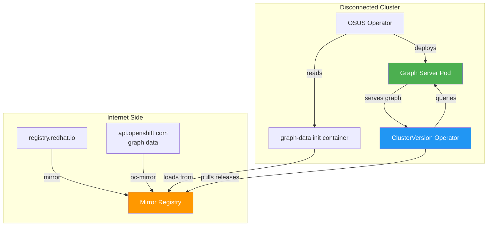

> 💡 **Quick Answer:** The OpenShift Update Service (OSUS) operator deploys a local Cincinnati-compatible graph server inside your disconnected cluster. It serves the same upgrade path graph that connected clusters get from `api.openshift.com`, but using locally mirrored graph-data and release images. Install the operator, mirror the graph-data container image, create an `UpdateService` CR, and point your `ClusterVersion` upstream to the local service.

## The Problem

Connected OpenShift clusters query `api.openshift.com` to discover safe upgrade paths. Disconnected (air-gapped) clusters can't reach this endpoint, which means:

- `oc adm upgrade` shows no available updates
- The ClusterVersion operator can't determine valid upgrade paths
- Administrators have no visibility into which versions are reachable
- Blind upgrades risk hitting blocked paths or missing required intermediate hops
- No conditional update warnings — you might hit known bugs

## The Solution

### Architecture



### Step 1: Mirror the Graph-Data Image

The graph-data image contains the entire upgrade graph (all channels, all architectures). It's updated by Red Hat whenever new releases or edges are added.

```bash
# On a connected bastion host with access to both registries

# Mirror graph-data image to your internal registry
oc image mirror \
  registry.redhat.io/openshift-update-service/graph-data:latest \
  quay.example.com/openshift-update-service/graph-data:latest

# Verify the mirror
skopeo inspect docker://quay.example.com/openshift-update-service/graph-data:latest \
  | jq '.Created'
```

**Automate this** — the graph-data image is updated frequently. Set up a cron job:

```bash
#!/bin/bash
# mirror-graph-data.sh — run weekly or before planned upgrades
set -euo pipefail

SRC="registry.redhat.io/openshift-update-service/graph-data:latest"
DST="quay.example.com/openshift-update-service/graph-data:latest"

echo "[$(date)] Mirroring graph-data..."
oc image mirror "$SRC" "$DST" --keep-manifest-list=true

# Tag with date for rollback
DATE_TAG=$(date +%Y%m%d)
oc image mirror "$SRC" "${DST%:*}:${DATE_TAG}"

echo "[$(date)] Done. Latest graph-data mirrored."
```

### Step 2: Mirror Release Images

You need the actual OCP release images for every version in your planned upgrade path:

```bash
# Mirror a specific release
oc adm release mirror \
  --from=quay.io/openshift-release-dev/ocp-release:4.14.42-x86_64 \
  --to=quay.example.com/openshift-release-dev/ocp-release \
  --to-release-image=quay.example.com/openshift-release-dev/ocp-release:4.14.42-x86_64

# Or use oc-mirror for batch mirroring
cat > imageset-config.yaml << 'EOF'
apiVersion: mirror.openshift.io/v1alpha2
kind: ImageSetConfiguration
mirror:
  platform:
    channels:
    - name: stable-4.14
      minVersion: 4.14.38
      maxVersion: 4.14.42
    - name: stable-4.15
      minVersion: 4.15.30
      maxVersion: 4.15.35
    - name: eus-4.16
      minVersion: 4.16.10
      maxVersion: 4.16.15
    graph: true  # Include graph-data image
EOF

oc mirror --config=imageset-config.yaml \
  docker://quay.example.com
```

### Step 3: Install the OSUS Operator

```yaml
# Namespace
apiVersion: v1
kind: Namespace
metadata:
  name: openshift-update-service
  annotations:
    openshift.io/node-selector: ""
  labels:
    openshift.io/cluster-monitoring: "true"

---
# OperatorGroup
apiVersion: operators.coreos.com/v1
kind: OperatorGroup
metadata:
  name: update-service-operator
  namespace: openshift-update-service
spec:
  targetNamespaces:
  - openshift-update-service

---
# Subscription
apiVersion: operators.coreos.com/v1alpha1
kind: Subscription
metadata:
  name: cincinnati-operator
  namespace: openshift-update-service
spec:
  channel: v1
  installPlanApproval: Manual
  name: cincinnati-operator
  source: redhat-operators
  sourceNamespace: openshift-marketplace
```

```bash
kubectl apply -f osus-operator.yaml

# Approve the install plan (Manual approval for production)
kubectl get installplan -n openshift-update-service
kubectl patch installplan <plan-name> -n openshift-update-service \
  --type merge -p '{"spec":{"approved":true}}'

# Wait for operator
kubectl get pods -n openshift-update-service -w
# NAME                                          READY   STATUS
# update-service-operator-xxxxxxx               1/1     Running
```

### Step 4: Create the UpdateService Instance

```yaml
apiVersion: updateservice.operator.openshift.io/v1
kind: UpdateService
metadata:
  name: update-service
  namespace: openshift-update-service
spec:
  replicas: 2                # HA for production
  releases: quay.example.com/openshift-release-dev/ocp-release
  graphDataImage: quay.example.com/openshift-update-service/graph-data:latest
```

```bash
kubectl apply -f update-service-cr.yaml

# Wait for the graph server pods
kubectl get pods -n openshift-update-service
# NAME                                          READY   STATUS
# update-service-operator-xxxxxxx               1/1     Running
# update-service-xxxxxxx-xxxxx                  1/1     Running
# update-service-xxxxxxx-xxxxx                  1/1     Running

# Get the service URL
kubectl get route -n openshift-update-service
# NAME              HOST/PORT
# update-service    update-service-openshift-update-service.apps.cluster.example.com
```

### Step 5: Configure ClusterVersion to Use Local OSUS

```bash
# Get the OSUS route (with CA if using custom certs)
OSUS_URL="https://$(kubectl get route update-service -n openshift-update-service -o jsonpath='{.spec.host}')/api/upgrades_info/v1/graph"

# Point ClusterVersion to local OSUS
oc patch clusterversion version --type merge -p "{
  \"spec\": {
    \"upstream\": \"${OSUS_URL}\"
  }
}"

# Verify — should now show available updates
oc adm upgrade
```

If using a custom CA for the internal registry:

```bash
# Create a ConfigMap with the CA bundle
oc create configmap custom-ca \
  --from-file=updateservice-registry=ca-bundle.crt \
  -n openshift-config

# Reference it in the cluster proxy
oc patch proxy/cluster --type merge -p '{
  "spec": {
    "trustedCA": {
      "name": "custom-ca"
    }
  }
}'
```

### Step 6: Verify the Graph is Serving

```bash
# Query the local graph endpoint
OSUS_ROUTE=$(kubectl get route update-service -n openshift-update-service -o jsonpath='{.spec.host}')

# Get graph for your channel
curl -sk "https://${OSUS_ROUTE}/api/upgrades_info/v1/graph?channel=stable-4.14&arch=amd64" \
  | jq '.nodes | length'
# 45  (number of versions in the graph)

# Find your current version in the graph
CURRENT=$(oc get clusterversion -o jsonpath='{.items[0].status.desired.version}')
curl -sk "https://${OSUS_ROUTE}/api/upgrades_info/v1/graph?channel=stable-4.14&arch=amd64" \
  | jq --arg v "$CURRENT" '[.nodes[] | select(.version == $v)] | length'
# 1  (your version exists in the graph)

# List all reachable versions from current
curl -sk "https://${OSUS_ROUTE}/api/upgrades_info/v1/graph?channel=stable-4.14&arch=amd64" \
  | jq --arg v "$CURRENT" '
    (.nodes | to_entries | map({key: .key, value: .value.version})) as $nodes |
    ($nodes | map(select(.value == $v)) | .[0].key) as $idx |
    [.edges[] | select(.[0] == ($idx | tonumber)) | .[1]] as $targets |
    [$nodes[] | select(.key as $k | $targets | map(tostring) | index($k))] |
    map(.value) | sort
  '
```

### Monitoring OSUS Health

```yaml
# ServiceMonitor for OSUS metrics
apiVersion: monitoring.coreos.com/v1
kind: ServiceMonitor
metadata:
  name: update-service-monitor
  namespace: openshift-update-service
spec:
  selector:
    matchLabels:
      app: update-service
  endpoints:
  - port: metrics
    interval: 30s
```

```bash
# Quick health check script
#!/bin/bash
echo "=== OSUS Pods ==="
kubectl get pods -n openshift-update-service -o wide

echo ""
echo "=== Graph Freshness ==="
OSUS_ROUTE=$(kubectl get route update-service -n openshift-update-service -o jsonpath='{.spec.host}')
GRAPH_DATE=$(skopeo inspect docker://quay.example.com/openshift-update-service/graph-data:latest 2>/dev/null | jq -r '.Created')
echo "Graph-data image created: $GRAPH_DATE"

echo ""
echo "=== ClusterVersion Upstream ==="
oc get clusterversion -o jsonpath='{.items[0].spec.upstream}'
echo ""

echo ""
echo "=== Available Updates ==="
oc adm upgrade 2>&1 | head -15
```

### Refreshing the Graph

When Red Hat publishes new releases or upgrade edges:

```bash
# 1. Re-mirror graph-data on bastion
oc image mirror \
  registry.redhat.io/openshift-update-service/graph-data:latest \
  quay.example.com/openshift-update-service/graph-data:latest

# 2. Restart OSUS pods to pick up new graph-data
kubectl rollout restart deployment -n openshift-update-service -l app=update-service

# 3. Verify new versions appear
oc adm upgrade
```

## Common Issues

**"No updates available" after setting upstream**

The graph-data image may be stale or the release images aren't mirrored. Verify: (1) graph-data was recently mirrored, (2) your channel is set correctly, (3) the release images for target versions exist in your mirror registry.

**OSUS pod CrashLooping**

Check if the `graphDataImage` is accessible from within the cluster. Run `kubectl logs -n openshift-update-service <pod>` — common cause is image pull failure due to missing pull secret or untrusted CA.

**Certificate errors querying OSUS route**

The OSUS route uses the cluster's default ingress certificate. If using a custom CA, ensure it's in the cluster proxy's `trustedCA` ConfigMap and the ClusterVersion operator trusts it.

**Graph shows versions but release pull fails**

You mirrored the graph but not the actual release images. Use `oc adm release mirror` for every version in your planned path. The graph tells you which versions exist — you still need the images.

## Best Practices

- **Mirror graph-data weekly** — new edges and conditional updates appear frequently
- **Use `oc-mirror` with `graph: true`** — mirrors releases and graph-data in one operation
- **Set `replicas: 2`** for production OSUS — availability matters during upgrades
- **Use `installPlanApproval: Manual`** — control when the OSUS operator itself upgrades
- **Tag graph-data with dates** — enables rollback to a known-good graph if issues arise
- **Test the full upgrade path in staging** — mirror, OSUS, and upgrade before production
- **Document your mirror cron schedule** — stale mirrors are the #1 cause of "no updates"

## Key Takeaways

- OSUS is the official way to serve upgrade graphs in disconnected OpenShift environments
- Three things to mirror: graph-data image, release images, and operator catalog
- The graph-data image changes frequently — automate mirroring with cron
- ClusterVersion `spec.upstream` points to the local OSUS route
- Always verify the graph is serving and your version is present before starting upgrades
- Combine with `oc-mirror` + `ImageSetConfiguration` for a fully automated mirror pipeline
