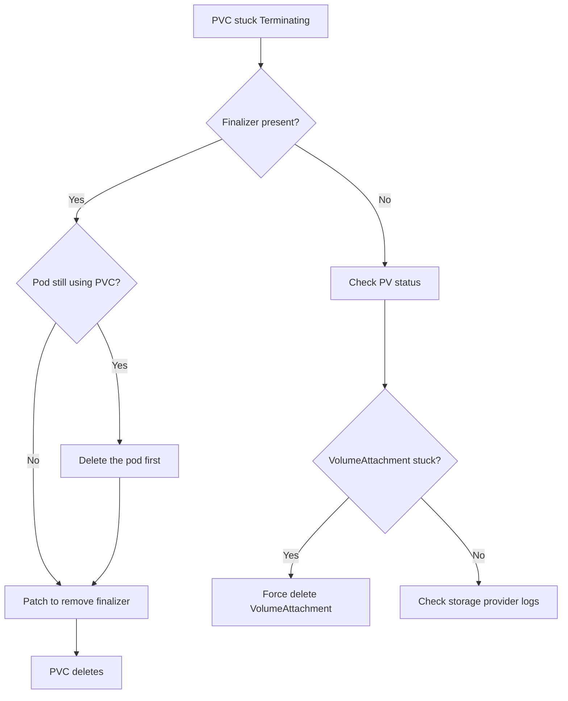

> 💡 **Quick Answer:** PVs/PVCs stuck in Terminating usually have a finalizer preventing deletion. Check `kubectl get pvc <name> -o jsonpath='{.metadata.finalizers}'`. If the volume is safely detached, remove the finalizer with `kubectl patch pvc <name> -p '{"metadata":{"finalizers":null}}'`.

## The Problem

You deleted a PVC or PV but it stays in `Terminating` status indefinitely. New PVCs can't bind to the underlying storage, namespace deletions hang, and storage capacity appears consumed by ghost volumes.

## The Solution

### Step 1: Identify What's Stuck

```bash
# Find stuck PVCs
kubectl get pvc -A | grep Terminating

# Find stuck PVs
kubectl get pv | grep Terminating

# Check finalizers on a stuck PVC
kubectl get pvc my-data -n myapp -o json | jq '.metadata.finalizers'
# ["kubernetes.io/pvc-protection"]   ← This finalizer prevents deletion while a pod mounts it
```

### Step 2: Check If a Pod Is Still Using It

```bash
# The pvc-protection finalizer stays until no pod references the PVC
kubectl get pods -n myapp -o json | jq -r '
  .items[] |
  select(.spec.volumes[]?.persistentVolumeClaim.claimName == "my-data") |
  .metadata.name
'
# my-app-0   ← This pod still mounts the PVC — delete the pod first
```

### Step 3: Remove the Finalizer (If Safe)

```bash
# Only after confirming no pod uses the PVC:
kubectl patch pvc my-data -n myapp --type merge -p '{"metadata":{"finalizers":null}}'

# For PVs:
kubectl patch pv pv-my-data --type merge -p '{"metadata":{"finalizers":null}}'
```

### Step 4: Handle Stuck PV with External Storage

```bash
# If PV is stuck because the storage backend can't detach:
kubectl describe pv pv-my-data | grep -A5 "Events:"
# Warning  VolumeFailedDetach  detach volume failed: rpc error: ...

# Force detach the volume attachment
kubectl get volumeattachment | grep pv-my-data
kubectl delete volumeattachment <attachment-name> --force --grace-period=0
```



## Common Issues

### PV Stuck After Node Deletion

The volume was attached to a node that no longer exists. Force-delete the VolumeAttachment object.

### ReclaimPolicy: Retain Prevents PV Cleanup

```bash
kubectl get pv pv-my-data -o jsonpath='{.spec.persistentVolumeReclaimPolicy}'
# Retain — PV won't be deleted even after PVC is gone
# Change to Delete if you want automatic cleanup:
kubectl patch pv pv-my-data -p '{"spec":{"persistentVolumeReclaimPolicy":"Delete"}}'
```

### CSI Driver Pod Down

If the CSI driver managing the volume is unhealthy, detach/delete operations fail silently. Restart the CSI driver pods.

## Best Practices

- **Don't remove finalizers blindly** — always verify no pod is using the volume first
- **Check VolumeAttachments** before removing PV finalizers — orphaned attachments cause data corruption
- **Use `reclaimPolicy: Delete`** for ephemeral storage, `Retain` for data you want to keep
- **Monitor CSI driver health** — unhealthy drivers cause stuck volumes

## Key Takeaways

- `kubernetes.io/pvc-protection` finalizer prevents deletion while a pod mounts the PVC
- Delete the pod first, then the finalizer clears automatically
- Force-removing finalizers is safe only after confirming detachment
- VolumeAttachment objects can also block PV deletion — check and force-delete if needed
