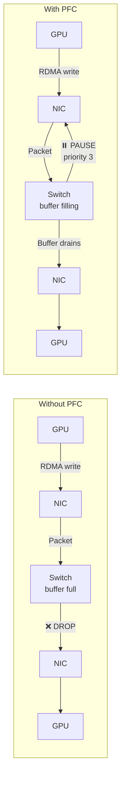

> 💡 **Quick Answer:** Enable PFC on Mellanox ConnectX NICs using `mlnx_qos -i <interface> --pfc 0,0,0,1,0,0,0,0` to make priority 3 lossless (RoCE default). Set DSCP trust mode with `mlnx_qos -i <interface> --trust dscp` so packets are classified by DSCP value (26/AF31 → priority 3). Verify with `mlnx_qos -i <interface>` and check PFC counters via `ethtool -S <interface> | grep prio3`.

## The Problem

RoCE (RDMA over Converged Ethernet) requires a **lossless** network fabric. Unlike InfiniBand which is lossless by design, Ethernet drops packets under congestion. PFC (Priority Flow Control / IEEE 802.1Qbb) pauses specific traffic classes when buffers fill, preventing drops. Without PFC, RoCE performance degrades severely — NCCL all-reduce operations retry endlessly, GPU training throughput collapses.



## Prerequisites

```bash
# Check NIC model
lspci | grep Mellanox
# 86:00.0 Ethernet controller: Mellanox Technologies MT2910 Family [ConnectX-7]

# Check firmware version (PFC requires firmware support)
ethtool -i ens8f0np0
# driver: mlx5_core
# version: 5.9-0.5.9.0
# firmware-version: 28.39.1002

# Install Mellanox tools (if not present)
# RHEL/Rocky:
yum install -y mstflint mlnx-tools
# Ubuntu:
apt install -y mstflint mlnx-tools
```

## Step 1: Set Trust Mode to DSCP

By default, NICs trust PCP (VLAN priority bits / Layer 2). For RoCE, you want **DSCP trust** (Layer 3) — works without VLAN tagging:

```bash
# Check current trust mode
mlnx_qos -i ens8f0np0
# Trust state: pcp    ← Default, Layer 2 (requires VLAN tags)

# Switch to DSCP trust
mlnx_qos -i ens8f0np0 --trust dscp
# Trust state: dscp   ← Now classifies by IP DSCP field

# Verify
mlnx_qos -i ens8f0np0 | grep -i trust
# Trust state: dscp
```

### Why DSCP Over PCP?

| Mode | Layer | Requires VLAN | Works Routed | RoCE Default |
|------|-------|---------------|-------------|-------------|
| **PCP** (802.1p) | L2 | ✅ Yes | ❌ No | No |
| **DSCP** | L3 | ❌ No | ✅ Yes | **Yes** |

RoCE v2 sets DSCP 26 (AF31) by default → maps to priority 3. DSCP trust reads this value and places traffic in the correct queue.

## Step 2: Enable PFC on Priority 3

```bash
# Current PFC state (all disabled by default)
mlnx_qos -i ens8f0np0
# PFC configuration:
#   priority:  0  1  2  3  4  5  6  7
#   enabled:   0  0  0  0  0  0  0  0

# Enable PFC on priority 3 ONLY
mlnx_qos -i ens8f0np0 --pfc 0,0,0,1,0,0,0,0
# PFC configuration:
#   priority:  0  1  2  3  4  5  6  7
#   enabled:   0  0  0  1  0  0  0  0

# ⚠️ Do NOT enable PFC on all priorities — wastes buffer space
# Only priority 3 needs to be lossless for RoCE
```

### Understanding the Priority Mapping

```
DSCP 26 (AF31) → Traffic Class 3 → Priority 3 → PFC enabled
                                                    ↓
                                              LOSSLESS ✅

DSCP 0 (Best Effort) → Traffic Class 0 → Priority 0 → PFC disabled
                                                          ↓
                                                    LOSSY (normal) ✅
```

## Step 3: Configure ETS (Enhanced Transmission Selection)

ETS allocates bandwidth between traffic classes:

```bash
# Check current ETS
mlnx_qos -i ens8f0np0
# tc: 0  1  2  3  4  5  6  7
# bw: 100 0  0  0  0  0  0  0   ← All bandwidth on TC0

# Allocate 30% to RoCE (TC3), 70% to best-effort (TC0)
mlnx_qos -i ens8f0np0 \
  --tc_bw 70,0,0,30,0,0,0,0 \
  --tsa ets,strict,strict,ets,strict,strict,strict,strict

# tsa options:
#   ets    = Enhanced Transmission Selection (bandwidth guaranteed)
#   strict = Strict priority (always served first if queued)

# Verify
mlnx_qos -i ens8f0np0
# ETS/BW:
#   tc:  0   1   2   3   4   5   6   7
#   bw:  70  0   0   30  0   0   0   0
#   tsa: ets str str ets str str str str
```

## Step 4: Map DSCP to Priority

Ensure DSCP 26 (decimal) maps to priority 3:

```bash
# Show current DSCP-to-priority mapping
mlnx_qos -i ens8f0np0 --dscp2prio
# DSCP  Priority
# 0     0
# ...
# 26    3    ← Should be 3 (default for RoCE)
# ...

# If mapping is wrong, set it explicitly:
mlnx_qos -i ens8f0np0 --dscp2prio set,26,3

# For GDR (GPUDirect RDMA) traffic which may use different DSCP:
mlnx_qos -i ens8f0np0 --dscp2prio set,24,3    # CS3 → priority 3
mlnx_qos -i ens8f0np0 --dscp2prio set,26,3    # AF31 → priority 3
mlnx_qos -i ens8f0np0 --dscp2prio set,34,3    # AF41 → priority 3
```

## Step 5: Enable ECN (Explicit Congestion Notification)

ECN works alongside PFC — marks packets instead of dropping, reducing PFC pause frame frequency:

```bash
# Enable ECN on TC3 (RoCE traffic class)
echo 1 > /sys/class/net/ens8f0np0/ecn/roce_np/enable/3
echo 1 > /sys/class/net/ens8f0np0/ecn/roce_rp/enable/3

# Set ECN thresholds (in KB)
# min_threshold: Start marking ECN at this buffer level
# max_threshold: Mark all packets above this level
echo 150 > /sys/class/net/ens8f0np0/ecn/roce_np/min_threshold/3    # 150KB
echo 1500 > /sys/class/net/ens8f0np0/ecn/roce_np/max_threshold/3   # 1500KB

# Verify ECN
cat /sys/class/net/ens8f0np0/ecn/roce_np/enable/3
# 1
cat /sys/class/net/ens8f0np0/ecn/roce_rp/enable/3
# 1
```

### PFC + ECN Together


ECN reacts **before** PFC kicks in → fewer pause frames → better throughput.

## Step 6: Configure RoCE Mode

```bash
# Check current RoCE mode
cma_roce_mode -d mlx5_0
# RoCE mode: RoCE v2    ← Correct (uses UDP/IP, DSCP-aware)

# If it shows RoCE v1, switch to v2:
cma_roce_mode -d mlx5_0 -m 2

# Verify
cma_roce_mode -d mlx5_0
# RoCE mode: RoCE v2
```

| RoCE Version | Layer | DSCP Support | Routable | Use When |
|-------------|-------|-------------|----------|----------|
| RoCE v1 | L2 (Ethertype) | ❌ No | ❌ Same subnet | Legacy only |
| **RoCE v2** | L3 (UDP:4791) | ✅ Yes | ✅ Routed | **Always** |

## Verification

### Check PFC Configuration

```bash
# Full QoS dump
mlnx_qos -i ens8f0np0
# Trust state: dscp
# PFC configuration:
#   priority:  0  1  2  3  4  5  6  7
#   enabled:   0  0  0  1  0  0  0  0
# ETS/BW:
#   tc:  0   1   2   3   4   5   6   7
#   bw:  70  0   0   30  0   0   0   0
#   tsa: ets str str ets str str str str
```

### Check PFC Counters

```bash
# PFC pause frames sent/received
ethtool -S ens8f0np0 | grep prio3
# rx_prio3_pause:  142       ← Pause frames received (switch told us to pause)
# tx_prio3_pause:  87        ← Pause frames sent (we told switch to pause)
# rx_prio3_bytes:  5849302847
# tx_prio3_bytes:  4928100234

# Non-zero pause counters = PFC is working
# Very high pause counts = congestion — check switch buffers or ECN thresholds

# Compare with lossy priorities (should have no pause frames)
ethtool -S ens8f0np0 | grep prio0
# rx_prio0_pause:  0         ← No PFC on priority 0 (expected)
# tx_prio0_pause:  0
```

### Check for Drops (Should Be Zero on Priority 3)

```bash
# Check for drops on the RDMA interface
ethtool -S ens8f0np0 | grep -E "drop|discard"
# rx_discards_phy: 0         ← ✅ No drops
# tx_discards_phy: 0

# Per-priority drops
ethtool -S ens8f0np0 | grep prio3_discard
# rx_prio3_discards: 0       ← ✅ Lossless working

# If you see drops on priority 3, PFC is not working end-to-end
# Check: NIC config → cable → switch port → switch QoS
```

### RDMA Connectivity Test

```bash
# On server 1 (receiver):
ib_write_bw -d mlx5_0 --report_gbits

# On server 2 (sender):
ib_write_bw -d mlx5_0 10.10.1.10 --report_gbits
# Bandwidth: 195.4 Gb/s    ← Near line-rate for 200Gb HDR

# If bandwidth is significantly lower, check PFC counters
# High pause count = congestion somewhere in the path
```

## Make Configuration Persistent

mlnx_qos settings are **lost on reboot**. Persist them:

### Option A: NetworkManager Dispatcher Script

```bash
cat > /etc/NetworkManager/dispatcher.d/99-rdma-qos << 'EOF'
#!/bin/bash
# Persist PFC/QoS settings for RDMA interfaces
IFACE=$1
ACTION=$2

if [[ "$ACTION" == "up" && "$IFACE" =~ ^ens[0-9]+f[0-9]+ ]]; then
    sleep 2  # Wait for interface to fully initialize
    mlnx_qos -i "$IFACE" --trust dscp
    mlnx_qos -i "$IFACE" --pfc 0,0,0,1,0,0,0,0
    mlnx_qos -i "$IFACE" --tc_bw 70,0,0,30,0,0,0,0 --tsa ets,strict,strict,ets,strict,strict,strict,strict
    
    # ECN
    echo 1 > /sys/class/net/"$IFACE"/ecn/roce_np/enable/3
    echo 1 > /sys/class/net/"$IFACE"/ecn/roce_rp/enable/3
    
    logger "RDMA QoS configured for $IFACE"
fi
EOF
chmod +x /etc/NetworkManager/dispatcher.d/99-rdma-qos
```

### Option B: systemd Service

```bash
cat > /etc/systemd/system/rdma-qos.service << 'EOF'
[Unit]
Description=Configure RDMA PFC/QoS on Mellanox NICs
After=network-online.target
Wants=network-online.target

[Service]
Type=oneshot
RemainAfterExit=yes
ExecStart=/usr/local/bin/configure-rdma-qos.sh

[Install]
WantedBy=multi-user.target
EOF

cat > /usr/local/bin/configure-rdma-qos.sh << 'EOF'
#!/bin/bash
set -euo pipefail

# Configure all Mellanox interfaces
for iface in $(ls /sys/class/net/ | grep -E '^ens[0-9]+f'); do
    if ethtool -i "$iface" 2>/dev/null | grep -q mlx5_core; then
        echo "Configuring PFC/QoS on $iface"
        mlnx_qos -i "$iface" --trust dscp
        mlnx_qos -i "$iface" --pfc 0,0,0,1,0,0,0,0
        mlnx_qos -i "$iface" --tc_bw 70,0,0,30,0,0,0,0 \
          --tsa ets,strict,strict,ets,strict,strict,strict,strict
        
        # ECN
        echo 1 > /sys/class/net/"$iface"/ecn/roce_np/enable/3 2>/dev/null || true
        echo 1 > /sys/class/net/"$iface"/ecn/roce_rp/enable/3 2>/dev/null || true
    fi
done
EOF
chmod +x /usr/local/bin/configure-rdma-qos.sh

systemctl enable rdma-qos.service
```

### Option C: OpenShift MachineConfig

```yaml
apiVersion: machineconfiguration.openshift.io/v1
kind: MachineConfig
metadata:
  name: 99-rdma-pfc-qos
  labels:
    machineconfiguration.openshift.io/role: worker
spec:
  config:
    ignition:
      version: 3.4.0
    systemd:
      units:
        - name: rdma-qos.service
          enabled: true
          contents: |
            [Unit]
            Description=Configure RDMA PFC/QoS
            After=network-online.target
            [Service]
            Type=oneshot
            RemainAfterExit=yes
            ExecStart=/usr/local/bin/configure-rdma-qos.sh
            [Install]
            WantedBy=multi-user.target
    storage:
      files:
        - path: /usr/local/bin/configure-rdma-qos.sh
          mode: 0755
          contents:
            inline: |
              #!/bin/bash
              for iface in $(ls /sys/class/net/ | grep -E '^ens[0-9]+f'); do
                if ethtool -i "$iface" 2>/dev/null | grep -q mlx5_core; then
                  mlnx_qos -i "$iface" --trust dscp
                  mlnx_qos -i "$iface" --pfc 0,0,0,1,0,0,0,0
                  mlnx_qos -i "$iface" --tc_bw 70,0,0,30,0,0,0,0 \
                    --tsa ets,strict,strict,ets,strict,strict,strict,strict
                  echo 1 > /sys/class/net/"$iface"/ecn/roce_np/enable/3 2>/dev/null || true
                  echo 1 > /sys/class/net/"$iface"/ecn/roce_rp/enable/3 2>/dev/null || true
                fi
              done
```

## Switch-Side Configuration (Must Match)

PFC must be enabled **end-to-end**: NIC → switch port → switch → switch port → NIC.

```
# Cumulus Linux / NVIDIA Spectrum
cat /etc/cumulus/datapath/traffic.conf
# PFC on priority 3
pfc.pfc_en = 0,0,0,1,0,0,0,0

# Mellanox ONYX (SN series)
interface ethernet 1/1-1/32 traffic-class 3 dcb pfc mode on

# Cisco Nexus
interface Ethernet1/1
  priority-flow-control mode on
  priority-flow-control priority 3 no-drop

# Arista EOS
interface Ethernet1
  priority-flow-control on
  priority-flow-control priority 3 no-drop
```

**⚠️ If the switch doesn't have PFC enabled on priority 3, NIC-side PFC alone does nothing.** PFC is a hop-by-hop protocol — every device in the path must participate.

## Common Issues

| Issue | Cause | Fix |
|-------|-------|-----|
| `mlnx_qos: command not found` | mlnx-tools not installed | `yum install mlnx-tools` or `apt install mlnx-tools` |
| PFC counters stay 0 | Switch-side PFC not enabled | Configure switch QoS to match |
| Drops on priority 3 | PFC not working end-to-end | Check every hop: NIC → cable → switch → NIC |
| Trust mode resets after reboot | Not persisted | Use systemd service or MachineConfig |
| Low RDMA bandwidth | PFC storms (too many pauses) | Enable ECN, increase switch buffer, check for congestion |
| `cma_roce_mode` not found | `rdma-core` or `libibverbs-utils` missing | Install RDMA userspace tools |
| Wrong DSCP on wire | Application overrides DSCP | Check `NCCL_IB_TC` env var, set to `106` (DSCP 26 in TOS) |

## Best Practices

- **PFC on priority 3 only** — don't make all priorities lossless (wastes buffer)
- **Always use DSCP trust** — works without VLANs, survives routing
- **Enable ECN alongside PFC** — reduces PFC storm frequency
- **Match NIC and switch config exactly** — PFC is hop-by-hop
- **Monitor PFC pause counters** — high counts indicate congestion
- **Persist configuration** — mlnx_qos is lost on reboot
- **Test with ib_write_bw before deploying AI workloads** — verify line-rate bandwidth
- **Use RoCE v2 always** — v1 is L2 only, can't route, no DSCP support

## Key Takeaways

- PFC makes Ethernet lossless for specific priorities — essential for RoCE/RDMA
- `mlnx_qos -i <iface> --trust dscp --pfc 0,0,0,1,0,0,0,0` — the core commands
- DSCP 26 (AF31) → priority 3 → PFC enabled → lossless RoCE
- ECN reduces PFC storms by signaling congestion before buffers fill
- Configuration must match end-to-end: NIC ↔ switch ↔ NIC
- Settings are NOT persistent — use systemd, MachineConfig, or dispatcher scripts
- Verify with `ethtool -S <iface> | grep prio3_pause` — non-zero = PFC working
