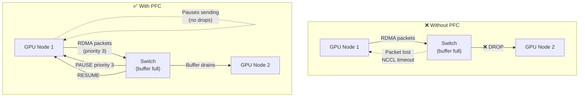

> 💡 **Quick Answer:** Priority Flow Control (PFC) makes RoCEv2 lossless by pausing specific traffic classes instead of dropping packets. On OpenShift/Kubernetes, configure PFC via `NodeNetworkConfigurationPolicy` (NNCP) using the NMState operator. Enable PFC on priority 3 (default RoCE), set jumbo frames (MTU 9000), and configure the switch to match. Without PFC, RoCE performance degrades catastrophically under congestion — TCP retransmits on RDMA destroy throughput.

## The Problem

RoCEv2 (RDMA over Converged Ethernet) runs over standard Ethernet but requires **lossless** behavior for the RDMA traffic class. Regular Ethernet drops packets under congestion — fine for TCP, fatal for RDMA. PFC provides per-priority flow control: when a switch buffer fills for a specific priority, it sends a PAUSE frame to the sender, preventing drops.

Without PFC, a busy Ethernet fabric drops RDMA packets → NCCL retransmits → distributed training throughput drops 10-100× → GPUs sit idle waiting for network.



## The Solution

### Prerequisites

```bash
# NMState operator must be installed
# On OpenShift:
oc get pods -n openshift-nmstate
# NAME                                   READY
# nmstate-handler-xxxxx                  1/1
# nmstate-operator-xxxxx                 1/1

# Or install on vanilla Kubernetes:
kubectl apply -f https://github.com/nmstate/kubernetes-nmstate/releases/latest/download/nmstate.io_nmstates.yaml
kubectl apply -f https://github.com/nmstate/kubernetes-nmstate/releases/latest/download/namespace.yaml
kubectl apply -f https://github.com/nmstate/kubernetes-nmstate/releases/latest/download/service_account.yaml
kubectl apply -f https://github.com/nmstate/kubernetes-nmstate/releases/latest/download/role.yaml
kubectl apply -f https://github.com/nmstate/kubernetes-nmstate/releases/latest/download/role_binding.yaml
kubectl apply -f https://github.com/nmstate/kubernetes-nmstate/releases/latest/download/operator.yaml
```

### Enable PFC on RDMA Interfaces

```yaml
# NodeNetworkConfigurationPolicy — enable PFC priority 3 for RoCE
apiVersion: nmstate.io/v1
kind: NodeNetworkConfigurationPolicy
metadata:
  name: pfc-roce-ens8f0
spec:
  nodeSelector:
    node-role.kubernetes.io/worker: ""
    feature.node.kubernetes.io/network-sriov.capable: "true"
  desiredState:
    interfaces:
      - name: ens8f0                   # RDMA-capable NIC
        type: ethernet
        state: up
        mtu: 9000                      # Jumbo frames required for RDMA
        ethtool:
          pause:
            # Disable global pause (use PFC per-priority instead)
            rx: false
            tx: false
        # PFC configuration via NMState ieee-8021Qaz
        ieee-8021Qaz:
          pfc:
            enabled:
              - 3                      # Enable PFC on priority 3 (RoCE default)
            # Priorities 0-2, 4-7: no PFC (lossy, best-effort)
```

### Full RoCE QoS Configuration

```yaml
# Complete PFC + DSCP + Trust mode configuration
apiVersion: nmstate.io/v1
kind: NodeNetworkConfigurationPolicy
metadata:
  name: roce-qos-full
spec:
  nodeSelector:
    node-role.kubernetes.io/worker: ""
  desiredState:
    interfaces:
      - name: ens8f0
        type: ethernet
        state: up
        mtu: 9000
        ipv4:
          enabled: true
          dhcp: false
          address:
            - ip: 10.0.100.10
              prefix-length: 24
        ethtool:
          pause:
            rx: false
            tx: false
          # Enable ECN (Explicit Congestion Notification)
          feature:
            rx-gro: true
            tx-generic-segmentation: true
        ieee-8021Qaz:
          pfc:
            enabled:
              - 3                      # Lossless priority for RoCE
          ets:
            # Enhanced Transmission Selection — bandwidth allocation
            traffic-classes:
              - priority: 0
                bandwidth: 10          # Best-effort: 10%
              - priority: 3
                bandwidth: 80          # RoCE RDMA: 80%
              - priority: 6
                bandwidth: 10          # Management: 10%
---
# Second NIC (dual-rail RDMA)
apiVersion: nmstate.io/v1
kind: NodeNetworkConfigurationPolicy
metadata:
  name: roce-qos-full-nic2
spec:
  nodeSelector:
    node-role.kubernetes.io/worker: ""
  desiredState:
    interfaces:
      - name: ens8f1
        type: ethernet
        state: up
        mtu: 9000
        ipv4:
          enabled: true
          dhcp: false
          address:
            - ip: 10.0.101.10
              prefix-length: 24
        ethtool:
          pause:
            rx: false
            tx: false
        ieee-8021Qaz:
          pfc:
            enabled:
              - 3
          ets:
            traffic-classes:
              - priority: 0
                bandwidth: 10
              - priority: 3
                bandwidth: 80
              - priority: 6
                bandwidth: 10
```

### DSCP-to-Priority Mapping

RoCEv2 uses DSCP 26 (AF31) by default → maps to priority 3. The NIC must trust DSCP markings:

```yaml
# Configure DSCP trust mode via NMState
apiVersion: nmstate.io/v1
kind: NodeNetworkConfigurationPolicy
metadata:
  name: dscp-trust-roce
spec:
  nodeSelector:
    node-role.kubernetes.io/worker: ""
  desiredState:
    interfaces:
      - name: ens8f0
        type: ethernet
        state: up
        # For Mellanox ConnectX NICs, trust mode is set via sysfs
        # NMState doesn't directly expose trust mode yet —
        # use a MachineConfig or DaemonSet for this part
```

```yaml
# DaemonSet to set trust mode + DSCP mapping on Mellanox NICs
apiVersion: apps/v1
kind: DaemonSet
metadata:
  name: roce-dscp-config
  namespace: kube-system
spec:
  selector:
    matchLabels:
      app: roce-dscp-config
  template:
    metadata:
      labels:
        app: roce-dscp-config
    spec:
      hostNetwork: true
      hostPID: true
      nodeSelector:
        feature.node.kubernetes.io/network-sriov.capable: "true"
      containers:
        - name: config
          image: registry.access.redhat.com/ubi9/ubi-minimal:latest
          command: ["/bin/bash", "-c"]
          args:
            - |
              for dev in ens8f0 ens8f1; do
                # Set trust mode to DSCP (not PCP)
                mlnx_qos -i $dev --trust dscp 2>/dev/null
                
                # Map DSCP 26 (AF31) to priority 3
                mlnx_qos -i $dev --dscp2prio set,26,3 2>/dev/null
                
                # Enable PFC on priority 3
                mlnx_qos -i $dev --pfc 0,0,0,1,0,0,0,0 2>/dev/null
                
                # Verify
                echo "=== $dev ==="
                mlnx_qos -i $dev 2>/dev/null
              done
              
              echo "PFC + DSCP configured. Sleeping..."
              sleep infinity
          securityContext:
            privileged: true
          volumeMounts:
            - name: sys
              mountPath: /sys
      volumes:
        - name: sys
          hostPath:
            path: /sys
      tolerations:
        - operator: Exists
```

### ECN (Explicit Congestion Notification)

PFC prevents packet drops but can cause head-of-line blocking. ECN marks packets instead of dropping them, allowing endpoints to react before PFC kicks in:

```yaml
# Enable ECN on RoCE interfaces
apiVersion: nmstate.io/v1
kind: NodeNetworkConfigurationPolicy
metadata:
  name: ecn-roce
spec:
  nodeSelector:
    node-role.kubernetes.io/worker: ""
  desiredState:
    interfaces:
      - name: ens8f0
        type: ethernet
        state: up
        # ECN is enabled at the IP level on the host
        # Set via sysctl
---
# MachineConfig for ECN sysctl (OpenShift)
apiVersion: machineconfiguration.openshift.io/v1
kind: MachineConfig
metadata:
  name: 99-ecn-roce
  labels:
    machineconfiguration.openshift.io/role: worker
spec:
  config:
    ignition:
      version: 3.2.0
    storage:
      files:
        - path: /etc/sysctl.d/99-ecn-roce.conf
          mode: 0644
          contents:
            source: data:text/plain;charset=utf-8;base64,bmV0LmlwdjQudGNwX2Vjbj0xCg==
          # Decoded: net.ipv4.tcp_ecn=1
```

### Bonded Interface with PFC

```yaml
# PFC on a bonded RDMA interface (dual-port for redundancy)
apiVersion: nmstate.io/v1
kind: NodeNetworkConfigurationPolicy
metadata:
  name: pfc-bond-roce
spec:
  nodeSelector:
    node-role.kubernetes.io/worker: ""
  desiredState:
    interfaces:
      - name: bond-rdma
        type: bond
        state: up
        mtu: 9000
        ipv4:
          enabled: true
          dhcp: false
          address:
            - ip: 10.0.100.10
              prefix-length: 24
        link-aggregation:
          mode: 802.3ad              # LACP
          options:
            miimon: "100"
            xmit_hash_policy: layer3+4
          port:
            - ens8f0
            - ens8f1
        ieee-8021Qaz:
          pfc:
            enabled:
              - 3
          ets:
            traffic-classes:
              - priority: 3
                bandwidth: 80
              - priority: 0
                bandwidth: 20
      # Member interfaces also need PFC
      - name: ens8f0
        type: ethernet
        state: up
        mtu: 9000
        ieee-8021Qaz:
          pfc:
            enabled:
              - 3
      - name: ens8f1
        type: ethernet
        state: up
        mtu: 9000
        ieee-8021Qaz:
          pfc:
            enabled:
              - 3
```

### Switch-Side Configuration (Must Match)

PFC must be configured end-to-end: NIC ↔ Switch ↔ NIC. The switch must enable PFC on the same priority:

```
! Cisco Nexus example
interface Ethernet1/1-48
  mtu 9216
  priority-flow-control mode on
  priority-flow-control priority 3 no-drop
  
! Mellanox/NVIDIA Spectrum
interface ethernet 1/1-48
  dcb priority-flow-control enable force
  dcb priority-flow-control priority 3 enable
  dcb ets traffic-class 3 bandwidth 80
  
! Arista
interface Ethernet1-48
  priority-flow-control on
  priority-flow-control priority 3 no-drop
```

### Verify PFC is Working

```bash
# 1. Check PFC status on NIC
mlnx_qos -i ens8f0
# Expected output:
# PFC configuration:
#   priority:  0  1  2  3  4  5  6  7
#   enabled:   0  0  0  1  0  0  0  0
#
# tc: 0 ratelimit: unlimited, tsa: vendor
# tc: 3 ratelimit: unlimited, tsa: ets, bw: 80%

# 2. Check PFC counters (should see pause frames)
ethtool -S ens8f0 | grep -i pfc
# rx_pfc_pri3_packets: 1247
# tx_pfc_pri3_packets: 983
# If counters increase during training → PFC is actively preventing drops ✅

# 3. Check for PFC storms (too many pause frames = problem)
watch -n 1 'ethtool -S ens8f0 | grep -i "pfc\|pause"'

# 4. Verify via NMState
kubectl get nnce <node-name>.pfc-roce-ens8f0 -o yaml | grep -A10 ieee-8021Qaz

# 5. Verify lossless with NCCL
NCCL_DEBUG=INFO NCCL_DEBUG_SUBSYS=NET python -c "
import torch.distributed as dist
# ... run all-reduce
" 2>&1 | grep -E "NET/IB|GDRDMA"
# NET/IB = RDMA active ✅
# Check no retransmit warnings in NCCL logs
```

### NMState NodeNetworkState — Read Current Config

```bash
# Check current PFC state on a node
kubectl get nns <node-name> -o yaml | grep -A20 ieee-8021Qaz

# Or for all nodes
for node in $(kubectl get nodes -l node-role.kubernetes.io/worker -o name); do
  echo "=== ${node} ==="
  kubectl get nns ${node#node/} -o jsonpath='{.status.currentState.interfaces[*].ieee-8021Qaz}' 2>/dev/null
  echo
done
```

## PFC Priority Mapping Reference

| Priority | Typical Use | PFC Enabled? |
|----------|-------------|--------------|
| 0 | Best-effort (default) | No (lossy) |
| 1 | Background | No |
| 2 | Excellent effort | No |
| **3** | **RoCEv2 / RDMA** | **Yes (lossless)** |
| 4 | Video streaming | No |
| 5 | Voice | Optional |
| 6 | Network control | No |
| 7 | Highest priority | No |

**Standard mapping:** RoCEv2 default DSCP 26 (AF31) → Priority 3 → PFC enabled on priority 3.

## Common Issues

| Issue | Cause | Fix |
|-------|-------|-----|
| PFC counters all zero | PFC not negotiated with switch | Verify switch-side PFC config matches priority 3 |
| PFC storm (continuous pauses) | Slow receiver or buffer misconfigured | Check ECN, increase switch buffer, verify no asymmetric links |
| RDMA works but slow | PFC disabled, packets dropping silently | Enable PFC, check `ethtool -S` for drops |
| `ieee-8021Qaz` not in NMState | NMState version too old | Upgrade NMState operator ≥ 2.2 |
| NNCP stuck in `Progressing` | NIC doesn't support DCB/PFC | Verify `ethtool -i ens8f0` shows mlx5_core driver |
| Trust mode wrong | NIC trusting PCP instead of DSCP | Run `mlnx_qos -i ens8f0 --trust dscp` |

## Best Practices

- **Enable PFC on priority 3 only** — making all priorities lossless wastes buffer and risks PFC storms
- **Always configure the switch to match** — PFC is end-to-end, both sides must agree
- **Use ECN alongside PFC** — ECN reacts before buffers fill, reducing PFC frequency
- **Set MTU 9000 on both NIC and switch** — jumbo frames are essential for RDMA throughput
- **Monitor PFC counters** — some pauses are normal, continuous pauses indicate a problem
- **Trust DSCP, not PCP** — DSCP is preserved end-to-end across routed networks
- **Test with ib_write_bw under congestion** — PFC should maintain lossless behavior even under load
- **One lossless priority per network** — don't enable PFC on multiple priorities unless you need FCoE + RDMA

## Key Takeaways

- PFC makes RoCEv2 lossless by pausing specific traffic priorities instead of dropping
- Configure via NNCP (NMState) on Kubernetes/OpenShift — `ieee-8021Qaz.pfc.enabled: [3]`
- Default RoCE mapping: DSCP 26 → Priority 3 → PFC lossless
- Switch must match: enable no-drop on priority 3 and allocate 80% bandwidth
- Use `mlnx_qos -i <dev>` and `ethtool -S <dev> | grep pfc` to verify
- Without PFC, RoCE drops packets under congestion → NCCL throughput collapses
- ECN + PFC together give the best performance: ECN reacts early, PFC is the safety net
