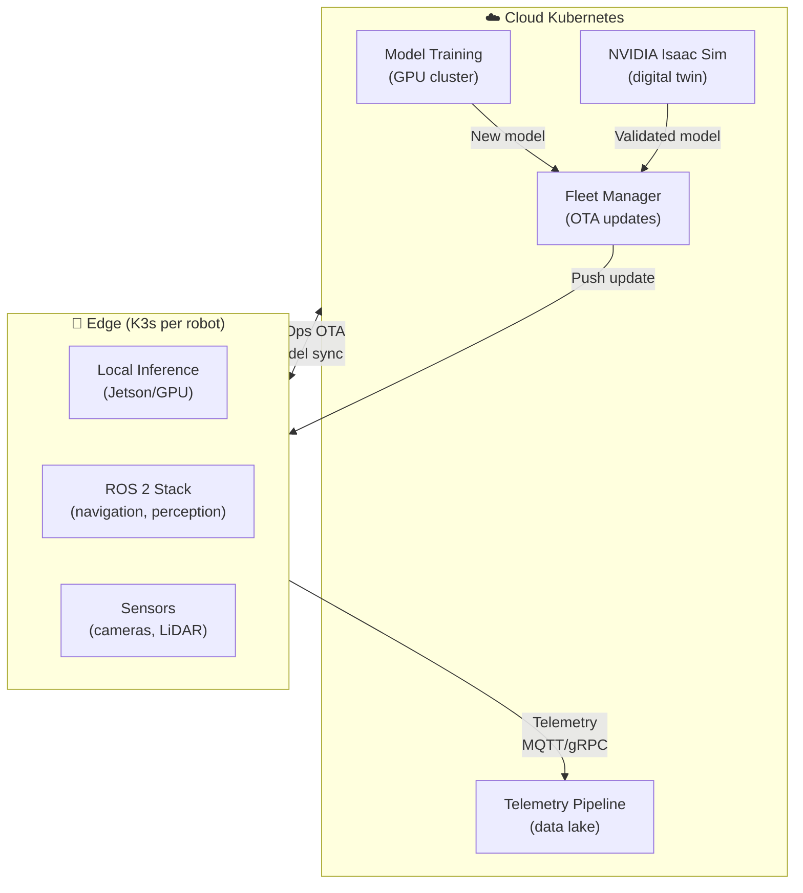

> 💡 **Quick Answer:** Physical AI deploys AI models into robots, drones, and autonomous vehicles. Kubernetes orchestrates the cloud side: model training, simulation (NVIDIA Isaac Sim), fleet OTA updates, telemetry collection, and edge node management. ROS 2 workloads run as pods with DDS networking, while K3s/MicroK8s runs on edge devices for local inference.

## The Problem

AI is moving off screens into the physical world — warehouse robots, delivery drones, autonomous forklifts, and smart factories. These systems need: cloud infrastructure for training and simulation, edge computing for real-time inference, fleet management for hundreds of robots, OTA model updates, and telemetry pipelines. Kubernetes provides the orchestration layer across cloud and edge.



## The Solution

### ROS 2 on Kubernetes

```yaml
# ROS 2 navigation stack as a Kubernetes Deployment
apiVersion: apps/v1
kind: Deployment
metadata:
  name: robot-navigation
spec:
  template:
    spec:
      hostNetwork: true              # DDS needs multicast
      dnsPolicy: ClusterFirstWithHostNet
      containers:
        - name: nav2
          image: myorg/ros2-nav2:humble
          env:
            - name: ROS_DOMAIN_ID
              value: "42"
            - name: RMW_IMPLEMENTATION
              value: "rmw_cyclonedds_cpp"
            - name: CYCLONEDDS_URI
              value: "/config/cyclonedds.xml"
          volumeMounts:
            - name: dds-config
              mountPath: /config
          resources:
            requests:
              cpu: "2"
              memory: "4Gi"
        
        # Perception with GPU inference
        - name: perception
          image: myorg/ros2-perception:humble
          env:
            - name: MODEL_PATH
              value: "/models/yolov8-robotics.onnx"
          resources:
            limits:
              nvidia.com/gpu: 1      # Jetson or discrete GPU
          volumeMounts:
            - name: models
              mountPath: /models
      volumes:
        - name: dds-config
          configMap:
            name: cyclonedds-config
        - name: models
          persistentVolumeClaim:
            claimName: perception-models
```

### NVIDIA Isaac Sim on Cloud K8s

```yaml
# Digital twin simulation for robot testing
apiVersion: batch/v1
kind: Job
metadata:
  name: isaac-sim-test
spec:
  template:
    spec:
      containers:
        - name: isaac-sim
          image: nvcr.io/nvidia/isaac-sim:4.2.0
          env:
            - name: ACCEPT_EULA
              value: "Y"
            - name: SCENARIO
              value: "/scenarios/warehouse-navigation.usd"
          resources:
            limits:
              nvidia.com/gpu: 1
          ports:
            - containerPort: 8211    # Streaming
      restartPolicy: Never
```

### Fleet OTA Updates via GitOps

```yaml
# FluxCD syncs model updates to edge clusters
apiVersion: source.toolkit.fluxcd.io/v1
kind: GitRepository
metadata:
  name: robot-fleet-config
spec:
  interval: 5m
  url: https://github.com/myorg/robot-fleet
  ref:
    branch: production
---
apiVersion: kustomize.toolkit.fluxcd.io/v1
kind: Kustomization
metadata:
  name: robot-models
spec:
  interval: 10m
  sourceRef:
    kind: GitRepository
    name: robot-fleet-config
  path: ./models/v2.3
  prune: true
  # Staged rollout: canary robot first
  patches:
    - target:
        kind: Deployment
        name: perception
      patch: |
        - op: replace
          path: /spec/template/spec/containers/0/image
          value: myorg/perception:v2.3
```

### Edge Device Management (K3s)

```bash
# Install K3s on each robot/edge device
curl -sfL https://get.k3s.io | INSTALL_K3S_EXEC="agent" \
  K3S_URL=https://fleet-server:6443 \
  K3S_TOKEN=<token> sh -

# Label edge nodes by robot type
kubectl label node robot-agv-001 \
  robot-type=agv \
  location=warehouse-a \
  hardware=jetson-orin
```

### Telemetry Pipeline

```yaml
# MQTT broker for robot telemetry
apiVersion: apps/v1
kind: Deployment
metadata:
  name: mqtt-broker
spec:
  template:
    spec:
      containers:
        - name: mosquitto
          image: eclipse-mosquitto:2
          ports:
            - containerPort: 1883
---
# Telemetry collector: MQTT → Kafka → Data Lake
apiVersion: apps/v1
kind: Deployment
metadata:
  name: telemetry-collector
spec:
  template:
    spec:
      containers:
        - name: collector
          image: myorg/telemetry-collector:v1.0
          env:
            - name: MQTT_BROKER
              value: "mqtt://mqtt-broker:1883"
            - name: KAFKA_BROKERS
              value: "kafka:9092"
            - name: TOPICS
              value: "robot/+/sensors,robot/+/status,robot/+/diagnostics"
```

## Common Issues

| Issue | Cause | Fix |
|-------|-------|-----|
| DDS multicast not working | NetworkPolicy blocks multicast | Use hostNetwork or Zenoh bridge |
| Edge node disconnects | Unreliable network | K3s works offline; sync when connected |
| Model too large for edge | Jetson has limited RAM | Quantize model (INT8/FP16 for TensorRT) |
| OTA update bricking robot | Bad model deployed | Staged rollout with health checks, auto-rollback |
| Sensor data overwhelming cloud | High-frequency telemetry | Edge preprocessing, send only anomalies/summaries |

## Best Practices

- **K3s for edge, full K8s for cloud** — K3s is lightweight enough for robots
- **GitOps for fleet updates** — version-controlled, auditable, rollback-capable
- **Staged rollouts** — canary one robot before fleet-wide update
- **Edge preprocessing** — run inference and filtering locally, send results to cloud
- **Simulate before deploying** — NVIDIA Isaac Sim validates models in digital twin
- **Monitor robot health** — Prometheus + Grafana for fleet-wide metrics

## Key Takeaways

- Physical AI deploys AI into robots, drones, and autonomous vehicles
- Kubernetes orchestrates cloud training, simulation, fleet management, and telemetry
- ROS 2 workloads run as pods with DDS networking (hostNetwork for multicast)
- K3s on edge devices provides Kubernetes API for robot software management
- GitOps enables versioned, staged OTA updates across robot fleets
- 2026 trend: AI moving from screens to warehouses, factories, and roads
