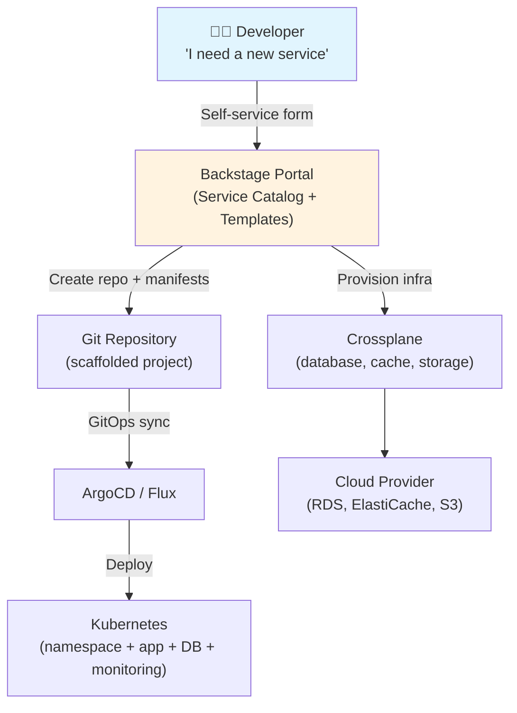

> 💡 **Quick Answer:** An Internal Developer Platform (IDP) on Kubernetes gives developers self-service access to deploy apps, provision databases, and create environments — without knowing Kubernetes internals. Build with Backstage (developer portal), Crossplane (infrastructure-as-code), ArgoCD/Flux (GitOps delivery), and templates that encode your organization's "golden paths."

## The Problem

CNCF's 2026 report shows platform engineering as the #1 organizational pattern for scaling Kubernetes adoption. Without a platform team, every developer needs to learn Kubernetes YAML, Helm, networking, and security — or wait for ops tickets. An IDP provides self-service "golden paths": developers fill a form, platform automation handles the rest.



## The Solution

### Architecture: The Platform Stack

```yaml
# Platform stack components
# Layer 1: Developer Portal (Backstage)
# Layer 2: Infrastructure Abstraction (Crossplane)
# Layer 3: GitOps Delivery (ArgoCD/Flux)
# Layer 4: Kubernetes Runtime
# Layer 5: Observability (Prometheus + Grafana)
```

### Backstage Software Template

```yaml
# Backstage template: scaffold a new microservice
apiVersion: scaffolder.backstage.io/v1beta3
kind: Template
metadata:
  name: kubernetes-microservice
  title: "Create a Kubernetes Microservice"
  description: "Scaffold a new Go/Python/Node microservice with CI/CD and K8s manifests"
spec:
  owner: platform-team
  type: service
  parameters:
    - title: Service Info
      required: [name, language, team]
      properties:
        name:
          title: Service Name
          type: string
          pattern: "^[a-z][a-z0-9-]+$"
        language:
          title: Language
          type: string
          enum: ["go", "python", "node"]
        team:
          title: Owning Team
          type: string
          ui:field: OwnerPicker
    - title: Infrastructure
      properties:
        database:
          title: Database
          type: string
          enum: ["none", "postgresql", "mysql", "redis"]
        replicas:
          title: Replicas
          type: integer
          default: 2
          minimum: 1
          maximum: 10
        gpu:
          title: GPU Required
          type: boolean
          default: false

  steps:
    - id: scaffold
      name: Scaffold Repository
      action: fetch:template
      input:
        url: ./skeleton
        values:
          name: ${{ parameters.name }}
          language: ${{ parameters.language }}

    - id: create-repo
      name: Create GitHub Repository
      action: publish:github
      input:
        repoUrl: github.com?owner=myorg&repo=${{ parameters.name }}

    - id: create-namespace
      name: Create Kubernetes Namespace
      action: kubernetes:apply
      input:
        manifest:
          apiVersion: v1
          kind: Namespace
          metadata:
            name: ${{ parameters.name }}
            labels:
              team: ${{ parameters.team }}
              managed-by: backstage

    - id: provision-db
      name: Provision Database
      if: ${{ parameters.database !== 'none' }}
      action: kubernetes:apply
      input:
        manifest:
          apiVersion: database.example.org/v1alpha1
          kind: PostgreSQLInstance
          metadata:
            name: ${{ parameters.name }}-db
            namespace: ${{ parameters.name }}
          spec:
            size: small
            version: "16"

    - id: register
      name: Register in Catalog
      action: catalog:register
      input:
        repoContentsUrl: ${{ steps.create-repo.output.repoContentsUrl }}
        catalogInfoPath: /catalog-info.yaml
```

### Crossplane Infrastructure Compositions

```yaml
# Platform team defines "what a database means" via Composition
apiVersion: apiextensions.crossplane.io/v1
kind: Composition
metadata:
  name: postgresql-aws
spec:
  compositeTypeRef:
    apiVersion: database.example.org/v1alpha1
    kind: PostgreSQLInstance
  resources:
    - name: rds-instance
      base:
        apiVersion: rds.aws.upbound.io/v1beta2
        kind: Instance
        spec:
          forProvider:
            engine: postgres
            engineVersion: "16"
            instanceClass: db.t3.medium
            allocatedStorage: 20
            publiclyAccessible: false
          # Connection secret published to dev namespace
          writeConnectionSecretToRef:
            namespace: "" # Patched from claim
    - name: security-group
      base:
        apiVersion: ec2.aws.upbound.io/v1beta1
        kind: SecurityGroup
        spec:
          forProvider:
            ingress:
              - fromPort: 5432
                toPort: 5432
                protocol: tcp
---
# Developer just requests:
apiVersion: database.example.org/v1alpha1
kind: PostgreSQLInstance
metadata:
  name: my-app-db
  namespace: my-app
spec:
  size: small         # Platform team maps "small" → db.t3.medium
  version: "16"
```

### Golden Path: ArgoCD App-of-Apps

```yaml
# Platform team manages the root app
apiVersion: argoproj.io/v1alpha1
kind: ApplicationSet
metadata:
  name: team-services
  namespace: argocd
spec:
  generators:
    - git:
        repoURL: https://github.com/myorg/platform-config.git
        revision: main
        directories:
          - path: "teams/*/services/*"
  template:
    metadata:
      name: "{{path.basename}}"
    spec:
      project: "{{path[1]}}"          # Team name from path
      source:
        repoURL: https://github.com/myorg/platform-config.git
        path: "{{path}}"
      destination:
        server: https://kubernetes.default.svc
        namespace: "{{path.basename}}"
      syncPolicy:
        automated:
          selfHeal: true
          prune: true
```

### Developer Self-Service: Environment Provisioning

```yaml
# Developer creates a PR to get a preview environment
# Platform automation (ArgoCD + Crossplane) handles the rest
apiVersion: v1
kind: Namespace
metadata:
  name: preview-pr-142
  labels:
    type: preview
    pr: "142"
    ttl: "72h"                    # Auto-cleanup after 72h
---
apiVersion: apps/v1
kind: Deployment
metadata:
  name: my-app
  namespace: preview-pr-142
spec:
  replicas: 1
  template:
    spec:
      containers:
        - name: app
          image: myorg/my-app:pr-142
          resources:
            requests:
              cpu: "100m"
              memory: "128Mi"    # Minimal for preview
```

### Platform Metrics

```yaml
# Track platform adoption
apiVersion: monitoring.coreos.com/v1
kind: PrometheusRule
metadata:
  name: platform-metrics
spec:
  groups:
    - name: platform.rules
      rules:
        - record: platform:services_total
          expr: count(kube_namespace_labels{label_managed_by="backstage"})
        - record: platform:deployments_per_day
          expr: sum(increase(argocd_app_sync_total[24h]))
        - record: platform:mean_time_to_deploy
          expr: histogram_quantile(0.50, argocd_app_sync_duration_seconds_bucket)
        - alert: PlatformSlowDeploy
          expr: platform:mean_time_to_deploy > 300
          for: 1h
          labels:
            severity: warning
          annotations:
            summary: "Mean deploy time exceeds 5 minutes"
```

## Common Issues

| Issue | Cause | Fix |
|-------|-------|-----|
| Template fails to scaffold | GitHub token expired | Rotate Backstage GitHub integration token |
| Crossplane claim stuck | Provider credentials missing | Check ProviderConfig and Secrets |
| ArgoCD out of sync | Manual changes in cluster | Enable `selfHeal: true` in sync policy |
| Developers bypass platform | Platform too restrictive | Add escape hatches for power users |
| Preview envs pile up | No TTL cleanup | Deploy namespace-lifecycle-manager |

## Best Practices

- **Start with 1-2 golden paths** — don't over-engineer; add paths as teams request them
- **Developers choose, platform delivers** — abstract away K8s complexity behind forms
- **GitOps everything** — every change flows through Git, no `kubectl apply` in production
- **Measure adoption** — track services onboarded, deploy frequency, MTTR
- **Keep escape hatches** — power users need raw K8s access for edge cases
- **Platform team ≠ gatekeepers** — enable self-service, don't create another ticket queue

## Key Takeaways

- Platform engineering gives developers self-service Kubernetes without K8s expertise
- Backstage provides the portal: service catalog, templates, documentation
- Crossplane abstracts infrastructure: developers request "a database," platform delivers
- ArgoCD/Flux delivers workloads: GitOps sync from scaffolded repos to clusters
- Golden paths encode best practices: security, observability, networking baked in
- 2026 trend: platform engineering is how organizations scale Kubernetes adoption
