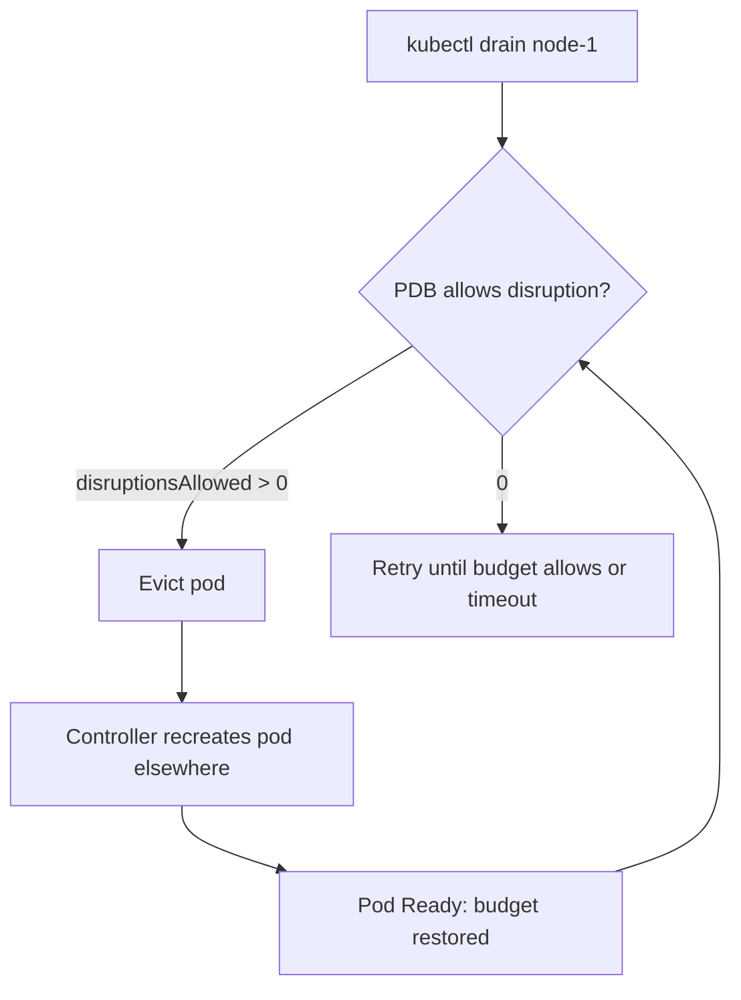

> 💡 **Quick Answer:** A PodDisruptionBudget (PDB) limits how many pods matching a selector can be **voluntarily** evicted at once. Set `minAvailable` (pods that must stay up) or `maxUnavailable` (pods that may be down) — one or the other, not both. `kubectl drain`, cluster upgrades, Cluster Autoscaler and Karpenter all go through the Eviction API and respect it.
>
> **Key config:** `maxUnavailable: 1` for a 3-replica Deployment — drains proceed one pod at a time.
>
> **Gotcha:** PDBs don't protect against **involuntary** disruptions (node crash, OOMKill) or Deployment rolling updates. A PDB whose `ALLOWED DISRUPTIONS` is 0 blocks node drains forever — see [PDB allowed disruptions 0](/recipes/troubleshooting/pdb-allowed-disruptions-zero/).

## Voluntary vs Involuntary Disruptions

```text
PDB applies (Eviction API):          PDB does NOT apply:
- kubectl drain                      - Node/hardware failure, kernel panic
- Cluster Autoscaler / Karpenter     - OOMKilled, liveness probe restarts
  scale-down and consolidation       - kubelet node-pressure eviction
- Managed node pool upgrades         - kubectl delete pod / deployment
- Direct calls to pods/eviction      - Deployment rolling updates
                                       (governed by strategy.rollingUpdate)
```

## minAvailable vs maxUnavailable

```yaml
apiVersion: policy/v1
kind: PodDisruptionBudget
metadata:
  name: web-pdb
spec:
  minAvailable: 2            # At least 2 matching pods must stay healthy
  selector:
    matchLabels:
      app: web
---
apiVersion: policy/v1
kind: PodDisruptionBudget
metadata:
  name: api-pdb
spec:
  maxUnavailable: 1          # At most 1 matching pod down at a time
  selector:
    matchLabels:
      app: api
---
apiVersion: policy/v1
kind: PodDisruptionBudget
metadata:
  name: worker-pdb
spec:
  maxUnavailable: "25%"      # Percentages round UP: 25% of 10 = 3
  selector:
    matchLabels:
      app: worker
```

Imperative: `kubectl create pdb web-pdb --selector=app=web --min-available=2`.

| Setting | 3 replicas | 5 replicas | Best for |
|---------|-----------|-----------|----------|
| `minAvailable: 1` | 2 can be down | 4 can be down | Minimum viable capacity |
| `minAvailable: 2` | 1 can be down | 3 can be down | Fixed capacity floor / quorum |
| `maxUnavailable: 1` | 1 can be down | 1 can be down | Default for most workloads |
| `maxUnavailable: "25%"` | 1 can be down | 2 can be down | Large or autoscaled fleets |

`maxUnavailable` adapts when an HPA changes the replica count; a fixed `minAvailable` equal to the HPA's `minReplicas` silently blocks drains whenever the workload is scaled in.

## Decision Matrix

```text
Workload               Replicas   PDB
Stateless API          3          maxUnavailable: 1
Stateless API          10+        maxUnavailable: 25%
Quorum DB / etcd       3          minAvailable: 2   (never lose quorum)
Quorum DB / etcd       5          minAvailable: 3
Message queue          3          maxUnavailable: 1
Singleton              1          maxUnavailable: 1 allows drains (brief outage)
                                  minAvailable: 1 blocks drains until handled manually
```

## StatefulSets and Primaries

```yaml
apiVersion: policy/v1
kind: PodDisruptionBudget
metadata:
  name: postgres-replicas-pdb
spec:
  minAvailable: 2               # Quorum of a 3-member cluster
  selector:
    matchLabels:
      app: postgresql
      role: replica
---
apiVersion: policy/v1
kind: PodDisruptionBudget
metadata:
  name: postgres-primary-pdb
spec:
  minAvailable: 1               # Primary is never evicted without a manual switchover
  selector:
    matchLabels:
      app: postgresql
      role: primary
```

Operators such as CloudNativePG create and manage these PDBs themselves — don't add competing ones. Avoid multiple PDBs selecting the same pod: the Eviction API refuses to evict pods covered by more than one PDB.

## Unhealthy Pod Eviction Policy

```yaml
apiVersion: policy/v1
kind: PodDisruptionBudget
metadata:
  name: app-pdb
spec:
  maxUnavailable: 1
  selector:
    matchLabels:
      app: myapp
  unhealthyPodEvictionPolicy: AlwaysAllow
  # IfHealthyBudget (default): Running-but-not-Ready pods can only be evicted if the budget allows
  # AlwaysAllow: not-Ready pods can always be evicted, so CrashLooping pods don't block drains
```

Beta and on by default since Kubernetes 1.27, GA in 1.31. Recommended for most workloads.

## PDB and Node Drain

```bash
kubectl drain node-1 --ignore-daemonsets --delete-emptydir-data --timeout=300s
# Evicts pods one by one; for a PDB-blocked pod kubectl retries until the budget allows:
# error when evicting pods/"api-xyz" (will retry after 5s): Cannot evict pod as it
# would violate the pod's disruption budget.

kubectl drain node-1 --ignore-daemonsets --dry-run=server   # Preview
kubectl get pdb -w                                          # Watch budgets during drain
```

`--force` does **not** bypass PDBs — it only allows deleting bare pods without a controller. `--disable-eviction` deletes pods directly and skips PDBs; use it only when you accept the outage.

DaemonSet pods are skipped by `--ignore-daemonsets`, so a PDB on a DaemonSet doesn't pace drains. PDBs on workloads without a scale subresource (DaemonSets, bare pods, most custom controllers) only support an integer `minAvailable`.

## Check PDB Status

```bash
kubectl get pdb -A
# NAME      MIN AVAILABLE   MAX UNAVAILABLE   ALLOWED DISRUPTIONS   AGE
# web-pdb   2               N/A               1                     5d

kubectl describe pdb web-pdb
#   Current Healthy:      3
#   Desired Healthy:      2
#   Disruptions Allowed:  1
#   Expected Pods:        3

kubectl get pdb web-pdb -o jsonpath='{.status.disruptionsAllowed}'

# Pods the PDB actually selects
kubectl get pods -l app=web --show-labels
```



## PDB with Cluster Autoscaler and Karpenter

Both evict through the Eviction API, so PDBs are respected automatically — no annotation on the PDB is needed. A node whose pods can't be evicted within budget is simply skipped for scale-down. To pin a specific pod, annotate the **pod** with `cluster-autoscaler.kubernetes.io/safe-to-evict: "false"` (Cluster Autoscaler) or `karpenter.sh/do-not-disrupt: "true"` (Karpenter).

## Common Issues

| Issue | Cause | Fix |
|-------|-------|-----|
| Drain stuck, `ALLOWED DISRUPTIONS 0` | `minAvailable` ≥ healthy replicas, single replica, or unready pods | Scale up, fix unhealthy pods, switch to `maxUnavailable: 1`, add `AlwaysAllow` |
| PDB not protecting pods | Selector doesn't match pod labels, or wrong namespace | Compare `kubectl get pdb -o yaml` with `kubectl get pods --show-labels` |
| Autoscaler never removes a node | PDB blocks eviction of a pod on it | Ensure disruptions allowed > 0 and replicas spread across nodes |
| Eviction error: more than one PDB | Overlapping selectors | One PDB per pod set |
| Outage during rollout despite PDB | Rolling updates ignore PDBs | Tune `maxUnavailable`/`maxSurge` in the Deployment strategy |

## Best Practices

1. **Every production workload with 2+ replicas gets a PDB**
2. **Default to `maxUnavailable: 1`**; use `minAvailable` for quorum
3. **Never set `minAvailable` equal to replicas** — blocks every drain and upgrade
4. **Spread replicas** with topology spread constraints or anti-affinity so one drain touches one replica
5. **Set `unhealthyPodEvictionPolicy: AlwaysAllow`** unless the app needs unready pods protected
6. **Alert on `kube_poddisruptionbudget_status_pod_disruptions_allowed == 0`** before maintenance windows

## Frequently Asked Questions

### What is a PodDisruptionBudget in Kubernetes?

A `policy/v1` object that tells the Eviction API how many pods of a set must stay available (or may be unavailable) during voluntary disruptions such as node drains, upgrades and autoscaler scale-down.

### Should I use minAvailable or maxUnavailable?

`maxUnavailable` in most cases: it keeps working as replicas change and always allows progress when there are enough healthy pods. Use `minAvailable` when you need an absolute floor, such as quorum for a 3- or 5-member cluster.

### Does kubectl drain --force ignore PDBs?

No. `--force` only lets drain delete pods not managed by a controller. Drain still uses the Eviction API and waits for the PDB. `--disable-eviction` is the flag that bypasses PDBs by deleting pods directly.

### Do PDBs apply to rolling updates?

No. Deployment and StatefulSet rollouts are controlled by their update strategy (`maxUnavailable`, `maxSurge`, `partition`), not by PDBs. PDBs only gate evictions.

### Can I use a PDB with a single replica?

`minAvailable: 1` on a single-replica workload blocks all voluntary evictions, so drains hang until someone intervenes. `maxUnavailable: 1` allows the drain with a brief outage. Running 2+ replicas is the real fix.
