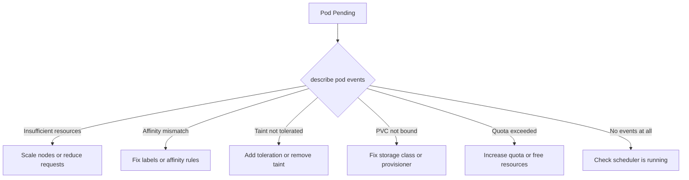

> 💡 **Quick Answer:** A pod stuck in Pending means the scheduler can't find a suitable node. Run `kubectl describe pod <name>` and check the Events section — it tells you exactly why: insufficient CPU/memory, no matching nodes for affinity/taints, unbound PVCs, or resource quota exceeded.

## The Problem

```bash
$ kubectl get pods
NAME                    READY   STATUS    RESTARTS   AGE
myapp-7b9f5c6d4-x2k8j  0/1     Pending   0          10m
```

## The Solution

### Get the Scheduling Failure Reason

```bash
kubectl describe pod myapp-7b9f5c6d4-x2k8j | grep -A10 Events
```

### Fix by Reason

**"Insufficient cpu/memory":**
```bash
# Check node allocatable vs requested
kubectl describe nodes | grep -A5 "Allocated resources"

# Option 1: Reduce pod requests
# Option 2: Add nodes
# Option 3: Remove resource hogs
kubectl top pods --all-namespaces --sort-by=memory | head -20
```

**"no nodes match pod affinity/anti-affinity":**
```bash
# Check what the pod requires
kubectl get pod myapp-7b9f5c6d4-x2k8j -o jsonpath='{.spec.affinity}' | jq

# Check node labels
kubectl get nodes --show-labels
```

**"node(s) had taint that the pod didn't tolerate":**
```bash
# Check node taints
kubectl describe nodes | grep Taints

# Add toleration to pod or remove taint from node
kubectl taint nodes worker-1 key=value:NoSchedule-
```

**"persistentvolumeclaim is not bound":**
```bash
# Check PVC status
kubectl get pvc
# If Pending, check storage class and provisioner
kubectl describe pvc my-claim
```

**"exceeded quota":**
```bash
# Check namespace quota usage
kubectl describe resourcequota -n my-namespace
```



## Common Issues

### Pending with no events at all
The scheduler itself may be down. Check: `kubectl get pods -n kube-system | grep scheduler`

### Pending after node drain
Drained nodes have a `NoSchedule` taint. Uncordon: `kubectl uncordon worker-1`

### Pod fits on paper but still Pending
Check `PodDisruptionBudget` — it can block scheduling during rolling updates.

## Best Practices

- **Always set resource requests** — without them the scheduler can't make accurate decisions
- **Use `kubectl describe` first** — the events section is the single best debugging tool for Pending pods
- **Monitor cluster capacity** with `kubectl top nodes` to catch exhaustion early
- **Use pod topology spread constraints** to distribute pods evenly across nodes

## Key Takeaways

- Pending = scheduler can't place the pod — `describe pod` events tell you exactly why
- Top causes: insufficient resources, affinity/taint mismatches, unbound PVCs, quota exceeded
- No events = check if the scheduler is running
- Always check both pod requirements and node capacity/labels/taints
