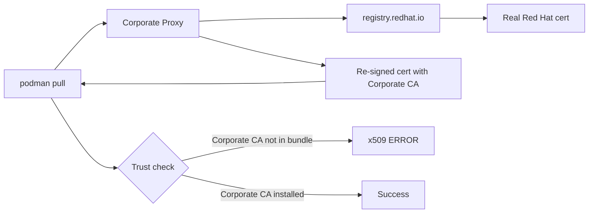

> 💡 **Quick Answer:** Corporate proxies that perform TLS inspection (MITM) replace upstream certificates with ones signed by an internal CA. Podman doesn't trust this CA by default, causing `x509: certificate signed by unknown authority`. Fix: extract the proxy Root CA from your browser, install it with `update-ca-trust`, then retry.
>
> **Key insight:** This affects `podman pull`, `podman login`, `skopeo`, and any container tool — but NOT browsers (which already trust the corporate CA via OS/AD policy).
>
> **Gotcha:** `--tls-verify=false` does NOT work for `registry.redhat.io` — Red Hat explicitly blocks insecure connections.

## The Problem

You try to pull images from `registry.redhat.io` or any external registry behind a corporate proxy:

```bash
$ podman pull registry.redhat.io/rhel9/support-tools:latest
Error: initializing source docker://registry.redhat.io/rhel9/support-tools:latest: \
  pinging container registry registry.redhat.io: \
  Get "https://registry.redhat.io/v2/": tls: failed to verify certificate: \
  x509: certificate signed by unknown authority
```

Login also fails:

```bash
$ podman login registry.redhat.io
Username: myuser
Password:
Error: authenticating creds for "registry.redhat.io": \
  pinging container registry registry.redhat.io: \
  x509: certificate signed by unknown authority
```

## The Solution

### Understand Why This Happens

Corporate networks often deploy **TLS-intercepting proxies** (also called SSL inspection, MITM proxies). These proxies:

1. Terminate the TLS connection from your machine
2. Inspect the traffic
3. Re-encrypt it with a certificate signed by the **corporate Root CA**
4. Forward it to the upstream server

Your browser trusts the corporate CA (installed via Active Directory Group Policy), but podman uses the system CA bundle (`/etc/pki/tls/certs/ca-bundle.crt`) which does NOT include the corporate CA.



### Step 1: Extract the Corporate Proxy CA

**From Firefox:**
1. Open any HTTPS site (e.g., `https://www.google.com`)
2. Click the lock icon → **Connection secure** → **More Information**
3. Click **View Certificate**
4. Look at the **Issuer** — it will show the corporate CA name, not Google
5. In the certificate chain, select the **topmost (root) CA**
6. Click **Export** → save as `proxy-ca.crt`

**From Chrome/Edge:**
1. Visit any HTTPS site → click lock → **Certificate is valid**
2. Go to **Certificate Path** tab
3. Select the topmost CA → **View Certificate** → **Details** → **Copy to File**
4. Choose **Base64 encoded X.509 (.CER)** → save as `proxy-ca.crt`

**From Windows Certificate Store:**
1. Run `certmgr.msc`
2. Navigate to **Trusted Root Certification Authorities** → **Certificates**
3. Find the corporate proxy CA (names vary: "Corporate Root CA", "SSL Inspection Root CA", etc.)
4. Right-click → **All Tasks** → **Export** → Base64 X.509

### Step 2: Install the CA on Your RHEL/Fedora Host

```bash
# Copy CA to the trust anchors directory
sudo cp proxy-ca.crt /etc/pki/ca-trust/source/anchors/

# Update the system CA bundle
sudo update-ca-trust

# Verify the CA is now trusted
openssl verify /etc/pki/ca-trust/source/anchors/proxy-ca.crt
# Should output: proxy-ca.crt: OK
```

### Step 3: Retry Podman Pull

```bash
# Login to Red Hat registry
podman login registry.redhat.io

# Pull the image
podman pull registry.redhat.io/rhel9/support-tools:latest
```

### Alternative: Offline Image Import (Air-Gapped)

If you cannot install the CA or fix DNS, import images manually:

**On a machine with internet access:**

```bash
# Pull and save to tarball
podman login registry.redhat.io
podman pull registry.redhat.io/rhel9/support-tools:latest
podman save registry.redhat.io/rhel9/support-tools:latest -o support-tools.tar
```

**Transfer `support-tools.tar` to the internal network via SCP/USB.**

**On the internal machine:**

```bash
# Load the image
podman load -i support-tools.tar

# Tag for internal registry
podman tag registry.redhat.io/rhel9/support-tools:latest \
  internal-registry.example.com/util/support-tools:latest

# Push to internal registry
podman login internal-registry.example.com
podman push internal-registry.example.com/util/support-tools:latest
```

## Common Issues

### `--tls-verify=false` doesn't work for Red Hat registries
Red Hat registries (`registry.redhat.io`, `registry.access.redhat.com`) explicitly reject insecure connections. This is by design and cannot be overridden.

### DNS also fails: `no such host`
If you see both TLS and DNS errors alternating, your network blocks external DNS entirely. The proxy handles HTTP/HTTPS routing but not DNS resolution. Solutions:
- Ask IT to allow DNS for `registry.redhat.io`
- Or use the offline import method above

### Wrong CA file installed
If you installed your internal Quay registry's CA (`quay-ca.crt`) but the error persists for `registry.redhat.io`, you have the wrong CA. The TLS error is from the **corporate proxy**, not from your internal registry. Extract the proxy CA from your browser instead.

### 502 Bad Gateway from internal registry
This means the image doesn't exist in your internal registry. You need to push it there first using the offline import method.

### Proxy environment variables set but still fails
```bash
export HTTPS_PROXY=http://proxy.example.com:8080
export HTTP_PROXY=http://proxy.example.com:8080
```
Setting proxy vars allows network routing but does NOT fix TLS trust. You still need the proxy CA installed.

## Best Practices

- **Extract the corporate CA once and store it in your team's shared docs** — every new RHEL host needs it
- **Use MachineConfig to distribute the CA to OpenShift nodes** automatically
- **For air-gapped clusters, build an image mirroring pipeline** using `oc mirror` or `skopeo sync`
- **Never disable TLS verification** — even if you could, it's a security risk
- **Test CA installation with `curl`** before trying podman: `curl -v https://registry.redhat.io/v2/`

## Key Takeaways

- Corporate TLS-intercepting proxies cause `x509` errors for all container tools, not just podman
- Browsers work because they trust the corporate CA via OS/AD policy — container tools don't
- `--tls-verify=false` is blocked for Red Hat registries — you must install the correct CA
- The proxy CA is different from your internal registry CA — extract it from your browser
- For fully air-gapped environments, use `podman save`/`podman load` to transfer images offline
