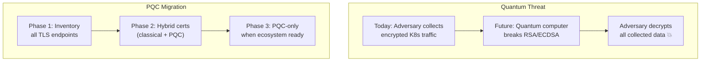

> 💡 **Quick Answer:** Post-Quantum Cryptography (PQC) replaces RSA/ECDSA with algorithms resistant to quantum computer attacks. NIST standardized ML-KEM (key exchange) and ML-DSA (signatures) in 2024. On Kubernetes, start by upgrading to PQC-aware TLS libraries (OpenSSL 3.5+, BoringSSL), then enable hybrid certificates (classical + PQC) in cert-manager, service mesh, and ingress controllers.

## The Problem

Quantum computers will eventually break RSA and ECDSA — the encryption protecting all Kubernetes TLS communication. "Harvest now, decrypt later" attacks mean adversaries are already collecting encrypted traffic to decrypt when quantum computers mature. NIST has published three PQC standards (2024), and 2026 is the year organizations must start migrating. Kubernetes clusters have TLS everywhere: API server, etcd, service mesh mTLS, ingress, and secrets.



## The Solution

### NIST PQC Standards for Kubernetes

| Standard | Algorithm | Use | K8s Relevance |
|----------|-----------|-----|---------------|
| **FIPS 203** (ML-KEM) | Kyber | Key exchange | TLS handshakes, mTLS, etcd encryption |
| **FIPS 204** (ML-DSA) | Dilithium | Digital signatures | Certificates, webhook signatures, JWTs |
| **FIPS 205** (SLH-DSA) | SPHINCS+ | Stateless signatures | Long-lived CA certificates |

### Phase 1: Inventory TLS Endpoints

```bash
# Find all TLS certificates in the cluster
kubectl get secrets --all-namespaces -o json | \
  jq -r '.items[] | select(.type == "kubernetes.io/tls") | 
    "\(.metadata.namespace)/\(.metadata.name)"'

# Check certificate algorithms
for ns_secret in $(kubectl get secrets -A -o jsonpath='{range .items[?(@.type=="kubernetes.io/tls")]}{.metadata.namespace}/{.metadata.name}{"\n"}{end}'); do
  NS=$(echo $ns_secret | cut -d/ -f1)
  SECRET=$(echo $ns_secret | cut -d/ -f2)
  echo -n "$ns_secret: "
  kubectl get secret -n $NS $SECRET -o jsonpath='{.data.tls\.crt}' | \
    base64 -d | openssl x509 -noout -text 2>/dev/null | \
    grep "Public Key Algorithm"
done

# Check K8s API server certificate
openssl s_client -connect localhost:6443 </dev/null 2>/dev/null | \
  openssl x509 -noout -text | grep "Public Key Algorithm"
```

### Phase 2: Hybrid Certificates with cert-manager

```yaml
# cert-manager Issuer with hybrid (classical + PQC) algorithm
# Requires cert-manager v1.16+ with PQC support
apiVersion: cert-manager.io/v1
kind: ClusterIssuer
metadata:
  name: pqc-hybrid-issuer
spec:
  ca:
    secretName: pqc-hybrid-ca
---
# Certificate with hybrid key algorithm
apiVersion: cert-manager.io/v1
kind: Certificate
metadata:
  name: api-gateway-pqc
  namespace: ingress
spec:
  secretName: api-gateway-tls-pqc
  issuerRef:
    name: pqc-hybrid-issuer
    kind: ClusterIssuer
  privateKey:
    algorithm: ML-DSA-65         # PQC signature algorithm
    # Or hybrid: ECDSA-P256-ML-DSA-65
  dnsNames:
    - api.example.com
  duration: 8760h               # 1 year
  renewBefore: 720h             # 30 days
```

### Ingress Controller with PQC TLS

```yaml
# NGINX Ingress with PQC-capable OpenSSL
apiVersion: apps/v1
kind: Deployment
metadata:
  name: nginx-ingress-pqc
spec:
  template:
    spec:
      containers:
        - name: controller
          image: myorg/nginx-ingress-pqc:v1.0  # Built with OpenSSL 3.5+
          args:
            - /nginx-ingress-controller
            - --ssl-protocols=TLSv1.3
            - --ssl-ciphers=TLS_AES_256_GCM_SHA384
          # TLS 1.3 with ML-KEM key exchange
          env:
            - name: OPENSSL_CONF
              value: /etc/ssl/openssl-pqc.cnf
```

### Service Mesh PQC mTLS

```yaml
# Istio with PQC-aware mTLS (future)
apiVersion: security.istio.io/v1
kind: PeerAuthentication
metadata:
  name: pqc-mtls
  namespace: istio-system
spec:
  mtls:
    mode: STRICT
    # PQC configuration (Istio roadmap)
    # keyExchange: ML-KEM-768
    # signatureAlgorithm: ML-DSA-65

# Cilium with WireGuard (already quantum-resistant key exchange)
# WireGuard uses X25519 — migration to ML-KEM planned
```

### etcd Encryption at Rest with PQC

```yaml
# KMS provider with PQC-capable encryption
apiVersion: apiserver.config.k8s.io/v1
kind: EncryptionConfiguration
resources:
  - resources:
      - secrets
    providers:
      - kms:
          apiVersion: v2
          name: pqc-kms
          endpoint: unix:///run/pqc-kms/socket
          timeout: 3s
      - identity: {}
```

### Migration Strategy

```bash
# Step 1: Audit current algorithms (run as CronJob)
#!/bin/bash
echo "=== Certificate Algorithm Inventory ==="
echo "Namespace,Secret,Algorithm,Expiry" > /reports/cert-audit.csv

kubectl get secrets -A -o json | \
  jq -r '.items[] | select(.type=="kubernetes.io/tls") | 
    .metadata.namespace + "," + .metadata.name' | \
while IFS=, read ns name; do
  ALGO=$(kubectl get secret -n $ns $name -o jsonpath='{.data.tls\.crt}' | \
    base64 -d | openssl x509 -noout -text 2>/dev/null | \
    grep "Public Key Algorithm" | awk -F: '{print $2}' | xargs)
  EXPIRY=$(kubectl get secret -n $ns $name -o jsonpath='{.data.tls\.crt}' | \
    base64 -d | openssl x509 -noout -enddate 2>/dev/null | cut -d= -f2)
  echo "$ns,$name,$ALGO,$EXPIRY" >> /reports/cert-audit.csv
done

echo "Certificates using RSA/ECDSA (need migration):"
grep -c "RSA\|ECDSA" /reports/cert-audit.csv
```

### Timeline

| Phase | When | Action |
|-------|------|--------|
| **Inventory** | Now (2026) | Catalog all TLS endpoints, key sizes, expiry |
| **Hybrid** | 2026-2027 | Deploy hybrid (classical + PQC) certificates |
| **Testing** | 2027-2028 | Validate PQC interoperability across stack |
| **PQC-only** | 2028+ | Migrate to PQC-only when ecosystem supports it |

## Common Issues

| Issue | Cause | Fix |
|-------|-------|-----|
| Larger certificate/key sizes | PQC algorithms have bigger keys | Increase TLS buffer sizes, test performance |
| Client compatibility | Old clients don't support PQC | Use hybrid certs (fallback to classical) |
| Slower TLS handshakes | PQC key exchange is computationally heavier | Benchmark and tune, use session resumption |
| cert-manager doesn't support PQC yet | Feature still in development | Use custom CA scripts or wait for upstream |
| Istio/Envoy PQC not ready | sidecar proxy ecosystem catching up | Use Cilium WireGuard (closer to PQC-ready) |

## Best Practices

- **Start with inventory** — you can't migrate what you don't know about
- **Use hybrid certificates first** — backwards compatible with classical clients
- **Prioritize long-lived data** — secrets, etcd backups, and stored TLS sessions
- **Monitor NIST updates** — standards are finalized but implementations evolving
- **Benchmark performance** — PQC adds overhead; test in staging first
- **Don't wait for quantum computers** — "harvest now, decrypt later" is happening today

## Key Takeaways

- NIST standardized PQC algorithms in 2024: ML-KEM (key exchange), ML-DSA (signatures)
- Kubernetes has TLS everywhere: API server, etcd, service mesh, ingress, webhooks
- Start with a certificate inventory audit — know what needs migration
- Hybrid certificates (classical + PQC) provide backwards compatibility
- WireGuard (Cilium) is closer to PQC-ready than mTLS sidecars (Istio)
- 2026 is the year to start — don't wait for quantum computers to arrive
