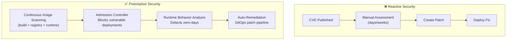

> 💡 **Quick Answer:** Preemptive cybersecurity shifts from "detect and respond" to "predict and prevent." On Kubernetes: (1) continuously scan images for CVEs before deployment with admission controllers, (2) use runtime behavior analysis (Falco/Tetragon) to detect anomalies, (3) auto-patch vulnerable workloads via GitOps, and (4) use CNAPP platforms for unified cloud-native security posture management.

## The Problem

Traditional Kubernetes security is reactive — you discover a vulnerability after it's exploited. In 2026, Gartner highlights preemptive cybersecurity as a strategic trend: security that continuously adapts, predicts threats, and automatically remediates before incidents occur. This means shifting left (build-time), shifting right (runtime), and automating the response loop.



## The Solution

### Layer 1: Build-Time Prevention

```yaml
# Tekton task: Scan images before push
apiVersion: tekton.dev/v1
kind: Task
metadata:
  name: image-security-scan
spec:
  steps:
    - name: trivy-scan
      image: aquasec/trivy:latest
      command: ["trivy"]
      args:
        - "image"
        - "--exit-code=1"              # Fail on critical/high
        - "--severity=CRITICAL,HIGH"
        - "--ignore-unfixed"
        - "$(params.IMAGE)"

    - name: sbom-generate
      image: anchore/syft:latest
      command: ["syft"]
      args:
        - "$(params.IMAGE)"
        - "-o=spdx-json=/workspace/sbom.json"
```

### Layer 2: Admission Control

```yaml
# Kyverno: Block images with critical CVEs
apiVersion: kyverno.io/v1
kind: ClusterPolicy
metadata:
  name: block-vulnerable-images
spec:
  validationFailureAction: Enforce
  webhookTimeoutSeconds: 30
  rules:
    - name: check-vulnerabilities
      match:
        resources:
          kinds: ["Pod"]
      verifyImages:
        - imageReferences: ["*"]
          attestations:
            - type: https://cosign.sigstore.dev/attestation/vuln/v1
              conditions:
                - all:
                    - key: "{{ scanner.result.summary.criticalCount }}"
                      operator: Equals
                      value: "0"
              attestors:
                - entries:
                    - keyless:
                        issuer: "https://accounts.google.com"
                        subject: "ci-bot@example.com"

    - name: require-signed-images
      match:
        resources:
          kinds: ["Pod"]
      verifyImages:
        - imageReferences: ["myregistry.com/*"]
          mutateDigest: true
          verifyDigest: true
          attestors:
            - entries:
                - keys:
                    publicKeys: |-
                      -----BEGIN PUBLIC KEY-----
                      MFkwEwYHKoZIzj0CAQYIKoZIzj0DAQcDQgAE...
                      -----END PUBLIC KEY-----
```

### Layer 3: Runtime Detection

```yaml
# Falco rules for Kubernetes-specific threats
- rule: Crypto Mining Detection
  desc: Detect cryptocurrency mining processes
  condition: >
    spawned_process and container and
    (proc.name in (xmrig, minerd, cpuminer, ethminer) or
     proc.cmdline contains "stratum+tcp")
  output: "Crypto miner detected (pod=%k8s.pod.name process=%proc.name cmdline=%proc.cmdline)"
  priority: CRITICAL
  tags: [cryptomining, runtime]

- rule: Reverse Shell Detection
  desc: Detect reverse shell activity in containers
  condition: >
    container and
    ((proc.name = bash and fd.type = ipv4 and fd.l4proto = tcp) or
     proc.cmdline contains "/dev/tcp" or
     proc.cmdline contains "nc -e")
  output: "Reverse shell detected (pod=%k8s.pod.name cmdline=%proc.cmdline connection=%fd.name)"
  priority: CRITICAL

- rule: Sensitive File Access
  desc: Detect access to service account tokens
  condition: >
    open_read and container and
    fd.name startswith "/var/run/secrets/kubernetes.io"
  output: "Service account token accessed (pod=%k8s.pod.name process=%proc.name)"
  priority: WARNING
```

### Layer 4: Auto-Remediation

```yaml
# Falco Sidekick: Auto-respond to threats
apiVersion: apps/v1
kind: Deployment
metadata:
  name: falcosidekick
spec:
  template:
    spec:
      containers:
        - name: sidekick
          image: falcosecurity/falcosidekick:latest
          env:
            # Kill pod on critical alert
            - name: KUBERNETES_ENABLED
              value: "true"
            - name: KUBERNETES_DELETEPOD
              value: "true"
            - name: KUBERNETES_MINIMUMPRIORITY
              value: "critical"
            # Notify security team
            - name: SLACK_WEBHOOKURL
              valueFrom:
                secretKeyRef:
                  name: slack-webhook
                  key: url
            # Create NetworkPolicy to isolate
            - name: KUBERNETES_NETWORKPOLICY_ENABLED
              value: "true"
```

### Continuous Security Posture (CNAPP)

```yaml
# Deploy security scanning as continuous CronJob
apiVersion: batch/v1
kind: CronJob
metadata:
  name: cluster-security-scan
spec:
  schedule: "0 */4 * * *"           # Every 4 hours
  jobTemplate:
    spec:
      template:
        spec:
          serviceAccountName: security-scanner
          containers:
            - name: scanner
              image: myorg/k8s-security-scanner:v1.0
              command: ["./scan.sh"]
              args:
                - "--check-rbac-overperms"
                - "--check-network-policies"
                - "--check-pod-security"
                - "--check-secrets-encryption"
                - "--check-image-vulnerabilities"
                - "--report=/reports/scan-$(date +%Y%m%d).json"
                - "--alert-on=critical,high"
          restartPolicy: Never
```

## Common Issues

| Issue | Cause | Fix |
|-------|-------|-----|
| Admission controller blocking all deploys | Policy too strict, no exemptions | Add exemptions for system namespaces |
| False positive runtime alerts | Falco rule too broad | Tune rules with \`exceptions\` and test in \`LOG\` priority first |
| Auto-kill disrupting production | Auto-remediation too aggressive | Start with isolate (NetworkPolicy), not kill |
| Scan results overwhelming | Too many CVEs, no prioritization | Focus on CRITICAL + exploitable + reachable |
| Slow image scanning | Large images, no caching | Use registry-level scanning, cache layers |

## Best Practices

- **Block at admission, not just alert** — prevention > detection > response
- **Sign all images with Cosign** — verify provenance at deploy time
- **Generate and store SBOMs** — required for supply chain transparency
- **Auto-isolate before auto-kill** — NetworkPolicy quarantine is safer than pod deletion
- **Tune Falco rules iteratively** — start with LOG, promote to ALERT, then to KILL
- **Scan continuously, not just at build** — new CVEs affect already-deployed images

## Key Takeaways

- Preemptive security = predict and prevent, not detect and respond
- Four layers: build-time scanning, admission control, runtime detection, auto-remediation
- Admission controllers (Kyverno/OPA) block vulnerable images before they run
- Runtime tools (Falco/Tetragon) detect zero-days and anomalous behavior
- Auto-remediation: isolate (NetworkPolicy) → alert (Slack) → kill (if critical)
- 2026 trend: continuous, adaptive security replacing periodic audits
