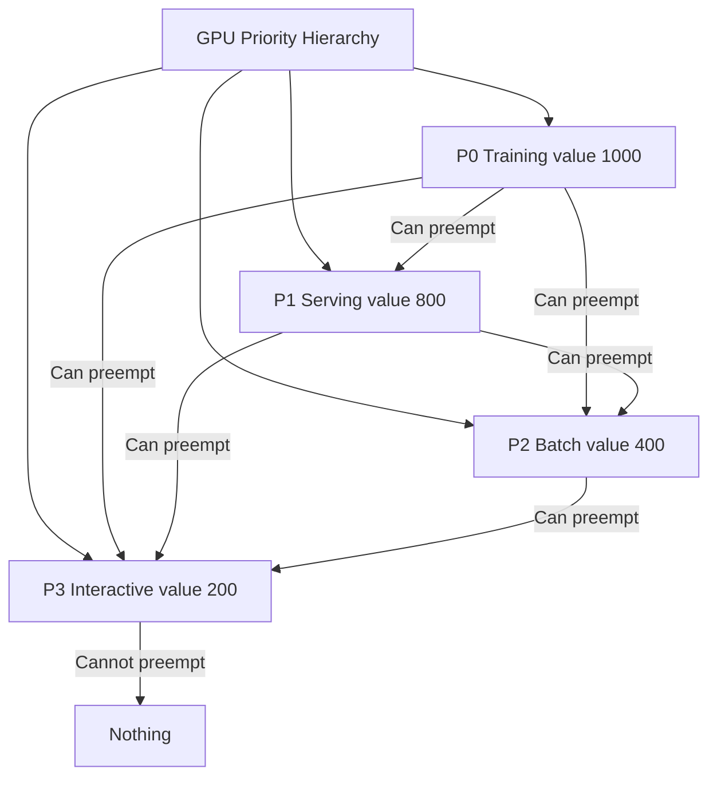

> 💡 **Quick Answer:** Create four PriorityClasses: P0 Training (1000), P1 Serving (800), P2 Batch (400), P3 Interactive (200). Higher priority jobs preempt lower ones. Use `preemptionPolicy: PreemptLowerPriority` for training/serving and `Never` for interactive to prevent cascade evictions.

## The Problem

Without explicit priorities, GPU scheduling is first-come-first-served. A low-priority notebook session can block a critical training job for hours. When GPU resources are scarce, you need deterministic rules for who can evict whom.

## The Solution

```yaml
# P0 — Training (highest priority)
apiVersion: scheduling.k8s.io/v1
kind: PriorityClass
metadata:
  name: gpu-training
value: 1000
globalDefault: false
preemptionPolicy: PreemptLowerPriority
description: "GPU training jobs — can preempt batch and interactive"
---
# P1 — Serving
apiVersion: scheduling.k8s.io/v1
kind: PriorityClass
metadata:
  name: gpu-serving
value: 800
globalDefault: false
preemptionPolicy: PreemptLowerPriority
description: "GPU inference serving — can preempt batch and interactive"
---
# P2 — Batch
apiVersion: scheduling.k8s.io/v1
kind: PriorityClass
metadata:
  name: gpu-batch
value: 400
globalDefault: false
preemptionPolicy: PreemptLowerPriority
description: "GPU batch jobs — can preempt interactive only"
---
# P3 — Interactive (lowest)
apiVersion: scheduling.k8s.io/v1
kind: PriorityClass
metadata:
  name: gpu-interactive
value: 200
globalDefault: false
preemptionPolicy: Never
description: "Interactive notebooks — cannot preempt anything"
```

### Using PriorityClasses

```yaml
# Training job with high priority
apiVersion: kubeflow.org/v1
kind: PyTorchJob
metadata:
  name: llm-finetune
  namespace: tenant-alpha
spec:
  pytorchReplicaSpecs:
    Worker:
      template:
        spec:
          priorityClassName: gpu-training
          containers:
            - name: trainer
              resources:
                limits:
                  nvidia.com/gpu: 8
---
# Interactive notebook with low priority
apiVersion: apps/v1
kind: Deployment
metadata:
  name: jupyter-notebook
  namespace: tenant-alpha
spec:
  template:
    spec:
      priorityClassName: gpu-interactive
      containers:
        - name: jupyter
          resources:
            limits:
              nvidia.com/gpu: 1
```

### Scoped Quotas per Priority

```yaml
apiVersion: v1
kind: ResourceQuota
metadata:
  name: training-gpu-quota
  namespace: tenant-alpha
spec:
  hard:
    requests.nvidia.com/gpu: "6"
  scopeSelector:
    matchExpressions:
      - scopeName: PriorityClass
        operator: In
        values: ["gpu-training"]
---
apiVersion: v1
kind: ResourceQuota
metadata:
  name: interactive-gpu-quota
  namespace: tenant-alpha
spec:
  hard:
    requests.nvidia.com/gpu: "2"
  scopeSelector:
    matchExpressions:
      - scopeName: PriorityClass
        operator: In
        values: ["gpu-interactive"]
```



## Common Issues

- **Notebooks keep getting evicted** — expected behavior; use `preemptionPolicy: Never` on interactive class so notebooks don't evict others, but accept they'll be evicted by training
- **Training job stuck pending despite lower-priority pods running** — preemption takes time; scheduler needs to find pods whose removal frees enough GPUs
- **All pods use default priority** — pods without `priorityClassName` get cluster default; set no globalDefault to force explicit priority selection

## Best Practices

- Four tiers is sufficient for most GPU clusters: training > serving > batch > interactive
- Use `preemptionPolicy: Never` for interactive to prevent cascade evictions
- Combine with scoped ResourceQuotas to limit GPUs per priority class per tenant
- Document the preemption posture: who can evict whom — make it explicit in tenant onboarding
- Training checkpoints are critical — preempted training jobs must be able to resume from checkpoint

## Key Takeaways

- PriorityClasses make GPU contention deterministic — no more random wins
- Higher priority = can preempt lower priority pods to free GPUs
- `preemptionPolicy: Never` prevents a class from evicting others
- Scoped quotas limit GPU allocation per priority tier per tenant
- Training jobs should always save checkpoints for preemption recovery
